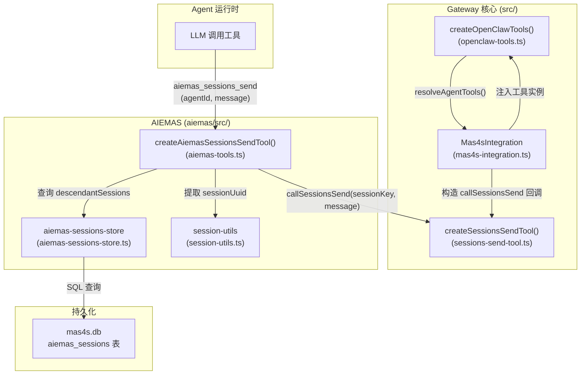
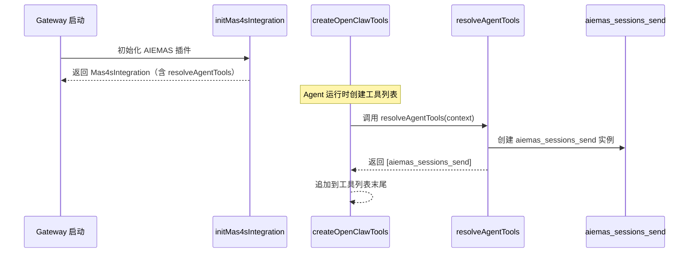
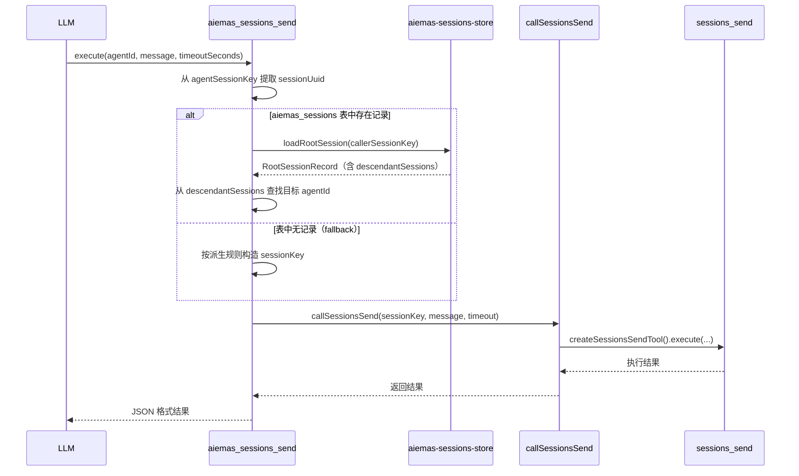

# 设计文档：A2A 通信 — AIEMAS 工具注入点 + `aiemas_sessions_send`

## 概述

本功能为 AIEMAS 多智能体协作平台实现 A2A（Agent-to-Agent）通信能力，核心设计目标：

1. **建立通用 AIEMAS Agent 工具注入点**：在 `Mas4sIntegration` 接口中新增 `resolveAgentTools` 方法，类似 `extraHandlers` 对 RPC handler 的作用，为 Agent 工具提供通用注入机制
2. **封装 `aiemas_sessions_send` 工具**：Agent 用户只需传 `agentId` + `message`，工具内部自动从 `aiemas_sessions.descendantSessions` 解析目标 sessionKey，再通过依赖注入的 `callSessionsSend` 回调调用 `sessions_send`
3. **保持架构边界清晰**：AIEMAS 代码（`aiemas/src/`）不直接导入 Gateway 核心模块（`src/`），通过 `initMas4sIntegration` 桥接层完成依赖注入
4. **最小化 Gateway 改动**：仅修改 `mas4s-integration.ts`（接口 + 实现）和 `openclaw-tools.ts`（注入调用），共 2 个 Gateway 核心文件

### 设计决策与理由

**为什么不用方案 F3（AGENTS.md 派生）？**

- 方案 F3 要求 LLM 在运行时执行字符串操作（从自己的 sessionKey 中提取 sessionUuid 再拼接），不同模型的字符串操作可靠性差异大
- 泄露了 sessionKey 派生规则和 session 级联机制等 AIEMAS 内部实现细节
- 未来扩展性不足：每新增一个 AIEMAS Agent 工具都需要重新教 LLM 新的操作方式

**为什么选择方案 G（新版）？**

- 对 LLM 的要求最低：只需传 `agentId` + `message`
- 建立了通用的工具注入机制，未来可扩展更多 AIEMAS 工具
- 通过依赖注入保持架构边界，AIEMAS 代码不直接导入 Gateway 核心模块

### 前置依赖

- `a2a-session-cascade` spec（已完成）：提供 `aiemas_sessions` 表和 `descendantSessions` 字段作为数据基础
- Gateway 的 `sessions_send` 工具：提供完整的权限检查、同步等待、A2A Flow 等能力

## 架构

### 系统分层与数据流



### 工具注入时序



### `aiemas_sessions_send` 执行时序



## 组件与接口

### 1. Mas4sIntegration 接口扩展

在现有 `Mas4sIntegration` 接口中新增 `resolveAgentTools` 可选方法：

```typescript
// src/gateway/mas4s-integration.ts
export interface Mas4sIntegration {
  // ... 现有字段（extraHandlers, interceptRequest, filterBroadcast 等）...

  /**
   * 返回 AIEMAS 提供的 Agent 工具列表。
   * 由 createOpenClawTools() 调用，将 AIEMAS 工具注入到 Agent 工具集中。
   * 返回 undefined 或空数组时不影响现有工具列表。
   */
  resolveAgentTools?: (context: {
    agentSessionKey?: string;
    config?: import("../config/config.js").OpenClawConfig;
  }) => AnyAgentTool[];
}
```

**设计要点：**

- 方法标记为可选（`?`），AIEMAS 插件未加载时不影响现有行为
- 接收 `agentSessionKey` 和 `config` 上下文，工具实例可根据当前 Agent session 动态配置
- 返回 `AnyAgentTool[]`，与现有工具类型完全一致

### 2. createOpenClawTools 注入点

在 `createOpenClawTools()` 中，工具列表构建完成后、插件工具解析之前，调用 `resolveAgentTools`：

```typescript
// src/agents/openclaw-tools.ts — createOpenClawTools() 中
const tools: AnyAgentTool[] = [
  // ... 现有核心工具 ...
];

// AIEMAS 工具注入（在插件工具之前）
try {
  const mas4sTools =
    getMas4sIntegrationRef()?.resolveAgentTools?.({
      agentSessionKey: options?.agentSessionKey,
      config: resolvedConfig,
    }) ?? [];
  tools.push(...mas4sTools);
} catch (err) {
  // 记录警告日志，继续返回不含 AIEMAS 工具的工具列表
}

if (options?.disablePluginTools) {
  return tools;
}
// ... 插件工具解析 ...
```

**全局访问点设计：**

`createOpenClawTools` 需要访问 `Mas4sIntegration` 实例。采用模块级变量 + setter 模式（与现有 `openClawToolsDeps` 模式一致）：

```typescript
// src/agents/openclaw-tools.ts
let mas4sIntegrationRef: Mas4sIntegration | null = null;

export function setMas4sIntegrationRef(integration: Mas4sIntegration | null): void {
  mas4sIntegrationRef = integration;
}

function getMas4sIntegrationRef(): Mas4sIntegration | null {
  return mas4sIntegrationRef;
}
```

在 `server.impl.ts` 中，`initMas4sIntegration` 完成后调用 `setMas4sIntegrationRef`：

```typescript
// src/gateway/server.impl.ts
const mas4sIntegration = await initMas4sIntegration(log, cfgAtStart);
setMas4sIntegrationRef(mas4sIntegration);
```

### 3. createAiemasSessionsSendTool（`aiemas/src/gateway-bridge/aiemas-tools.ts`）

AIEMAS 侧的工具实现，仅定义参数 schema 和 sessionKey 解析逻辑，不导入任何 Gateway 核心模块。

```typescript
// aiemas/src/gateway-bridge/aiemas-tools.ts
export interface AiemasToolDeps {
  db: DatabaseSync;
  /** 依赖注入：由桥接层构造的 sessions_send 调用回调 */
  callSessionsSend: (params: {
    sessionKey: string;
    message: string;
    timeoutSeconds?: number;
  }) => Promise<unknown>;
}

export function createAiemasSessionsSendTool(deps: AiemasToolDeps): AnyAgentTool {
  return {
    name: "aiemas_sessions_send",
    label: "AIEMAS Session Send",
    description: "向拓扑树中的子 Agent 发送消息。根据 agentId 自动解析目标 sessionKey。",
    parameters: AiemasSessionsSendSchema, // TypeBox schema
    execute: async (_toolCallId, args, _toolContext) => {
      // 1. 解析参数
      // 2. 从 agentSessionKey 提取 sessionUuid
      // 3. 查询 aiemas_sessions 表 → descendantSessions
      // 4. 确定目标 sessionKey（优先 descendantSessions，fallback 派生规则）
      // 5. 调用 callSessionsSend 回调
      // 6. 返回结果
    },
  };
}
```

**参数 Schema：**

```typescript
const AiemasSessionsSendSchema = Type.Object({
  agentId: Type.String({ description: "目标子 Agent 的 agentId" }),
  message: Type.String({ description: "要发送的消息" }),
  timeoutSeconds: Type.Optional(
    Type.Number({ minimum: 0, description: "等待回复的超时秒数，默认 30" }),
  ),
});
```

### 4. initMas4sIntegration 中的工具注册

在 `initMas4sIntegration` 返回的 `Mas4sIntegration` 对象中实现 `resolveAgentTools`：

```typescript
// src/gateway/mas4s-integration.ts — initMas4sIntegration 返回值中
return {
  // ... 现有字段 ...
  resolveAgentTools: (context) => {
    try {
      const tools: AnyAgentTool[] = [];
      const callSessionsSend = async (params: {
        sessionKey: string;
        message: string;
        timeoutSeconds?: number;
      }) => {
        const sendTool = createSessionsSendTool({
          agentSessionKey: context.agentSessionKey,
          config: context.config,
          callGateway: openClawToolsDeps.callGateway,
        });
        return sendTool.execute("aiemas-internal", {
          sessionKey: params.sessionKey,
          message: params.message,
          timeoutSeconds: params.timeoutSeconds ?? 30,
        });
      };
      tools.push(
        createAiemasSessionsSendTool({
          db: plugin.db,
          callSessionsSend,
        }),
      );
      return tools;
    } catch (err) {
      log.warn(`[mas4s] resolveAgentTools failed: ${String(err)}`);
      return [];
    }
  },
};
```

**关键设计：**

- `callSessionsSend` 回调在桥接层构造，内部调用 `createSessionsSendTool().execute()`
- 继承调用者的 `agentSessionKey` 和 `config`，确保权限检查、同步等待、A2A Flow 等能力完整保留
- AIEMAS 代码（`aiemas-tools.ts`）只接收回调，不需要知道 `sessions_send` 的实现细节

### 5. AGENTS.md 调度方式

修改 `.openclaw/workspace-aieiaas/AGENTS.md`，将调度方式从 `sessions_send`（需手动派生 sessionKey）改为 `aiemas_sessions_send`（只需 agentId + message）：

```markdown
## 调度方式（aiemas_sessions_send）

统一使用 `aiemas_sessions_send` 工具进行子 Agent 调度，只需传 agentId 和 message：

### 同步查询

aiemas_sessions_send(agentId="aieiaas-resource", message="查询所有运行中的虚拟机", timeoutSeconds=30)

### SOP 执行

aiemas_sessions_send(agentId="aieiaas-model", message="执行模型部署 SOP: Qwen2-72B", timeoutSeconds=120)

### 注意事项

- 子 Agent 的 session 已通过级联机制预创建，aiemas_sessions_send 会自动解析目标 sessionKey
- 不需要手动获取或构造 sessionKey
```

## 数据模型

### 依赖的现有数据结构

#### aiemas_sessions 表（来自 a2a-session-cascade）

```sql
CREATE TABLE IF NOT EXISTS aiemas_sessions (
  sessionUuid       TEXT PRIMARY KEY,
  sessionKey        TEXT NOT NULL,
  sessionId         TEXT NOT NULL,
  agentId           TEXT NOT NULL,
  label             TEXT,
  currentAgentId    TEXT,
  userId            TEXT NOT NULL,
  tenantId          TEXT NOT NULL,
  descendantSessions TEXT NOT NULL,  -- JSON 字符串
  createdAt         INTEGER NOT NULL,
  updatedAt         INTEGER NOT NULL
);
```

#### descendantSessions JSON 结构

```json
[
  {
    "agentId": "aieiaas-resource",
    "sessionKey": "agent:aieiaas-resource:group:mas-d4548844",
    "sessionId": "sess-uuid-1"
  },
  {
    "agentId": "aieiaas-model",
    "sessionKey": "agent:aieiaas-model:group:mas-d4548844",
    "sessionId": "sess-uuid-2"
  }
]
```

#### RootSessionRecord（来自 aiemas-sessions-store.ts）

```typescript
export interface RootSessionRecord {
  sessionKey: string;
  sessionId: string;
  agentId: string;
  sessionUuid: string;
  label?: string;
  currentAgentId?: string;
  userId: string;
  tenantId: string;
  descendantSessions: Array<{
    agentId: string;
    sessionKey: string;
    sessionId: string;
  }>;
  createdAt: number;
  updatedAt: number;
}
```

#### SessionKey 派生规则（来自 session-utils.ts）

```typescript
// 从 sessionKey 提取 sessionUuid
extractUuidFromKey("agent:aieiaas:group:mas-d4548844") → "mas-d4548844"

// 从 agentId + sessionUuid 构造 sessionKey
constructKeyFromUuid("aieiaas-resource", "mas-d4548844") → "agent:aieiaas-resource:group:mas-d4548844"
```

### 本功能新增的数据结构

本功能不新增数据库表或字段，完全复用 `a2a-session-cascade` 已建立的 `aiemas_sessions` 表和 `descendantSessions` 字段。

### aiemas_sessions_send 工具参数与返回值

**输入参数：**

| 参数           | 类型   | 必填 | 说明                        |
| -------------- | ------ | ---- | --------------------------- |
| agentId        | string | 是   | 目标子 Agent 的 agentId     |
| message        | string | 是   | 要发送的消息                |
| timeoutSeconds | number | 否   | 等待回复的超时秒数，默认 30 |

**返回值：** 与 `sessions_send` 完全一致的 JSON 格式：

| 状态                                         | 含义               |
| -------------------------------------------- | ------------------ |
| `{ status: "ok", reply, runId, sessionKey }` | 同步拿到回复       |
| `{ status: "accepted", runId, sessionKey }`  | 异步模式，不等回复 |
| `{ status: "timeout", runId, error }`        | 超时               |
| `{ status: "error", error }`                 | 错误               |

## 正确性属性（Correctness Properties）

_属性（Property）是指在系统所有合法执行中都应成立的特征或行为——本质上是对系统应做什么的形式化陈述。属性是人类可读规格说明与机器可验证正确性保证之间的桥梁。_

### Property 1: 工具注入追加到列表末尾

_For any_ 非空的 AIEMAS 工具数组（由 `resolveAgentTools` 返回），调用 `createOpenClawTools` 后，返回的工具列表应以这些 AIEMAS 工具结尾（在核心工具之后、插件工具之前），且核心工具列表不受影响。

**Validates: Requirements 1.3**

### Property 2: SessionKey 解析正确性

_For any_ 有效的调用者 sessionKey（格式 `agent:{callerAgentId}:group:{sessionUuid}`）和目标 agentId，`aiemas_sessions_send` 工具解析出的目标 sessionKey 应满足以下条件之一：

- 若 `aiemas_sessions` 表中存在调用者的记录且 `descendantSessions` 包含目标 agentId，则使用 `descendantSessions` 中记录的 sessionKey
- 否则，使用 `constructKeyFromUuid(agentId, sessionUuid)` 构造的 sessionKey（格式 `agent:{agentId}:group:{sessionUuid}`）

两种路径产生的 sessionKey 中 sessionUuid 部分应与调用者的 sessionUuid 一致。

**Validates: Requirements 2.3, 2.4, 2.5**

### Property 3: 无效 agentSessionKey 返回错误

_For any_ 空字符串、undefined 或无法解析出有效 sessionUuid 的 agentSessionKey，`aiemas_sessions_send` 工具应返回包含 `status: "error"` 的 JSON 结果，不调用 `callSessionsSend` 回调。

**Validates: Requirements 2.8, 7.1, 7.2**

### Property 4: callSessionsSend 失败时错误包装

_For any_ `callSessionsSend` 回调抛出的异常（包括 Gateway 超时、网络错误等），`aiemas_sessions_send` 工具应将异常包装为包含 `status: "error"` 的 JSON 结果返回，不抛出未捕获的异常。

**Validates: Requirements 7.3**

## 错误处理

| 场景                                     | 处理方式                                                               |
| ---------------------------------------- | ---------------------------------------------------------------------- |
| agentSessionKey 为空/undefined           | 返回 `{ status: "error", error: "..." }` JSON 结果                     |
| agentSessionKey 格式无法解析 sessionUuid | 返回 `{ status: "error", error: "..." }` JSON 结果                     |
| aiemas_sessions 表查询失败（DB 异常）    | 记录警告日志，回退到派生规则构造 sessionKey，继续调用                  |
| descendantSessions 中未找到目标 agentId  | 回退到派生规则构造 sessionKey（`constructKeyFromUuid`）                |
| callSessionsSend 回调执行失败            | 捕获异常，包装为 `{ status: "error", error: "..." }` 返回              |
| resolveAgentTools 执行时抛出异常         | createOpenClawTools 捕获异常，记录警告日志，返回不含 AIEMAS 工具的列表 |
| AIEMAS 插件未加载                        | resolveAgentTools 为 undefined，createOpenClawTools 正常返回现有工具   |

## 测试策略

### 属性测试（Property-Based Testing）

使用 `fast-check` 库进行属性测试，每个属性最少运行 100 次迭代。

测试文件：`aiemas/src/gateway-bridge/aiemas-tools.property.test.ts`

| 属性                                        | 测试标签                                                                      |
| ------------------------------------------- | ----------------------------------------------------------------------------- |
| Property 1: 工具注入追加到列表末尾          | Feature: a2a-communication, Property 1: Tool injection appends to list        |
| Property 2: SessionKey 解析正确性           | Feature: a2a-communication, Property 2: SessionKey resolution correctness     |
| Property 3: 无效 agentSessionKey 返回错误   | Feature: a2a-communication, Property 3: Invalid agentSessionKey returns error |
| Property 4: callSessionsSend 失败时错误包装 | Feature: a2a-communication, Property 4: callSessionsSend failure wraps error  |

生成器设计：

- `arbAgentId`：生成非空字母数字 + 连字符字符串（模拟 agent ID，如 `aieiaas-resource`）
- `arbSessionUuid`：生成 UUID 格式字符串或短标识符（如 `mas-d4548844`）
- `arbSessionKey`：生成 `agent:{agentId}:group:{sessionUuid}` 格式
- `arbDescendantSession`：生成 `{ agentId, sessionKey, sessionId }` 对象
- `arbRootSessionRecord`：生成完整的 RootSessionRecord（含 descendantSessions 数组）
- `arbInvalidSessionKey`：生成空字符串、无冒号字符串、格式不完整的字符串

### 单元测试（Example-Based）

| 测试目标                                                    | 测试文件                          |
| ----------------------------------------------------------- | --------------------------------- |
| aiemas_sessions_send 成功路径（从 descendantSessions 查找） | aiemas-tools.test.ts              |
| aiemas_sessions_send fallback 路径（派生规则构造）          | aiemas-tools.test.ts              |
| aiemas_sessions_send 错误处理（空 sessionKey）              | aiemas-tools.test.ts              |
| aiemas_sessions_send 错误处理（DB 异常回退）                | aiemas-tools.test.ts              |
| aiemas_sessions_send 错误处理（callSessionsSend 失败）      | aiemas-tools.test.ts              |
| resolveAgentTools 返回正确工具列表                          | mas4s-integration.test.ts（现有） |
| resolveAgentTools 异常时 createOpenClawTools 不受影响       | openclaw-tools.test.ts（现有）    |
| AGENTS.md 调度方式使用 aiemas_sessions_send                 | 手动验证                          |

### 集成测试

- 完整的 `aiemas_sessions_send` 调用链路（工具注入 → sessionKey 解析 → sessions_send 调用 → 结果返回）
- 与 `a2a-session-cascade` 的集成（级联创建 session 后，通过 `aiemas_sessions_send` 发送消息）
- AGENTS.md 修改后的端到端验证（通过 webchat-ui 发送"列出所有虚拟机"，验证调度链路）
