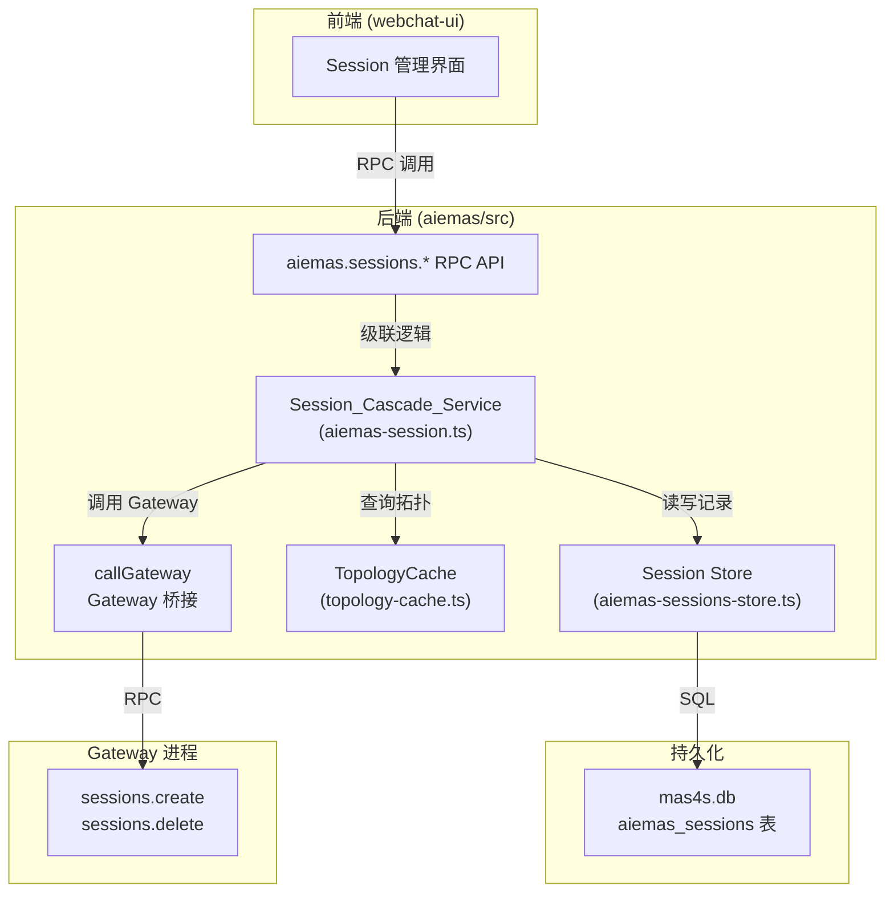
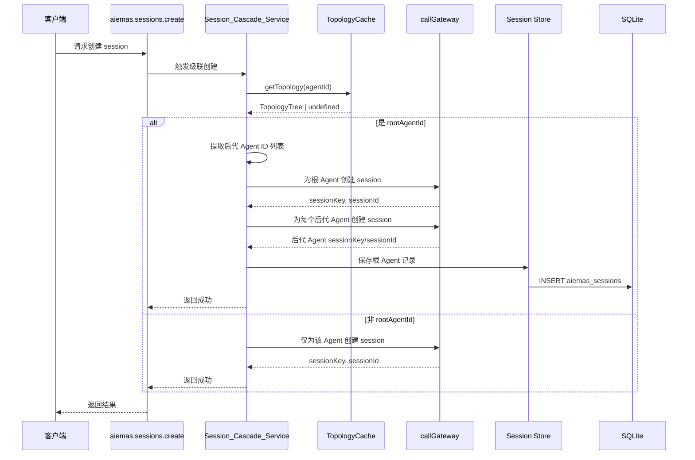

# 设计文档：A2A Session 级联创建与删除

## 概述

本功能为 AIEMAS 多智能体协作平台新增 Session 级联 RPC API（`aiemas.sessions.create`、`aiemas.sessions.delete`、`aiemas.sessions.list`），实现根 Agent 与其拓扑树中所有后代 Agent 的 session 自动级联管理。

核心设计目标：

1. **通用拓扑级联方案**：不与任何具体 A2A 场景绑定，仅依赖 TopologyCache 的拓扑关系进行级联操作
2. **最小化 Gateway 改动**：所有级联逻辑闭环在 AIEMAS 层实现，通过 `callGateway` 调用 Gateway 的 `sessions.create` 和 `sessions.delete`
3. **会话所有权记录**：级联创建的后代 Agent session 正确记录所有权和成员关系，支持多租户权限控制
4. **拓扑变更增量同步**：当拓扑关系通过 `aiemas.agents.topology.save` 更新时，自动为新增后代 Agent 创建 session，为移除后代 Agent 删除 session
5. **独立持久化存储**：根 Agent session 记录持久化到独立的 `aiemas_sessions` 表，维护根 Agent 与所有后代 Agent 的 sessionKey 映射

## 架构

### 系统分层



### 数据流



## 组件与接口

### 1. Session_Cascade_Service（`aiemas/src/gateway-bridge/aiemas-session.ts`）

核心服务模块，负责级联创建、删除、查询和拓扑变更增量同步。

```typescript
export interface SessionCascadeService {
  /** 级联创建 session */
  cascadeCreate(params: {
    agentId: string;
    userId: string;
    tenantId: string;
    label?: string;
  }): Promise<{ sessionKey: string; sessionId: string }>;

  /** 级联删除 session */
  cascadeDelete(params: { sessionKey: string }): Promise<void>;

  /** 查询根 Agent session 列表 */
  listRootSessions(): Promise<
    Array<{
      sessionKey: string;
      sessionId: string;
      agentId: string;
      sessionUuid: string;
      label?: string;
      userId: string;
      tenantId: string;
      createdAt: number;
    }>
  >;

  /** 拓扑变更时增量同步 session */
  syncTopologyChanges(params: {
    rootAgentId: string;
    oldTopology: TopologyTree | undefined;
    newTopology: TopologyTree;
    tenantId: string;
  }): Promise<void>;
}
```

### 2. aiemas_sessions 表设计

在 `ensureMas4sSchema` 中追加 DDL：

```sql
CREATE TABLE IF NOT EXISTS aiemas_sessions (
  sessionKey        TEXT PRIMARY KEY,
  sessionId         TEXT NOT NULL,
  agentId           TEXT NOT NULL,
  sessionUuid       TEXT NOT NULL,
  label             TEXT,
  userId            TEXT NOT NULL,
  tenantId          TEXT NOT NULL,
  descendantSessions TEXT NOT NULL,
  createdAt         INTEGER NOT NULL
);

CREATE INDEX IF NOT EXISTS idx_aiemas_sessions_agentId
  ON aiemas_sessions(agentId);

CREATE INDEX IF NOT EXISTS idx_aiemas_sessions_userId
  ON aiemas_sessions(userId);

CREATE INDEX IF NOT EXISTS idx_aiemas_sessions_tenantId
  ON aiemas_sessions(tenantId);
```

**字段说明：**

| 字段               | 类型    | 说明                                                                     |
| ------------------ | ------- | ------------------------------------------------------------------------ |
| sessionKey         | TEXT    | 根 Agent 的 sessionKey，格式 `agent:{agentId}:group:{sessionUuid}`，主键 |
| sessionId          | TEXT    | 根 Agent 的 sessionId（由 Gateway 返回）                                 |
| agentId            | TEXT    | 根 Agent ID                                                              |
| sessionUuid        | TEXT    | 会话组唯一标识，与所有后代 Agent 共享                                    |
| label              | TEXT    | 用户可读的 session 标签（可选）                                          |
| userId             | TEXT    | 创建者用户 ID                                                            |
| tenantId           | TEXT    | 所属租户 ID                                                              |
| descendantSessions | TEXT    | JSON 字符串，维护所有后代 Agent 的 sessionKey 和 sessionId 映射          |
| createdAt          | INTEGER | 创建时间戳（ms）                                                         |

**descendantSessions JSON 结构：**

```json
[
  {
    "agentId": "aieiaas-resource",
    "sessionKey": "agent:aieiaas-resource:group:mas-d4548844",
    "sessionId": "sess-uuid-1"
  },
  {
    "agentId": "aieiaas-model",
    "sessionKey": "agent:aieiaas-model:group:mas-d4548844",
    "sessionId": "sess-uuid-2"
  }
]
```

### 3. Session Store（`aiemas/src/store/aiemas-sessions-store.ts`）

数据库操作层，负责 `aiemas_sessions` 表的读写。

```typescript
export function createAiemasSessionsStore(db: DatabaseSync) {
  return {
    /** 保存根 Agent session 记录 */
    saveRootSession(params: {
      sessionKey: string;
      sessionId: string;
      agentId: string;
      sessionUuid: string;
      label?: string;
      userId: string;
      tenantId: string;
      descendantSessions: Array<{
        agentId: string;
        sessionKey: string;
        sessionId: string;
      }>;
    }): void;

    /** 加载根 Agent session 记录 */
    loadRootSession(sessionKey: string): RootSessionRecord | undefined;

    /** 查询根 Agent session 列表 */
    listRootSessions(): RootSessionRecord[];

    /** 删除根 Agent session 记录 */
    deleteRootSession(sessionKey: string): void;

    /** 更新 descendantSessions 字段 */
    updateDescendantSessions(params: {
      sessionKey: string;
      descendantSessions: Array<{
        agentId: string;
        sessionKey: string;
        sessionId: string;
      }>;
    }): void;
  };
}
```

### 4. RPC Handlers（`aiemas/src/gateway-bridge/aiemas-session.ts` 中注册）

通过 `mas4s-gateway-plugin.ts` 的 `extraHandlers` 机制注册。

#### `aiemas.sessions.create`

- **参数**：`{ agentId: string, label?: string }`
- **权限**：`admin | member`（写操作）
- **响应**：`{ sessionKey: string, sessionId: string }`
- **行为**：
  - 若 `agentId` 是 rootAgentId（TopologyCache 中存在），为根 Agent 及所有后代 Agent 创建 session
  - 若 `agentId` 不是 rootAgentId，仅为该 Agent 自身创建 session
  - 根 Agent session 记录持久化到 `aiemas_sessions` 表

#### `aiemas.sessions.delete`

- **参数**：`{ sessionKey: string }`
- **权限**：`admin | member`（写操作）
- **响应**：`{ ok: true }`
- **行为**：
  - 从 sessionKey 中解析 agentId
  - 若 agentId 是 rootAgentId，删除根 Agent 及所有后代 Agent 的 session
  - 若 agentId 不是 rootAgentId，仅删除该 Agent 自身的 session
  - 从 `aiemas_sessions` 表删除对应记录

#### `aiemas.sessions.list`

- **参数**：无（空参数）
- **权限**：`admin | member | viewer`（只读查询）
- **响应**：`{ sessions: Array<{ sessionKey, agentId, sessionUuid, label, userId, tenantId, createdAt }> }`
- **行为**：
  - 仅返回 `aiemas_sessions` 表中记录的根 Agent session
  - 不返回 Gateway `sessions.list` 中的后代 Agent 级联 session

### 5. SessionKey 派生规则

根 Agent 的 sessionKey 格式：`agent:{agentId}:{kind}:{suffix}`

后代 Agent 的 sessionKey 派生规则：**仅替换 agentId 段，其余部分完全不变**

```
根 Agent:    agent:aie-iaas:group:mas-d4548844
                    ↓ 替换 agentId
后代 Agent:  agent:aieiaas-resource:group:mas-d4548844
             agent:aieiaas-model:group:mas-d4548844
             agent:aieiaas-task:group:mas-d4548844
             agent:aieiaas-monitor:group:mas-d4548844
```

**派生算法：**

```typescript
function deriveDescendantSessionKey(rootSessionKey: string, descendantAgentId: string): string {
  // 解析根 Agent sessionKey
  const parts = rootSessionKey.split(":");
  // parts = ["agent", "aie-iaas", "group", "mas-d4548844"]

  // 替换 agentId 段（第二段）
  parts[1] = descendantAgentId;

  // 重新拼接
  return parts.join(":");
}
```

### TopologyTree（来自 agent-topology-dag 设计）

```typescript
export interface TopologyEdge {
  from: string;
  to: string;
}

export interface TopologyTree {
  edges: TopologyEdge[];
}
```

### RootSessionRecord

```typescript
export interface RootSessionRecord {
  sessionKey: string;
  sessionId: string;
  agentId: string;
  sessionUuid: string;
  label?: string;
  userId: string;
  tenantId: string;
  descendantSessions: Array<{
    agentId: string;
    sessionKey: string;
    sessionId: string;
  }>;
  createdAt: number;
}
```

## 实现方案

### 1. 级联创建流程（`cascadeCreate`）

```
输入：agentId, userId, tenantId, label?

步骤 1：检查兼容模式
  IF userId === null THEN
    仅通过 callGateway 为该 Agent 创建 session，返回
  END

步骤 2：查询拓扑关系
  topology = TopologyCache.getTopology(agentId)
  IF topology === undefined THEN
    agentId 不是 rootAgentId，仅为该 Agent 创建 session，返回
  END

步骤 3：提取后代 Agent ID 列表
  descendantAgentIds = extractDescendantAgentIds(topology.edges)
  // 从 edges 中提取所有唯一的 agentId（from 和 to 字段的并集），排除 rootAgentId

步骤 4：为根 Agent 创建 session
  rootSessionKey, rootSessionId = callGateway("sessions.create", {
    agentId: agentId,
    label: label
  })
  sessionUuid = extractSessionUuid(rootSessionKey)

步骤 5：为后代 Agent 创建 session
  descendantSessions = []
  FOR EACH descendantAgentId IN descendantAgentIds DO
    TRY
      descendantSessionKey, descendantSessionId = callGateway("sessions.create", {
        agentId: descendantAgentId
      })
      recordSessionCreated(descendantSessionKey, descendantSessionId, userId, tenantId)
      descendantSessions.append({
        agentId: descendantAgentId,
        sessionKey: descendantSessionKey,
        sessionId: descendantSessionId
      })
    CATCH error
      log.warn("Failed to create descendant session", { descendantAgentId, error })
      CONTINUE
    END
  END

步骤 6：持久化根 Agent 记录
  sessionStore.saveRootSession({
    sessionKey: rootSessionKey,
    sessionId: rootSessionId,
    agentId: agentId,
    sessionUuid: sessionUuid,
    label: label,
    userId: userId,
    tenantId: tenantId,
    descendantSessions: descendantSessions,
    createdAt: now()
  })

步骤 7：记录根 Agent 所有权
  recordSessionCreated(rootSessionKey, rootSessionId, userId, tenantId)

返回：{ sessionKey: rootSessionKey, sessionId: rootSessionId }
```

### 2. 级联删除流程（`cascadeDelete`）

```
输入：sessionKey

步骤 1：加载根 Agent 记录
  record = sessionStore.loadRootSession(sessionKey)
  IF record === undefined THEN
    仅通过 callGateway 删除该 session，返回
  END

步骤 2：检查兼容模式
  IF record.userId === null THEN
    仅通过 callGateway 删除该 session，返回
  END

步骤 3：删除后代 Agent session
  FOR EACH descendantSession IN record.descendantSessions DO
    TRY
      callGateway("sessions.delete", {
        sessionKey: descendantSession.sessionKey
      })
      deleteSessionRecords(descendantSession.sessionKey)
    CATCH error
      log.warn("Failed to delete descendant session", {
        descendantAgentId: descendantSession.agentId,
        error
      })
      CONTINUE
    END
  END

步骤 4：删除根 Agent session
  callGateway("sessions.delete", {
    sessionKey: sessionKey
  })

步骤 5：清理记录
  deleteSessionRecords(sessionKey)
  sessionStore.deleteRootSession(sessionKey)

返回：{ ok: true }
```

### 3. 拓扑变更增量同步（`syncTopologyChanges`）

在 `aiemas.agents.topology.save` handler 成功更新 TopologyCache 后调用。

```
输入：rootAgentId, oldTopology, newTopology, tenantId

步骤 1：计算拓扑差异
  oldDescendantIds = extractDescendantAgentIds(oldTopology?.edges ?? [])
  newDescendantIds = extractDescendantAgentIds(newTopology.edges)

  addedAgentIds = newDescendantIds - oldDescendantIds
  removedAgentIds = oldDescendantIds - newDescendantIds

步骤 2：查询活跃 session 记录
  activeSessions = sessionStore.listRootSessions({
    agentId: rootAgentId,
    tenantId: tenantId
  })

步骤 3：为新增后代 Agent 创建 session
  FOR EACH activeSession IN activeSessions DO
    FOR EACH addedAgentId IN addedAgentIds DO
      TRY
        descendantSessionKey, descendantSessionId = callGateway("sessions.create", {
          agentId: addedAgentId
        })
        recordSessionCreated(descendantSessionKey, descendantSessionId,
                           activeSession.userId, tenantId)

        // 更新 descendantSessions
        activeSession.descendantSessions.append({
          agentId: addedAgentId,
          sessionKey: descendantSessionKey,
          sessionId: descendantSessionId
        })
      CATCH error
        log.warn("Failed to create new descendant session", {
          addedAgentId,
          error
        })
        CONTINUE
      END
    END
  END

步骤 4：为移除后代 Agent 删除 session
  FOR EACH activeSession IN activeSessions DO
    FOR EACH removedAgentId IN removedAgentIds DO
      // 从 descendantSessions 中查找对应的 session
      descendantSession = activeSession.descendantSessions.find(
        s => s.agentId === removedAgentId
      )
      IF descendantSession !== undefined THEN
        TRY
          callGateway("sessions.delete", {
            sessionKey: descendantSession.sessionKey
          })
          deleteSessionRecords(descendantSession.sessionKey)

          // 从 descendantSessions 中移除
          activeSession.descendantSessions =
            activeSession.descendantSessions.filter(
              s => s.agentId !== removedAgentId
            )
        CATCH error
          log.warn("Failed to delete removed descendant session", {
            removedAgentId,
            error
          })
          CONTINUE
        END
      END
    END
  END

步骤 5：更新持久化记录
  FOR EACH activeSession IN activeSessions DO
    sessionStore.updateDescendantSessions({
      sessionKey: activeSession.sessionKey,
      descendantSessions: activeSession.descendantSessions
    })
  END

返回：void
```

### 4. 与现有系统的集成

#### 与 GatewayAuthBridge 的集成

- `recordSessionCreated` 和 `deleteSessionRecords` 调用 GatewayAuthBridge 暴露的钩子
- 级联创建的后代 Agent session 通过这些钩子正确记录到 `session_ownership` 和 `session_memberships` 表

#### 与 TopologyCache 的集成

- 通过 `TopologyCache.getTopology(agentId)` 查询拓扑关系
- TopologyCache 在 `aiemas.agents.topology.save` 时已同步更新，无需额外同步

#### 兼容模式处理

- 当 `userId === null` 时，跳过级联操作，仅通过 `callGateway` 执行根 Agent 自身的 session 操作
- 保持原有行为不变

## 错误处理与日志

| 场景                        | 错误码              | 处理方式                                     |
| --------------------------- | ------------------- | -------------------------------------------- |
| agentId 为空                | `INVALID_PARAMS`    | 拒绝请求，返回错误                           |
| sessionKey 格式错误         | `INVALID_PARAMS`    | 拒绝请求，返回错误                           |
| 后代 Agent session 创建失败 | —                   | 记录警告日志，继续创建其余后代 Agent session |
| 后代 Agent session 删除失败 | —                   | 记录警告日志，继续删除其余后代 Agent session |
| 数据库写入失败              | `INTERNAL`          | 返回错误，不更新缓存                         |
| 权限不足                    | `PERMISSION_DENIED` | 由 RBAC 层拦截                               |
| 兼容模式（userId=null）     | —                   | 跳过级联操作，仅执行根 Agent 自身操作        |

**关键日志记录点：**

- 级联创建开始/完成
- 后代 Agent session 创建成功/失败
- 拓扑变更增量同步开始/完成
- 权限校验失败

## RBAC 权限注册

在 `aiemas/src/rbac/permission-checker.ts` 的 `GLOBAL_ROLE_PERMISSIONS` 中注册：

```typescript
"aiemas.sessions.create": new Set(["admin", "member"]),
"aiemas.sessions.delete": new Set(["admin", "member"]),
"aiemas.sessions.list": new Set(["admin", "member", "viewer"]),
```

## 正确性属性（Correctness Properties）

_属性（Property）是指在系统所有合法执行中都应成立的特征或行为——本质上是对系统应做什么的形式化陈述。属性是人类可读规格说明与机器可验证正确性保证之间的桥梁。_

### Property 1: SessionKey 派生一致性

_For any_ 根 Agent sessionKey（格式 `agent:{rootAgentId}:group:{sessionUuid}`）和任意后代 Agent ID，派生的后代 Agent sessionKey 应满足格式 `agent:{descendantAgentId}:group:{sessionUuid}`，其中 `group` 和 `sessionUuid` 与根 Agent sessionKey 保持一致。

**Validates: Requirements 3.3, 3.5**

### Property 2: 后代 Agent ID 提取正确性

_For any_ TopologyTree（包含任意数量的 edges），从 edges 中提取的后代 Agent ID 集合应恰好等于所有 `from` 和 `to` 字段的并集，排除 rootAgentId 后的结果。

**Validates: Requirements 1.3, 2.3**

### Property 3: 非 rootAgentId 不触发级联

_For any_ 不在 TopologyCache 的 byRoot 索引中的 agentId，调用 `cascadeCreate` 或 `cascadeDelete` 时应仅对该 Agent 自身执行操作，不执行任何级联操作（即 callGateway 调用次数为 1）。

**Validates: Requirements 1.2, 2.2, 4.4, 7.3**

### Property 4: 级联创建操作数量正确性

_For any_ rootAgentId 和包含 N 条 edges 的 TopologyTree，调用 `cascadeCreate` 时应调用 callGateway 的次数为 1（根 Agent）+ M（后代 Agent 数量），其中 M 为从 edges 中提取的唯一后代 Agent ID 数量。

**Validates: Requirements 1.4, 1.3**

### Property 5: 级联删除操作数量正确性

_For any_ 已保存的根 Agent session 记录（包含 M 个后代 Agent session），调用 `cascadeDelete` 时应调用 callGateway 删除的次数为 M（后代 Agent）+ 1（根 Agent）。

**Validates: Requirements 2.3, 2.4**

### Property 6: Session 记录往返一致性

_For any_ 有效的根 Agent session 参数（agentId, userId, tenantId, label），调用 `cascadeCreate` 后再通过 `sessionStore.loadRootSession` 加载，返回的记录应与保存时的数据在语义上等价（sessionKey、agentId、userId、tenantId、label 字段相同）。

**Validates: Requirements 1.7, 9.4**

### Property 7: 拓扑差异计算正确性

_For any_ 新旧 TopologyTree，计算的新增 Agent ID 集合应恰好等于 `newDescendantIds - oldDescendantIds`，移除 Agent ID 集合应恰好等于 `oldDescendantIds - newDescendantIds`。

**Validates: Requirements 10.1**

### Property 8: 拓扑变更增量同步操作数量正确性

_For any_ 拓扑变更（新增 N 个后代 Agent，移除 M 个后代 Agent）和 K 个活跃 session 记录，调用 `syncTopologyChanges` 时应调用 callGateway 创建 N×K 次，删除 M×K 次。

**Validates: Requirements 10.2, 10.3**

### Property 9: 兼容模式跳过级联

_For any_ userId 为 null 的请求，调用 `cascadeCreate` 或 `cascadeDelete` 时应仅对该 Agent 自身执行操作，不执行任何级联操作（即 callGateway 调用次数为 1）。

**Validates: Requirements 6.5**

### Property 10: 查询结果字段完整性

_For any_ 查询请求，返回的每条 session 记录应包含所有必需字段（sessionKey、agentId、sessionUuid、label、userId、tenantId、createdAt），且这些字段的值应与数据库中存储的值一致。

**Validates: Requirements 8.5**

### Property 11: 空拓扑树边界情况

_For any_ rootAgentId 且 TopologyTree 的 edges 为空数组，调用 `cascadeCreate` 时应仅为根 Agent 创建 session，不执行任何级联操作（即 callGateway 调用次数为 1）。

**Validates: Requirements 1.6**

### Property 12: 拓扑树从无到有的增量同步

_For any_ 从无拓扑树（undefined）变更为有拓扑树（包含 N 条 edges）的情况，应视为全量新增，为每个活跃 session 创建 N 个后代 Agent session。

**Validates: Requirements 10.5**

### Property 13: 拓扑树从有到无的增量同步

_For any_ 从有拓扑树（包含 N 条 edges）变更为无拓扑树（edges 为空）的情况，应视为全量移除，为每个活跃 session 删除 N 个后代 Agent session。

**Validates: Requirements 10.5**

### Property 14: 所有 session 共享相同 sessionUuid

_For any_ 级联创建操作，根 Agent 及所有后代 Agent 的 sessionKey 中提取的 sessionUuid 应完全相同。

**Validates: Requirements 3.5, 5.2**

## 测试策略

### 属性测试（Property-Based Testing）

使用 `fast-check` 库进行属性测试，每个属性最少运行 100 次迭代。

测试文件：`aiemas/src/gateway-bridge/aiemas-session.property.test.ts` 和 `aiemas/src/store/aiemas-sessions-store.property.test.ts`

| 属性                                | 测试标签                                                                               | 测试位置                               |
| ----------------------------------- | -------------------------------------------------------------------------------------- | -------------------------------------- |
| Property 1: SessionKey 派生一致性   | Feature: a2a-session-cascade, Property 1: SessionKey derivation consistency            | aiemas-session.property.test.ts        |
| Property 2: 后代 Agent ID 提取      | Feature: a2a-session-cascade, Property 2: Descendant agent ID extraction correctness   | aiemas-session.property.test.ts        |
| Property 3: 非 rootAgentId 不触发   | Feature: a2a-session-cascade, Property 3: Non-root agent ID does not trigger cascade   | aiemas-session.property.test.ts        |
| Property 4: 级联创建操作数量        | Feature: a2a-session-cascade, Property 4: Cascade create operation count correctness   | aiemas-session.property.test.ts        |
| Property 5: 级联删除操作数量        | Feature: a2a-session-cascade, Property 5: Cascade delete operation count correctness   | aiemas-session.property.test.ts        |
| Property 6: Session 记录往返一致性  | Feature: a2a-session-cascade, Property 6: Session record round-trip consistency        | aiemas-sessions-store.property.test.ts |
| Property 7: 拓扑差异计算正确性      | Feature: a2a-session-cascade, Property 7: Topology diff calculation correctness        | aiemas-session.property.test.ts        |
| Property 8: 增量同步操作数量        | Feature: a2a-session-cascade, Property 8: Incremental sync operation count correctness | aiemas-session.property.test.ts        |
| Property 9: 兼容模式跳过级联        | Feature: a2a-session-cascade, Property 9: Compatibility mode skips cascade             | aiemas-session.property.test.ts        |
| Property 10: 查询结果字段完整性     | Feature: a2a-session-cascade, Property 10: Query result field completeness             | aiemas-sessions-store.property.test.ts |
| Property 11: 空拓扑树边界情况       | Feature: a2a-session-cascade, Property 11: Empty topology tree boundary case           | aiemas-session.property.test.ts        |
| Property 12: 拓扑树从无到有         | Feature: a2a-session-cascade, Property 12: Topology tree from none to some             | aiemas-session.property.test.ts        |
| Property 13: 拓扑树从有到无         | Feature: a2a-session-cascade, Property 13: Topology tree from some to none             | aiemas-session.property.test.ts        |
| Property 14: 所有 session 共享 uuid | Feature: a2a-session-cascade, Property 14: All sessions share same sessionUuid         | aiemas-session.property.test.ts        |

生成器设计：

- `arbAgentId`：生成非空字母数字字符串（模拟 agent ID）
- `arbSessionUuid`：生成 UUID 格式字符串
- `arbSessionKey`：生成 `agent:{agentId}:{kind}:{sessionUuid}` 格式
- `arbEdge`：生成 `{ from: arbAgentId, to: arbAgentId }` 且 `from !== to`
- `arbTopologyTree`：生成 `{ edges: fc.array(arbEdge) }`
- `arbRootSessionRecord`：生成完整的根 Agent session 记录

### 单元测试（Example-Based）

| 测试目标                        | 测试文件                      |
| ------------------------------- | ----------------------------- |
| 级联创建流程（成功路径）        | aiemas-session.test.ts        |
| 级联删除流程（成功路径）        | aiemas-session.test.ts        |
| 后代 Agent session 创建失败处理 | aiemas-session.test.ts        |
| 后代 Agent session 删除失败处理 | aiemas-session.test.ts        |
| 拓扑变更增量同步                | aiemas-session.test.ts        |
| Session Store CRUD 操作         | aiemas-sessions-store.test.ts |
| RBAC 权限注册正确性             | permission-checker.test.ts    |
| 兼容模式（userId=null）处理     | aiemas-session.test.ts        |
| 表结构和索引创建                | database.test.ts              |

### 集成测试

- 完整的级联创建流程（包括 Gateway 调用和所有权记录）
- 完整的级联删除流程（包括 Gateway 调用和记录清理）
- 拓扑变更时的增量同步（包括新增和移除后代 Agent）
- 与 GatewayAuthBridge 的集成（所有权记录和成员关系）
- 与 TopologyCache 的集成（拓扑关系查询）
