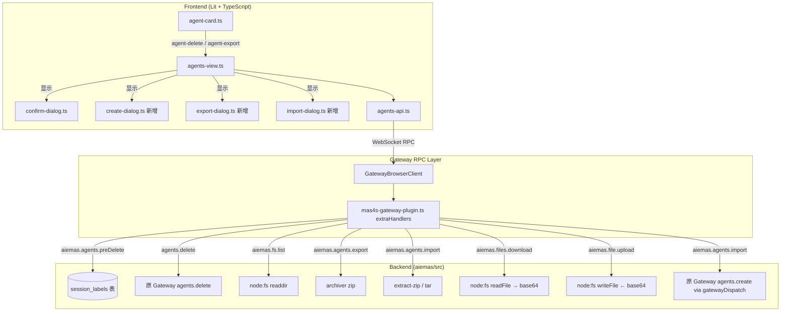

# Design Document: Agent CRUD, Import & Export

## Overview

本设计为智能体页面（agents-view）新增创建、删除、导出、导入四大功能，实现智能体的完整生命周期管理。

- **创建**：通过列表页右上角创建按钮触发，用户在 Create_Dialog 中填写名称和工作区目录后，调用已有的 `agents.create` RPC 方法创建智能体。
- **删除**：通过 agent-card 上的删除图标触发，先调用 `aiemas.agents.preDelete` 检查 `session_labels.currentAgentId` 是否存在关联会话，无关联后调用已有的 `agents.delete` 执行删除。
- **导出**：通过 agent-card 上的导出图标触发，调用 `aiemas.fs.list` 获取工作区文件列表，用户在 Export_Dialog 中勾选后调用 `aiemas.agents.export` 打包为 zip，再通过 `aiemas.files.download` 以 base64 下载。
- **导入**：通过列表页右上角导入按钮触发，用户在 Import_Dialog 中选择 zip 文件，通过 `aiemas.file.upload` 上传至服务端临时目录，再调用 `aiemas.agents.import` 创建智能体并解压到工作区。

所有新增后端逻辑闭环在 `aiemas/src/gateway-bridge/mas4s-gateway-plugin.ts` 的 `extraHandlers` 中，前端 RPC 封装统一在 `aiemas/ui/mas4s/src/gateway/agents-api.ts`。

## Architecture

### 系统分层



### 设计决策

1. **preDelete 前置检查**：删除前查询 `session_labels` 表而非直接删除，避免破坏正在使用该智能体的会话。查询使用已有的 `node:sqlite` DatabaseSync 实例（与 plugin 初始化时创建的 `db` 相同）。

2. **导出采用 base64 传输**：由于 Gateway 通信基于 WebSocket JSON-RPC，文件内容通过 base64 编码在 `aiemas.files.download` 响应中返回，前端解码后触发浏览器下载。这避免了引入额外的 HTTP 文件下载端点。

3. **导入复用 `agents.create`**：`aiemas.agents.import` 通过 `gatewayDispatch` 调用已有的 `agents.create` 方法创建智能体，然后将 zip 解压覆盖到新智能体的 workspace 目录。这确保了智能体创建逻辑的一致性。

4. **临时文件管理**：导出时在 workspace 同级创建 `{agentId}-export` 临时目录，压缩完成后清理；导入时上传文件写入 `os.tmpdir()`，解压完成后清理。

5. **最小入侵原 Gateway**：所有新增 RPC 方法注册在 `extraHandlers` 中，`src/gateway/server-methods-list.ts` 无需修改（extraHandlers 方法不需要在 BASE_METHODS 中注册）。

## Components and Interfaces

### 新增后端 RPC 方法（extraHandlers）

#### `aiemas.agents.preDelete`

```typescript
// 请求参数
interface PreDeleteParams {
  agentId: string;
}
// 成功响应
interface PreDeleteOkResponse {
  ok: true;
}
// 错误响应: AGENT_IN_USE (code), message 包含关联会话数量
// 错误响应: INVALID_PARAMS (agentId 缺失或为空)
```

- 查询: `SELECT COUNT(*) AS count FROM session_labels WHERE currentAgentId = ?`
- count > 0 → respond(false, undefined, { code: "AGENT_IN_USE", message: `该智能体仍有 ${count} 个关联会话，无法删除` })

#### `aiemas.fs.list`

```typescript
interface FsListParams {
  dirPath: string;
}
interface FsListResponse {
  entries: Array<{
    name: string;
    type: "file" | "directory";
    size: number; // 目录为 0
  }>;
}
// 错误: INVALID_PARAMS (dirPath 缺失/空), NOT_FOUND (目录不存在)
```

- 使用 `node:fs/promises` 的 `readdir` + `stat` 读取直接子项

#### `aiemas.agents.export`

```typescript
interface AgentExportParams {
  agentId: string;
  workspace: string;
  items: string[]; // 选中的文件/目录名称
}
interface AgentExportResponse {
  archivePath: string; // zip 绝对路径
}
// 错误: INVALID_PARAMS, NOT_FOUND
```

- 流程: 创建临时目录 → 复制 items → zip 压缩 → 返回 archivePath → 清理临时目录
- zip 库: 使用 `archiver` npm 包（或 Node 内置 `child_process` 调用系统 `zip` 命令）

#### `aiemas.agents.import`

```typescript
interface AgentImportParams {
  archivePath: string;
}
interface AgentImportResponse {
  // 与 agents.create 返回格式一致
  id: string;
  name?: string;
  workspace: string;
  model: { primary: string; fallbacks: string[] };
}
// 错误: INVALID_PARAMS, EXTRACT_FAILED, agents.create 透传错误
```

- 流程: gatewayDispatch("agents.create") → 解压 zip 到新 workspace → 清理临时 zip → 返回新智能体信息

#### `aiemas.files.download`

```typescript
interface FileDownloadParams {
  filePath: string;
}
interface FileDownloadResponse {
  data: string; // base64 编码
  fileName: string;
  mimeType: string;
}
// 错误: INVALID_PARAMS, NOT_FOUND
```

#### `aiemas.file.upload`

```typescript
interface FileUploadParams {
  fileName: string;
  data: string; // base64 编码
}
interface FileUploadResponse {
  filePath: string; // 服务端临时文件绝对路径
}
// 错误: INVALID_PARAMS
```

- 写入路径: `path.join(os.tmpdir(), 'aiemas-upload-' + randomId, fileName)`

### 新增前端 API 函数（agents-api.ts）

```typescript
// 新增到 agents-api.ts
export async function createAgent(
  client: GatewayBrowserClient,
  name: string,
  workspace: string,
): Promise<{ ok: true; agentId: string; name: string; workspace: string }>;
export async function preDeleteAgent(
  client: GatewayBrowserClient,
  agentId: string,
): Promise<{ ok: true }>;
export async function deleteAgent(
  client: GatewayBrowserClient,
  agentId: string,
): Promise<{ ok: true }>;
export async function listWorkspaceFiles(
  client: GatewayBrowserClient,
  dirPath: string,
): Promise<FsListResponse>;
export async function exportAgent(
  client: GatewayBrowserClient,
  agentId: string,
  workspace: string,
  items: string[],
): Promise<{ archivePath: string }>;
export async function downloadFile(
  client: GatewayBrowserClient,
  filePath: string,
): Promise<FileDownloadResponse>;
export async function uploadFile(
  client: GatewayBrowserClient,
  fileName: string,
  data: string,
): Promise<{ filePath: string }>;
export async function importAgent(
  client: GatewayBrowserClient,
  archivePath: string,
): Promise<AgentImportResponse>;
```

### 新增 UI 组件

#### `create-dialog.ts`

LitElement 组件，提供创建智能体的表单。

- 属性: 无外部属性
- 状态: `name: string` (智能体名称), `workspace: string` (工作区目录)
- 事件: `confirm` (detail: { name: string, workspace: string }), `cancel`
- 验证: name 和 workspace 均为必填，空值时禁用确认按钮
- 样式: 复用 `confirm-dialog.ts` 的弹窗样式模式

#### `export-dialog.ts`

LitElement 组件，接收 `entries: FsListEntry[]` 属性，渲染复选框列表。

- 属性: `entries` (文件/目录列表), `agentName` (标题显示)
- 状态: `selectedItems: Set<string>` (默认全选)
- 事件: `confirm` (detail: { items: string[] }), `cancel`
- 功能: 全选/取消全选 toggle

#### `import-dialog.ts`

LitElement 组件，提供文件选择器。

- 状态: `selectedFile: File | null`
- 事件: `confirm` (detail: { file: File }), `cancel`
- 文件类型限制: `accept=".zip,.tar.gz,.tgz"`

#### `agent-card.ts` 修改

在卡片右下角新增删除和导出图标按钮，点击时 `stopPropagation()` 并 dispatch 对应自定义事件。

#### `agents-view.ts` 修改

- 头部区域新增创建按钮和导入按钮
- 监听 `agent-delete` / `agent-export` 事件
- 管理 create-dialog / confirm-dialog / export-dialog / import-dialog 的显示状态
- 实现创建、删除、导出、导入的完整业务流程

## Data Models

### 数据库查询（只读）

本功能不新增数据库表或列，仅查询已有的 `session_labels` 表：

```sql
-- aiemas.agents.preDelete: 检查智能体关联会话数
SELECT COUNT(*) AS count FROM session_labels WHERE currentAgentId = ?;
```

`session_labels` 表结构（已存在于 `aiemas/src/store/database.ts`）：

| 列名           | 类型    | 说明                |
| -------------- | ------- | ------------------- |
| sessionUuid    | TEXT PK | 会话 UUID           |
| label          | TEXT    | 会话标签            |
| displayName    | TEXT    | 会话显示名          |
| currentAgentId | TEXT    | 当前关联的智能体 ID |
| updatedAt      | INTEGER | 最后更新时间戳      |

### 前端类型扩展（agents-types.ts）

```typescript
/** aiemas.fs.list 响应中的文件/目录条目 */
export interface WorkspaceEntry {
  name: string;
  type: "file" | "directory";
  size: number;
}

/** aiemas.fs.list 响应 */
export interface WorkspaceListPayload {
  entries: WorkspaceEntry[];
}

/** aiemas.agents.export 响应 */
export interface AgentExportPayload {
  archivePath: string;
}

/** aiemas.files.download 响应 */
export interface FileDownloadPayload {
  data: string;
  fileName: string;
  mimeType: string;
}

/** aiemas.file.upload 响应 */
export interface FileUploadPayload {
  filePath: string;
}
```

### 文件系统临时数据

| 场景 | 临时路径                                          | 生命周期                 |
| ---- | ------------------------------------------------- | ------------------------ |
| 导出 | `{workspace}/../{agentId}-export/` (临时目录)     | 压缩完成后立即删除       |
| 导出 | `{workspace}/../{agentId}-export.zip` (压缩包)    | 前端下载完成后由前端管理 |
| 导入 | `os.tmpdir()/aiemas-upload-{randomId}/{fileName}` | 解压完成后立即删除       |
