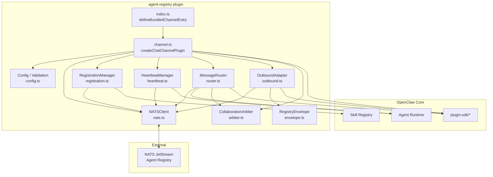
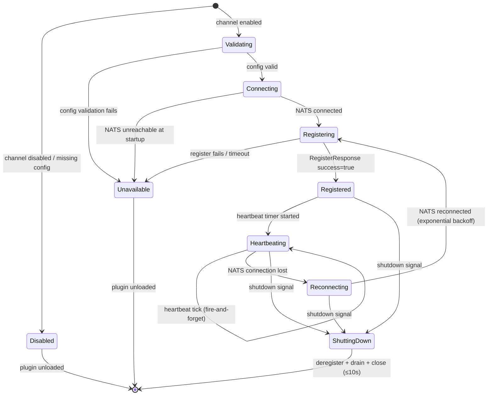
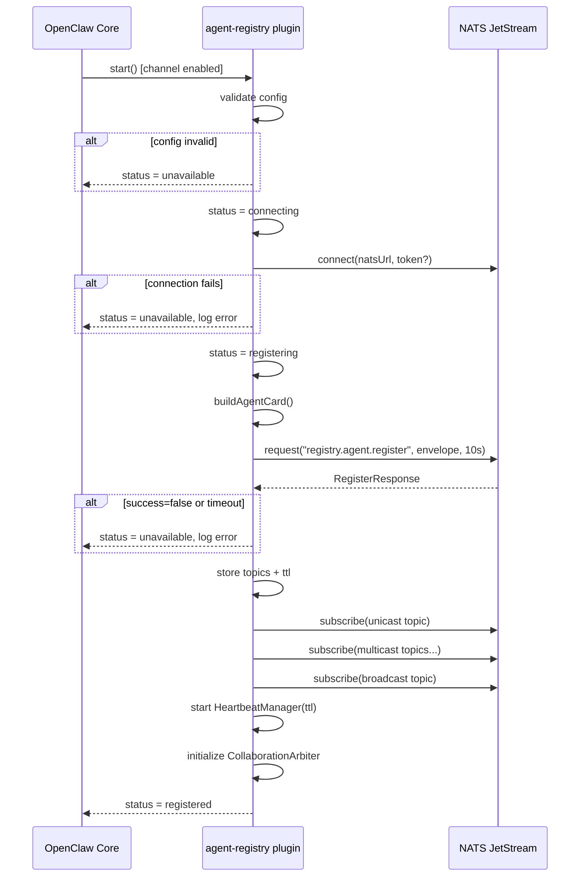
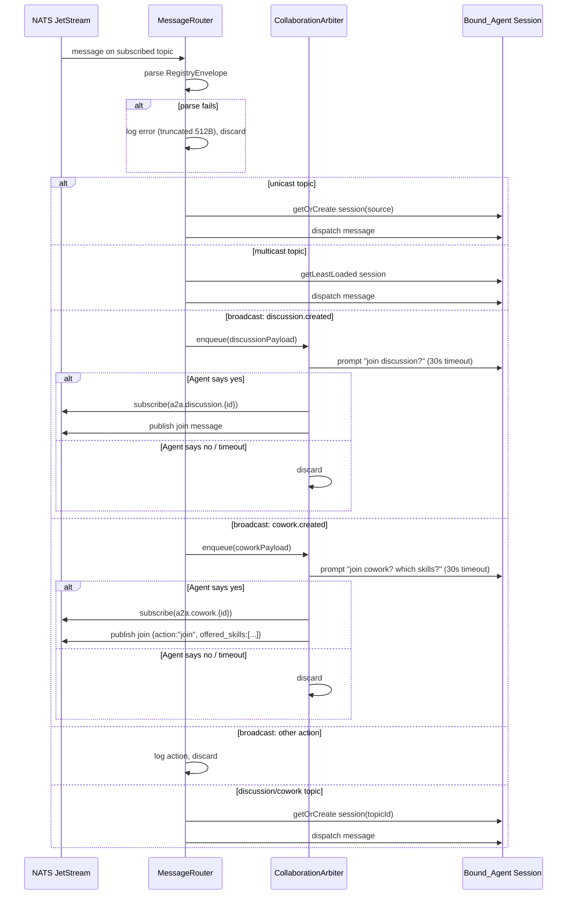
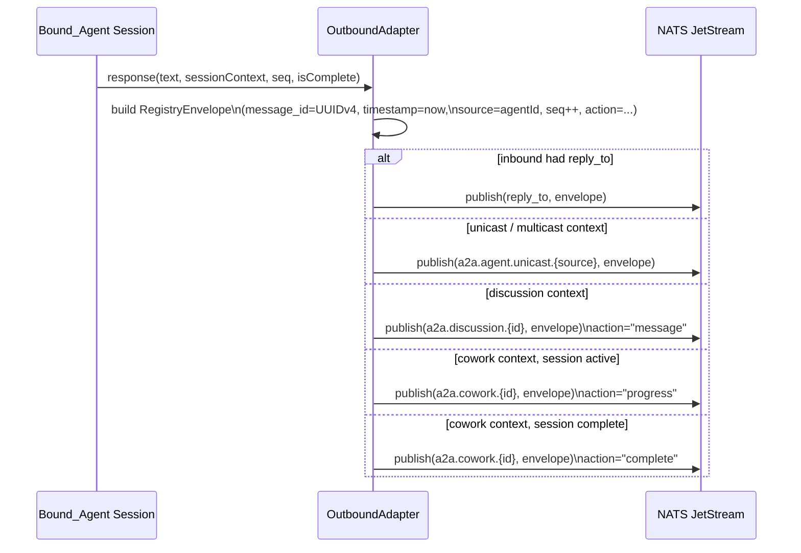
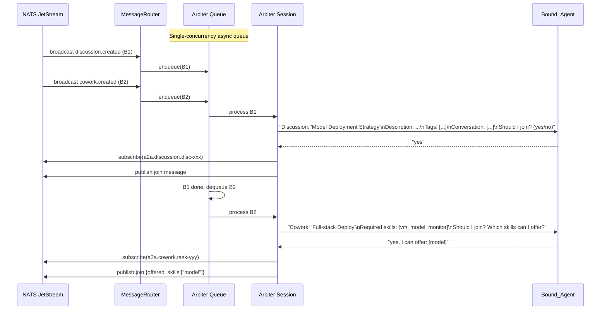
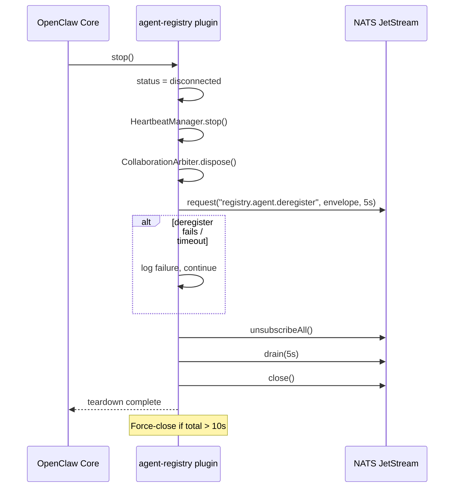

# Design Document: agent-registry-channel

## Overview

The `agent-registry` channel plugin connects OpenClaw to an Agent Registry's A2A (Agent-to-Agent) collaboration network via native NATS JetStream. It follows the OpenClaw TypeScript ESM plugin SDK patterns established by `extensions/telegram/`, using `defineBundledChannelEntry` and `createChatChannelPlugin` from the plugin SDK.

When active, the plugin:

1. Connects to a NATS server and registers an AgentCard built from explicitly configured skills
2. Subscribes to assigned unicast, multicast, and broadcast topics
3. Routes inbound A2A messages to a bound OpenClaw Agent
4. Maintains a long-lived **Collaboration_Arbiter** session for autonomous join decisions on `discussion.created` / `cowork.created` broadcasts
5. Sends heartbeats at `floor(TTL/3)` ms intervals to keep the registration alive
6. Deregisters cleanly on shutdown

The plugin is intentionally narrow: it does not auto-scan installed skills, does not expose the host MAC address, and does not make join decisions algorithmically — all collaboration decisions are delegated to the Bound_Agent via the Arbiter session.

---

## Architecture

### Component Diagram



### Plugin Lifecycle State Machine



---

## Module Structure

```
extensions/agent-registry/
├── index.ts                        # defineBundledChannelEntry — plugin entry point
├── channel-plugin-api.ts           # re-exports agentRegistryPlugin
├── openclaw.plugin.json            # plugin manifest
├── package.json                    # @openclaw/agent-registry, type: "module"
├── src/
│   ├── channel.ts                  # createChatChannelPlugin — main plugin assembly
│   ├── config.ts                   # env var schema, validation, parsed config type
│   ├── envelope.ts                 # RegistryEnvelope serialize/deserialize, UUID gen
│   ├── nats-client.ts              # NATS connection, reconnect, subscribe/unsubscribe
│   ├── registration.ts             # AgentCard build, register, re-register, deregister
│   ├── heartbeat.ts                # Heartbeat timer, status/load reporting
│   ├── router.ts                   # Inbound message routing (unicast/multicast/broadcast)
│   ├── outbound.ts                 # Outbound adapter — wrap responses in RegistryEnvelope
│   ├── arbiter.ts                  # CollaborationArbiter session management
│   ├── types.ts                    # Shared TypeScript interfaces and type aliases
│   └── status.ts                   # Channel status adapter (connecting/registered/etc.)
└── __tests__/
    ├── envelope.test.ts            # Unit + property tests for serialization
    ├── config.test.ts              # Config validation tests
    ├── registration.test.ts        # AgentCard build tests
    ├── router.test.ts              # Message routing tests
    └── outbound.test.ts            # Outbound envelope wrapping tests
```

---

## Components and Interfaces

### NATSClient (`nats-client.ts`)

Owns the single NATS connection for the plugin lifetime. Wraps `nats.js` (the official NATS TypeScript client).

```typescript
interface NATSClientOptions {
  url: string;
  token?: string;
  onDisconnect: () => void;
  onReconnect: () => void;
}

interface NATSClient {
  connect(): Promise<void>;
  request(subject: string, payload: Uint8Array, timeoutMs: number): Promise<Uint8Array>;
  publish(subject: string, payload: Uint8Array): void;
  subscribe(subject: string, handler: (msg: Uint8Array) => void): NATSSubscription;
  unsubscribeAll(): Promise<void>;
  drain(timeoutMs: number): Promise<void>;
  close(): Promise<void>;
  readonly isConnected: boolean;
}

interface NATSSubscription {
  subject: string;
  unsubscribe(): void;
}
```

Reconnect strategy: exponential backoff starting at 1 s, doubling each attempt, capped at 30 s. Delegated to `nats.js` reconnect options (`reconnect: true`, `maxReconnectAttempts: -1`, `reconnectTimeWait: 1000`, `maxReconnectTimeWait: 30000`).

### RegistrationManager (`registration.ts`)

Builds the AgentCard and manages the register/deregister lifecycle.

```typescript
interface RegistrationManagerOptions {
  config: AgentRegistryConfig;
  natsClient: NATSClient;
  getInstalledSkills: () => Promise<InstalledSkill[]>;
}

interface RegistrationManager {
  buildAgentCard(): Promise<AgentCard>;
  register(): Promise<RegisterResult>;
  deregister(): Promise<void>;
  readonly assignedTopics: TopicAssignment | null;
  readonly ttlMs: number | null;
}

interface RegisterResult {
  ok: boolean;
  topics?: TopicAssignment;
  ttlMs?: number;
  error?: string;
}
```

### HeartbeatManager (`heartbeat.ts`)

```typescript
interface HeartbeatManagerOptions {
  agentId: string;
  natsClient: NATSClient;
  getActiveSessionCount: () => number;
}

interface HeartbeatManager {
  start(ttlMs: number): void;
  stop(): void;
  readonly isRunning: boolean;
}
```

Heartbeat interval = `Math.floor(ttlMs / 3)`. Status is `"busy"` when `getActiveSessionCount() > 0`, otherwise `"idle"`.

### MessageRouter (`router.ts`)

Dispatches inbound NATS messages to the appropriate OpenClaw agent session.

```typescript
interface MessageRouterOptions {
  boundAgentId: string;
  natsClient: NATSClient;
  arbiter: CollaborationArbiter;
  createSession: (sourceAgentId: string, agentId: string) => AgentSession;
  getOrCreateSession: (key: string, agentId: string) => AgentSession;
  getLeastLoadedSession: (agentId: string) => AgentSession;
}

interface MessageRouter {
  handleUnicast(envelope: RegistryEnvelope): Promise<void>;
  handleMulticast(envelope: RegistryEnvelope): Promise<void>;
  handleBroadcast(envelope: RegistryEnvelope): Promise<void>;
  handleCollaborationTopic(topicId: string, envelope: RegistryEnvelope): Promise<void>;
}
```

### CollaborationArbiter (`arbiter.ts`)

Maintains a single long-lived Bound_Agent session. Processes `discussion.created` and `cowork.created` broadcasts sequentially (one at a time, 30 s timeout per decision).

```typescript
interface CollaborationArbiterOptions {
  boundAgentId: string;
  natsClient: NATSClient;
  createArbiterSession: (agentId: string) => AgentSession;
  configuredSkills: string[];
}

interface CollaborationArbiter {
  initialize(): Promise<void>;
  processDiscussionCreated(payload: DiscussionCreatedPayload): Promise<void>;
  processCoworkCreated(payload: CoworkCreatedPayload): Promise<void>;
  dispose(): void;
}
```

The Arbiter uses a sequential async queue (single-concurrency promise chain) to ensure broadcasts are processed one at a time. Each decision prompt includes the full context (`text`, `description`, `tags`/`required_skills`, `conversation`).

### OutboundAdapter (`outbound.ts`)

Wraps OpenClaw agent responses in `RegistryEnvelope` and publishes to the correct NATS subject.

```typescript
interface OutboundAdapterOptions {
  agentId: string;
  natsClient: NATSClient;
}

interface OutboundAdapter {
  send(params: OutboundSendParams): Promise<void>;
}

interface OutboundSendParams {
  responseText: string;
  inboundEnvelope: RegistryEnvelope;
  sessionContext: SessionContext; // unicast | multicast | discussion | cowork
  sessionSeq: number;
  isSessionComplete: boolean;
}
```

---

## Data Models

### AgentRegistryConfig

```typescript
interface AgentRegistryConfig {
  natsUrl: string; // AGENT_REGISTRY_NATS_URL
  agentId: string; // AGENT_REGISTRY_AGENT_ID
  agentName: string; // AGENT_REGISTRY_AGENT_NAME
  natsToken?: string; // AGENT_REGISTRY_NATS_TOKEN (optional)
  skills: string[]; // AGENT_REGISTRY_SKILLS parsed, default []
  boundAgentId?: string; // AGENT_REGISTRY_BOUND_AGENT_ID (optional)
}
```

Validation rules (Requirement 9):

- `natsUrl`: non-empty, matches `/^nats:\/\/[^:]+:\d{1,5}$/` where port 1–65535
- `agentId`: non-empty, ≤64 chars, `/^[a-zA-Z0-9_-]+$/`
- `agentName`: non-empty, ≤128 chars
- `natsToken`: optional, ≤512 chars
- `skills`: optional comma-separated list, each name ≤128 chars
- `boundAgentId`: optional, ≤64 chars

### RegistryEnvelope

```typescript
interface RegistryEnvelope {
  message_id: string; // UUID v4
  request_id: string; // UUID v4 (req: generated; res: copied from req)
  message_type: "req" | "res" | "event";
  timestamp: number; // Unix epoch ms, non-negative integer
  source: string; // sender agent_id; "registry" for Registry-originated
  seq: number; // non-negative integer, monotonically increasing per session
  action: string; // e.g. "register", "heartbeat", "message", "join"
  resource_type: string; // "agent" | "collaboration" | "cowork" | "discussion"
  payload: Record<string, unknown>;
  reply_to: string | null; // temporary inbox subject for request-reply; null otherwise
}
```

### AgentCard

```typescript
interface AgentCard {
  // A2A standard fields
  name: string;
  description: string;
  version: string; // "1.0.0"
  url: string; // "nats://a2a.agent.unicast.{agentId}"
  capabilities: AgentCapabilities;
  skills: AgentSkill[];
  defaultInputModes: string[]; // ["text/plain"]
  defaultOutputModes: string[]; // ["text/plain"]
  securitySchemes?: Record<string, unknown>;
  authentication?: Record<string, unknown>;
  icon?: string;
  // Registry extension fields
  agent_id: string;
  mac: string; // always "00:00:00:00:00:00"
  transport: "mq";
  endpoint?: string;
  status: "online" | "idle" | "busy" | "offline";
}

interface AgentCapabilities {
  streaming: boolean; // false
  pushNotifications: boolean; // false
  longRunningOperations: boolean; // true (Requirement 2.7)
  stateTransitionHistory: boolean; // false
}

interface AgentSkill {
  id: string;
  name: string;
  description: string;
  tags: string[];
  examples?: string[];
  inputModes?: string[];
  outputModes?: string[];
}
```

### TopicAssignment

```typescript
interface TopicAssignment {
  unicast: string; // "a2a.agent.unicast.{agentId}"
  multicast: string[]; // ["a2a.agent.group.{groupId}", ...]
  broadcast: string; // "a2a.agent.broadcast.all"
}
```

### HeartbeatPayload

```typescript
interface HeartbeatPayload {
  agent_id: string;
  status: "online" | "idle" | "busy" | "offline";
  load: {
    cpu: number; // 0.0 (not measured, always 0)
    memory: number; // 0.0 (not measured, always 0)
    active_task_count: number;
  };
}
```

### SessionContext

Tracks the routing context for an active agent session so the OutboundAdapter knows where to publish responses.

```typescript
type SessionContext =
  | { kind: "unicast"; sourceAgentId: string }
  | { kind: "multicast"; groupId: string }
  | { kind: "discussion"; discussionId: string }
  | { kind: "cowork"; taskId: string; isComplete: boolean };
```

### PluginStatus

```typescript
type PluginStatus =
  | "disabled"
  | "connecting"
  | "registering"
  | "registered"
  | "reconnecting"
  | "unavailable"
  | "disconnected";
```

---

## Sequence Diagrams

### Startup and Registration



### Inbound Message Routing



### Outbound Message Sending



### Collaboration Arbiter Flow



### Shutdown / Deregistration



---

## Error Handling

| Scenario                                          | Behavior                                                                                        |
| ------------------------------------------------- | ----------------------------------------------------------------------------------------------- |
| `AGENT_REGISTRY_NATS_URL` absent or malformed     | Set status `unavailable`, log field name + constraint + expected format. No connection attempt. |
| Required config field fails validation            | Emit validation error naming the field, violated constraint, expected format. Refuse to start.  |
| NATS unreachable at startup                       | Log error including `AGENT_REGISTRY_NATS_URL`, set status `unavailable`.                        |
| NATS connection lost during operation             | Trigger reconnect with exponential backoff (1s → 2s → 4s … max 30s). Status = `reconnecting`.   |
| Registration `success=false`                      | Log `error` field from response, set status `unavailable`.                                      |
| Registration timeout (10s)                        | Log failure reason, set status `unavailable`.                                                   |
| Re-registration after reconnect                   | Re-publish AgentCard, replace stored topics + TTL, restart heartbeat timer.                     |
| Heartbeat publish fails                           | Log failure with `agent_id` + error reason. Continue on next interval.                          |
| Inbound message not valid RegistryEnvelope        | Log parse error with raw bytes (truncated to 512 bytes) + subject. Discard.                     |
| Skill name in `AGENT_REGISTRY_SKILLS` not found   | Log warning with unresolved name. Skip that entry.                                              |
| Arbiter decision timeout (30s)                    | Do not subscribe, discard broadcast. Log timeout.                                               |
| Deregister fails / timeout                        | Log failure with `agent_id` + error. Proceed with connection teardown.                          |
| Teardown exceeds 10s                              | Force-close NATS connection.                                                                    |
| Arbiter session terminates unexpectedly           | Recreate before processing next broadcast.                                                      |
| Inbound `source` field absent on unicast response | Log warning, discard outbound message.                                                          |

---

## Dependencies

New npm packages required (to add to `extensions/agent-registry/package.json`):

| Package | Version   | Purpose                                                               |
| ------- | --------- | --------------------------------------------------------------------- |
| `nats`  | `^2.29.0` | Official NATS.io TypeScript client — native JetStream connection      |
| `uuid`  | `^11.1.0` | UUID v4 generation for `message_id` and `request_id` fields           |
| `zod`   | `^3.24.0` | Config schema validation (consistent with OpenClaw codebase patterns) |

Dev dependencies:
| Package | Version | Purpose |
|---|---|---|
| `fast-check` | `^3.23.0` | Property-based testing library |
| `@openclaw/plugin-sdk` | `workspace:*` | OpenClaw plugin SDK (already in workspace) |

The `nats` package provides `connect()`, `StringCodec`, `JSONCodec`, request-reply via `nc.request()`, and subscription management. It handles reconnect internally when configured with `reconnect: true`.

---

## Correctness Properties

_A property is a characteristic or behavior that should hold true across all valid executions of a system — essentially, a formal statement about what the system should do. Properties serve as the bridge between human-readable specifications and machine-verifiable correctness guarantees._

**Property Reflection:** Before listing properties, redundancies were eliminated:

- AgentCard field invariants (2.2, 2.3, 2.4, 2.5, 2.7) are combined into a single comprehensive property since they all test the same `buildAgentCard()` function output.
- Config validation properties (1.7, 9.1, 9.2, 9.3) are combined since they all test the same validation function with different field rules.
- Envelope round-trip (10.5) subsumes the individual field presence checks (10.1–10.4) since a successful round-trip implies all required fields were present and correctly valued.
- Heartbeat status + load (5.2–5.5) are combined since they test the same `buildHeartbeatPayload()` function.

---

### Property 1: RegistryEnvelope serialization round-trip

_For any_ valid `RegistryEnvelope` object (with all required fields populated), serializing it to JSON and then deserializing the result should produce an object with field values equal to those of the original for all required fields (`message_id`, `request_id`, `message_type`, `timestamp`, `source`, `seq`, `action`, `resource_type`, `payload`).

**Validates: Requirements 10.1, 10.5**

---

### Property 2: message_id uniqueness

_For any_ two successive calls to the envelope factory function, the generated `message_id` values should be distinct (no two envelopes share the same `message_id`).

**Validates: Requirements 10.2**

---

### Property 3: timestamp is a non-negative integer

_For any_ envelope created by the plugin, the `timestamp` field should be a non-negative integer representing Unix epoch milliseconds, and should be greater than or equal to the timestamp of any envelope created before it in the same process.

**Validates: Requirements 10.3**

---

### Property 4: seq is monotonically increasing per session

_For any_ sequence of outbound envelopes produced within a single agent session, the `seq` values should form a strictly increasing sequence starting from 0, with each value exactly 1 greater than the previous.

**Validates: Requirements 10.4, 7.6**

---

### Property 5: AgentCard invariants

_For any_ valid `AgentRegistryConfig`, calling `buildAgentCard(config)` should produce a card where:

- `card.agent_id === config.agentId`
- `card.name === config.agentName`
- `card.mac === "00:00:00:00:00:00"`
- `card.transport === "mq"`
- `card.capabilities.longRunningOperations === true`

**Validates: Requirements 2.2, 2.3, 2.4, 2.5, 2.7**

---

### Property 6: AgentCard skill filtering

_For any_ list of configured skill names and any set of installed skills, `buildAgentCard()` should produce a `skills` array where:

- Every entry's `name` appears in the configured skill names list
- Every installed skill whose name appears in the configured list is present in the result
- No installed skill whose name does not appear in the configured list is present in the result

**Validates: Requirements 2.1, 2.6**

---

### Property 7: Skill field mapping preservation

_For any_ installed skill that appears in the configured skills list, the corresponding `AgentSkill` entry in the built AgentCard should have `id`, `name`, `description`, and `tags` values equal to those of the source installed skill.

**Validates: Requirements 2.6**

---

### Property 8: NATS URL validation rejects invalid inputs

_For any_ string that does not match the pattern `nats://{host}:{port}` where port is an integer between 1 and 65535, `validateNatsUrl()` should return a validation error. _For any_ string that does match the pattern with a valid port, it should return success.

**Validates: Requirements 1.7, 9.1**

---

### Property 9: Agent ID validation

_For any_ string that contains characters outside `[a-zA-Z0-9_-]` or exceeds 64 characters, `validateAgentId()` should return a validation error. _For any_ non-empty string of at most 64 characters containing only alphanumeric characters, hyphens, and underscores, it should return success.

**Validates: Requirements 9.2**

---

### Property 10: NATS token included in connect options

_For any_ non-empty token string provided as `AGENT_REGISTRY_NATS_TOKEN`, the NATS connect options object produced by `buildNatsConnectOptions(config)` should include that exact token value in the `token` field.

**Validates: Requirements 1.2**

---

### Property 11: Heartbeat interval is floor(TTL/3)

_For any_ positive integer TTL value (in milliseconds) returned by the Registry, the heartbeat timer interval computed by `computeHeartbeatInterval(ttl)` should equal `Math.floor(ttl / 3)`.

**Validates: Requirements 5.1**

---

### Property 12: Heartbeat status reflects active session count

_For any_ non-negative integer `activeSessionCount`, `buildHeartbeatPayload(agentId, activeSessionCount)` should produce a payload where:

- `status === "busy"` if and only if `activeSessionCount > 0`
- `load.active_task_count === activeSessionCount`

**Validates: Requirements 5.3, 5.4, 5.5**

---

### Property 13: Outbound envelope wraps response correctly

_For any_ response text string and valid session context, `wrapOutboundResponse(text, context, agentId, seq)` should produce a `RegistryEnvelope` where:

- `source === agentId`
- `message_type === "req"`
- `message_id` is a valid UUID v4
- `timestamp` is a non-negative integer
- `seq` equals the provided seq value
- `payload` contains the response text

**Validates: Requirements 7.1**

---

## Testing Strategy

### Dual Testing Approach

Unit tests cover specific examples, edge cases, and error conditions. Property tests verify universal properties across many generated inputs. Both are necessary for comprehensive coverage.

### Property-Based Testing

The property-based testing library is **fast-check** (`^3.23.0`), chosen for its TypeScript-first design and compatibility with Vitest.

Each property test runs a minimum of **100 iterations**. Tests are tagged with a comment referencing the design property:

```typescript
// Feature: agent-registry-channel, Property 1: RegistryEnvelope serialization round-trip
it.prop([arbitraryRegistryEnvelope()])("round-trip preserves all required fields", (envelope) => {
  const json = serializeEnvelope(envelope);
  const parsed = deserializeEnvelope(json);
  expect(parsed).toMatchObject({
    message_id: envelope.message_id,
    timestamp: envelope.timestamp,
    source: envelope.source,
    seq: envelope.seq,
    action: envelope.action,
    resource_type: envelope.resource_type,
  });
});
```

**Properties to implement as property-based tests:**

- Property 1: `envelope.test.ts` — round-trip serialization
- Property 2: `envelope.test.ts` — message_id uniqueness
- Property 3: `envelope.test.ts` — timestamp validity
- Property 4: `outbound.test.ts` — seq monotonicity
- Property 5: `registration.test.ts` — AgentCard invariants
- Property 6: `registration.test.ts` — skill filtering
- Property 7: `registration.test.ts` — skill field mapping
- Property 8: `config.test.ts` — NATS URL validation
- Property 9: `config.test.ts` — agent ID validation
- Property 10: `config.test.ts` — token in connect options
- Property 11: `heartbeat.test.ts` — interval computation
- Property 12: `heartbeat.test.ts` — status/load payload
- Property 13: `outbound.test.ts` — outbound envelope wrapping

### Unit Tests (Example-Based)

Focus on specific scenarios not covered by property tests:

- **Config validation**: each required field missing → correct error message naming the field
- **Registration**: mock NATS request-reply → verify envelope format, topics stored on success, status set to `unavailable` on failure
- **Topic subscription**: mock NATS client → verify subscribe called for unicast, each multicast, broadcast
- **Heartbeat lifecycle**: timer starts after registration, stops on plugin stop, restarts with new TTL on re-registration
- **Message routing**: unicast → source session created; multicast → least-loaded session; broadcast `discussion.created` → arbiter enqueued; broadcast unknown action → discarded
- **Arbiter sequential processing**: two concurrent broadcasts processed one at a time
- **Outbound routing**: `reply_to` present → publish to `reply_to`; cowork complete → action `"complete"`
- **Deregistration**: correct envelope sent, failure logged and teardown continues
- **Shutdown timeout**: force-close triggered if teardown exceeds 10 s

### Integration Tests

- Plugin connects to a real NATS server (test container or local), registers, receives a unicast message, and produces a response
- Reconnect behavior: NATS server restart triggers re-registration with new topics

### Test Configuration

```typescript
// vitest.config.ts (within extensions/agent-registry)
import { defineConfig } from "vitest/config";
export default defineConfig({
  test: {
    include: ["__tests__/**/*.test.ts"],
    environment: "node",
  },
});
```

fast-check configuration for property tests:

```typescript
import { configureGlobal } from "fast-check";
configureGlobal({ numRuns: 100 });
```
