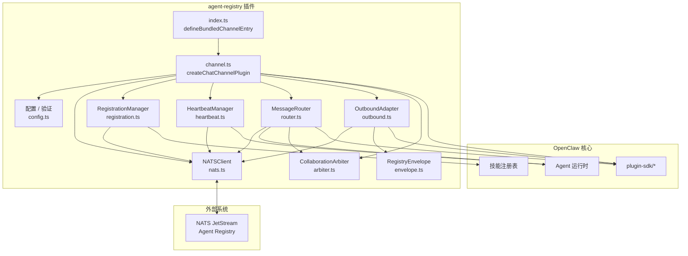
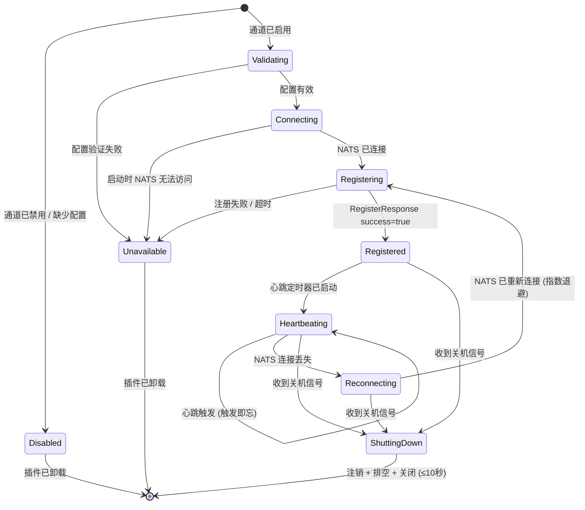
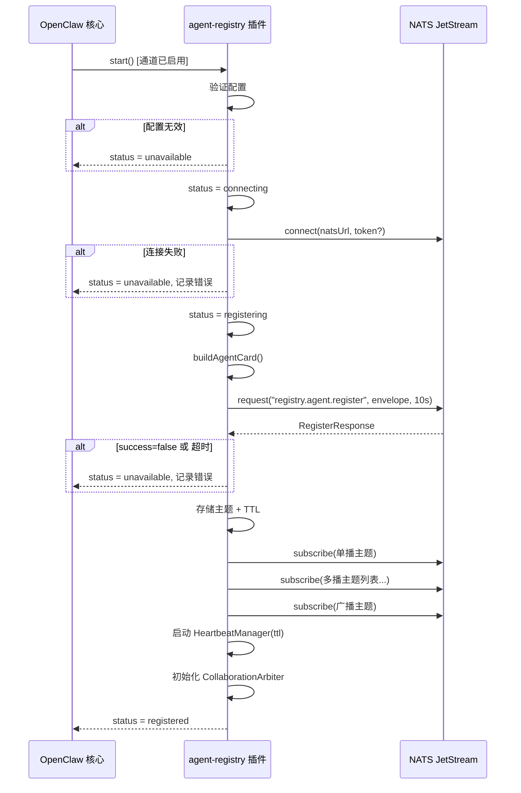
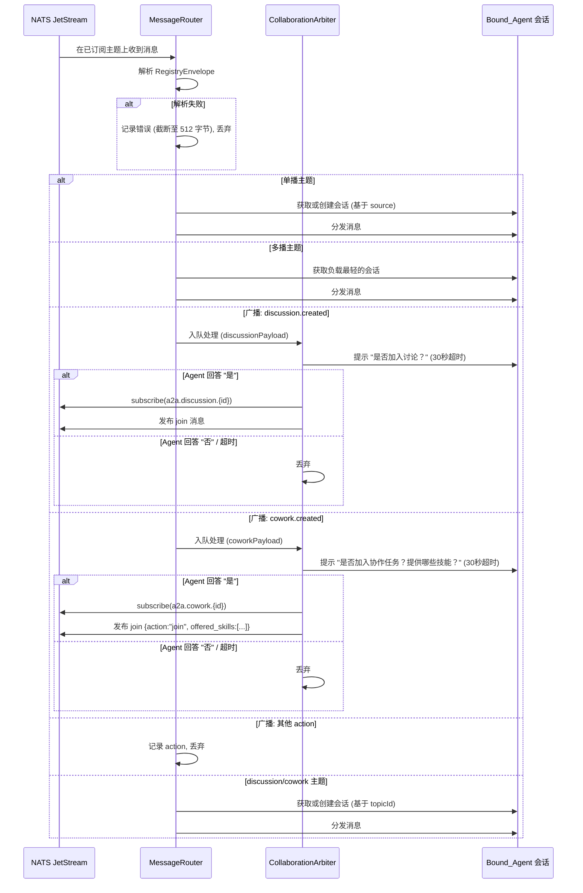
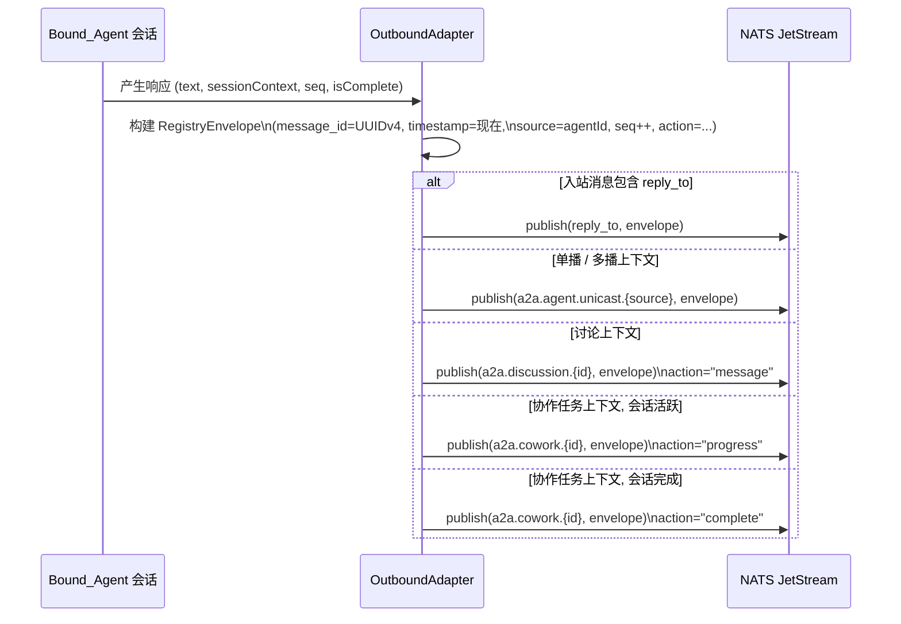
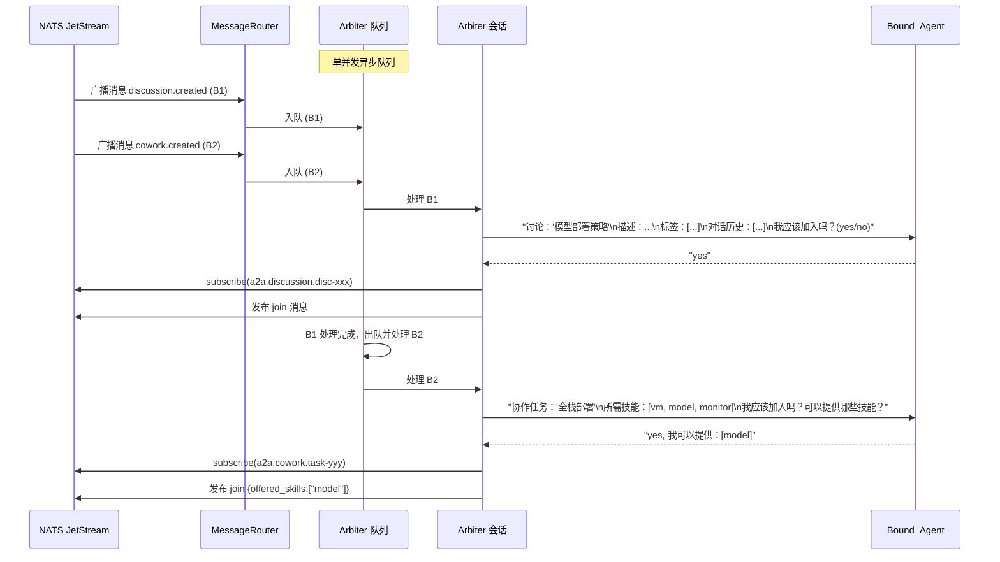
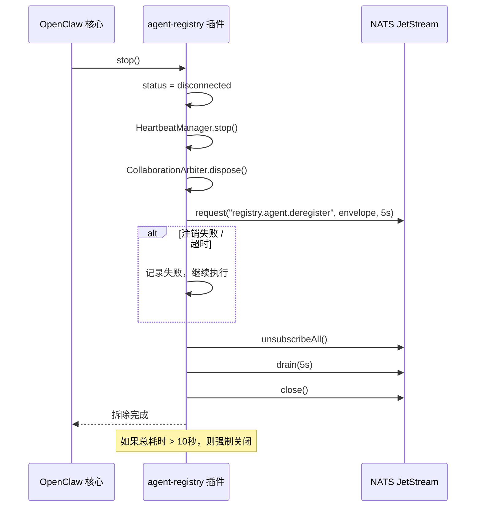

# 设计文档：agent-registry-channel

## 概述

`agent-registry` 通道插件通过原生 NATS JetStream 将 OpenClaw 连接到 Agent Registry 的 A2A（Agent-to-Agent）协作网络。它遵循 `extensions/telegram/` 所建立的 OpenClaw TypeScript ESM 插件 SDK 模式，使用插件 SDK 中的 `defineBundledChannelEntry` 和 `createChatChannelPlugin` 进行实现。

激活后，该插件将：

1. 连接到 NATS 服务器，并注册从显式配置的技能构建的 AgentCard。
2. 订阅分配的单播（unicast）、多播（multicast）和广播（broadcast）主题。
3. 将入站 A2A 消息路由到绑定的 OpenClaw Agent。
4. 维护一个长效的 **Collaboration_Arbiter** 会话，用于对 `discussion.created` / `cowork.created` 广播进行自主加入决策。
5. 以 `floor(TTL/3)` 毫秒为间隔发送心跳，以保持注册状态。
6. 在关机时进行干净的注销。

该插件的设计意图是专注且窄化的：它不会自动扫描已安装的技能，不会暴露主机的 MAC 地址，也不会通过算法自动做出加入决策 —— 所有的协作决策都通过 Arbiter 会话委托给 Bound_Agent。

---

## 架构

### 组件图



### 插件生命周期状态机



---

## 模块结构

```
extensions/agent-registry/
├── index.ts                        # defineBundledChannelEntry — 插件入口点
├── channel-plugin-api.ts           # 重新导出 agentRegistryPlugin
├── openclaw.plugin.json            # 插件清单 (manifest)
├── package.json                    # @openclaw/agent-registry, type: "module"
├── src/
│   ├── channel.ts                  # createChatChannelPlugin — 插件主组装模块
│   ├── config.ts                   # 环境变量 Schema、验证、解析后的配置类型
│   ├── envelope.ts                 # RegistryEnvelope 序列化/反序列化、UUID 生成
│   ├── nats-client.ts              # NATS 连接、重连、订阅/取消订阅
│   ├── registration.ts             # AgentCard 构建、注册、重新注册、注销
│   ├── heartbeat.ts                # 心跳定时器、状态/负载报告
│   ├── router.ts                   # 入站消息路由 (单播/多播/广播)
│   ├── outbound.ts                 # 出站适配器 — 将响应封装在 RegistryEnvelope 中
│   ├── arbiter.ts                  # CollaborationArbiter 会话管理
│   ├── types.ts                    # 共享的 TypeScript 接口和类型别名
│   └── status.ts                   # 通道状态适配器 (connecting/registered 等)
└── __tests__/
    ├── envelope.test.ts            # 序列化的单元测试 + 属性测试
    ├── config.test.ts              # 配置验证测试
    ├── registration.test.ts        # AgentCard 构建测试
    ├── router.test.ts              # 消息路由测试
    └── outbound.test.ts            # 出站信封封装测试
```

---

## 组件与接口

### NATSClient (`nats-client.ts`)

在插件生命周期内拥有单一的 NATS 连接。封装了 `nats.js`（官方 NATS TypeScript 客户端）。

```typescript
interface NATSClientOptions {
  url: string;
  token?: string;
  onDisconnect: () => void;
  onReconnect: () => void;
}

interface NATSClient {
  connect(): Promise<void>;
  request(subject: string, payload: Uint8Array, timeoutMs: number): Promise<Uint8Array>;
  publish(subject: string, payload: Uint8Array): void;
  subscribe(subject: string, handler: (msg: Uint8Array) => void): NATSSubscription;
  unsubscribeAll(): Promise<void>;
  drain(timeoutMs: number): Promise<void>;
  close(): Promise<void>;
  readonly isConnected: boolean;
}

interface NATSSubscription {
  subject: string;
  unsubscribe(): void;
}
```

重连策略：从 1 秒开始指数退避，每次尝试翻倍，上限为 30 秒。委托给 `nats.js` 的重连选项（`reconnect: true`, `maxReconnectAttempts: -1`, `reconnectTimeWait: 1000`, `maxReconnectTimeWait: 30000`）。

### RegistrationManager (`registration.ts`)

构建 AgentCard 并管理注册/注销生命周期。

```typescript
interface RegistrationManagerOptions {
  config: AgentRegistryConfig;
  natsClient: NATSClient;
  getInstalledSkills: () => Promise<InstalledSkill[]>;
}

interface RegistrationManager {
  buildAgentCard(): Promise<AgentCard>;
  register(): Promise<RegisterResult>;
  deregister(): Promise<void>;
  readonly assignedTopics: TopicAssignment | null;
  readonly ttlMs: number | null;
}

interface RegisterResult {
  ok: boolean;
  topics?: TopicAssignment;
  ttlMs?: number;
  error?: string;
}
```

### HeartbeatManager (`heartbeat.ts`)

```typescript
interface HeartbeatManagerOptions {
  agentId: string;
  natsClient: NATSClient;
  getActiveSessionCount: () => number;
}

interface HeartbeatManager {
  start(ttlMs: number): void;
  stop(): void;
  readonly isRunning: boolean;
}
```

心跳间隔 = `Math.floor(ttlMs / 3)`。当 `getActiveSessionCount() > 0` 时状态为 `"busy"`，否则为 `"idle"`。

### MessageRouter (`router.ts`)

将入站的 NATS 消息分发到适当的 OpenClaw agent 会话。

```typescript
interface MessageRouterOptions {
  boundAgentId: string;
  natsClient: NATSClient;
  arbiter: CollaborationArbiter;
  createSession: (sourceAgentId: string, agentId: string) => AgentSession;
  getOrCreateSession: (key: string, agentId: string) => AgentSession;
  getLeastLoadedSession: (agentId: string) => AgentSession;
}

interface MessageRouter {
  handleUnicast(envelope: RegistryEnvelope): Promise<void>;
  handleMulticast(envelope: RegistryEnvelope): Promise<void>;
  handleBroadcast(envelope: RegistryEnvelope): Promise<void>;
  handleCollaborationTopic(topicId: string, envelope: RegistryEnvelope): Promise<void>;
}
```

### CollaborationArbiter (`arbiter.ts`)

维护单一的长效 Bound_Agent 会话。按顺序处理 `discussion.created` 和 `cowork.created` 广播（每次处理一个，决策超时时间为 30 秒）。

```typescript
interface CollaborationArbiterOptions {
  boundAgentId: string;
  natsClient: NATSClient;
  createArbiterSession: (agentId: string) => AgentSession;
  configuredSkills: string[];
}

interface CollaborationArbiter {
  initialize(): Promise<void>;
  processDiscussionCreated(payload: DiscussionCreatedPayload): Promise<void>;
  processCoworkCreated(payload: CoworkCreatedPayload): Promise<void>;
  dispose(): void;
}
```

Arbiter 使用顺序异步队列（单并发 Promise 链）来确保广播被逐个处理。每个决策提示词都包含完整的上下文（`text`、`description`、`tags`/`required_skills`、`conversation`）。

### OutboundAdapter (`outbound.ts`)

将 OpenClaw agent 的响应封装在 `RegistryEnvelope` 中，并发布到正确的 NATS 主题。

```typescript
interface OutboundAdapterOptions {
  agentId: string;
  natsClient: NATSClient;
}

interface OutboundAdapter {
  send(params: OutboundSendParams): Promise<void>;
}

interface OutboundSendParams {
  responseText: string;
  inboundEnvelope: RegistryEnvelope;
  sessionContext: SessionContext; // unicast | multicast | discussion | cowork
  sessionSeq: number;
  isSessionComplete: boolean;
}
```

---

## 数据模型

### AgentRegistryConfig

```typescript
interface AgentRegistryConfig {
  natsUrl: string; // AGENT_REGISTRY_NATS_URL
  agentId: string; // AGENT_REGISTRY_AGENT_ID
  agentName: string; // AGENT_REGISTRY_AGENT_NAME
  natsToken?: string; // AGENT_REGISTRY_NATS_TOKEN (可选)
  skills: string[]; // AGENT_REGISTRY_SKILLS 解析后的值，默认为 []
  boundAgentId?: string; // AGENT_REGISTRY_BOUND_AGENT_ID (可选)
}
```

验证规则 (需求 9)：

- `natsUrl`: 非空，匹配 `/^nats:\/\/[^:]+:\d{1,5}$/`，且端口号在 1–65535 之间
- `agentId`: 非空，≤64 字符，匹配 `/^[a-zA-Z0-9_-]+$/`
- `agentName`: 非空，≤128 字符
- `natsToken`: 可选，≤512 字符
- `skills`: 可选的逗号分隔列表，每个名称 ≤128 字符
- `boundAgentId`: 可选，≤64 字符

### RegistryEnvelope

```typescript
interface RegistryEnvelope {
  message_id: string; // UUID v4
  request_id: string; // UUID v4 (请求时生成；响应时从请求中复制)
  message_type: "req" | "res" | "event";
  timestamp: number; // Unix 时间戳 (毫秒)，非负整数
  source: string; // 发送者的 agent_id；若由 Registry 发起则为 "registry"
  seq: number; // 非负整数，每个会话单调递增
  action: string; // 例如 "register", "heartbeat", "message", "join"
  resource_type: string; // "agent" | "collaboration" | "cowork" | "discussion"
  payload: Record<string, unknown>;
  reply_to: string | null; // 请求-响应模式的临时收件箱主题；否则为 null
}
```

### AgentCard

```typescript
interface AgentCard {
  // A2A 标准字段
  name: string;
  description: string;
  version: string; // "1.0.0"
  url: string; // "nats://a2a.agent.unicast.{agentId}"
  capabilities: AgentCapabilities;
  skills: AgentSkill[];
  defaultInputModes: string[]; // ["text/plain"]
  defaultOutputModes: string[]; // ["text/plain"]
  securitySchemes?: Record<string, unknown>;
  authentication?: Record<string, unknown>;
  icon?: string;
  // Registry 扩展字段
  agent_id: string;
  mac: string; // 始终为 "00:00:00:00:00:00"
  transport: "mq";
  endpoint?: string;
  status: "online" | "idle" | "busy" | "offline";
}

interface AgentCapabilities {
  streaming: boolean; // false
  pushNotifications: boolean; // false
  longRunningOperations: boolean; // true (需求 2.7)
  stateTransitionHistory: boolean; // false
}

interface AgentSkill {
  id: string;
  name: string;
  description: string;
  tags: string[];
  examples?: string[];
  inputModes?: string[];
  outputModes?: string[];
}
```

### TopicAssignment

```typescript
interface TopicAssignment {
  unicast: string; // "a2a.agent.unicast.{agentId}"
  multicast: string[]; // ["a2a.agent.group.{groupId}", ...]
  broadcast: string; // "a2a.agent.broadcast.all"
}
```

### HeartbeatPayload

```typescript
interface HeartbeatPayload {
  agent_id: string;
  status: "online" | "idle" | "busy" | "offline";
  load: {
    cpu: number; // 0.0 (未测量，始终为 0)
    memory: number; // 0.0 (未测量，始终为 0)
    active_task_count: number;
  };
}
```

### SessionContext

跟踪活跃 agent 会话的路由上下文，以便 OutboundAdapter 知道在哪里发布响应。

```typescript
type SessionContext =
  | { kind: "unicast"; sourceAgentId: string }
  | { kind: "multicast"; groupId: string }
  | { kind: "discussion"; discussionId: string }
  | { kind: "cowork"; taskId: string; isComplete: boolean };
```

### PluginStatus

```typescript
type PluginStatus =
  | "disabled"
  | "connecting"
  | "registering"
  | "registered"
  | "reconnecting"
  | "unavailable"
  | "disconnected";
```

---

## 序列图

### 启动与注册



### 入站消息路由



### 出站消息发送



### 协作决策者 (Collaboration Arbiter) 流程



### 关机 / 注销



---

## 错误处理

| 场景                                     | 行为                                                                  |
| ---------------------------------------- | --------------------------------------------------------------------- |
| `AGENT_REGISTRY_NATS_URL` 缺失或格式错误 | 设置状态为 `unavailable`，记录字段名 + 约束 + 预期格式。不尝试连接。  |
| 必填配置字段验证失败                     | 发出验证错误，说明字段、违反的约束及预期格式。拒绝启动。              |
| 启动时 NATS 无法访问                     | 记录包含 `AGENT_REGISTRY_NATS_URL` 的错误，设置状态为 `unavailable`。 |
| 运行期间 NATS 连接丢失                   | 触发指数退避重连（1s → 2s → 4s … 最大 30s）。状态 = `reconnecting`。  |
| 注册返回 `success=false`                 | 记录响应中的 `error` 字段，设置状态为 `unavailable`。                 |
| 注册超时 (10秒)                          | 记录失败原因，设置状态为 `unavailable`。                              |
| 重连后的重新注册                         | 重新发布 AgentCard，替换存储的主题 + TTL，重启心跳定时器。            |
| 心跳发布失败                             | 记录包含 `agent_id` + 错误原因的失败信息。在下一个周期继续。          |
| 入站消息不是有效的 RegistryEnvelope      | 记录解析错误（包含原始字节截断至 512 字节）+ 主题。丢弃。             |
| `AGENT_REGISTRY_SKILLS` 中的技能名未找到 | 记录包含未识别名称的警告。跳过该条目。                                |
| Arbiter 决策超时 (30秒)                  | 不订阅，丢弃广播。记录超时。                                          |
| 注销失败 / 超时                          | 记录包含 `agent_id` + 错误的失败信息。继续执行连接拆除。              |
| 拆除操作超过 10 秒                       | 强制关闭 NATS 连接。                                                  |
| Arbiter 会话意外终止                     | 在处理下一个广播前重新创建。                                          |
| 单播响应时入站 `source` 字段缺失         | 记录警告，丢弃出站消息。                                              |

---

## 依赖项

需要新增的 npm 包（需添加到 `extensions/agent-registry/package.json`）：

| 包名   | 版本      | 用途                                                 |
| ------ | --------- | ---------------------------------------------------- |
| `nats` | `^2.29.0` | 官方 NATS.io TypeScript 客户端 — 原生 JetStream 连接 |
| `uuid` | `^11.1.0` | 为 `message_id` 和 `request_id` 字段生成 UUID v4     |
| `zod`  | `^3.24.0` | 配置 Schema 验证（与 OpenClaw 代码库模式保持一致）   |

开发依赖项：
| 包名 | 版本 | 用途 |
|---|---|---|
| `fast-check` | `^3.23.0` | 基于属性的测试 (Property-based testing) 库 |
| `@openclaw/plugin-sdk` | `workspace:*` | OpenClaw 插件 SDK（已在工作区中） |

`nats` 包提供了 `connect()`、`StringCodec`、`JSONCodec`、通过 `nc.request()` 实现的请求-响应模式以及订阅管理。当配置 `reconnect: true` 时，它内部会自动处理重连。

---

## 正确性属性 (Correctness Properties)

_属性是跨系统的所有有效执行都应成立的特征或行为 —— 本质上是关于系统应做什么的正式陈述。属性充当了人类可读的规范与机器可验证的正确性保证之间的桥梁。_

**属性反射：** 在列出属性之前，消除了冗余：

- AgentCard 字段不变性（2.2, 2.3, 2.4, 2.5, 2.7）被合并为一个综合属性，因为它们都测试同一个 `buildAgentCard()` 函数的输出。
- 配置验证属性（1.7, 9.1, 9.2, 9.3）被合并，因为它们都使用不同的字段规则测试同一个验证函数。
- 信封往返 (10.5) 涵盖了各字段的存在性检查（10.1–10.4），因为成功的往返意味着所有必填字段都存在且取值正确。
- 心跳状态 + 负载（5.2–5.5）被合并，因为它们测试同一个 `buildHeartbeatPayload()` 函数。

---

### 属性 1: RegistryEnvelope 序列化往返

_对于任何_ 有效的 `RegistryEnvelope` 对象（所有必填字段已填充），将其序列化为 JSON 然后反序列化结果，应产生一个在所有必填字段（`message_id`, `request_id`, `message_type`, `timestamp`, `source`, `seq`, `action`, `resource_type`, `payload`）上与原始对象值相等的对象。

**验证需求：10.1, 10.5**

---

### 属性 2: message_id 的唯一性

_对于_ 对信封工厂函数的任何两次连续调用，生成的 `message_id` 值应该是不同的（没有两个信封共享相同的 `message_id`）。

**验证需求：10.2**

---

### 属性 3: 时间戳是非负整数

_对于_ 插件创建的任何信封，`timestamp` 字段应该是一个表示 Unix 时间戳（毫秒）的非负整数，并且应该大于或等于同一进程中之前创建的任何信封的时间戳。

**验证需求：10.3**

---

### 属性 4: 每个会话的 seq 单调递增

_对于_ 单个 agent 会话中产生的任何出站信封序列，`seq` 值应形成一个从 0 开始的严格递增序列，每个值恰好比前一个值大 1。

**验证需求：10.4, 7.6**

---

### 属性 5: AgentCard 不变性

_对于任何_ 有效的 `AgentRegistryConfig`，调用 `buildAgentCard(config)` 应产生一张卡片，满足：

- `card.agent_id === config.agentId`
- `card.name === config.agentName`
- `card.mac === "00:00:00:00:00:00"`
- `card.transport === "mq"`
- `card.capabilities.longRunningOperations === true`

**验证需求：2.2, 2.3, 2.4, 2.5, 2.7**

---

### 属性 6: AgentCard 技能过滤

_对于任何_ 配置的技能名称列表和任何已安装的技能集，`buildAgentCard()` 应产生一个 `skills` 数组，满足：

- 每个条目的 `name` 都出现在配置的技能名称列表中
- 每个名称出现在配置列表中的已安装技能都存在于结果中
- 任何名称未出现在配置列表中的已安装技能都不存在于结果中

**验证需求：2.1, 2.6**

---

### 属性 7: 技能字段映射保留

_对于任何_ 出现在配置技能列表中的已安装技能，构建出的 AgentCard 中相应的 `AgentSkill` 条目应具有与源安装技能相等的 `id`、`name`、`description` 和 `tags` 值。

**验证需求：2.6**

---

### 属性 8: NATS URL 验证拒绝无效输入

_对于任何_ 不匹配 `nats://{host}:{port}` 模式（其中端口是 1 到 65535 之间的整数）的字符串，`validateNatsUrl()` 应返回验证错误。_对于任何_ 匹配该模式且具有有效端口的字符串，它应返回成功。

**验证需求：1.7, 9.1**

---

### 属性 9: Agent ID 验证

_对于任何_ 包含 `[a-zA-Z0-9_-]` 以外字符或超过 64 个字符的字符串，`validateAgentId()` 应返回验证错误。_对于任何_ 不超过 64 个字符且仅包含字母数字、连字符和下划线的非空字符串，它应返回成功。

**验证需求：9.2**

---

### 属性 10: NATS 令牌包含在连接选项中

_对于任何_ 作为 `AGENT_REGISTRY_NATS_TOKEN` 提供的非空令牌字符串，由 `buildNatsConnectOptions(config)` 产生的 NATS 连接选项对象应在 `token` 字段中包含该确切的令牌值。

**验证需求：1.2**

---

### 属性 11: 心跳间隔为 floor(TTL/3)

_对于任何_ 由 Registry 返回的正整数 TTL 值（毫秒），由 `computeHeartbeatInterval(ttl)` 计算的心跳定时器间隔应等于 `Math.floor(ttl / 3)`。

**验证需求：5.1**

---

### 属性 12: 心跳状态反映活跃会话计数

_对于任何_ 非负整数 `activeSessionCount`，`buildHeartbeatPayload(agentId, activeSessionCount)` 应产生一个负载，满足：

- `status === "busy"` 当且仅当 `activeSessionCount > 0`
- `load.active_task_count === activeSessionCount`

**验证需求：5.3, 5.4, 5.5**

---

### 属性 13: 出站信封正确封装响应

_对于任何_ 响应文本字符串和有效的会话上下文，`wrapOutboundResponse(text, context, agentId, seq)` 应产生一个 `RegistryEnvelope`，满足：

- `source === agentId`
- `message_type === "req"`
- `message_id` 是有效的 UUID v4
- `timestamp` 是非负整数
- `seq` 等于提供的 seq 值
- `payload` 包含响应文本

**验证需求：7.1**

---

## 测试策略

### 双重测试方法

单元测试覆盖具体的示例、边界情况和错误条件。属性测试（Property tests）验证跨多个生成的输入的通用属性。两者对于全面覆盖都是必要的。

### 基于属性的测试

基于属性的测试库选用 **fast-check** (`^3.23.0`)，因其 TypeScript 优先的设计以及与 Vitest 的兼容性而被选中。

每个属性测试至少运行 **100 次迭代**。测试会打上引用设计属性的注释：

```typescript
// 功能: agent-registry-channel, 属性 1: RegistryEnvelope 序列化往返
it.prop([arbitraryRegistryEnvelope()])("往返保留所有必填字段", (envelope) => {
  const json = serializeEnvelope(envelope);
  const parsed = deserializeEnvelope(json);
  expect(parsed).toMatchObject({
    message_id: envelope.message_id,
    timestamp: envelope.timestamp,
    source: envelope.source,
    seq: envelope.seq,
    action: envelope.action,
    resource_type: envelope.resource_type,
  });
});
```

**作为基于属性的测试实现的属性：**

- 属性 1：`envelope.test.ts` — 往返序列化
- 属性 2：`envelope.test.ts` — message_id 唯一性
- 属性 3：`envelope.test.ts` — 时间戳有效性
- 属性 4：`outbound.test.ts` — seq 单调性
- 属性 5：`registration.test.ts` — AgentCard 不变性
- 属性 6：`registration.test.ts` — 技能过滤
- 属性 7：`registration.test.ts` — 技能字段映射
- 属性 8：`config.test.ts` — NATS URL 验证
- 属性 9：`config.test.ts` — Agent ID 验证
- 属性 10：`config.test.ts` — 连接选项中的令牌
- 属性 11：`heartbeat.test.ts` — 间隔计算
- 属性 12：`heartbeat.test.ts` — 状态/负载数据
- 属性 13：`outbound.test.ts` — 出站信封封装

### 单元测试（基于示例）

关注属性测试未涵盖的特定场景：

- **配置验证**：每个缺失的必填字段 → 命名该字段的正确错误消息
- **注册**：模拟 NATS 请求-响应 → 验证信封格式、成功时存储的主题、失败时状态设置为 `unavailable`
- **主题订阅**：模拟 NATS 客户端 → 验证是否为单播、每个多播和广播调用了订阅
- **心跳生命周期**：注册后启动定时器，插件停止时停止，重新注册获取新 TTL 后重启
- **消息路由**：单播 → 创建源会话；多播 → 负载最轻会话；广播 `discussion.created` → Arbiter 入队；广播未知 action → 丢弃
- **Arbiter 顺序处理**：两个并发广播被逐个处理
- **出站路由**：存在 `reply_to` → 发布到 `reply_to`；协作任务完成 → action 为 `"complete"`
- **注销**：发送正确的信封，记录失败并继续拆除流程
- **关机超时**：拆除时间超过 10 秒触发强制关闭

### 集成测试

- 插件连接到真实的 NATS 服务器（测试容器或本地），注册，接收单播消息并产生响应
- 重连行为：NATS 服务器重启触发使用新主题重新注册

### 测试配置

```typescript
// vitest.config.ts (位于 extensions/agent-registry 目录下)
import { defineConfig } from "vitest/config";
export default defineConfig({
  test: {
    include: ["__tests__/**/*.test.ts"],
    environment: "node",
  },
});
```

用于属性测试的 fast-check 配置：

```typescript
import { configureGlobal } from "fast-check";
configureGlobal({ numRuns: 100 });
```
