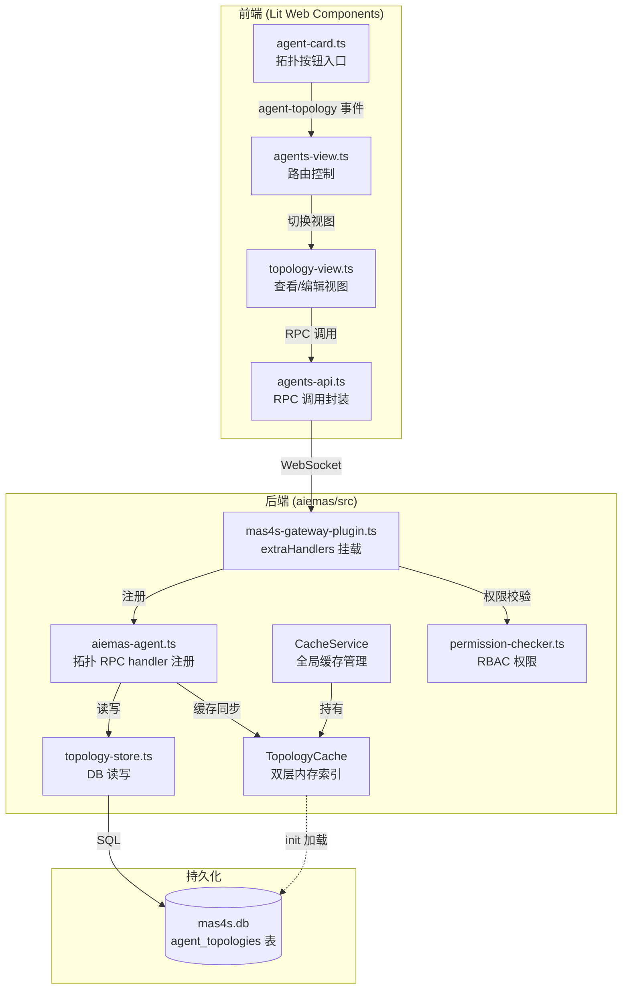
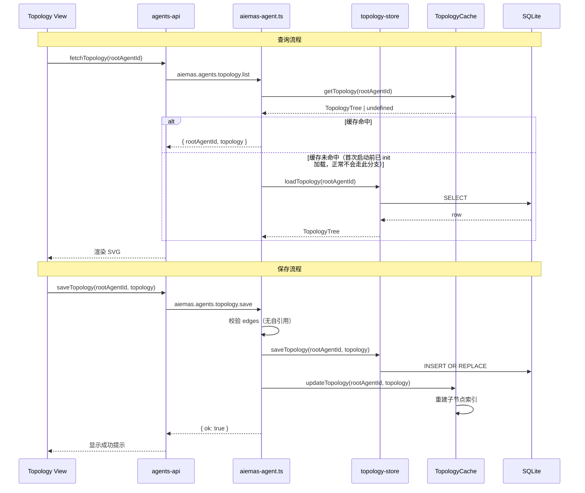

# 设计文档：智能体拓扑关系 DAG 可视化

## 概述

本功能为 AIEMAS 多智能体协作平台新增拓扑关系（DAG）的持久化存储、内存缓存、RPC 查询/保存 API，以及前端 SVG 可视化与编辑能力。核心设计目标：

1. 以整棵拓扑树为单位持久化（`rootAgentId` 为主键），数据结构为 `{ edges: Array<{ from, to }> }`
2. 引入 `CacheService` 集中管理所有内存缓存（UserCache + TopologyCache），替代当前 `createTenantService` 闭包中分散的缓存实例
3. TopologyCache 维护双层索引：按 rootAgentId 的完整拓扑树 + 按任意 agentId 的子节点列表，支持路由快速查找
4. 前端基于原生 JS + SVG 实现轻量级拓扑查看/编辑器，不引入第三方流程图库

## 架构

### 系统分层



### 数据流



## 组件与接口

### 1. TopologyTree 类型定义

在 `aiemas/src/models.ts` 中新增：

```typescript
/** 拓扑图中的一条有向边 */
export interface TopologyEdge {
  from: string;
  to: string;
}

/** 一棵完整的拓扑树文档 */
export interface TopologyTree {
  edges: TopologyEdge[];
}
```

### 2. topology-store.ts（`aiemas/src/store/topology-store.ts`）

数据库操作层，负责 `agent_topologies` 表的读写。

```typescript
import type { DatabaseSync } from "node:sqlite";
import type { TopologyTree } from "../models.js";

/** 加载指定根节点的拓扑树 */
export function loadTopology(db: DatabaseSync, rootAgentId: string): TopologyTree | undefined;

/** 加载所有拓扑树 */
export function loadAllTopologies(
  db: DatabaseSync,
): Array<{ rootAgentId: string; topology: TopologyTree }>;

/** 保存拓扑树（INSERT OR REPLACE） */
export function saveTopology(db: DatabaseSync, rootAgentId: string, topology: TopologyTree): void;

/** 校验 edges 合法性：无自引用边 */
export function validateEdges(edges: Array<{ from: string; to: string }>): {
  valid: boolean;
  message?: string;
};
```

### 3. TopologyCache（`aiemas/src/cache/topology-cache.ts`）

```typescript
import type { DatabaseSync } from "node:sqlite";
import type { TopologyTree } from "../models.js";

export class TopologyCache {
  /** 完整拓扑树索引：rootAgentId → TopologyTree */
  private readonly byRoot: Map<string, TopologyTree>;
  /** 子节点索引：agentId → 直接子 Agent ID 列表 */
  private readonly childrenIndex: Map<string, string[]>;

  /** 从 DB 加载所有拓扑树并构建索引 */
  load(db: DatabaseSync): void;

  /** 获取指定根节点的完整拓扑树 */
  getTopology(rootAgentId: string): TopologyTree | undefined;

  /** 获取指定 agent 的直接子节点列表 */
  getChildren(agentId: string): string[];

  /** 更新单棵拓扑树并重建相关子节点索引 */
  update(rootAgentId: string, topology: TopologyTree): void;
}
```

### 4. CacheService（`aiemas/src/cache/cache-service.ts`）

集中管理所有内存缓存实例，替代 `createTenantService` 闭包中分散的缓存。

```typescript
import type { DatabaseSync } from "node:sqlite";
import { UserCache } from "../users/user-cache.js";
import { TopologyCache } from "./topology-cache.js";

export class CacheService {
  readonly userCache: UserCache;
  readonly topologyCache: TopologyCache;

  constructor();

  /** 统一初始化：从 DB 加载所有缓存数据 */
  init(db: DatabaseSync): void;
}
```

设计决策：`CacheService` 在 `createTenantService` 中实例化，通过 `TenantService` 接口暴露 `cacheService` 属性。现有 `UserCache` 的 `load(db)` 调用迁移到 `CacheService.init(db)` 中统一执行。

### 5. RPC Handlers（`aiemas/src/gateway-bridge/aiemas-agent.ts` 中注册）

拓扑相关的 RPC handler 在 `aiemas-agent.ts` 的 `registerAgentHandlers` 函数中注册到 `extraHandlers`，与现有的 `aiemas.agents.import` 等 agent 相关方法保持一致的组织方式。`mas4s-gateway-plugin.ts` 负责调用 `registerAgentHandlers` 完成挂载。

#### `aiemas.agents.topology.list`

- 参数：`{ rootAgentId?: string }`
- 权限：`admin | member | viewer`（只读）
- 响应：
  - 有 `rootAgentId`：`{ rootAgentId, topology: TopologyTree }`
  - 无 `rootAgentId`：`{ topologies: Array<{ rootAgentId, topology }> }`

#### `aiemas.agents.topology.save`

- 参数：`{ rootAgentId: string, topology: { edges: Array<{ from: string, to: string }> } }`
- 权限：`admin | member`（写操作）
- 校验：edges 中不允许 `from === to`，否则返回 `INVALID_PARAMS`
- 响应：`{ ok: true }`
- 副作用：写入 DB 后同步更新 TopologyCache

### 6. 前端组件

#### agent-card.ts 修改

在 `card-footer` 中导出按钮之前新增拓扑图标按钮，点击触发 `agent-topology` 自定义事件。

#### topology-view.ts（新增 `aiemas/ui/mas4s/src/views/topology-view.ts`）

Lit 组件，作为二级页面展示。包含两种模式：

- 查看模式：SVG 渲染节点（矩形 + 名称）和有向边（带箭头连线），自动布局，禁止拖拽/连线。左上角返回按钮，右上角编辑按钮。
- 编辑模式：允许从节点输出连接点拖拽到另一节点输入连接点创建边，点击连线高亮并可删除，阻止自引用边。提供保存/取消按钮。

#### agents-api.ts 新增

```typescript
/** 查询拓扑关系 */
export async function fetchTopology(
  client: GatewayBrowserClient,
  rootAgentId?: string,
): Promise<...>;

/** 保存拓扑关系 */
export async function saveTopology(
  client: GatewayBrowserClient,
  rootAgentId: string,
  topology: TopologyTree,
): Promise<{ ok: true }>;
```

#### agents-view.ts 修改

监听 `agent-topology` 事件，切换到 `topology-view` 二级页面，传入当前 agent 信息。

## 数据模型

### agent_topologies 表

| 字段        | 类型    | 约束        | 说明                   |
| ----------- | ------- | ----------- | ---------------------- |
| rootAgentId | TEXT    | PRIMARY KEY | 根 Agent ID            |
| topology    | TEXT    | NOT NULL    | TopologyTree JSON 文档 |
| updatedAt   | INTEGER | NOT NULL    | 更新时间戳（ms）       |

DDL（在 `ensureMas4sSchema` 中追加）：

```sql
CREATE TABLE IF NOT EXISTS agent_topologies (
  rootAgentId TEXT PRIMARY KEY,
  topology    TEXT NOT NULL,
  updatedAt   INTEGER NOT NULL
);
```

### TopologyTree JSON 结构

```json
{
  "edges": [
    { "from": "aie-iaas", "to": "aieiaas-resource" },
    { "from": "aie-iaas", "to": "aieiaas-model" },
    { "from": "aie-iaas", "to": "aieiaas-task" },
    { "from": "aie-iaas", "to": "aieiaas-monitor" }
  ]
}
```

### TopologyCache 内存结构

```
byRoot: Map<string, TopologyTree>
  "aie-iaas" → { edges: [...] }

childrenIndex: Map<string, string[]>
  "aie-iaas" → ["aieiaas-resource", "aieiaas-model", "aieiaas-task", "aieiaas-monitor"]
  "aieiaas-resource" → []
  "aieiaas-model" → []
  ...
```

### RBAC 权限注册

在 `GLOBAL_ROLE_PERMISSIONS` 中新增：

```typescript
"aiemas.agents.topology.list": new Set(["admin", "member", "viewer"]),
"aiemas.agents.topology.save": new Set(["admin", "member"]),
```

## 正确性属性（Correctness Properties）

_属性（Property）是指在系统所有合法执行中都应成立的特征或行为——本质上是对系统应做什么的形式化陈述。属性是人类可读规格说明与机器可验证正确性保证之间的桥梁。_

### Property 1: 自引用边校验

_For any_ 边 `{ from, to }`，若 `from === to`，则 `validateEdges` 必须返回校验失败；若 `from !== to`，则该边必须通过校验。

**Validates: Requirements 1.3, 3.4**

### Property 2: 拓扑树保存-加载往返一致性

_For any_ 合法的 `rootAgentId`（非空字符串）和合法的 `TopologyTree`（edges 中无自引用边），先调用 `saveTopology` 保存，再调用 `loadTopology` 加载，返回的 TopologyTree 应与保存时的输入在语义上等价（edges 集合相同）。

**Validates: Requirements 1.4, 2.2, 3.2**

### Property 3: 全量列表完整性

_For any_ 一组互不相同的 `(rootAgentId, TopologyTree)` 对，全部保存后调用 `loadAllTopologies`，返回的列表应包含且仅包含这些 rootAgentId，且每个 rootAgentId 对应的 topology 与最后一次保存的值一致。

**Validates: Requirements 2.3**

### Property 4: 子节点索引正确性

_For any_ TopologyTree，在 TopologyCache 中加载或更新该拓扑树后，对于 edges 中出现在 `from` 字段的每个 agentId，`getChildren(agentId)` 返回的列表应恰好等于该 agentId 在 edges 中所有 `to` 值的集合；对于未出现在任何 `from` 字段中的 agentId，`getChildren(agentId)` 应返回空数组。

**Validates: Requirements 5.2, 5.4, 5.5**

### Property 5: 缓存与数据库一致性

_For any_ 合法的 `rootAgentId` 和 `TopologyTree`，在 TopologyCache 执行 `update(rootAgentId, topology)` 后，`getTopology(rootAgentId)` 返回的值应与传入的 topology 在语义上等价，且 `getChildren` 对该拓扑树中所有 agentId 的返回值应与从 edges 直接计算的结果一致。

**Validates: Requirements 3.3, 5.3**

## 错误处理

| 场景                        | 错误码              | 描述                   | 处理方式                    |
| --------------------------- | ------------------- | ---------------------- | --------------------------- |
| edges 中存在 from === to    | `INVALID_PARAMS`    | "自引用边不允许"       | 拒绝保存，返回错误          |
| rootAgentId 为空            | `INVALID_PARAMS`    | "rootAgentId required" | 拒绝保存，返回错误          |
| topology 参数缺失或格式错误 | `INVALID_PARAMS`    | "topology required"    | 拒绝保存，返回错误          |
| 数据库写入失败              | `INTERNAL`          | 内部错误信息           | 返回错误，不更新缓存        |
| 权限不足                    | `PERMISSION_DENIED` | 角色权限不匹配         | 由 RBAC 层拦截              |
| 查询不存在的 rootAgentId    | —                   | 正常返回               | 返回 `{ edges: [] }` 空拓扑 |
| 前端保存失败                | —                   | 网络/服务端错误        | 显示错误提示，保留编辑状态  |
| 前端拖拽自引用边            | —                   | 客户端阻止             | 忽略此次拖拽，不创建边      |

## 测试策略

### 属性测试（Property-Based Testing）

使用 `fast-check` 库进行属性测试，每个属性最少运行 100 次迭代。

测试文件：`aiemas/src/store/topology-store.property.test.ts` 和 `aiemas/src/cache/topology-cache.property.test.ts`

| 属性                         | 测试标签                                                                | 测试位置                        |
| ---------------------------- | ----------------------------------------------------------------------- | ------------------------------- |
| Property 1: 自引用边校验     | Feature: agent-topology-dag, Property 1: Self-reference edge validation | topology-store.property.test.ts |
| Property 2: 保存-加载往返    | Feature: agent-topology-dag, Property 2: Save-load round-trip           | topology-store.property.test.ts |
| Property 3: 全量列表完整性   | Feature: agent-topology-dag, Property 3: List all completeness          | topology-store.property.test.ts |
| Property 4: 子节点索引正确性 | Feature: agent-topology-dag, Property 4: Children index correctness     | topology-cache.property.test.ts |
| Property 5: 缓存一致性       | Feature: agent-topology-dag, Property 5: Cache-DB consistency           | topology-cache.property.test.ts |

生成器设计：

- `arbAgentId`：生成非空字母数字字符串（模拟 agent ID）
- `arbEdge`：生成 `{ from: arbAgentId, to: arbAgentId }` 且 `from !== to`
- `arbTopologyTree`：生成 `{ edges: fc.array(arbEdge) }`
- `arbSelfRefEdge`：生成 `from === to` 的边（用于校验失败测试）

### 单元测试（Example-Based）

| 测试目标                | 测试文件                   |
| ----------------------- | -------------------------- |
| CacheService 初始化加载 | cache-service.test.ts      |
| RBAC 权限注册正确性     | permission-checker.test.ts |
| RPC handler 参数校验    | aiemas-agent.test.ts       |
| agent_topologies 表创建 | database.test.ts           |

### 前端测试

前端组件使用 example-based 测试：

- agent-card 拓扑按钮渲染与事件触发
- topology-view 查看/编辑模式切换
- 保存成功/失败提示
- 自引用边前端阻止
