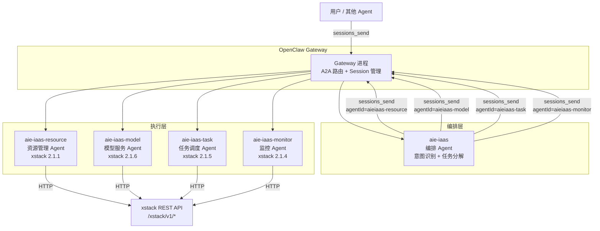
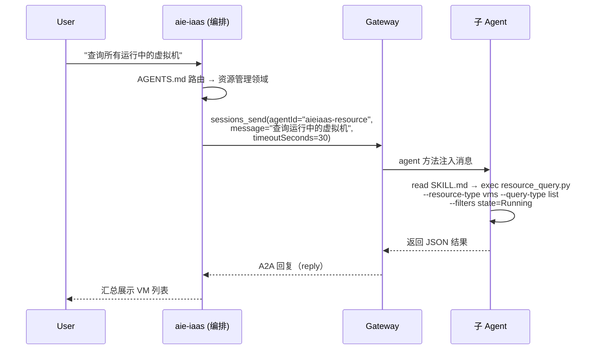
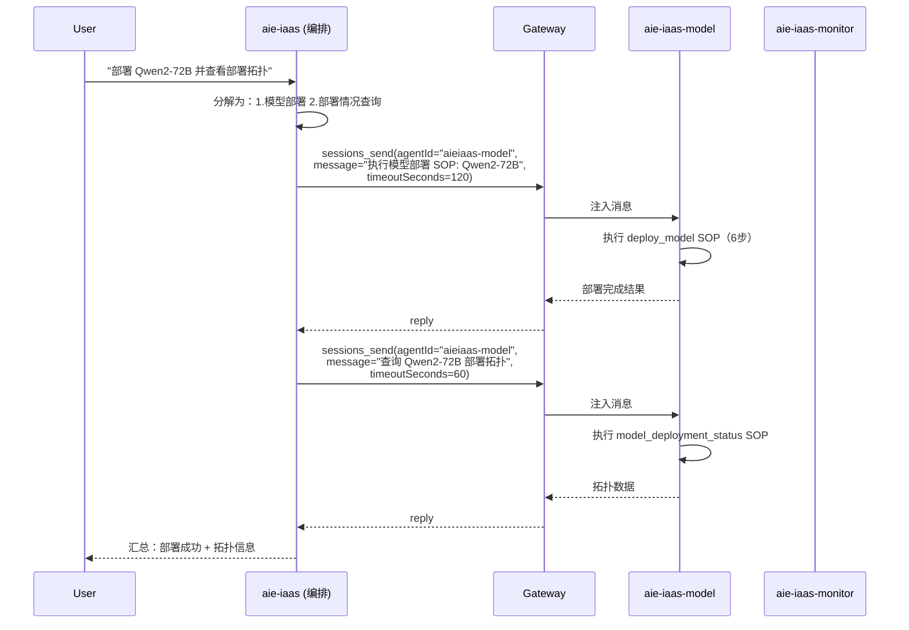
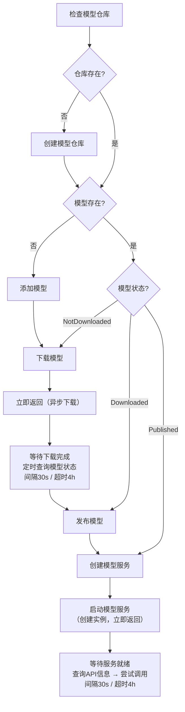
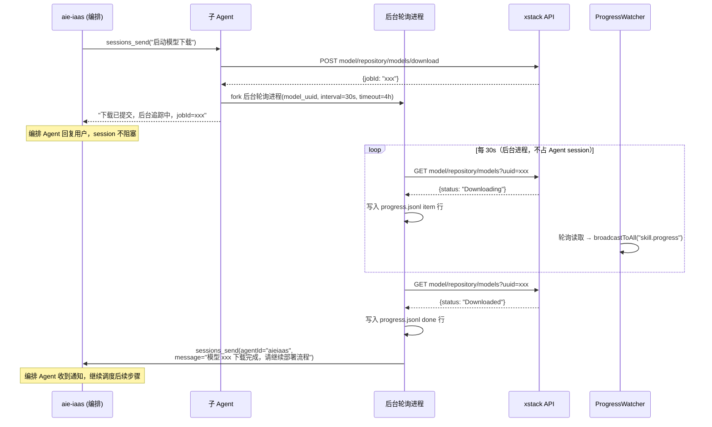
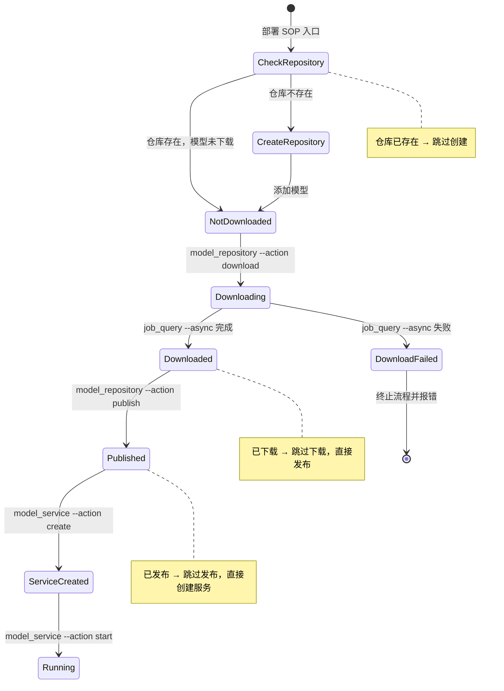

# 设计文档：AIE IaaS Multi-Agent 编排系统

## 概述

以 aie-iaas 为编排中心，通过 OpenClaw `sessions_send` A2A 通信协调 4 个专业子 Agent（资源管理、模型服务、任务调度、监控）完成 xstack 云平台 IaaS 管理。编排 Agent 自身不调用 xstack API，所有 API 调用由子 Agent 的 Python Skill 脚本完成。不修改 aiemas 核心代码。

### 设计决策

| 决策         | 选择                              | 理由                                                 |
| ------------ | --------------------------------- | ---------------------------------------------------- |
| Agent 间通信 | `sessions_send` A2A（不用 spawn） | 同步等待 + Ping-Pong 多轮对话，编排 Agent 可控制流程 |
| Skill 实现   | Python 脚本 + SKILL.md            | 与现有 image_query 模式一致                          |
| HTTP 客户端  | 共享 `_lib/xstack_client.py`      | 统一分页/重试逻辑，避免重复代码                      |
| 编排模式     | 编排 Agent 纯路由，不调 API       | 职责分离，子 Agent 专注领域                          |
| 超时策略     | 查询 30s，SOP 120s                | 按操作复杂度区分                                     |

## 系统架构



## A2A 通信流程

### 同步查询（单子 Agent）



### 多 Agent 串行编排（跨领域 SOP）



## Workspace 目录结构

### 编排 Agent（aie-iaas）

```
~/.openclaw/workspace-aieiaas/
├── AGENTS.md          # 路由规则 + 子 Agent 调度策略
├── SOUL.md            # 编排角色定义
├── IDENTITY.md        # Agent 身份
├── TOOLS.md           # 工具配置（sessions_send 用法）
├── USER.md
└── memory/
```

编排 Agent 无 `skills/` 目录，不直接调用 xstack API。

### 子 Agent（以 aie-iaas-resource 为例）

```
~/.openclaw/workspace-aieiaas-resource/
├── AGENTS.md              # 资源管理操作手册 + SOP 定义
├── SOUL.md                # 资源管理专家角色
├── IDENTITY.md
├── TOOLS.md               # 环境变量配置备忘
├── USER.md
├── SOP.json               # 创建云主机 SOP（SOPTracker 兼容）
├── skills/
│   ├── _lib/
│   │   ├── xstack_client.py    # 共享 HTTP 客户端
│   │   └── progress.py         # 共享 ProgressReporter（写入 progress.jsonl）
│   ├── resource_query/
│   │   ├── SKILL.md
│   │   └── resource_query.py
│   ├── vm_lifecycle/
│   │   ├── SKILL.md
│   │   └── vm_lifecycle.py
│   ├── vm_hardware/
│   │   ├── SKILL.md
│   │   └── vm_hardware.py
│   ├── storage_manage/
│   │   ├── SKILL.md
│   │   └── storage_manage.py
│   ├── image_manage/
│   │   ├── SKILL.md
│   │   └── image_manage.py
│   └── job_poll/
│       ├── SKILL.md
│       └── job_poll.py
├── progress/                      # Skill 进度文件（运行时生成）
└── memory/
```

### 全部子 Agent Workspace 汇总

| Agent             | Workspace                     | Skills                                                                            | SOP                            |
| ----------------- | ----------------------------- | --------------------------------------------------------------------------------- | ------------------------------ |
| aie-iaas-resource | `workspace-aieiaas-resource/` | resource_query, vm_lifecycle, vm_hardware, storage_manage, image_manage, job_poll | 创建云主机                     |
| aie-iaas-model    | `workspace-aieiaas-model/`    | model_repository, model_service, gateway_manage, apikey_manage, job_poll          | 部署模型服务, 模型部署情况查询 |
| aie-iaas-task     | `workspace-aieiaas-task/`     | job_query, task_job_manage, executor_manage, scheduler_manage                     | —                              |
| aie-iaas-monitor  | `workspace-aieiaas-monitor/`  | monitor_query, alarm_query, log_query, gateway_statistics                         | 硬件设施监控, 模型调用统计     |

## OpenClaw 配置

```json5
{
  agents: {
    list: [
      { id: "aieiaas", workspace: "~/.openclaw/workspace-aieiaas", name: "IaaS Orchestrator" },
      {
        id: "aieiaas-resource",
        workspace: "~/.openclaw/workspace-aieiaas-resource",
        name: "Resource Manager",
      },
      {
        id: "aieiaas-model",
        workspace: "~/.openclaw/workspace-aieiaas-model",
        name: "Model Service",
      },
      {
        id: "aieiaas-task",
        workspace: "~/.openclaw/workspace-aieiaas-task",
        name: "Task Scheduler",
      },
      {
        id: "aieiaas-monitor",
        workspace: "~/.openclaw/workspace-aieiaas-monitor",
        name: "Monitor",
      },
    ],
  },
  tools: {
    agentToAgent: {
      enabled: true,
      allow: ["aieiaas", "aieiaas-resource", "aieiaas-model", "aieiaas-task", "aieiaas-monitor"],
    },
    sessions: { visibility: "all" },
  },
}
```

## 编排 Agent AGENTS.md 路由规则

```markdown
## 路由表

| 用户意图关键词                                                       | 目标 Agent | agentId          | timeoutSeconds         |
| -------------------------------------------------------------------- | ---------- | ---------------- | ---------------------- |
| 虚拟机/VM/云主机/启动/停止/重启/镜像/存储/云盘/快照/集群/宿主机/区域 | 资源管理   | aieiaas-resource | 30（查询）/ 120（SOP） |
| 模型/推理/网关/API Key/部署模型/模型服务/模型仓库/数据集             | 模型服务   | aieiaas-model    | 30（查询）/ 120（SOP） |
| 任务/Job/脚本/执行器/定时任务/调度                                   | 任务调度   | aieiaas-task     | 30                     |
| 监控/告警/日志/CPU/内存/GPU/统计/Top模型/Token                       | 监控       | aieiaas-monitor  | 30（查询）/ 60（SOP）  |

## 调度方式

统一使用 sessions_send：

- 同步查询：sessions_send(agentId="aieiaas-xxx", message="...", timeoutSeconds=30)
- SOP 执行：sessions_send(agentId="aieiaas-xxx", message="执行 XXX SOP: ...", timeoutSeconds=120)
- 多 Agent 串行：按依赖顺序逐个 sessions_send，前一个完成后再调下一个
```

## 共享 HTTP 客户端

`skills/_lib/xstack_client.py` 被所有子 Agent 共享（通过符号链接或复制）：

```python
class XstackClient:
    def __init__(self):
        self.base_url = os.environ.get('AIE_IAAS_API_URL')
        self.token = os.environ.get('AIE_IAAS_API_TOKEN')
        # 缺失则 JSON 错误 + exit(1)

    def get(self, path, params=None) -> dict:
        """单次 GET，含重试（5xx/超时重试3次，4xx不重试）"""

    def get_all(self, path, params=None) -> list:
        """自动分页 GET，pageSize=100 循环直到全部返回"""

    def post(self, path, body=None) -> dict:
        """POST，含重试"""

    def put(self, path, body=None) -> dict:
        """PUT，含重试"""

    def delete(self, path, body=None) -> dict:
        """DELETE，含重试"""
```

分页逻辑：pageIndex 从 1 开始，每次 +1，直到返回数据条数 < pageSize。
重试逻辑：HTTP 5xx 或网络异常时，间隔 1s→2s→4s，最多 3 次。

## Skill 详细设计

### 资源管理 Agent Skills

#### resource_query

```bash
python3 skills/resource_query/resource_query.py \
  --resource-type {vms,hosts,clusters,zones,volumes,storages,images,snapshots} \
  --query-type {list,detail,statistics,sub-resource} \
  --uuid <target_uuid> \
  --sub-resource <name>  # 如 candidate-gpus, gpus, nics, sys_graph 等
  --filters <key=value,...>
```

#### vm_lifecycle

```bash
python3 skills/vm_lifecycle/vm_lifecycle.py \
  --action {start,stop,poweroff,reboot,suspend,resume,reset,create,rebuild,backup,recover,export,migrate} \
  --uuid <vm_uuid> \
  --batch --uuids <uuid1,uuid2,...> \
  --update-field {name,spec,ha-mode,owner} \
  --delete-mode {recycle,expunge} \
  --payload <json_string>
```

#### vm_hardware

```bash
python3 skills/vm_hardware/vm_hardware.py \
  --uuid <vm_uuid> \
  --device-type {gpu,pci,usb,volume,nic} \
  --operation {attach,detach} \
  --nic-operation {bind-eip,unbind-eip,bind-vip,unbind-vip} \
  --payload <json_string>
```

#### storage_manage

```bash
python3 skills/storage_manage/storage_manage.py \
  --target {main-storage,volume,snapshot} \
  --action {create,update,delete,attach,detach,resize,recover,revert} \
  --storage-type {local,nfs,ceph,ceph-rbd}  # main-storage 创建时
  --payload <json_string>
```

#### image_manage

```bash
python3 skills/image_manage/image_manage.py \
  --target {image,container-image,image-repository,container-image-repository} \
  --action {create,update,delete,recover,enable,disable} \
  --payload <json_string>
```

### 模型服务 Agent Skills

#### model_repository

```bash
python3 skills/model_repository/model_repository.py \
  --action {create,update,delete,add-model,download,publish,unpublish,sync,query,detail,statistics,list-models,list-files} \
  --target {repository,model,dataset-repository,dataset} \
  --payload <json_string>
```

#### model_service

```bash
python3 skills/model_service/model_service.py \
  --action {create,start,stop,delete,update,scale,query,detail,instances,api-info,served-names,alias,extra} \
  --payload <json_string>
```

#### gateway_manage

```bash
python3 skills/gateway_manage/gateway_manage.py \
  --action {create,update,delete,sync,query,detail,add-sub-gateway,add-custom-service} \
  --payload <json_string>
```

#### apikey_manage

```bash
python3 skills/apikey_manage/apikey_manage.py \
  --action {create,regenerate,update,update-config,delete,query,detail} \
  --payload <json_string>
```

### 任务调度 Agent Skills

#### job_query

```bash
# 单次查询
python3 skills/job_query/job_query.py --job-id <uuid>

# 同步轮询（阻塞直到终态）
python3 skills/job_query/job_query.py --job-id <uuid> --poll --interval 10 --timeout 300

# 后台异步轮询（立即返回，后台持续轮询，通过 progress.jsonl 报告）
python3 skills/job_query/job_query.py --job-id <uuid> --poll --async --interval 10 --timeout 14400
```

后台异步模式工作原理：

- `--async` 标志使脚本 fork 后台进程，父进程立即输出 `{"status":"polling","jobId":"..."}` 并退出
- 后台进程持续轮询 `GET /xstack/v1/jobs/{jobId}`，每次轮询写入 progress.jsonl item 行
- 达到终态时写入 done 行（含 succeeded/failed 和 job 最终状态详情）
- 最大超时 4h（14400s），超时后写入 done(failed) 并退出

#### task_job_manage

```bash
python3 skills/task_job_manage/task_job_manage.py \
  --action {create-script,create-command,start,stop,debug,update,query,detail,results,log,delete} \
  --payload <json_string>
```

#### executor_manage

```bash
python3 skills/executor_manage/executor_manage.py \
  --action {create,start,stop,update,scale,config,query,detail,delete} \
  --payload <json_string>
```

#### scheduler_manage

```bash
python3 skills/scheduler_manage/scheduler_manage.py \
  --action {create,update,update-state,batch-update-state,query,detail,log,delete} \
  --payload <json_string>
```

### 监控 Agent Skills

#### monitor_query

```bash
python3 skills/monitor_query/monitor_query.py \
  --query-type {overview,sys-graph,sys-moment} \
  --host-uuid <uuid> --start <ts> --end <ts>
```

#### alarm_query

```bash
python3 skills/alarm_query/alarm_query.py \
  --query-type {message,message-graph,message-distribution,statistics} \
  --target {resource,event} \
  --action {query,detail,create,update,enable,disable,delete} \
  --payload <json_string>
```

#### log_query

```bash
python3 skills/log_query/log_query.py \
  --log-type {oplog,runlog} \
  --filters <key=value,...>
```

#### gateway_statistics

```bash
python3 skills/gateway_statistics/gateway_statistics.py \
  --query-type {records,top-by-calls,top-by-tokens,apikey-top-calls,apikey-top-tokens,served-models,apikeys} \
  --start-time <ts> --end-time <ts> \
  --model-name <name> --apikey-uuid <uuid> --gateway-uuid <uuid>
```

## SOP 可视化架构

### 数据流

```
Skill 脚本 (Python)                    Gateway                              前端
─────────────────                    ───────                              ────
exec vm_lifecycle.py ──────────→ onAgentEvent(stream:tool, phase:start)
                                   ├─ 正则提取 skill: vm_lifecycle
                                   ├─ SOPTracker.onToolEvent() → step=running
                                   │   └─ broadcastToAll("sop.state", ...)  ──→ store.updateSOPState()
                                   └─ ProgressWatcher.startWatch()              → <sop-pipeline> 更新
                                       └─ 每2s轮询 progress.jsonl
                                           └─ broadcastToAll("skill.progress") ──→ store.updateSkillProgress()
                                                                                    → 进度条 + 日志面板

vm_lifecycle.py 写入 progress.jsonl:
  {"type":"start","skill":"vm_lifecycle","total":4,"ts":...}
  {"type":"item","skill":"vm_lifecycle","index":0,"label":"查询资源","pct":100,"ts":...}
  {"type":"item","skill":"vm_lifecycle","index":1,"label":"创建VM","status":"running","ts":...}
  {"type":"log","skill":"vm_lifecycle","message":"正在分配 CPU/内存资源","ts":...}
  {"type":"done","skill":"vm_lifecycle","succeeded":1,"failed":0,"ts":...}
```

### SOP.json skill 字段命名规则

SOPTracker 从 `exec` 命令中通过正则 `/([a-z_]+)\.py/` 提取 skill 名称。因此：

- SOP.json 中的 `skill` 字段必须等于 Python 脚本文件名（不含 `.py`）
- 例如：脚本 `resource_query.py` → skill 值为 `resource_query`
- SOPTracker 匹配规则：`toolName === step.skill || toolName.includes(step.skill)`

### 共享 ProgressReporter（Python）

`skills/_lib/progress.py` 提供 `ProgressReporter` 类：

```python
class ProgressReporter:
    def __init__(self, skill_name: str, run_id: str = None):
        """初始化，确定 progress.jsonl 文件路径，自动创建目录。"""

    def start(self, total: int, label: str = None):
        """写入 type=start 行，声明总项数。"""

    def update(self, index: int, pct: int = None, label: str = None,
               status: str = None, message: str = None):
        """写入 type=item 行，更新单项进度。"""

    def log(self, message: str, level: str = "info"):
        """写入 type=log 行，自由文本日志。"""

    def done(self, succeeded: int, failed: int, elapsed_ms: int = None,
             message: str = None):
        """写入 type=done 行，声明完成。自动 close 文件。"""

    def _write(self, data: dict):
        """底层写入：注入 skill + ts，json.dumps + \\n，立即 flush。"""
```

进度文件路径：`~/.openclaw/agents/<agentId>/workspace/progress/<skill>.progress.jsonl`

### 哪些 Skill 需要集成 ProgressReporter

| Skill                       | 是否需要进度 | 理由                                                              |
| --------------------------- | ------------ | ----------------------------------------------------------------- |
| resource_query              | 否           | 查询通常 < 10s                                                    |
| vm_lifecycle (create)       | 否           | 创建本身是提交操作，耗时由 job_query 异步追踪                     |
| model_repository (download) | 否           | 下载提交后，耗时由 job_query 异步追踪                             |
| model_service (start)       | 否           | 启动提交后，耗时由 job_query 异步追踪                             |
| job_query (--async)         | 是           | 后台长时间轮询（最长 4h），需通过 progress.jsonl 持续报告轮询状态 |
| monitor_query               | 否           | 查询通常 < 10s                                                    |
| gateway_statistics          | 否           | 查询通常 < 10s                                                    |

## SOP 定义

### 创建云主机 SOP（aie-iaas-resource）

```json
{
  "name": "create_vm",
  "label": "创建云主机",
  "steps": [
    { "skill": "resource_query", "label": "基础资源查询", "icon": "search" },
    { "skill": "resource_query", "label": "配置确认", "icon": "settings" },
    { "skill": "vm_lifecycle", "label": "创建提交", "icon": "create" },
    { "skill": "job_query", "label": "异步任务追踪", "icon": "track" }
  ]
}
```

创建提交后，Agent 调用 `job_query --async` 启动后台轮询，立即向用户返回 jobId。后台进程通过 progress.jsonl 持续报告轮询状态，job 完成后写入 done 行。

### 部署模型服务 SOP（aie-iaas-model）

```json
{
  "name": "deploy_model",
  "label": "部署模型服务",
  "steps": [
    { "skill": "model_repository", "label": "检查/创建模型仓库", "icon": "create" },
    { "skill": "model_repository", "label": "添加模型", "icon": "add" },
    { "skill": "model_repository", "label": "下载模型", "icon": "download" },
    { "skill": "model_status_poll", "label": "等待下载完成", "icon": "wait" },
    { "skill": "model_repository", "label": "发布模型", "icon": "publish" },
    { "skill": "model_service", "label": "创建模型服务", "icon": "service" },
    { "skill": "model_service", "label": "启动模型服务", "icon": "start" },
    { "skill": "model_service_probe", "label": "等待服务就绪", "icon": "health" }
  ]
}
```

SOP 支持条件跳步，Agent 根据模型当前状态决定入口点：



两个异步等待步骤的实现：

1. **等待下载完成**（`model_status_poll`）：定时查询 `GET /xstack/v1/model/repository/models`（按 uuid 过滤），检查模型状态字段，直到 Downloaded 或 DownloadFailed
2. **等待服务就绪**（`model_service_probe`）：先查询 `GET /xstack/v1/model/service/api` 获取服务端点，然后定时尝试调用该端点（如 `GET /v1/models`），调用成功表示服务真正运行

Agent 在 AGENTS.md 中的 SOP 指令会描述这些条件分支逻辑，SOPTracker 仍按线性步骤追踪（跳过的步骤标记为 skipped）。

### 模型部署情况查询 SOP（aie-iaas-model）

```json
{
  "name": "model_deployment_status",
  "label": "模型部署情况",
  "steps": [
    { "skill": "model_repository", "label": "模型资源筛选", "icon": "filter" },
    { "skill": "model_service", "label": "服务发现", "icon": "search" },
    { "skill": "model_service", "label": "计算资源追踪", "icon": "track" },
    { "skill": "resource_query", "label": "物理节点映射", "icon": "map" },
    { "skill": "gateway_manage", "label": "拓扑汇总与监控", "icon": "topology" }
  ]
}
```

### 硬件设施监控 SOP（aie-iaas-monitor）

```json
{
  "name": "hardware_monitor",
  "label": "硬件设施监控",
  "steps": [
    { "skill": "monitor_query", "label": "资源分配审计", "icon": "audit" },
    { "skill": "monitor_query", "label": "实时状态统计", "icon": "chart" },
    { "skill": "monitor_query", "label": "性能趋势监测", "icon": "trending" },
    { "skill": "monitor_query", "label": "清单明细审计", "icon": "list" },
    { "skill": "monitor_query", "label": "结果汇总", "icon": "summary" }
  ]
}
```

### 模型调用统计 SOP（aie-iaas-monitor）

```json
{
  "name": "model_call_statistics",
  "label": "模型调用统计",
  "steps": [
    { "skill": "gateway_statistics", "label": "资源发现", "icon": "discover" },
    { "skill": "gateway_statistics", "label": "统计数据检索", "icon": "data" },
    { "skill": "gateway_statistics", "label": "排行榜检索", "icon": "ranking" },
    { "skill": "gateway_statistics", "label": "结果汇总", "icon": "summary" }
  ]
}
```

## 异步 Job 轮询架构

创建 VM 和部署模型等操作可能耗时数小时。当 xstack API 返回 jobId 或启动异步任务时，不阻塞 Agent session，而是启动后台异步轮询进程，达到终态后通过 `sessions_send` 异步通知编排 Agent。



### 后台轮询进程设计

后台轮询进程是一个独立的 Python 进程（通过 `job_query.py --async` 或专用的 `async_poll.py` 启动），具备以下能力：

1. **不占 Agent session**：fork 后父进程立即退出，后台进程独立运行
2. **progress.jsonl 报告**：持续写入轮询状态，ProgressWatcher 实时推送到前端
3. **sessions_send 异步通知**：达到终态后，通过 OpenClaw CLI（`openclaw message send`）向编排 Agent 发送结果通知
4. **两种轮询模式**：
   - **Job 状态轮询**：查询 `GET /xstack/v1/jobs/{jobId}`，用于 VM 创建
   - **模型状态轮询**：查询 `GET /xstack/v1/model/repository/models`，用于模型下载
   - **服务健康探测**：查询服务 API 信息后尝试调用端点，用于模型服务启动

### 超时与错误处理

| 场景               | 默认超时 | 轮询间隔 | 处理方式                                 |
| ------------------ | -------- | -------- | ---------------------------------------- |
| 创建 VM            | 4h       | 10s      | 超时 → done(failed) + sessions_send 通知 |
| 模型下载           | 4h       | 30s      | 超时 → done(failed) + sessions_send 通知 |
| 模型服务启动       | 4h       | 30s      | 超时 → done(failed) + sessions_send 通知 |
| 单次轮询网络错误   | —        | —        | 记录 log(level=warn)，继续下次轮询       |
| 连续 10 次轮询失败 | —        | —        | done(failed) + sessions_send 通知        |

## 模型生命周期状态机



## 错误处理

| 错误类型      | 触发条件                   | 处理方式                                      |
| ------------- | -------------------------- | --------------------------------------------- |
| 环境变量缺失  | API_URL 或 TOKEN 未设置    | JSON 错误 + exit(1)                           |
| HTTP 4xx      | 客户端参数错误             | 不重试，JSON 错误输出                         |
| HTTP 5xx      | 服务端错误                 | 指数退避重试 3 次                             |
| 网络超时      | 请求超时                   | 指数退避重试 3 次                             |
| A2A 超时      | sessions_send 超时         | 编排 Agent 向用户报告超时的子 Agent           |
| A2A forbidden | 权限不足                   | 编排 Agent 向用户报告权限错误                 |
| SOP 步骤失败  | 子 Agent 内 Skill 执行失败 | 子 Agent 终止 SOP 并返回错误，编排 Agent 汇报 |

统一错误 JSON：`{"error": true, "statusCode": N, "message": "..."}`

## 正确性属性

### Property 1: 编排 Agent 不直接调用 xstack API

_For any_ aie-iaas 编排 Agent 的执行过程，其 workspace 中不应存在任何 Skill 脚本，所有 xstack API 调用必须通过 sessions_send 委派给子 Agent 完成。
**Validates: Requirement 1.6**

### Property 2: Skill CLI 参数到 REST 端点映射正确性

_For any_ 有效的 Skill 参数组合，构建的 REST URL 应严格匹配 xstack API 规范。
**Validates: Requirements 2.1-2.5, 3.1-3.4, 4.1-4.4, 5.1-5.4**

### Property 3: 分页数据完整性

_For any_ 总数为 N 的资源列表查询，get_all 返回的数据条数应恰好等于 N。
**Validates: Requirement 7.2**

### Property 4: 指数退避重试正确性

_For any_ 连续失败的请求序列，重试间隔应为 1s→2s→4s，最多 3 次后返回错误。
**Validates: Requirement 7.3**

### Property 5: A2A 路由正确性

_For any_ 用户请求经编排 Agent 路由后，sessions_send 的 agentId 应与请求意图领域对应的子 Agent 一致。
**Validates: Requirements 1.1, 1.2**

### Property 6: SOP 定义 Schema 一致性

_For any_ SOP.json 文件，其结构应符合 SOPDefinition 接口（name + label + steps[]，每个 step 含 skill + label），且 skill 值应等于对应 Python 脚本文件名（不含 .py）。
**Validates: Requirement 8.1**

### Property 7: Progress 行格式正确性

_For any_ ProgressReporter 写入的 progress.jsonl 行，每行应为合法 JSON 且包含 skill（非空字符串）和 ts（正整数）字段；start 行包含 total；done 行包含 succeeded 和 failed。
**Validates: Requirement 8.2**

### Property 8: ProgressReporter flush 即时性

_For any_ ProgressReporter 的 \_write 调用，写入后应立即 flush 到磁盘，确保 ProgressWatcher 的下一次 2 秒轮询能读到该行。
**Validates: Requirement 8.2.8**

## 测试策略

### 单元测试（Python pytest）

| 模块                        | 测试重点                                                         |
| --------------------------- | ---------------------------------------------------------------- |
| xstack_client               | 分页循环、重试逻辑、环境变量校验、错误格式                       |
| resource_query              | URL 构建、list/detail/statistics/sub-resource 模式               |
| vm_lifecycle                | action 映射、单机/批量 URL、create/update/delete                 |
| model_repository            | action → endpoint 映射、所有 target 类型                         |
| model_service               | 生命周期 action 映射、查询类型                                   |
| gateway_statistics          | 各 query-type 端点映射                                           |
| job_query                   | 轮询终止条件、超时处理                                           |
| progress (ProgressReporter) | start/item/log/done 行格式、flush 即时性、文件路径生成、线程安全 |

### A2A 集成测试

| 场景          | 测试重点                                  |
| ------------- | ----------------------------------------- |
| 编排→资源     | sessions_send 查询 VM 列表，验证返回格式  |
| 编排→模型     | sessions_send 执行部署 SOP，验证 6 步完成 |
| 编排→监控     | sessions_send 执行硬件监控 SOP            |
| 多 Agent 串行 | 编排 Agent 串行调度模型+监控，验证顺序    |
| 权限验证      | 未授权 Agent 调用应返回 forbidden         |
| 超时处理      | 子 Agent 超时时编排 Agent 正确报告        |
