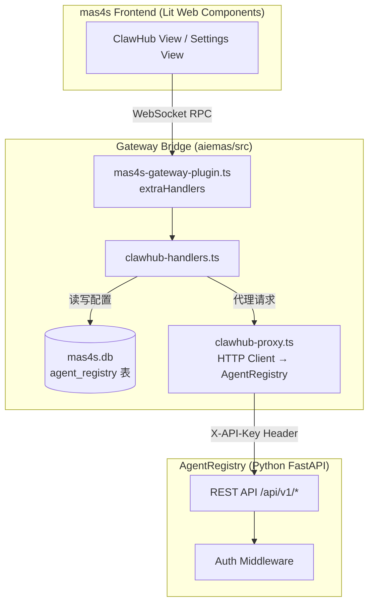
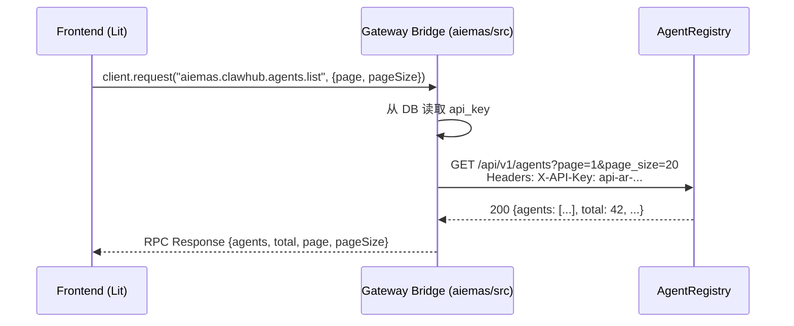

# Design Document: ClawHub Registry Integration

## Overview

本设计文档描述 mas4s Web UI 与 AgentRegistry 远程注册中心的集成方案。功能涵盖四个核心模块：

1. **AgentRegistry 健康检查端点** — Python 后端新增 `GET /api/v1/healthy`，用于服务在线检测和 API Key 有效性验证
2. **配置持久化层** — 在 mas4s.db 新增 `agent_registry` 表，将 NATS 配置从 `.env` 文件迁移至数据库管理
3. **设置页面配置 UI** — 在 Settings 页面中提供 API Key 和 NATS 配置的可视化管理界面
4. **ClawHub 浏览视图** — 新增导航模块，以卡片形式展示远程 AgentRegistry 中的 Agent 和 Skill 列表

### 设计目标

- 最小化对现有架构的侵入，复用已有的 Gateway RPC 模式和 Lit 组件模式
- 配置变更无需重启服务，通过数据库 + 热重载信号实现动态更新
- 前端通过 Gateway 代理所有对 AgentRegistry 的 HTTP 请求，避免浏览器直连外部服务（CORS 安全）

### 架构约束 (遵循 aiemas/AGENTS.md)

- **最小入侵原 Gateway**：所有新增后端逻辑闭环在 `aiemas/src/` 目录内实现，原 gateway (`src/gateway/`) 不做改动
- **RPC 命令前缀**：所有新增 WebSocket RPC 命令使用 `aiemas.clawhub.*` 前缀，在 `mas4s-gateway-plugin.ts` 的 `extraHandlers` 中注册
- **权限注册**：每个新增 RPC 方法必须同步在 `aiemas/src/rbac/permission-checker.ts` 的 `GLOBAL_ROLE_PERMISSIONS` 中显式注册允许的角色集合
- **数据库**：使用 `node:sqlite` DatabaseSync，持久化到 `~/.openclaw/aiemas/mas4s.db`，复用 `ensureMas4sSchema()` 初始化
- **API 文档**：新增的 RPC 命令需记录到 `docs/openclaw/websocket_api.md`

## Architecture

### 整体数据流



### 请求代理模式

前端不直接调用 AgentRegistry REST API。所有请求通过 Gateway WebSocket RPC 代理：



### 设计决策

| 决策                       | 选择               | 理由                                                             |
| -------------------------- | ------------------ | ---------------------------------------------------------------- |
| 后端逻辑位置               | `aiemas/src/` 目录 | 遵循 AGENTS.md 约束：最小入侵原 gateway，新功能闭环在 aiemas/src |
| RPC 命令前缀               | `aiemas.clawhub.*` | 遵循 AGENTS.md 约束：在 extraHandlers 中注册，需显式注册权限     |
| 前端如何调用 AgentRegistry | Gateway 代理       | 避免 CORS 问题；API Key 不暴露给浏览器；复用现有 WebSocket 通道  |
| 配置存储位置               | mas4s.db 单例行    | 与现有 schema 模式一致；支持动态更新；无需重启                   |
| 迁移策略                   | 首次启动自动迁移   | 平滑过渡；不破坏现有 .env 配置方式                               |
| Skill 数据来源             | 从 Agent 列表聚合  | AgentRegistry 无独立 Skill API；复用已有 agents 数据             |
| 分页策略                   | 服务端分页         | AgentRegistry 原生支持 page/page_size 参数                       |

## Components and Interfaces

### 1. AgentRegistry 健康检查端点 (Python 后端)

**文件**: `AgentRegistry/src/agent_registry/api/routes.py`

```python
# 新增路由（无需 get_current_user 依赖，自行校验凭证）
@router.get("/healthy")
async def healthy(request: Request):
    """健康检查 + API Key/Token 有效性验证"""
    # 复用现有 auth middleware 逻辑
    # 成功: {"success": true, "status": "healthy"}
    # 失败: 401 {"success": false, "error": "Unauthorized", "code": "UNAUTHORIZED"}
```

**实现方式**: 在现有 `routes.py` 中新增一个独立路由，使用 `Depends(get_current_user)` 依赖注入进行认证。认证通过即返回 200，认证失败由 middleware 自动返回 401。

### 2. 配置持久化层 (Gateway Bridge)

**新增文件**: `aiemas/src/store/agent-registry-config.ts`

```typescript
export interface AgentRegistryConfigRecord {
  id: "default";
  apiKey: string | null;
  natsUrl: string | null;
  natsToken: string | null;
  agentId: string | null;
  agentName: string | null;
  boundAgentId: string | null;
  createdAt: number;
  updatedAt: number;
}

/** 从数据库读取配置，空值回退环境变量 */
export function getAgentRegistryConfig(db: DatabaseSync): AgentRegistryConfigRecord;

/** 保存配置到数据库 */
export function saveAgentRegistryConfig(
  db: DatabaseSync,
  config: Partial<Omit<AgentRegistryConfigRecord, "id" | "createdAt" | "updatedAt">>,
): void;

/** 首次启动时从 .env 迁移配置 */
export function migrateFromEnvIfEmpty(db: DatabaseSync): void;
```

**Schema 变更** (在 `ensureMas4sSchema` 中追加):

```sql
CREATE TABLE IF NOT EXISTS agent_registry (
  id             TEXT PRIMARY KEY DEFAULT 'default',
  api_key        TEXT,
  nats_url       TEXT,
  nats_token     TEXT,
  agent_id       TEXT,
  agent_name     TEXT,
  bound_agent_id TEXT,
  created_at     INTEGER NOT NULL,
  updated_at     INTEGER NOT NULL
);
```

### 3. Gateway RPC 命令 (aiemas/src)

**新增文件**: `aiemas/src/gateway-bridge/clawhub-handlers.ts`

所有 RPC 命令在 `mas4s-gateway-plugin.ts` 的 `extraHandlers` 中注册，使用 `aiemas.clawhub.*` 前缀：

| RPC 命令                     | 功能                        | 参数                                                                   | 权限                  |
| ---------------------------- | --------------------------- | ---------------------------------------------------------------------- | --------------------- |
| `aiemas.clawhub.config.get`  | 获取当前配置                | —                                                                      | admin, member, viewer |
| `aiemas.clawhub.config.save` | 保存配置（含 API Key 验证） | `{apiKey?, natsUrl?, natsToken?, agentId?, agentName?, boundAgentId?}` | admin                 |
| `aiemas.clawhub.agents.list` | 代理获取远程 Agent 列表     | `{page, pageSize}`                                                     | admin, member, viewer |
| `aiemas.clawhub.healthy`     | 代理健康检查                | `{apiKey}` (用于保存前验证)                                            | admin                 |

**权限注册** (在 `aiemas/src/rbac/permission-checker.ts` 的 `GLOBAL_ROLE_PERMISSIONS` 中):

```typescript
// 只读查询类 → 所有角色可访问
"aiemas.clawhub.config.get": new Set(["admin", "member", "viewer"]),
"aiemas.clawhub.agents.list": new Set(["admin", "member", "viewer"]),
// 写操作/破坏性操作 → 仅 admin
"aiemas.clawhub.config.save": new Set(["admin"]),
"aiemas.clawhub.healthy": new Set(["admin"]),
```

**新增文件**: `aiemas/src/gateway-bridge/clawhub-proxy.ts`

```typescript
import { request as httpRequest } from "node:http";

async function proxyToRegistry(
  method: string,
  path: string,
  apiKey: string,
  query?: Record<string, string>,
): Promise<unknown> {
  // 使用 node:http/https 发起请求
  // AgentRegistry 的 base URL 从 agent_registry 表的 nats_url 推导（同一服务器的 HTTP 端口）
  // 或从配置中单独存储的 registry_url 字段获取
  // Headers: { "X-API-Key": apiKey, "Content-Type": "application/json" }
  // 超时: 10s
  // 错误映射: 网络错误 → SERVICE_UNREACHABLE, 401 → INVALID_API_KEY, 其他 → REGISTRY_ERROR
}
```

**Handler 注册** (在 `mas4s-gateway-plugin.ts` 中):

```typescript
// aiemas/src/gateway-bridge/mas4s-gateway-plugin.ts
import { registerClawHubHandlers } from "./clawhub-handlers.js";

// 在 extraHandlers 中注册
registerClawHubHandlers(extraHandlers, { db, callGateway });
```

### 4. 前端 Gateway API 层

**新增文件**: `aiemas/ui/mas4s/src/gateway/clawhub-api.ts`

```typescript
import type { GatewayBrowserClient } from "../lib/gateway.js";

export interface RegistryAgent {
  card: {
    agent_id: string;
    name: string;
    skills: string[];
  };
  status: "online" | "idle" | "busy" | "offline";
  load?: { cpu: number; memory: number; active_task_count: number };
}

export interface AgentsListResponse {
  agents: RegistryAgent[];
  count: number;
  total: number;
  page: number;
  page_size: number;
}

export interface RegistryConfig {
  apiKey: string | null;
  natsUrl: string | null;
  natsToken: string | null;
  agentId: string | null;
  agentName: string | null;
  boundAgentId: string | null;
}

/** 获取远程 Agent 列表 */
export async function fetchRegistryAgents(
  client: GatewayBrowserClient,
  page: number,
  pageSize: number,
): Promise<AgentsListResponse> {
  return client.request("aiemas.clawhub.agents.list", { page, pageSize });
}

/** 获取配置 */
export async function fetchRegistryConfig(client: GatewayBrowserClient): Promise<RegistryConfig> {
  return client.request("aiemas.clawhub.config.get");
}

/** 保存配置（含 API Key 在线验证） */
export async function saveRegistryConfig(
  client: GatewayBrowserClient,
  config: Partial<RegistryConfig>,
): Promise<{ ok: boolean; error?: string }> {
  return client.request("aiemas.clawhub.config.save", config);
}
```

### 5. 前端视图组件

**新增文件**:

| 文件                          | 组件                   | 职责                                        |
| ----------------------------- | ---------------------- | ------------------------------------------- |
| `views/clawhub-view.ts`       | `<clawhub-view>`       | ClawHub 主视图，管理 Agents/Skills 页签切换 |
| `views/clawhub-agent-card.ts` | `<clawhub-agent-card>` | 单个 Agent 卡片                             |
| `views/clawhub-skill-card.ts` | `<clawhub-skill-card>` | 单个 Skill 卡片（支持多 Agent 聚合）        |
| `views/settings-registry.ts`  | `<settings-registry>`  | 设置页面中的 AgentRegistry 配置区域         |

**导航扩展**:

```typescript
// ui-state-controller.ts
export type NavItem =
  | "workspace"
  | "usage"
  | "agents"
  | "skills"
  | "cron"
  | "users"
  | "discussions"
  | "clawhub" // ← 新增
  | "settings";
```

### 6. Skill 聚合逻辑

**新增文件**: `aiemas/ui/mas4s/src/utils/skill-aggregator.ts`

```typescript
export interface AggregatedSkill {
  name: string;
  agents: Array<{
    agentId: string;
    agentName: string;
    status: "online" | "idle" | "busy" | "offline";
  }>;
}

/**
 * 从 Agent 列表中聚合 Skill 条目。
 * 相同名称（大小写敏感）的技能聚合到同一条目。
 */
export function aggregateSkills(agents: RegistryAgent[]): AggregatedSkill[];

/**
 * 对聚合后的 Skill 列表执行搜索过滤。
 * 大小写不敏感的子字符串匹配。
 */
export function filterSkills(skills: AggregatedSkill[], query: string): AggregatedSkill[];
```

### 7. 输入验证模块

**新增文件**: `aiemas/ui/mas4s/src/utils/registry-validators.ts`

```typescript
export interface ValidationResult {
  valid: boolean;
  error?: string;
}

/** 验证 API Key 格式: 以 "api-ar-" 为前缀，总长度 64 */
export function validateApiKey(value: string): ValidationResult;

/** 验证 NATS URL 格式: nats://{host}:{port}, port 1-65535, 总长度 ≤ 256 */
export function validateNatsUrl(value: string): ValidationResult;

/** 验证 Agent ID: [a-zA-Z0-9_-]{1,64} */
export function validateAgentId(value: string): ValidationResult;

/** 验证 Agent Name: 长度 1-128 */
export function validateAgentName(value: string): ValidationResult;
```

## Data Models

### agent_registry 表 (mas4s.db)

| 字段           | 类型    | 约束                        | 说明                  |
| -------------- | ------- | --------------------------- | --------------------- |
| id             | TEXT    | PRIMARY KEY, 固定 'default' | 单例标识              |
| api_key        | TEXT    | NULLABLE                    | AgentRegistry API Key |
| nats_url       | TEXT    | NULLABLE                    | NATS 连接 URL         |
| nats_token     | TEXT    | NULLABLE                    | NATS 认证 Token       |
| agent_id       | TEXT    | NULLABLE                    | 本机 Agent 注册 ID    |
| agent_name     | TEXT    | NULLABLE                    | 本机 Agent 显示名称   |
| bound_agent_id | TEXT    | NULLABLE                    | 绑定的本地 Agent ID   |
| created_at     | INTEGER | NOT NULL                    | 创建时间戳 (ms)       |
| updated_at     | INTEGER | NOT NULL                    | 最后更新时间戳 (ms)   |

### 配置解析优先级

```
最终配置值 = agent_registry 表中的值 ?? 环境变量值 ?? null
```

对应环境变量映射：

| 数据库字段     | 环境变量                      |
| -------------- | ----------------------------- |
| api_key        | (无对应环境变量)              |
| nats_url       | AGENT_REGISTRY_NATS_URL       |
| nats_token     | AGENT_REGISTRY_NATS_TOKEN     |
| agent_id       | AGENT_REGISTRY_AGENT_ID       |
| agent_name     | AGENT_REGISTRY_AGENT_NAME     |
| bound_agent_id | AGENT_REGISTRY_BOUND_AGENT_ID |

### AgentRegistry API 响应模型

```typescript
/** GET /api/v1/agents 响应 */
interface AgentsResponse {
  agents: AgentRecord[];
  count: number;
  total: number;
  page: number;
  page_size: number;
}

/** 单个 Agent 记录 */
interface AgentRecord {
  card: {
    agent_id: string;
    name: string;
    skills: string[];
    mac: string;
    transport: "nats" | "http";
    permissions?: {
      allow_create_discussion: boolean;
      allow_create_cowork: boolean;
    };
  };
  status: "online" | "idle" | "busy" | "offline";
  load?: {
    cpu: number;
    memory: number;
    active_task_count: number;
  };
  registered_at: string;
  last_heartbeat: string;
}

/** GET /api/v1/healthy 响应 */
interface HealthyResponse {
  success: true;
  status: "healthy";
}
```

## Correctness Properties

_A property is a characteristic or behavior that should hold true across all valid executions of a system — essentially, a formal statement about what the system should do. Properties serve as the bridge between human-readable specifications and machine-verifiable correctness guarantees._

### Property 1: Config resolution priority

_For any_ configuration field, if the database contains a non-null value for that field, the resolved config SHALL return the database value regardless of what the corresponding environment variable contains; if the database value is null, the resolved config SHALL return the environment variable value.

**Validates: Requirements 2.4**

### Property 2: Env migration correctness

_For any_ set of AGENT*REGISTRY*\* environment variables present in `~/.openclaw/.env`, when the `agent_registry` table is empty and migration runs, the resulting database record SHALL contain the exact same values as the source environment variables for all mapped fields.

**Validates: Requirements 2.3**

### Property 3: API Key format validation

_For any_ string input, the API Key validator SHALL return valid=true if and only if the string starts with the prefix `api-ar-` AND has a total length of exactly 64 characters.

**Validates: Requirements 3.3, 3.4**

### Property 4: NATS URL format validation

_For any_ string input, the NATS URL validator SHALL return valid=true if and only if the string matches the pattern `nats://{host}:{port}` where host is a non-empty string, port is an integer in [1, 65535], and total length does not exceed 256 characters.

**Validates: Requirements 4.2**

### Property 5: Agent ID format validation

_For any_ string input, the Agent ID validator SHALL return valid=true if and only if the string contains only characters from `[a-zA-Z0-9_-]` and has a length between 1 and 64 inclusive.

**Validates: Requirements 4.3**

### Property 6: Agent Name length validation

_For any_ string input, the Agent Name validator SHALL return valid=true if and only if the string has a length between 1 and 128 inclusive.

**Validates: Requirements 4.5**

### Property 7: Agent card data completeness

_For any_ valid AgentRecord from the registry, the rendered agent card SHALL contain the agent name, agent ID, status indicator, and skill tags (displaying at most 5 tags with a "+N" overflow indicator when skills exceed 5).

**Validates: Requirements 6.3**

### Property 8: Skill aggregation groups by unique name

_For any_ list of AgentRecords, the skill aggregation function SHALL produce exactly one AggregatedSkill entry per unique skill name (case-sensitive), and each entry SHALL list all agents that declare that skill with their respective statuses.

**Validates: Requirements 7.1, 7.3**

### Property 9: Skill search filter correctness

_For any_ aggregated skill list and any search query string, the filter function SHALL return only those skills whose name contains the query as a substring (case-insensitive comparison), and SHALL return all such matching skills.

**Validates: Requirements 7.5**

## Error Handling

### 前端错误处理策略

| 场景                            | 处理方式          | 用户反馈                                              |
| ------------------------------- | ----------------- | ----------------------------------------------------- |
| API Key 未配置                  | 不发送请求        | 显示配置引导，链接到设置页面                          |
| AgentRegistry 不可达 (网络错误) | 捕获异常          | "AgentRegistry 服务不可达，请检查网络连接" + 重试按钮 |
| 请求超时 (10s)                  | Promise.race 超时 | "请求超时，请稍后重试" + 重试按钮                     |
| API Key 无效 (401)              | 捕获 HTTP 状态码  | "API Key 无效或已过期，请前往设置页面更新"            |
| 服务端错误 (5xx)                | 捕获 HTTP 状态码  | "AgentRegistry 服务异常，请稍后重试" + 重试按钮       |
| Gateway 断开                    | 检测 gatewayCode  | "连接已断开，请检查网络"                              |

### Gateway 代理错误映射

```typescript
// Gateway → Frontend 错误码映射
const ERROR_CODES = {
  SERVICE_UNREACHABLE: "AgentRegistry 服务不可达",
  INVALID_API_KEY: "API Key 无效或已过期",
  API_KEY_NOT_CONFIGURED: "API Key 未配置",
  REGISTRY_ERROR: "AgentRegistry 返回错误",
  TIMEOUT: "请求超时",
} as const;
```

### 配置保存错误处理

保存配置时的错误分为两类，前端需区分展示：

1. **API Key 验证失败** — 调用 `/api/v1/healthy` 返回 401 → 提示 "API Key 无效"
2. **服务不可达** — 网络错误或超时 → 提示 "AgentRegistry 服务不可达，无法验证 API Key"

两种情况均不持久化 API Key，保留用户已输入的表单数据。

### 数据库写入失败

- 记录 error 级别日志（含错误详情）
- 返回错误响应给前端
- 不影响系统其他功能的正常运行
- 首次迁移失败时，系统继续使用环境变量配置

## Testing Strategy

### 测试框架

- **前端单元测试**: Vitest + fast-check (已在 devDependencies 中)
- **后端单元测试**: pytest + hypothesis (Python PBT 库)
- **集成测试**: Vitest (mock Gateway client)

### 属性测试 (Property-Based Testing)

本功能适合 PBT 的模块：

- 输入验证函数（纯函数，输入空间大）
- 配置解析优先级逻辑（纯函数，组合状态多）
- Skill 聚合逻辑（纯函数，输入结构多样）
- Skill 搜索过滤（纯函数，字符串匹配）

**PBT 配置**:

- 库: `fast-check` (前端), `hypothesis` (后端)
- 最小迭代次数: 100
- 每个测试标注对应的 Property 编号

**标注格式**: `// Feature: clawhub-registry-integration, Property N: <property_text>`

### 单元测试覆盖

| 模块                       | 测试文件                        | 测试类型                         |
| -------------------------- | ------------------------------- | -------------------------------- |
| `registry-validators.ts`   | `registry-validators.test.ts`   | PBT (Property 3-6)               |
| `skill-aggregator.ts`      | `skill-aggregator.test.ts`      | PBT (Property 8, 9)              |
| `agent-registry-config.ts` | `agent-registry-config.test.ts` | PBT (Property 1, 2)              |
| `clawhub-api.ts`           | `clawhub-api.test.ts`           | Example-based (mock client)      |
| `clawhub-view.ts`          | `clawhub-view.test.ts`          | Example-based (DOM rendering)    |
| `settings-registry.ts`     | `settings-registry.test.ts`     | Example-based (form interaction) |

### 集成测试

| 场景              | 验证内容                                |
| ----------------- | --------------------------------------- |
| 保存 API Key 流程 | 格式验证 → 在线验证 → 持久化 → 成功反馈 |
| 首次启动迁移      | .env 读取 → DB 写入 → 配置可用          |
| ClawHub 加载流程  | 配置检查 → API 请求 → 数据渲染          |
| 错误恢复          | 超时/401/网络错误 → 错误展示 → 重试     |

### Python 后端测试

| 模块                  | 测试内容                                                           |
| --------------------- | ------------------------------------------------------------------ |
| `GET /api/v1/healthy` | 有效 Token → 200, 有效 API Key → 200, 无凭证 → 401, 无效凭证 → 401 |
