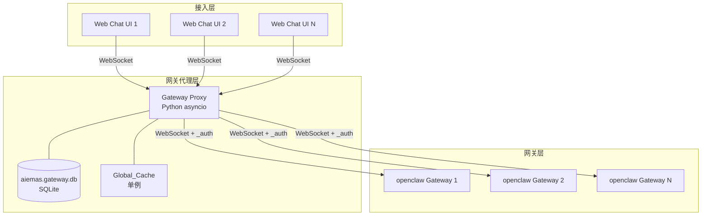
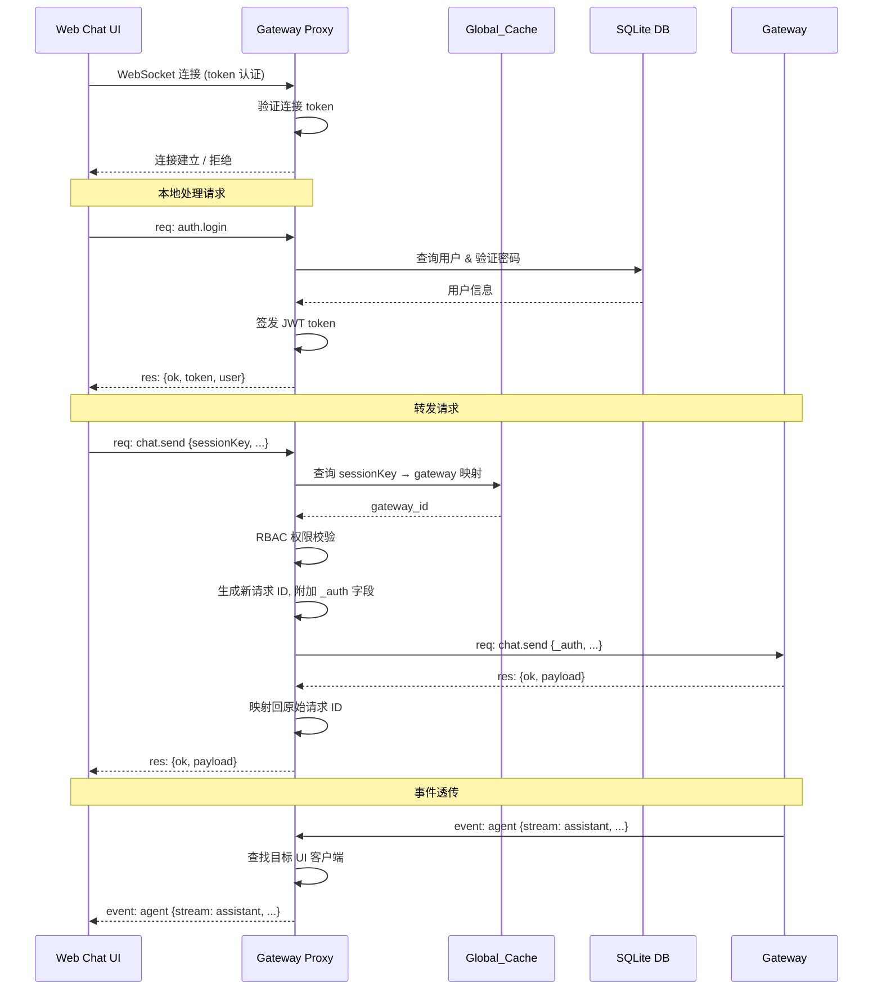
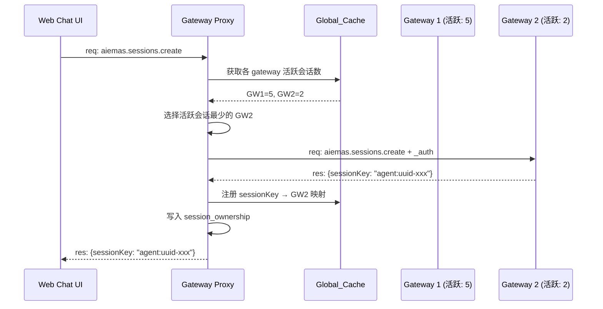

# 设计文档：Gateway Proxy

## 概述

Gateway Proxy 是一个基于 Python asyncio 的 WebSocket 代理服务，位于 AIEMAS Web Chat UI 与多个 openclaw gateway 实例之间。其核心目标是解决单线程 Node.js gateway 在多用户多 agent 并发场景下的性能瓶颈，通过将连接管理和路由逻辑从 gateway 中剥离，实现水平扩展。

### 设计目标

1. **协议透明**：UI 无需感知是连接 Proxy 还是直连 gateway，WebSocket 协议帧格式完全兼容
2. **本地鉴权**：登录、注册、token 刷新等认证操作在 Proxy 本地完成，减少 gateway 负载
3. **智能路由**：基于缓存的活跃会话数进行负载均衡，将请求路由到最空闲的 gateway
4. **事件透传**：流式事件（chat、agent、tool、approval 等）实时透传，不修改内容和顺序
5. **权限一致**：复用现有 gateway 的 RBAC 权限矩阵，保证权限行为完全一致

### 设计决策

| 决策         | 选择                             | 理由                                                                                                  |
| ------------ | -------------------------------- | ----------------------------------------------------------------------------------------------------- |
| 实现语言     | Python 3.10+                     | asyncio 原生支持高并发 WebSocket，避免 Node.js 单线程瓶颈                                             |
| 数据库       | SQLite (aiosqlite)               | 与现有 gateway 保持一致的轻量级持久化方案                                                             |
| WebSocket 库 | websockets                       | Python 生态最成熟的 asyncio WebSocket 库                                                              |
| 密码哈希     | SHA-256 + UUID salt              | 与现有 gateway 的 `hashPassword`/`verifyPassword` 保持一致（参考 `aiemas/src/users/user-service.ts`） |
| JWT 签名     | HMAC-SHA256                      | 与现有 gateway 共享 `MAS4S_JWT_SECRET`，保证 token 互认                                               |
| 缓存策略     | 进程内单例 Global_Cache          | 避免外部缓存依赖，asyncio 单进程模型下线程安全                                                        |
| 配置文件     | `~/.openclaw/gateway-proxy.json` | 与现有 gateway 的 `openclaw.json` 配置风格一致，支持 port/bind/token                                  |
| 日志框架     | Python logging (structlog 风格)  | 消息入口、转发、事件转发均添加结构化日志，便于问题定位                                                |

## 架构

### 系统架构图



### 请求处理流程



### 负载均衡流程



## 组件与接口

### 核心组件

#### 1. ProxyServer（主服务）

入口组件，负责启动 WebSocket 服务器、初始化数据库和缓存、管理生命周期。

```python
class ProxyServer:
    """Gateway Proxy 主服务"""

    def __init__(self, config: ProxyConfig):
        self.config = config
        self.db: aiosqlite.Connection  # SQLite 连接
        self.cache: GlobalCache        # 全局缓存单例
        self.gateway_manager: GatewayManager
        self.client_manager: ClientManager
        self.router: MessageRouter
        self.auth_service: AuthService

    async def start(self) -> None:
        """启动服务：初始化 DB → 加载缓存 → 连接 gateways → 启动 WS 服务器"""

    async def stop(self) -> None:
        """优雅关闭：断开所有连接 → 关闭 DB"""

    async def handle_client(self, websocket, path) -> None:
        """处理新的 UI 客户端 WebSocket 连接"""
```

#### 2. GlobalCache（全局缓存单例）

集中管理所有内存缓存，保证数据一致性。

```python
class GlobalCache:
    """全局缓存单例，管理用户、gateway、会话路由缓存"""

    def __init__(self):
        self._users: dict[str, UserInfo]           # userId → UserInfo
        self._gateways: dict[str, GatewayInfo]     # gateway_id → GatewayInfo
        self._session_routes: dict[str, str]       # sessionKey → gateway_id
        self._session_access: dict[str, float]     # sessionKey → lastAccessAt (timestamp)
        self._lock: asyncio.Lock                   # 写操作锁

    async def init_from_db(self, db: aiosqlite.Connection) -> None:
        """从数据库加载用户和 gateway 信息到内存"""

    def get_route(self, session_key: str) -> str | None:
        """O(1) 查找 sessionKey 对应的 gateway_id"""

    def set_route(self, session_key: str, gateway_id: str) -> None:
        """注册 sessionKey → gateway 映射"""

    def remove_route(self, session_key: str) -> None:
        """移除 sessionKey 映射"""

    def update_access(self, session_key: str) -> None:
        """更新会话的 lastAccessAt 时间戳"""

    def get_least_loaded_gateway(self) -> str | None:
        """基于最近 24h 活跃会话数选择负载最低的 gateway"""

    def get_active_session_count(self, gateway_id: str) -> int:
        """计算某 gateway 最近 24h 的活跃会话数"""
```

#### 3. GatewayManager（Gateway 连接管理器）

管理与所有 gateway 实例的 WebSocket 连接。

```python
class GatewayManager:
    """管理与后端 gateway 实例的 WebSocket 连接"""

    def __init__(self, cache: GlobalCache, on_event: EventCallback):
        self._connections: dict[str, GatewayConnection]  # gateway_id → connection
        self._cache = cache
        self._on_event = on_event

    async def connect_all(self, gateways: list[GatewayInfo]) -> None:
        """连接所有已注册的 gateway"""

    async def connect_one(self, gateway: GatewayInfo) -> None:
        """连接单个 gateway，建立连接后同步会话列表"""

    async def disconnect_one(self, gateway_id: str) -> None:
        """断开与指定 gateway 的连接"""

    async def send_request(self, gateway_id: str, frame: dict) -> dict:
        """向指定 gateway 发送请求并等待响应"""

    def is_connected(self, gateway_id: str) -> bool:
        """检查 gateway 连接状态"""

    def get_connected_gateway_ids(self) -> list[str]:
        """获取所有已连接的 gateway ID 列表"""
```

#### 4. GatewayConnection（单个 Gateway 连接）

封装与单个 gateway 的 WebSocket 连接，包含重连逻辑。

```python
class GatewayConnection:
    """单个 gateway 的 WebSocket 连接封装"""

    def __init__(self, gateway: GatewayInfo, on_event: EventCallback):
        self._ws: websockets.WebSocketClientProtocol | None
        self._pending: dict[str, asyncio.Future]  # request_id → Future
        self._reconnect_task: asyncio.Task | None
        self._backoff_seconds: float = 1.0
        self._max_backoff: float = 60.0

    async def connect(self) -> None:
        """建立 WebSocket 连接，发送 connect 握手"""

    async def send_request(self, frame: dict) -> dict:
        """发送请求帧并等待响应"""

    async def _reconnect_loop(self) -> None:
        """指数退避重连循环"""

    async def _receive_loop(self) -> None:
        """接收循环：分发响应和事件"""

    async def close(self) -> None:
        """关闭连接"""
```

#### 5. ClientManager（UI 客户端管理器）

管理所有 UI WebSocket 客户端连接。

```python
class ClientManager:
    """管理 UI 客户端 WebSocket 连接"""

    def __init__(self):
        self._clients: dict[str, ClientConnection]  # conn_id → ClientConnection

    def add_client(self, conn_id: str, ws, auth: AuthContext) -> None:
        """注册新客户端连接"""

    def remove_client(self, conn_id: str) -> None:
        """移除客户端连接"""

    async def send_to_client(self, conn_id: str, frame: dict) -> None:
        """向指定客户端发送消息帧"""

    def get_clients_for_session(self, session_key: str) -> list[ClientConnection]:
        """获取订阅了指定会话的客户端列表"""
```

#### 6. MessageRouter（消息路由器）

负责请求分类（本地处理 vs 转发）和请求 ID 映射。

```python
class MessageRouter:
    """消息路由：本地处理 vs 转发到 gateway"""

    LOCAL_METHODS = frozenset([
        "system.status", "auth.login", "auth.refresh",
        "auth.verify", "user.register",
    ])

    def __init__(self, auth_service: AuthService, gateway_manager: GatewayManager,
                 cache: GlobalCache, permission_checker: PermissionChecker):
        self._id_map: dict[str, RequestMapping]  # proxy_req_id → mapping
        self._auth_service = auth_service
        self._gateway_manager = gateway_manager
        self._cache = cache
        self._permission_checker = permission_checker

    async def route(self, client: ClientConnection, frame: dict) -> None:
        """路由请求：本地处理或转发"""

    async def _handle_local(self, client: ClientConnection, method: str,
                            params: dict, req_id: str) -> None:
        """处理本地方法"""

    async def _forward_to_gateway(self, client: ClientConnection, method: str,
                                   params: dict, req_id: str) -> None:
        """转发请求到目标 gateway"""

    def _create_forwarded_frame(self, frame: dict, auth: AuthContext) -> tuple[str, dict]:
        """生成转发帧：新 ID + _auth 字段"""

    async def handle_gateway_response(self, proxy_req_id: str, response: dict) -> None:
        """处理 gateway 响应：映射回原始请求 ID 并返回给 UI"""
```

#### 7. AuthService（认证服务）

本地处理所有认证相关操作。

```python
class AuthService:
    """本地认证服务：登录、注册、token 管理"""

    def __init__(self, db: aiosqlite.Connection, jwt_secret: str):
        self._db = db
        self._jwt_secret = jwt_secret
        self._rate_limiter: dict[str, list[float]]  # IP → 失败时间戳列表

    async def login(self, username: str, password: str, client_ip: str) -> dict:
        """验证用户名密码，签发 JWT token"""

    async def register(self, username: str, password: str, display_name: str) -> dict:
        """注册新用户"""

    def verify_token(self, token: str) -> JwtPayload | None:
        """验证 JWT token 有效性"""

    def refresh_token(self, token: str) -> str | None:
        """刷新 JWT token"""

    def get_system_status(self) -> dict:
        """返回系统初始化状态"""

    @staticmethod
    def hash_password(plain: str) -> str:
        """SHA-256 + UUID salt 密码哈希（兼容现有 gateway）"""

    @staticmethod
    def verify_password(plain: str, stored: str) -> bool:
        """验证密码（兼容现有 gateway 格式 sha256:<salt>:<hash>）"""
```

#### 8. PermissionChecker（权限校验器）

复用现有 gateway 的 RBAC 权限矩阵。

```python
class PermissionChecker:
    """RBAC 权限校验，与现有 gateway 权限矩阵一致"""

    GLOBAL_ROLE_PERMISSIONS: dict[str, set[str]]  # method → allowed roles
    SESSION_ROLE_PERMISSIONS: dict[str, set[str]]  # method → allowed session roles

    def check_permission(self, user_id: str | None, role: str | None,
                         method: str, session_context: SessionContext | None = None) -> bool:
        """全局角色 + 会话角色权限校验"""

    def _derive_allowed_roles(self, method: str) -> set[str] | None:
        """未注册方法的 fallback 角色推导"""
```

#### 9. EventForwarder（事件转发器）

处理 gateway 推送的流式事件，转发给对应的 UI 客户端。

```python
class EventForwarder:
    """流式事件转发：gateway → UI 客户端"""

    def __init__(self, client_manager: ClientManager, cache: GlobalCache):
        self._client_manager = client_manager
        self._cache = cache

    async def forward_event(self, gateway_id: str, event_frame: dict) -> None:
        """将 gateway 事件转发给对应会话的 UI 客户端"""
```

### 接口定义

#### WebSocket 消息帧格式（与现有 gateway 完全一致）

```python
# 请求帧
RequestFrame = TypedDict("RequestFrame", {
    "type": Literal["req"],
    "id": str,           # UUID
    "method": str,       # e.g. "chat.send", "auth.login"
    "params": dict,      # 方法参数
})

# 响应帧
ResponseFrame = TypedDict("ResponseFrame", {
    "type": Literal["res"],
    "id": str,           # 与请求 ID 对应
    "ok": bool,
    "payload": dict | None,
    "error": dict | None,  # {"code": str, "message": str, "details": ...}
})

# 事件帧
EventFrame = TypedDict("EventFrame", {
    "type": Literal["event"],
    "event": str,        # e.g. "chat", "agent", "session.tool"
    "payload": dict,
    "seq": int | None,
})

# Proxy → Gateway 转发时附加的 _auth 字段
AuthExtension = TypedDict("AuthExtension", {
    "userId": str,
    "tenantId": str,
    "role": str,         # "admin" | "member" | "viewer"
})
```

#### Gateway 管理 API（仅 admin 角色可调用）

| 方法                   | 参数                   | 返回                | 说明             |
| ---------------------- | ---------------------- | ------------------- | ---------------- |
| `proxy.gateway.add`    | `{name, wsUrl, token}` | `{gatewayId}`       | 添加 gateway     |
| `proxy.gateway.remove` | `{gatewayId}`          | `{ok}`              | 删除 gateway     |
| `proxy.gateway.list`   | `{}`                   | `{gateways: [...]}` | 列出所有 gateway |

## 数据模型

### SQLite 数据库 Schema（aiemas.gateway.db）

```sql
-- 用户表（与现有 gateway 的 users 表结构一致）
CREATE TABLE IF NOT EXISTS users (
    userId       TEXT PRIMARY KEY,
    username     TEXT NOT NULL,
    displayName  TEXT NOT NULL,
    passwordHash TEXT NOT NULL,  -- 格式: sha256:<salt>:<hash>
    role         TEXT NOT NULL CHECK(role IN ('admin', 'member', 'viewer')),
    tenantId     TEXT NOT NULL,
    status       TEXT NOT NULL DEFAULT 'pending'
                 CHECK(status IN ('pending', 'approved', 'rejected')),
    createdAt    INTEGER NOT NULL
);

CREATE UNIQUE INDEX IF NOT EXISTS idx_users_tenant_username
ON users(tenantId, username);

-- Gateway 注册表
CREATE TABLE IF NOT EXISTS gateways (
    gatewayId    TEXT PRIMARY KEY,
    name         TEXT NOT NULL,
    wsUrl        TEXT NOT NULL UNIQUE,
    token        TEXT NOT NULL,  -- gateway 认证 token
    status       TEXT NOT NULL DEFAULT 'disconnected'
                 CHECK(status IN ('connected', 'disconnected')),
    createdAt    INTEGER NOT NULL
);

-- 会话所有者表
CREATE TABLE IF NOT EXISTS session_ownership (
    sessionKey   TEXT PRIMARY KEY,
    userId       TEXT NOT NULL,
    tenantId     TEXT NOT NULL,
    createdAt    INTEGER NOT NULL
);

-- 会话成员关系表
CREATE TABLE IF NOT EXISTS session_memberships (
    sessionKey   TEXT NOT NULL,
    userId       TEXT NOT NULL,
    role         TEXT NOT NULL CHECK(role IN ('owner', 'participant')),
    joinedAt     INTEGER NOT NULL,
    PRIMARY KEY (sessionKey, userId)
);

CREATE INDEX IF NOT EXISTS idx_memberships_user
ON session_memberships(userId);
```

### 内存数据结构

```python
@dataclass
class UserInfo:
    user_id: str
    username: str
    display_name: str
    role: str           # "admin" | "member" | "viewer"
    tenant_id: str
    status: str         # "pending" | "approved" | "rejected"

@dataclass
class GatewayInfo:
    gateway_id: str
    name: str
    ws_url: str
    token: str
    status: str         # "connected" | "disconnected"

@dataclass
class ClientConnection:
    conn_id: str
    websocket: Any      # websockets.WebSocketServerProtocol
    auth: AuthContext | None
    subscribed_sessions: set[str]  # 该客户端关注的 sessionKey 集合

@dataclass
class AuthContext:
    user_id: str
    tenant_id: str
    role: str           # "admin" | "member" | "viewer"

@dataclass
class RequestMapping:
    original_req_id: str    # UI 发送的原始请求 ID
    proxy_req_id: str       # Proxy 生成的转发请求 ID
    client_conn_id: str     # 发送请求的 UI 客户端连接 ID
    gateway_id: str         # 目标 gateway ID
    created_at: float       # 创建时间戳，用于超时清理

@dataclass
class JwtPayload:
    user_id: str
    tenant_id: str
    role: str
    iat: int                # issued at (unix timestamp)
    exp: int                # expiration (unix timestamp)
```

### 配置文件（`~/.openclaw/gateway-proxy.json`）

配置文件路径为 `~/.openclaw/gateway-proxy.json`，参考现有 `openclaw.json` 中 `gateway` 配置段的风格。首次启动时若配置文件不存在则自动创建，若未配置 token 则自动生成并保存。

```json
{
  "port": 18790,
  "bind": "loopback",
  "auth": {
    "token": "auto-generated-hex-token-if-not-set"
  },
  "jwtSecret": "shared-MAS4S_JWT_SECRET",
  "database": {
    "path": "~/.openclaw/aiemas/aiemas.gateway.db"
  }
}
```

| 字段            | 类型   | 默认值                                 | 说明                                                        |
| --------------- | ------ | -------------------------------------- | ----------------------------------------------------------- |
| `port`          | int    | `18790`                                | WebSocket 服务监听端口                                      |
| `bind`          | string | `"loopback"`                           | 绑定地址：`"loopback"` (127.0.0.1) 或 `"0.0.0.0"`           |
| `auth.token`    | string | 自动生成                               | Proxy 的连接认证 token，未配置时自动生成 64 字符 hex 并保存 |
| `jwtSecret`     | string | 必填                                   | 与所有 gateway 共享的 `MAS4S_JWT_SECRET`                    |
| `database.path` | string | `~/.openclaw/aiemas/aiemas.gateway.db` | SQLite 数据库文件路径                                       |

```python
@dataclass
class ProxyConfig:
    port: int = 18790
    bind: str = "loopback"       # "loopback" | "0.0.0.0"
    token: str = ""              # 连接认证 token，空时自动生成
    jwt_secret: str = ""         # MAS4S_JWT_SECRET
    db_path: str = ""            # SQLite 数据库路径

    @classmethod
    def load(cls, path: str = "~/.openclaw/gateway-proxy.json") -> "ProxyConfig":
        """加载配置文件，不存在时创建默认配置"""

    def save(self, path: str = "~/.openclaw/gateway-proxy.json") -> None:
        """保存配置到文件（token 自动生成后需回写）"""

    def ensure_token(self) -> None:
        """若 token 为空，生成 64 字符 hex token 并保存"""
```

### 日志规范

所有关键路径添加结构化日志，使用 `[gateway-proxy]` 前缀，便于与 gateway 日志区分。

| 日志点            | 级别  | 格式示例                                                                               |
| ----------------- | ----- | -------------------------------------------------------------------------------------- |
| 服务启动          | INFO  | `[gateway-proxy] Starting on {bind}:{port}`                                            |
| 配置加载          | INFO  | `[gateway-proxy] Config loaded from {path}, port={port}, bind={bind}`                  |
| Token 自动生成    | INFO  | `[gateway-proxy] Auto-generated auth token (length={len})`                             |
| UI 客户端连接     | INFO  | `[gateway-proxy] Client connected: conn_id={id}, ip={ip}`                              |
| UI 客户端断开     | INFO  | `[gateway-proxy] Client disconnected: conn_id={id}`                                    |
| 收到请求（入口）  | DEBUG | `[gateway-proxy] ← req: method={method}, id={id}, client={conn_id}`                    |
| 本地处理请求      | DEBUG | `[gateway-proxy] Local handle: method={method}, id={id}`                               |
| 转发请求          | DEBUG | `[gateway-proxy] → Forward: method={method}, id={orig_id}→{proxy_id}, gateway={gw_id}` |
| 收到 gateway 响应 | DEBUG | `[gateway-proxy] ← Gateway res: id={proxy_id}, ok={ok}, gateway={gw_id}`               |
| 返回响应给 UI     | DEBUG | `[gateway-proxy] → res: id={orig_id}, ok={ok}, client={conn_id}`                       |
| 事件转发          | DEBUG | `[gateway-proxy] → Event forward: event={event}, gateway={gw_id}, clients={count}`     |
| Gateway 连接建立  | INFO  | `[gateway-proxy] Gateway connected: id={gw_id}, url={url}`                             |
| Gateway 连接断开  | WARN  | `[gateway-proxy] Gateway disconnected: id={gw_id}, url={url}`                          |
| Gateway 重连      | INFO  | `[gateway-proxy] Gateway reconnecting: id={gw_id}, attempt={n}, backoff={sec}s`        |
| 会话路由注册      | DEBUG | `[gateway-proxy] Route added: sessionKey={key} → gateway={gw_id}`                      |
| 会话路由移除      | DEBUG | `[gateway-proxy] Route removed: sessionKey={key}`                                      |
| 权限校验失败      | WARN  | `[gateway-proxy] Permission denied: user={uid}, method={method}, role={role}`          |
| 登录成功          | INFO  | `[gateway-proxy] Login success: user={username}, userId={uid}`                         |
| 登录失败          | WARN  | `[gateway-proxy] Login failed: user={username}, ip={ip}, reason={reason}`              |
| 转发超时          | WARN  | `[gateway-proxy] Forward timeout: method={method}, id={proxy_id}, gateway={gw_id}`     |
| 会话未找到        | WARN  | `[gateway-proxy] Session not found: sessionKey={key}`                                  |

## 正确性属性

_属性是系统在所有有效执行中都应保持为真的特征或行为——本质上是对系统应做什么的形式化陈述。属性是人类可读规范与机器可验证正确性保证之间的桥梁。_

### 属性 1：密码哈希 round-trip

*对于任意*非空密码字符串 p，`hash_password(p)` 产生的哈希值 h 满足 `verify_password(p, h)` 返回 True；且对于任意不同于 p 的密码字符串 q，`verify_password(q, h)` 返回 False。

**验证需求：1.10**

### 属性 2：JWT token round-trip

*对于任意*有效的用户信息 (userId, tenantId, role)，使用共享的 `MAS4S_JWT_SECRET` 签发的 JWT token，经过 `verify_token` 验证后应返回相同的 userId、tenantId 和 role。

**验证需求：8.13**

### 属性 3：全局权限矩阵一致性

_对于任意_ (method, role) 组合，Proxy 的 `check_permission` 结果应与现有 gateway 的 `GLOBAL_ROLE_PERMISSIONS` 矩阵完全一致：公开方法（空角色集）允许所有人访问；已注册方法按角色集判断；未注册的 `aiemas.*` 前缀方法默认拒绝；其他未注册方法按 gateway scope fallback 推导。

**验证需求：7.1, 7.2, 7.3, 7.7**

### 属性 4：会话级权限校验（含 admin 绕过）

_对于任意_ (method, global_role, session_role) 组合，当 method 在 `SESSION_ROLE_PERMISSIONS` 中注册时：admin 角色始终通过会话级校验；非 admin 角色按 session_role 是否在允许集合中判断。

**验证需求：7.4, 7.8**

### 属性 5：方法路由分类

*对于任意*方法名 method，若 method 属于 `LOCAL_METHODS` 集合（system.status、auth.login、auth.refresh、auth.verify、user.register），则应被本地处理；否则应被路由转发。

**验证需求：9.2, 9.3**

### 属性 6：请求 ID 映射 round-trip

*对于任意*请求帧，转发到 gateway 时生成的 proxy_req_id 应不同于原始 req_id；当 gateway 返回以 proxy_req_id 为 ID 的响应时，Proxy 应将响应的 ID 替换回原始 req_id 后返回给 UI 客户端。

**验证需求：9.4, 9.6**

### 属性 7：\_auth 字段附加

*对于任意*请求帧和已认证的用户上下文 (userId, tenantId, role)，转发到 gateway 的帧应包含 `_auth` 字段，且 `_auth.userId`、`_auth.tenantId`、`_auth.role` 与用户上下文完全一致。

**验证需求：9.5**

### 属性 8：路由缓存增删一致性

_对于任意_ sessionKey 和 gateway_id，执行 `set_route(sessionKey, gateway_id)` 后 `get_route(sessionKey)` 应返回 gateway_id；执行 `remove_route(sessionKey)` 后 `get_route(sessionKey)` 应返回 None。

**验证需求：5.2, 5.3, 6.6**

### 属性 9：负载均衡选择正确性

*对于任意*已连接的 gateway 集合及其各自的会话列表（含 lastAccessAt），`get_least_loaded_gateway` 返回的 gateway 的最近 24h 活跃会话数应小于等于所有其他已连接 gateway 的活跃会话数。当多个 gateway 活跃会话数相同时，返回值应在这些候选 gateway 中。

**验证需求：6.3, 6.5**

### 属性 10：Gateway 注册增删 round-trip

*对于任意*有效的 gateway 信息 (name, wsUrl, token)，添加后应能在 gateway 列表中查询到且字段匹配；删除后应不再出现在列表中。

**验证需求：2.1, 2.2**

### 属性 11：Gateway 地址唯一性约束

_对于任意_ wsUrl，当该地址已被某个 gateway 注册后，再次以相同 wsUrl 添加 gateway 应被拒绝。

**验证需求：2.4**

### 属性 12：有活跃会话时拒绝删除 gateway

_对于任意_ gateway，当其路由缓存中存在至少一个 sessionKey 映射时，删除该 gateway 应被拒绝。

**验证需求：2.3**

### 属性 13：指数退避间隔计算

*对于任意*重连次数 n（n ≥ 0），计算的退避间隔应满足 `min(base * factor^n, 60)` 秒，且永远不超过 60 秒上限。

**验证需求：3.4**

### 属性 14：事件内容透传不变性

_对于任意_ gateway 推送的事件帧，Proxy 转发给 UI 客户端的事件帧内容应与原始事件帧完全一致（JSON 深度相等）。

**验证需求：11.4**

### 属性 15：消息与事件顺序保持

*对于任意*同一会话内的有序消息/事件序列，Proxy 转发后的顺序应与原始顺序一致。

**验证需求：10.5, 11.3**

## 错误处理

### 错误码定义

| 错误码                        | 场景                               | HTTP/WS 行为                     |
| ----------------------------- | ---------------------------------- | -------------------------------- |
| `AUTH_FAILED`                 | 用户名或密码错误（不区分具体原因） | 响应 ok=false                    |
| `RATE_LIMITED`                | 登录尝试过于频繁                   | 响应 ok=false，附带 retryAfterMs |
| `WEAK_PASSWORD`               | 密码强度不足（< 8 位）             | 响应 ok=false                    |
| `ACCOUNT_PENDING_APPROVAL`    | 账户待审批                         | 响应 ok=false                    |
| `ACCOUNT_REJECTED`            | 账户已被拒绝                       | 响应 ok=false                    |
| `TOKEN_EXPIRED`               | JWT token 已过期                   | 响应 ok=false                    |
| `TOKEN_INVALID`               | JWT token 无效                     | 响应 ok=false                    |
| `PERMISSION_DENIED`           | 角色权限不足                       | 响应 ok=false                    |
| `SESSION_NOT_FOUND`           | sessionKey 在路由缓存中不存在      | 响应 ok=false                    |
| `GATEWAY_UNAVAILABLE`         | 目标 gateway 连接断开              | 响应 ok=false                    |
| `NO_AVAILABLE_GATEWAY`        | 所有 gateway 均断开                | 响应 ok=false                    |
| `GATEWAY_TIMEOUT`             | 转发请求超时                       | 响应 ok=false                    |
| `DUPLICATE_GATEWAY_URL`       | gateway 地址已被注册               | 响应 ok=false                    |
| `GATEWAY_HAS_ACTIVE_SESSIONS` | gateway 有活跃会话，不可删除       | 响应 ok=false                    |
| `MAS_AUTH_FAILED`             | WebSocket 连接认证失败             | 关闭连接 code=4008               |

### 错误处理策略

1. **认证错误模糊化**：登录失败统一返回 `AUTH_FAILED`，不泄露用户是否存在
2. **速率限制**：同一 IP 每分钟最多 10 次失败登录尝试，超限返回 `RATE_LIMITED`
3. **转发超时**：默认 30 秒超时，超时后清理请求 ID 映射并返回 `GATEWAY_TIMEOUT`
4. **连接断开恢复**：gateway 连接断开时，该 gateway 上的所有 pending 请求返回 `GATEWAY_UNAVAILABLE`
5. **审计日志**：所有权限校验失败记录审计日志（userId、method、reason、timestamp）

## 测试策略

### 属性测试（Property-Based Testing）

使用 **Hypothesis** 库（Python 生态最成熟的 PBT 框架）实现属性测试。

- 每个属性测试最少运行 **100 次迭代**
- 每个测试标注对应的设计属性编号
- 标注格式：`# Feature: gateway-proxy, Property {N}: {property_text}`

**属性测试覆盖范围：**

| 属性    | 测试目标             | 生成器策略                                                 |
| ------- | -------------------- | ---------------------------------------------------------- |
| 属性 1  | 密码哈希 round-trip  | 随机 Unicode 字符串（1-100 字符）                          |
| 属性 2  | JWT token round-trip | 随机 userId/tenantId (UUID)、随机 role                     |
| 属性 3  | 全局权限矩阵         | 随机 method（已注册 + 未注册 + aiemas.\* 前缀）、随机 role |
| 属性 4  | 会话级权限           | 随机 method、随机 global_role、随机 session_role           |
| 属性 5  | 方法路由分类         | 随机方法名（本地方法 + 非本地方法）                        |
| 属性 6  | 请求 ID 映射         | 随机 UUID 请求 ID                                          |
| 属性 7  | \_auth 字段          | 随机用户上下文 + 随机请求帧                                |
| 属性 8  | 路由缓存增删         | 随机 sessionKey + 随机 gateway_id                          |
| 属性 9  | 负载均衡             | 随机 gateway 集合 + 随机会话分布                           |
| 属性 10 | Gateway 增删         | 随机 gateway 信息                                          |
| 属性 11 | 地址唯一性           | 随机 wsUrl                                                 |
| 属性 12 | 有会话时拒绝删除     | 随机 gateway + 随机会话                                    |
| 属性 13 | 指数退避             | 随机重连次数 (0-100)                                       |
| 属性 14 | 事件透传             | 随机事件帧（各种事件类型和 payload）                       |
| 属性 15 | 顺序保持             | 随机有序消息/事件序列                                      |

### 单元测试

覆盖具体示例、边界条件和错误场景：

- 数据库 schema 初始化（SMOKE 测试）
- 登录/注册/token 刷新的具体流程
- 无效 token 连接拒绝
- 所有 gateway 断开时的错误返回
- sessionKey 不存在时的错误返回
- 转发超时的错误处理
- 事务回滚验证

### 集成测试

使用 mock WebSocket 服务器验证端到端流程：

- UI → Proxy → Gateway 完整消息转发链路
- 流式事件透传链路
- Gateway 连接/断开/重连生命周期
- 多客户端并发消息转发
