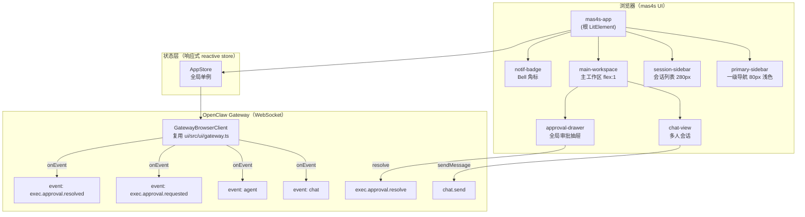
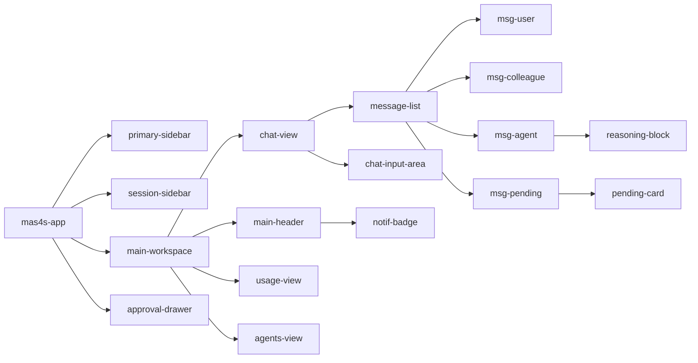
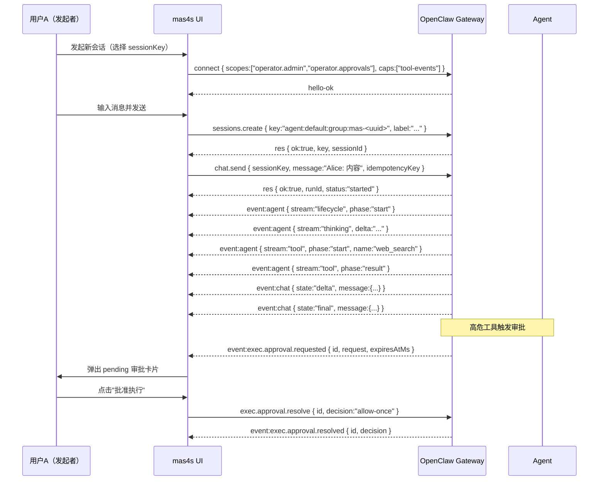

# 设计文档：mas4s 多智能体协作平台前端

## 概述

基于 OpenClaw 底座，在 `aiemas/ui/mas4s/` 目录构建多智能体科研协作平台前端。
技术栈与现有 `ui/` 保持一致（TypeScript ESM + Lit 3.x Web Components + Vite 8）。
UI 布局与样式以 `aiemas/docs/mas4s/mas.html` 静态原型为基准实现，不参考 `ui/` 目录的布局和样式。
Agent 以**会话（Session）**为交互单元，第一期聚焦多人会话功能，后续迭代叠加 Human-in-the-Loop 审批、透明化推理等模块。

---

## 高层设计（High-Level Design）

### 系统架构图



### 组件关系图



### 数据流（第一期：多人会话）



### Gateway 能力边界分析（不修改 gateway 的可行性）

以下分析基于对 gateway 源码的审查，明确哪些需求可以**完全不修改 gateway** 实现，哪些有限制。

#### ✅ 可完全实现（无需修改 gateway）

| 需求                      | 实现方式                                                                                   | 依赖的现有 gateway 能力                                                      |
| ------------------------- | ------------------------------------------------------------------------------------------ | ---------------------------------------------------------------------------- | ---------------------- |
| **HITL（exec 命令审批）** | 监听 `exec.approval.requested` 事件，渲染 `msg-pending` 卡片，调用 `exec.approval.resolve` | `exec.approval.*` 协议已完整，`broadcast` 受 `operator.approvals` scope 保护 |
| **透明化推理**            | 监听 `event:agent { stream:"thinking" }` 和 `stream:"tool"`                                | 需在 `connect` 时声明 `caps:["tool-events"]`，gateway 已支持                 |
| **多人会话**              | `sessions.create` 使用 `:group:` key，多个客户端连接同一 sessionKey                        | gateway 的 group session 机制已支持多客户端订阅同一会话事件                  |
| **任务看板（会话分类）**  | 前端维护 `masType:"initiated"                                                              | "participated"`，通过 `sessions.list` 拉取列表后本地分类                     | `sessions.list` 已支持 |
| **Diff 比对**             | 纯前端计算，使用 `diff` 库对比两个 `MasProposal.body` 字符串                               | 不依赖 gateway                                                               |
| **多任务并发通知**        | `AppStore.pendingApprovals` 跨会话聚合，Bell 角标显示总数                                  | 所有 `exec.approval.requested` 事件都会广播给有 scope 的连接                 |

#### ⚠️ 有限制（可间接实现，但有约束）

| 需求                         | 限制                                                                                                                               | 间接实现方案                                                                                                                                                                                                                                                                                                               |
| ---------------------------- | ---------------------------------------------------------------------------------------------------------------------------------- | -------------------------------------------------------------------------------------------------------------------------------------------------------------------------------------------------------------------------------------------------------------------------------------------------------------------------- |
| **子 Agent 启动前挂起**      | `sessions_spawn` 没有独立的审批门，`DANGEROUS_ACP_TOOLS` 的确认机制仅在 ACP 场景下生效，标准 exec.approval 流程不覆盖子 Agent 启动 | **Prompt Engineering 方案**：在 Agent system prompt 中约定"在调用 `sessions_spawn` 前，必须先通过 `chat.send` 发送一条包含 `[SPAWN_CONFIRM]` 标记的消息，等待人工回复 `confirm` 后再继续"。前端识别该标记渲染确认卡片，用户确认后发送 `confirm` 消息触发 Agent 继续。此方案不修改 gateway，但依赖 Agent 遵守 prompt 约定。 |
| **精准挂起（子流程切换前）** | 同上，gateway 无法在 Agent 内部流程切换点注入审批门                                                                                | 同上，通过 prompt 约定让 Agent 在关键节点主动请求确认                                                                                                                                                                                                                                                                      |

#### ❌ 无法实现（需修改 gateway 或 Agent 配置）

| 需求                             | 原因                                                                                                                                                                                            |
| -------------------------------- | ----------------------------------------------------------------------------------------------------------------------------------------------------------------------------------------------- |
| **HITL 覆盖所有工具（非 exec）** | `exec.approval.*` 协议仅覆盖 `exec` 工具（shell 命令执行），其他工具（如 `fs_write`、`sessions_spawn`）没有对应的审批协议                                                                       |
| **多人实时协作（消息同步）**     | gateway 的 group session 支持多客户端订阅，但消息广播给所有订阅者的机制需要验证（当前 `chat` 事件的 `sessionKey` 路由是否广播给所有连接该 session 的客户端，还是仅发给发起 `chat.send` 的连接） |

> **注**：关于多人消息同步，需在第一期实现时通过实际测试验证 gateway 的 group session 广播行为。若 gateway 仅将 `chat` 事件回给发起者，则需要通过 `sessions.list` 轮询或其他机制补偿。

#### 子 Agent 挂起的 Prompt Engineering 方案（详细设计）

```
Agent System Prompt 约定（伪代码）：
  在执行以下高风险操作前，必须先发送确认消息：
  - 调用 sessions_spawn 启动子 Agent
  - 进入新的关键研究阶段

  确认消息格式：
  "[SPAWN_CONFIRM] 即将启动子 Agent：{agentName}，任务：{task}，请回复 confirm 继续或 cancel 取消"

前端处理：
  1. 监听 event:chat，检测消息中的 [SPAWN_CONFIRM] 标记
  2. 渲染 SpawnConfirmCard 组件（类似 msg-pending，但用于子 Agent 确认）
  3. 用户点击"确认"后，发送 chat.send { message: "confirm" }
  4. 用户点击"取消"后，发送 chat.send { message: "cancel" }
```

### 模块划分

| 模块       | 路径                     | 职责                                    |
| ---------- | ------------------------ | --------------------------------------- |
| 根应用     | `src/app.ts`             | 路由、布局、全局状态初始化              |
| 网关客户端 | `src/gateway/client.ts`  | 复用/封装 `GatewayBrowserClient`        |
| 状态管理   | `src/store/app-store.ts` | 响应式 store（ReactiveController 模式） |
| 组件库     | `src/components/`        | Lit Web Components                      |
| 视图层     | `src/views/`             | 页面级组件（chat/usage/agents）         |
| 工具函数   | `src/utils/`             | 消息格式化、UUID、时间等                |

---

## 低层设计（Low-Level Design）

### UI 布局规范（基于 mas.html 原型）

整体采用三栏水平 flex 布局，高度 100vh，无滚动条溢出。

#### 布局 CSS 变量与色板

```css
/* src/styles/tokens.css */
:host,
:root {
  /* 全局背景 */
  --ai-bg-body: #f1f5f9;
  --ai-bg-panel: #ffffff;
  --ai-border: #e2e8f0;

  /* 品牌渐变 */
  --ai-primary-gradient: linear-gradient(135deg, #3b82f6 0%, #6366f1 100%);
  --ai-primary-light: #eff6ff;

  /* 文字 */
  --ai-text-main: #1e293b;
  --ai-text-sub: #64748b;

  /* 阴影 */
  --ai-shadow-soft: 0 4px 20px rgba(0, 0, 0, 0.04);
  --ai-shadow-hover: 0 10px 25px rgba(59, 130, 246, 0.15);

  /* 头像渐变 */
  --color-avatar-user: linear-gradient(135deg, #3b82f6 0%, #6366f1 100%);
  --color-avatar-agent: linear-gradient(135deg, #10b981 0%, #059669 100%);
  --color-avatar-colleague: linear-gradient(135deg, #f59e0b 0%, #d97706 100%);
  --color-avatar-pending: linear-gradient(135deg, #e11d48, #be123c);

  /* 消息气泡 */
  --color-bubble-other-bg: #ffffff;
  --color-bubble-other-border: #e2e8f0;
  --color-bubble-user-bg: var(--ai-primary-gradient);
  --color-bubble-user-shadow: 0 4px 12px rgba(59, 130, 246, 0.2);

  /* 尺寸 */
  --width-primary-sidebar: 80px;
  --width-session-sidebar: 280px;
  --height-header: 70px;
  --radius-card: 16px;
  --radius-avatar: 12px;
  --radius-input: 20px;
}
```

#### 一级导航 `primary-sidebar`

```
宽度：80px，背景 #ffffff，border-right: 1px solid #e2e8f0
box-shadow: 2px 0 10px rgba(0,0,0,0.02)

Logo：48×48px，背景 linear-gradient(135deg,#3b82f6,#6366f1)，border-radius 14px，文字"AIE"
  box-shadow: 0 4px 12px rgba(59,130,246,0.3)，margin-bottom 32px

导航项（.nav-item）：64×64px，border-radius 16px，flex-column，margin-bottom 12px
  图标容器（.nav-icon-wrapper）：36×36px，border-radius 10px，margin-bottom 4px
  标签：12px，color #64748b
  激活态：color #3b82f6，font-weight 600
    .nav-icon-wrapper：background #eff6ff，box-shadow inset 0 0 0 1px rgba(59,130,246,0.2)
  hover：color #3b82f6，.nav-icon-wrapper background #f8fafc，translateY(-2px)

菜单项（顶部到底部）：
  工作台(ChatDotRound)、使用情况(DataLine)、智能体(Cpu)、Skills(SetUp)、定时任务(Timer)
  flex:1 占位（推到底部）
  设置(Setting)
```

#### 会话列表 `session-sidebar`（仅工作台显示）

```
宽度：280px，背景 #f8fafc，border-right: 1px solid #e2e8f0

Header（70px）：
  左侧"会话列表"font-weight 600，font-size 16px，color #1e293b
  右侧"+"圆形按钮（28×28px，primary）
    下拉菜单：发起新会话 / 加入会话

会话分组（el-menu，可折叠，default-openeds）：
  "发起的会话"（FolderOpened 图标）
    - 每项高 44px，文字截断 ellipsis，右侧红色 is-dot badge（hasNotification 时）
  "参与的会话"（Connection 图标）
    - 每项高 44px，文字截断 ellipsis，右侧蓝色数字 badge（notificationCount > 0 时）

激活项（.is-active）：
  background #ffffff，color #3b82f6，font-weight 600
  box-shadow: 0 2px 8px rgba(59,130,246,0.1)，border-left: 3px solid #3b82f6
```

#### 主工作区 `main-workspace`

```
flex: 1，flex-direction: column，overflow: hidden，背景 #f1f5f9

顶部 Header（70px，背景 #fff，border-bottom: 1px solid #e2e8f0）：
  box-shadow: 0 2px 10px rgba(0,0,0,0.02)，padding: 0 30px
  左侧（workspace 且有当前会话时）：
    "会话：{title}"，font-size 18px，font-weight 600，color #1e293b
    状态 Tag（effect:"light"）
    邀请按钮（Share 图标，circle）
  右侧：
    Bell 角标按钮（全局审批通知，plain circle）
    用户头像（渐变 #f43f5e→#8b5cf6）+ 用户名（14px，color #475569）

聊天区 .chat-container：
  flex: 1，overflow-y: auto，padding: 30px，scroll-behavior: smooth
  顶部分隔文字："—— 协作链路已加密连接 ——"（居中，12px，color #94a3b8，letter-spacing 2px）

输入区 .chat-input-wrapper：
  padding: 0 30px 30px 30px
  .chat-input-area：背景 #fff，border: 1px solid #e2e8f0，border-radius 20px
    padding: 15px 20px，box-shadow: 0 10px 30px rgba(0,0,0,0.05)
    focus-within：border-color #93c5fd，box-shadow 蓝色
    textarea（2行，无边框，font-size 15px）
    底部工具栏：左侧提示文字（12px，color #94a3b8）+ 右侧发送按钮（primary，border-radius 8px）
```

### 消息气泡样式规范

#### 通用消息行 `.message-row`

```css
display: flex;
margin-bottom: 30px;
animation: slideUp 0.4s ease-out forwards;
opacity: 0;
transform: translateY(10px);
/* slideUp: to { opacity:1; transform:translateY(0) } */

.message-row.is-user {
  justify-content: flex-end;
}
```

#### 头像 `.message-avatar`

```
尺寸：40×40px，border-radius 12px，margin: 0 16px，flex-shrink: 0
box-shadow: 0 4px 10px rgba(0,0,0,0.08)

用户：background linear-gradient(135deg,#3b82f6,#6366f1)，UserFilled 图标
Agent：background linear-gradient(135deg,#10b981,#059669)，Cpu 图标
同事：background linear-gradient(135deg,#f59e0b,#d97706)，姓氏首字
审批挂起：background linear-gradient(135deg,#e11d48,#be123c)，WarningFilled 图标
  box-shadow: 0 4px 10px rgba(225,29,72,0.3)
```

#### 消息内容 `.message-content`

```
max-width: 65%（pending 消息 max-width: 80%），flex-column
用户消息：align-items: flex-end

发送者名 .message-name：13px，color #64748b，margin-bottom 6px，flex align-items center gap 6px
  用户名后附 Check 图标（color #3b82f6）
  Agent 名：color #059669，后附"Agent"小 Tag（success，light，10px）
  审批挂起名：color #e11d48，后附"Awaiting HITL"小 Tag（danger，plain，border #fda4af）

气泡 .message-bubble：padding 14px 18px，border-radius 16px，font-size 14px，line-height 1.6
  box-shadow: 0 2px 8px rgba(0,0,0,0.04)
  Agent/同事气泡：background #fff，border 1px solid #e2e8f0，color #1e293b，border-top-left-radius 4px
  用户气泡：background linear-gradient(135deg,#3b82f6,#6366f1)，color #fff，无 border
    border-top-right-radius 4px，border-top-left-radius 16px
    box-shadow: 0 4px 12px rgba(59,130,246,0.2)
```

#### 推理折叠块 `.reasoning-box`

```
margin-bottom: 12px，宽度 100%
折叠标题：36px 高，13px，color #059669，font-family monospace，font-weight 600
  Loading 旋转图标（margin-right 8px）+ 标题文字
展开内容 .terminal-mock：
  background #1e293b，color #34d399，padding 15px，border-radius 8px
  font-family 'Fira Code' monospace，font-size 12px，white-space pre-wrap
  box-shadow: inset 0 2px 10px rgba(0,0,0,0.2)，border: 1px solid #0f172a
```

#### 审批挂起卡片 `.pending-card`

```
margin-top: 12px，border: 1px solid #fecdd3，background #fff，border-radius 12px
box-shadow: 0 4px 15px rgba(225,29,72,0.08)

卡片 Header（background #fff1f2，border-bottom: 1px solid #ffe4e6）：
  闪烁红点（8×8px，background #f43f5e，box-shadow 0 0 8px #f43f5e，animation blink 1s infinite）
  "系统防线触发：重大变更需审批"，color #e11d48，font-weight 600，font-size 15px

内容区（padding 20px）：
  描述文字：14px，color #334155，line-height 1.6
  参数详情块：background #f8fafc，border: 1px solid #e2e8f0，padding 15px，border-radius 8px，13px monospace
    "> 待执行："（color #64748b）+ tool（color #0284c7，bold）
    "> 风险项："（color #64748b）+ risk（color #d97706，bold）
  操作按钮（右对齐，margin-top 20px，仅发起者可见）：
    驳回（plain）、修改参数（primary plain）
    批准执行（danger，background #e11d48，box-shadow 0 4px 10px rgba(225,29,72,0.3)）
```

### 关键接口定义

#### 会话（MasSession）

`MasSession` 继承 `GatewaySessionRow`（来自 `ui/src/ui/types.ts`），复用其 `key`、`kind`、`room`、`space`、`label`、`status` 等字段，追加 mas4s 专属扩展字段。

```typescript
import type { GatewaySessionRow, SessionRunStatus } from "../../ui/src/ui/types.js";

/**
 * mas4s 会话 = GatewaySessionRow（kind:"group"）+ mas4s 专属扩展。
 * status 直接复用 GatewaySessionRow.status（"running"|"done"|"failed"|"killed"|"timeout"）
 */
interface MasSession extends GatewaySessionRow {
  /** 发起者（initiated）vs 参与者（participated），决定审批按钮可见性 */
  masType: "initiated" | "participated";
  hasNotification: boolean;
  notificationCount: number;
  participants: MasParticipant[];
}

interface MasParticipant {
  id: string;
  name: string;
  isInitiator: boolean;
}

/** 从 GatewaySessionRow.status 派生 UI Tag type */
function resolveStatusType(
  status: SessionRunStatus | undefined,
): "danger" | "warning" | "success" | "info" {
  switch (status) {
    case "failed":
    case "killed":
      return "danger";
    case "timeout":
      return "warning";
    case "done":
      return "success";
    case "running":
    default:
      return "info";
  }
}
```

#### 聊天消息（ChatMessage）

与 gateway `NormalizedMessage`（`ui/src/ui/types/chat-types.ts`）对齐，追加多人会话专属字段。
**不修改 gateway 任何文件**，`ChatMessage` 仅在 mas4s 前端内部使用。

```typescript
// src/types/chat-types.ts

/**
 * 与 ui/src/ui/types/chat-types.ts 中 NormalizedMessage 保持结构一致。
 * 直接复用 NormalizedMessage，追加 mas4s 专属字段。
 */
import type { NormalizedMessage, MessageContentItem } from "../../ui/src/ui/types/chat-types.js";

interface ChatMessage extends NormalizedMessage {
  /**
   * mas4s 多人会话子类型（纯前端字段，不传给 gateway）：
   *   "colleague" — 其他人类参与者发送的消息（由 parseSenderPrefix 解析得到）
   *   "pending"   — 审批挂起消息（role="approval"）
   *   undefined   — 普通 user/assistant 消息
   */
  subType?: "colleague" | "pending";
}

// MessageContentItem 直接复用 ui/src/ui/types/chat-types.ts 中的定义：
// type: "text" | "tool_call" | "tool_result"（与 gateway 实际格式一致）
export type { MessageContentItem };
```

#### 审批请求（ApprovalRequest / ApprovalResolved）

与 gateway `exec.approval.requested` / `exec.approval.resolved` 广播 payload 完全对齐。

```typescript
// src/types/approval-types.ts

/** exec.approval.requested 广播 payload（与 exec-approval.ts broadcast 字段一一对应） */
interface ApprovalRequest {
  id: string;
  request: {
    command: string;
    commandPreview?: string;
    commandArgv?: string[];
    envKeys?: string[];
    systemRunBinding?: unknown;
    systemRunPlan?: unknown;
    cwd: string | null;
    nodeId: string | null;
    host: string | null;
    security: string | null;
    ask: string | null;
    agentId: string | null;
    resolvedPath: string | null;
    sessionKey: string | null;
    turnSourceChannel: string | null;
    turnSourceTo: string | null;
    turnSourceAccountId: string | null;
    turnSourceThreadId: string | number | null;
  };
  createdAtMs: number;
  expiresAtMs: number;
}

/** exec.approval.resolved 广播 payload */
interface ApprovalResolved {
  id: string;
  /** "allow-once" | "allow-always" | "deny" */
  decision: string;
  resolvedBy?: string | null;
  ts: number;
  request?: ApprovalRequest["request"];
}
```

#### 全局状态（AppStore）

```typescript
// src/store/app-store.ts
import type { ReactiveController, ReactiveControllerHost } from "lit";
import type { MasSession } from "../types/session-types.js";
import type { ChatMessage } from "../types/chat-types.js";
import type { ApprovalRequest } from "../types/approval-types.js";

export class AppStore {
  private static _instance: AppStore | null = null;
  static get instance(): AppStore {
    return (AppStore._instance ??= new AppStore());
  }

  // ── 会话列表 ──────────────────────────────────────
  sessions: MasSession[] = [];
  activeSessionId: string | null = null;

  get activeSession(): MasSession | undefined {
    return this.sessions.find((s) => s.key === this.activeSessionId);
  }

  // ── 消息缓存（key → 消息数组） ────────────────────
  messagesBySession: Map<string, ChatMessage[]> = new Map();

  // ── 审批队列（跨会话聚合，所有 exec.approval.requested 事件统一收集）──
  pendingApprovals: ApprovalRequest[] = [];

  // ── 子 Agent 启动确认队列（第三期，Prompt Engineering 方案）──────────
  pendingSpawnConfirms: Array<{
    sessionKey: string;
    messageId: string;
    agentName: string;
    task: string;
  }> = [];

  // ── 响应式通知 ────────────────────────────────────
  private _hosts: Set<ReactiveControllerHost> = new Set();

  addHost(host: ReactiveControllerHost): void {
    this._hosts.add(host);
  }
  removeHost(host: ReactiveControllerHost): void {
    this._hosts.delete(host);
  }

  /** public，供 event-handler.ts 直接调用 */
  notify(): void {
    for (const host of this._hosts) host.requestUpdate();
  }

  // ── 会话操作 ──────────────────────────────────────
  setSessions(sessions: MasSession[]): void {
    this.sessions = sessions;
    this.notify();
  }

  setActiveSession(key: string): void {
    this.activeSessionId = key;
    this.notify();
  }

  appendMessage(sessionKey: string, msg: ChatMessage): void {
    const msgs = this.messagesBySession.get(sessionKey) ?? [];
    this.messagesBySession.set(sessionKey, [...msgs, msg]);
    this.notify();
  }

  // ── 审批操作 ──────────────────────────────────────
  addApproval(req: ApprovalRequest): void {
    this.pendingApprovals = [...this.pendingApprovals, req];
    this.notify();
  }

  resolveApproval(id: string): void {
    this.pendingApprovals = this.pendingApprovals.filter((a) => a.id !== id);
    this.notify();
  }
}

/** ReactiveController 适配器，供 LitElement 使用 */
export class AppStoreController implements ReactiveController {
  readonly store = AppStore.instance;
  constructor(private host: ReactiveControllerHost) {
    host.addController(this);
  }
  hostConnected(): void {
    this.store.addHost(this.host);
  }
  hostDisconnected(): void {
    this.store.removeHost(this.host);
  }
}
```

### 组件伪代码

#### `mas4s-app`（根组件，三栏布局）

```typescript
// src/app.ts
@customElement("mas4s-app")
class Mas4sApp extends LitElement {
  private _store = new AppStoreController(this);

  render() {
    return html`
      <div class="app-layout">
        <primary-sidebar
          .activeNav=${this._activeNav}
          @nav-change=${this._onNavChange}
        ></primary-sidebar>

        ${this._activeNav === "workspace"
          ? html`<session-sidebar
              .sessions=${this._store.store.sessions}
              .activeSessionId=${this._store.store.activeSessionId}
              @session-select=${(e) => this._store.store.setActiveSession(e.detail.key)}
              @session-create=${this._onSessionCreate}
              @session-join=${this._onSessionJoin}
            ></session-sidebar>`
          : nothing}

        <main-workspace
          .activeNav=${this._activeNav}
          .session=${this._store.store.activeSession}
          .messages=${this._store.store.messagesBySession.get(
            this._store.store.activeSessionId ?? "",
          ) ?? []}
          .pendingApprovals=${this._store.store.pendingApprovals}
          @send-message=${this._onSendMessage}
          @resolve-approval=${this._onResolveApproval}
        ></main-workspace>
      </div>
    `;
  }
}
```

#### `main-workspace`（主工作区）

```typescript
// src/components/main-workspace.ts
@customElement("main-workspace")
class MainWorkspace extends LitElement {
  @property({ attribute: false }) session?: MasSession;
  @property({ attribute: false }) messages: ChatMessage[] = [];
  @property({ attribute: false }) pendingApprovals: ApprovalRequest[] = [];

  render() {
    return html`
      <div class="workspace">
        <main-header
          .title=${this.session ? `会话：${this.session.label ?? this.session.key}` : ""}
          .status=${this.session?.status}
          .approvalCount=${this.pendingApprovals.length}
        ></main-header>

        <chat-view
          .messages=${this.messages}
          .session=${this.session}
          @send-message=${(e) =>
            this.dispatchEvent(
              new CustomEvent("send-message", { detail: e.detail, bubbles: true }),
            )}
        ></chat-view>

        ${this.pendingApprovals.length > 0
          ? html`<approval-drawer
              .approvals=${this.pendingApprovals}
              .isInitiator=${this.session?.masType === "initiated"}
              @resolve=${(e) =>
                this.dispatchEvent(
                  new CustomEvent("resolve-approval", { detail: e.detail, bubbles: true }),
                )}
            ></approval-drawer>`
          : nothing}
      </div>
    `;
  }
}
```

#### `chat-view`（聊天视图）

```typescript
// src/views/chat-view.ts
@customElement("chat-view")
class ChatView extends LitElement {
  @property({ attribute: false }) messages: ChatMessage[] = [];
  @property({ attribute: false }) session?: MasSession;
  @state() private _inputText = "";

  render() {
    return html`
      <div class="chat-container" ${ref(this._containerRef)}>
        <div class="session-divider">—— 协作链路已加密连接 ——</div>
        <message-list .messages=${this.messages}></message-list>
      </div>
      <div class="chat-input-wrapper">
        <div class="chat-input-area">
          <textarea
            rows="2"
            placeholder="输入消息，Shift+Enter 换行，Enter 发送..."
            .value=${this._inputText}
            @input=${(e) => (this._inputText = e.target.value)}
            @keydown=${this._onKeyDown}
          ></textarea>
          <div class="input-toolbar">
            <span class="input-hint">Shift+Enter 换行</span>
            <button @click=${this._onSend}>发送</button>
          </div>
        </div>
      </div>
    `;
  }

  private _onSend() {
    const text = this._inputText.trim();
    if (!text || !this.session) return;
    this.dispatchEvent(
      new CustomEvent("send-message", {
        detail: { sessionKey: this.session.key, text },
        bubbles: true,
      }),
    );
    this._inputText = "";
  }
}
```

#### `msg-pending`（审批挂起消息）

```typescript
// src/components/msg-pending.ts
@customElement("msg-pending")
class MsgPending extends LitElement {
  @property({ attribute: false }) approval!: ApprovalRequest;
  @property({ type: Boolean }) isInitiator = false;

  render() {
    const { request } = this.approval;
    return html`
      <div class="message-row">
        <div class="message-avatar pending-avatar">⚠</div>
        <div class="message-content" style="max-width:80%">
          <div class="message-name pending-name">
            系统防线
            <span class="tag-hitl">Awaiting HITL</span>
          </div>
          <div class="pending-card">
            <div class="pending-header">
              <span class="blink-dot"></span>
              系统防线触发：重大变更需审批
            </div>
            <div class="pending-body">
              <p>${request.ask ?? request.command}</p>
              <div class="param-block">
                <div>&gt; 待执行：<strong>${request.command}</strong></div>
                <div>&gt; 风险项：<strong>${request.security ?? "未知"}</strong></div>
              </div>
              ${this.isInitiator
                ? html` <div class="action-row">
                    <button class="btn-deny" @click=${() => this._resolve("deny")}>驳回</button>
                    <button class="btn-modify">修改参数</button>
                    <button class="btn-approve" @click=${() => this._resolve("allow-once")}>
                      批准执行
                    </button>
                  </div>`
                : nothing}
            </div>
          </div>
        </div>
      </div>
    `;
  }

  private _resolve(decision: string) {
    this.dispatchEvent(
      new CustomEvent("resolve", {
        detail: { id: this.approval.id, decision },
        bubbles: true,
      }),
    );
  }
}
```

### WebSocket 事件处理（`event-handler.ts`）

```typescript
// src/gateway/event-handler.ts
import type { GatewayBrowserClient } from "../../ui/src/ui/gateway.js";
import { AppStore } from "../store/app-store.js";
import { normalizeMessage } from "../../ui/src/ui/chat/message-normalizer.js";
import { parseSenderPrefix } from "../utils/message-format.js";

export function registerEventHandlers(client: GatewayBrowserClient): void {
  const store = AppStore.instance;

  client.onEvent("chat", (payload) => {
    const { sessionKey, state, message } = payload as {
      sessionKey: string;
      state: "delta" | "final" | "clear";
      message?: unknown;
    };
    if (state === "clear") {
      store.messagesBySession.set(sessionKey, []);
      store.notify();
      return;
    }
    if (!message) return;
    const normalized = normalizeMessage(message);
    const { senderLabel, cleanText } = parseSenderPrefix(normalized.content[0]?.text ?? "");
    const chatMsg = {
      ...normalized,
      senderLabel: senderLabel ?? normalized.senderLabel,
      content: [{ type: "text" as const, text: cleanText }],
      subType: senderLabel ? ("colleague" as const) : undefined,
    };
    updateChatStream(store, sessionKey, chatMsg, state === "final");
  });

  client.onEvent("agent", (payload) => {
    // 第一期仅记录 stream:"thinking" delta，后续迭代渲染 reasoning-block
    const { sessionKey, stream, delta } = payload as {
      sessionKey?: string;
      stream?: string;
      delta?: string;
    };
    if (!sessionKey || stream !== "thinking" || !delta) return;
    // TODO: 第二期实现推理折叠块渲染
  });

  client.onEvent("exec.approval.requested", (payload) => {
    store.addApproval(payload as import("../types/approval-types.js").ApprovalRequest);
  });

  client.onEvent("exec.approval.resolved", (payload) => {
    const { id } = payload as { id: string };
    store.resolveApproval(id);
  });
}

/**
 * 第三期：解析 Agent 发送的子 Agent 启动确认标记。
 * Agent 在 system prompt 中被约定：调用 sessions_spawn 前必须先发送含 [SPAWN_CONFIRM] 的消息。
 * 前端识别该标记，渲染 SpawnConfirmCard，用户确认后发送 "confirm" 消息触发 Agent 继续。
 *
 * @returns SpawnConfirmInfo 若消息含 [SPAWN_CONFIRM] 标记，否则 null
 */
export function tryParseSpawnConfirm(text: string): {
  agentName: string;
  task: string;
  raw: string;
} | null {
  const match = /\[SPAWN_CONFIRM\]\s*(.+)/s.exec(text);
  if (!match) return null;
  // 简单解析：格式为 "即将启动子 Agent：{name}，任务：{task}"
  const body = match[1].trim();
  const nameMatch = /子\s*Agent[：:]\s*([^，,]+)/.exec(body);
  const taskMatch = /任务[：:]\s*(.+?)(?:，|,|$)/.exec(body);
  return {
    agentName: nameMatch?.[1]?.trim() ?? "未知",
    task: taskMatch?.[1]?.trim() ?? body,
    raw: body,
  };
}

/** 流式更新：delta 追加到 streaming 消息，final 替换并标记完成 */
function updateChatStream(
  store: AppStore,
  sessionKey: string,
  msg: import("../types/chat-types.js").ChatMessage,
  isFinal: boolean,
): void {
  const msgs = store.messagesBySession.get(sessionKey) ?? [];
  const lastIdx = msgs.length - 1;
  const last = msgs[lastIdx];
  if (!isFinal && last?.role === "assistant" && last.id === msg.id) {
    const updated = [...msgs];
    updated[lastIdx] = { ...last, content: msg.content };
    store.messagesBySession.set(sessionKey, updated);
    store.notify();
  } else {
    store.appendMessage(sessionKey, msg);
  }
}
```

### 消息格式工具（`message-format.ts`）

多人会话中，gateway 侧在 `chat.send` 的 `message` 字段前注入 `"Name: "` 前缀以区分发送者。
前端负责在发送时构造前缀，在接收时解析前缀。

```typescript
// src/utils/message-format.ts

/**
 * 构造多人会话消息体（注入发送者前缀）。
 * 约定：message = "Alice: 实际内容"
 */
export function buildGroupMessage(senderName: string, text: string): string {
  return `${senderName}: ${text}`;
}

/**
 * 解析消息前缀，提取发送者名和正文。
 * 若无前缀则 senderLabel 为 null。
 */
export function parseSenderPrefix(text: string): {
  senderLabel: string | null;
  cleanText: string;
} {
  const match = /^([^:\n]{1,40}):\s(.+)$/s.exec(text);
  if (!match) return { senderLabel: null, cleanText: text };
  return { senderLabel: match[1].trim(), cleanText: match[2] };
}

/**
 * 从 GatewayBrowserClient connect 参数构造 chat.send envelope。
 */
export function buildEnvelopeFrom(opts: {
  sessionKey: string;
  message: string;
  idempotencyKey?: string;
}): Record<string, unknown> {
  return {
    sessionKey: opts.sessionKey,
    message: opts.message,
    idempotencyKey: opts.idempotencyKey ?? crypto.randomUUID(),
  };
}
```

### 会话创建与 sessionKey 映射（`session-manager.ts`）

**关键约束**：

- `sessions.patch` schema 是 `additionalProperties: false`，只接受已定义字段，**不能传 `kind`**
- `kind` 由 gateway 根据 sessionKey 格式自动派生：key 含 `:group:` 或 `:channel:` 则为 `"group"`，否则为 `"direct"`
- `sessions.get` 不存在，加入已有会话应用 `sessions.list` + filter 或 `sessions.resolve`
- **不修改 gateway 任何文件**

```typescript
// src/gateway/session-manager.ts
import type { GatewayBrowserClient } from "../../ui/src/ui/gateway.js";
import type { MasSession } from "../types/session-types.js";
import type { GatewaySessionRow } from "../../ui/src/ui/types.js";

/**
 * 发起新会话：在 gateway 创建 group session，返回 MasSession。
 *
 * sessionKey 格式约定：使用含 ":group:" 的 key，gateway 会自动将 kind 派生为 "group"。
 * 例如：`agent:default:group:mas-<uuid>`
 * 不传 kind 字段（sessions.patch schema 不接受）。
 */
export async function createSession(
  client: GatewayBrowserClient,
  opts: {
    label: string;
    agentId?: string;
    participants?: string[];
  },
): Promise<MasSession> {
  const uuid = crypto.randomUUID().slice(0, 8);
  const agentId = opts.agentId ?? "default";
  // 含 ":group:" 的 key 会被 classifySessionKey() 自动识别为 kind="group"
  const key = `agent:${agentId}:group:mas-${uuid}`;

  // sessions.create 支持 key + label，不需要传 kind
  const result = await client.request<{ key: string; sessionId: string }>("sessions.create", {
    key,
    label: opts.label,
  });

  return {
    key: result.key ?? key,
    kind: "group",
    label: opts.label,
    updatedAt: Date.now(),
    status: "running",
    masType: "initiated",
    hasNotification: false,
    notificationCount: 0,
    participants: (opts.participants ?? []).map((name, i) => ({
      id: `p-${i}`,
      name,
      isInitiator: i === 0,
    })),
  } as MasSession;
}

/**
 * 加入已有会话：通过 sessions.resolve 查找 sessionKey，返回 MasSession（masType="participated"）。
 * 使用 sessions.resolve 而非不存在的 sessions.get。
 */
export async function joinSession(
  client: GatewayBrowserClient,
  sessionKey: string,
): Promise<MasSession> {
  // sessions.resolve 通过 key 查找并返回规范化的 key
  const resolved = await client.request<{ ok: boolean; key: string }>("sessions.resolve", {
    key: sessionKey,
  });
  if (!resolved.ok) {
    throw new Error(`session not found: ${sessionKey}`);
  }
  // 再通过 sessions.list 拿到完整 row（含 label/status 等）
  const listResult = await client.request<{ sessions: GatewaySessionRow[] }>("sessions.list", {
    label: undefined,
  });
  const row = listResult.sessions.find((s) => s.key === resolved.key);
  return {
    ...(row ?? { key: resolved.key, kind: "group" as const, updatedAt: null }),
    masType: "participated",
    hasNotification: false,
    notificationCount: 0,
    participants: [],
  } as MasSession;
}
```

### 会话分享链接与加入协作（`session-invite.ts`）

#### 需求分析

| 需求           | 描述                                                                                       |
| -------------- | ------------------------------------------------------------------------------------------ |
| 生成分享链接   | 发起者点击 Header 的"邀请"按钮，生成一条包含 `sessionKey` 的 URL，复制后发给协作者         |
| 加入协作会话   | 协作者打开分享链接，或在"加入会话"对话框中粘贴 `sessionKey`/链接，连接到同一 group session |
| 权限区分       | 发起者（`masType:"initiated"`）拥有审批权；协作者（`masType:"participated"`）仅有建议权    |
| 会话存在性校验 | 加入前通过 `sessions.resolve` 验证 sessionKey 是否存在，不存在则提示错误                   |

#### Gateway 能力分析（不修改 gateway）

`sessions.create` 的 `SessionsCreateParamsSchema` 支持 `key`、`label`、`agentId`、`model`、`parentSessionKey`、`task`/`message`，**不含 `kind` 字段**——`kind` 由 gateway 根据 key 格式自动派生（含 `:group:` → `"group"`）。

`sessions.resolve` 支持通过 `key`/`sessionId`/`label` 三种方式查找，返回 `{ ok: boolean; key: string }`。

**结论：分享链接和加入会话完全不需要修改 gateway**，实现路径：

1. 分享链接 = 纯前端 URL 构造，把 `sessionKey` 编码进 URL hash/query
2. 加入会话 = `sessions.resolve { key }` 验证存在性 → 连接同一 sessionKey → `masType:"participated"`

#### 分享链接格式

```
https://<mas4s-host>/?join=<encodedSessionKey>
```

- `encodedSessionKey` = `btoa(sessionKey)`（Base64，避免 `:` 在 URL 中的歧义）
- 示例：`https://mas4s.local/?join=YWdlbnQ6ZGVmYXVsdDpncm91cDptYXMtYWJjZDEyMzQ=`
- 前端启动时检测 `?join=` 参数，自动触发加入流程

#### 实现代码（`session-invite.ts`）

```typescript
// src/gateway/session-invite.ts

import type { GatewayBrowserClient } from "../../ui/src/ui/gateway.js";
import type { MasSession } from "../types/session-types.js";
import type { GatewaySessionRow } from "../../ui/src/ui/types.js";

/**
 * 生成会话分享链接（纯前端，不调用 gateway）。
 * 将 sessionKey Base64 编码后附加到当前页面 URL 的 ?join= 参数。
 */
export function buildInviteUrl(sessionKey: string): string {
  const base = `${window.location.origin}${window.location.pathname}`;
  const encoded = btoa(sessionKey);
  return `${base}?join=${encodeURIComponent(encoded)}`;
}

/**
 * 从当前 URL 解析 ?join= 参数，返回 sessionKey。
 * 若无该参数或解码失败则返回 null。
 */
export function parseInviteFromUrl(): string | null {
  const params = new URLSearchParams(window.location.search);
  const encoded = params.get("join");
  if (!encoded) return null;
  try {
    return atob(decodeURIComponent(encoded));
  } catch {
    return null;
  }
}

/**
 * 从用户粘贴的文本中提取 sessionKey。
 * 支持两种输入格式：
 *   1. 完整分享链接：https://...?join=<encoded>
 *   2. 原始 sessionKey：agent:default:group:mas-xxxxxxxx
 */
export function parseInviteInput(input: string): string | null {
  const trimmed = input.trim();
  if (!trimmed) return null;

  // 尝试解析为 URL
  try {
    const url = new URL(trimmed);
    const encoded = url.searchParams.get("join");
    if (encoded) {
      return atob(decodeURIComponent(encoded));
    }
  } catch {
    // 不是合法 URL，继续尝试直接作为 sessionKey
  }

  // 直接作为 sessionKey（格式：agent:*:group:*）
  if (/^agent:[^:]+:group:[^:]+$/.test(trimmed)) {
    return trimmed;
  }

  return null;
}

/**
 * 加入已有会话：
 * 1. sessions.resolve 验证 sessionKey 存在
 * 2. sessions.list 获取完整 row（含 label/status）
 * 3. 返回 masType="participated" 的 MasSession
 *
 * 不修改 gateway 任何文件。
 */
export async function joinSession(
  client: GatewayBrowserClient,
  sessionKey: string,
): Promise<MasSession> {
  // Step 1: 验证 sessionKey 存在
  const resolved = await client.request<{ ok: boolean; key: string }>("sessions.resolve", {
    key: sessionKey,
  });
  if (!resolved.ok) {
    throw new Error(`会话不存在或已过期：${sessionKey}`);
  }
  const canonicalKey = resolved.key;

  // Step 2: 获取完整 session row
  const listResult = await client.request<{ sessions: GatewaySessionRow[] }>("sessions.list", {});
  const row = listResult.sessions.find((s) => s.key === canonicalKey);

  return {
    ...(row ?? { key: canonicalKey, kind: "group" as const, updatedAt: null }),
    masType: "participated",
    hasNotification: false,
    notificationCount: 0,
    participants: [],
  } as MasSession;
}
```

#### UI 交互流程

**发起者生成分享链接：**

```
Header 右侧"邀请"按钮（Share 图标）
  → 点击后调用 buildInviteUrl(session.key)
  → 弹出 invite-dialog 组件
    ┌─────────────────────────────────────────┐
    │  邀请协作者                              │
    │  ─────────────────────────────────────  │
    │  [https://mas4s.local/?join=YWdlbn...]  │
    │                          [复制链接]      │
    │                                         │
    │  或直接分享会话 ID：                     │
    │  agent:default:group:mas-abcd1234       │
    └─────────────────────────────────────────┘
  → 点击"复制链接"：navigator.clipboard.writeText(url)
  → 显示"已复制"提示（2s 后消失）
```

**协作者加入会话（两种入口）：**

```
入口 A：打开分享链接
  → 页面加载时 parseInviteFromUrl() 检测到 ?join= 参数
  → 自动弹出 join-confirm-dialog
    ┌─────────────────────────────────────────┐
    │  加入协作会话                            │
    │  会话：{label ?? sessionKey}            │
    │  状态：{status}                         │
    │  [取消]              [加入会话]          │
    └─────────────────────────────────────────┘
  → 确认后调用 joinSession(client, sessionKey)
  → 清除 URL 中的 ?join= 参数（history.replaceState）

入口 B：手动输入
  → session-sidebar Header 的"+"按钮 → 下拉菜单"加入会话"
  → 弹出 join-session-dialog
    ┌─────────────────────────────────────────┐
    │  加入协作会话                            │
    │  粘贴分享链接或会话 ID：                 │
    │  [___________________________________]  │
    │  错误提示（若 sessionKey 无效）          │
    │  [取消]              [加入]             │
    └─────────────────────────────────────────┘
  → 输入变化时调用 parseInviteInput(input) 解析
  → 点击"加入"调用 joinSession(client, sessionKey)
```

#### 新增组件

| 组件                  | 路径                                    | 职责                           |
| --------------------- | --------------------------------------- | ------------------------------ |
| `invite-dialog`       | `src/components/invite-dialog.ts`       | 显示分享链接、复制按钮         |
| `join-session-dialog` | `src/components/join-session-dialog.ts` | 手动输入 sessionKey/链接加入   |
| `join-confirm-dialog` | `src/components/join-confirm-dialog.ts` | URL 参数自动触发的加入确认弹窗 |

#### `invite-dialog` 组件伪代码

```typescript
// src/components/invite-dialog.ts
@customElement("invite-dialog")
class InviteDialog extends LitElement {
  @property({ attribute: false }) session!: MasSession;
  @state() private _copied = false;

  private get _inviteUrl(): string {
    return buildInviteUrl(this.session.key);
  }

  render() {
    return html`
      <div class="dialog-overlay" @click=${this._onOverlayClick}>
        <div class="dialog-card">
          <h3>邀请协作者</h3>
          <div class="invite-url-row">
            <input readonly .value=${this._inviteUrl} />
            <button @click=${this._onCopy}>${this._copied ? "已复制 ✓" : "复制链接"}</button>
          </div>
          <p class="session-id-hint">或直接分享会话 ID：<code>${this.session.key}</code></p>
        </div>
      </div>
    `;
  }

  private async _onCopy() {
    await navigator.clipboard.writeText(this._inviteUrl);
    this._copied = true;
    setTimeout(() => (this._copied = false), 2000);
  }
}
```

#### `join-session-dialog` 组件伪代码

```typescript
// src/components/join-session-dialog.ts
@customElement("join-session-dialog")
class JoinSessionDialog extends LitElement {
  @state() private _input = "";
  @state() private _error = "";
  @state() private _loading = false;

  render() {
    return html`
      <div class="dialog-overlay">
        <div class="dialog-card">
          <h3>加入协作会话</h3>
          <textarea
            placeholder="粘贴分享链接或会话 ID..."
            .value=${this._input}
            @input=${(e: Event) => {
              this._input = (e.target as HTMLTextAreaElement).value;
              this._error = "";
            }}
          ></textarea>
          ${this._error ? html`<p class="error">${this._error}</p>` : nothing}
          <div class="action-row">
            <button @click=${this._onCancel}>取消</button>
            <button class="btn-primary" ?disabled=${this._loading} @click=${this._onJoin}>
              ${this._loading ? "加入中..." : "加入"}
            </button>
          </div>
        </div>
      </div>
    `;
  }

  private async _onJoin() {
    const sessionKey = parseInviteInput(this._input);
    if (!sessionKey) {
      this._error = "无效的链接或会话 ID，请检查后重试";
      return;
    }
    this._loading = true;
    try {
      this.dispatchEvent(
        new CustomEvent("join", {
          detail: { sessionKey },
          bubbles: true,
        }),
      );
    } finally {
      this._loading = false;
    }
  }
}
```

#### 启动时自动处理 `?join=` 参数

```typescript
// src/app.ts（mas4s-app 的 connectedCallback 中）
override connectedCallback() {
  super.connectedCallback();
  // 检测 URL 中的 ?join= 参数，自动触发加入流程
  const pendingJoinKey = parseInviteFromUrl();
  if (pendingJoinKey) {
    this._pendingJoinKey = pendingJoinKey;
    // 清除 URL 参数，避免刷新后重复触发
    const url = new URL(window.location.href);
    url.searchParams.delete("join");
    history.replaceState(null, "", url.toString());
  }
}
```

---

### 协议扩展设计（后续迭代预留）

第一期不实现，但接口在此定义以指导后续迭代。

**原则：不修改 gateway 任何现有文件**。扩展信息通过现有字段的约定格式传递：

- `MasApprovalContext` 通过 `chat.send` 的 `message` 字段前缀约定传递（纯前端解析），不写入 gateway 的 `ask` 字段
- `MasProposal` 作为 assistant 消息的结构化内容，通过现有 `chat` 事件传递

```typescript
// src/types/protocol-extensions.ts

/**
 * 第二期：Human-in-the-Loop 审批上下文（纯前端解析，不修改 gateway）。
 * 从 exec.approval.requested 的 request.ask 字段 JSON 解析得到（若 Agent 写入了该格式）。
 * 前端只读，不向 gateway 写入此结构。
 */
interface MasApprovalContext {
  /** 触发审批的 Agent 名称 */
  agentName?: string;
  /** 关联的 proposal id（若有） */
  proposalId?: string;
  /** 风险等级：low / medium / high / critical */
  riskLevel?: "low" | "medium" | "high" | "critical";
}

/** 尝试从 request.ask 字段解析 MasApprovalContext（容错，解析失败返回 null） */
function tryParseMasApprovalContext(ask: string | null | undefined): MasApprovalContext | null {
  if (!ask) return null;
  try {
    const parsed = JSON.parse(ask);
    if (parsed && typeof parsed === "object" && "riskLevel" in parsed) {
      return parsed as MasApprovalContext;
    }
  } catch {
    /* ignore */
  }
  return null;
}

/**
 * 第三期：个性化输出方案（通过 assistant 消息的结构化内容传递，不新增 gateway 方法）。
 * Agent 在 chat 消息中以约定 JSON 格式输出方案，前端解析渲染。
 */
interface MasProposal {
  id: string;
  sessionKey: string;
  title: string;
  summary: string;
  /** 方案正文（Markdown） */
  body: string;
  createdAtMs: number;
  status: "pending" | "accepted" | "rejected";
}

/**
 * 第三期：方案 diff（纯前端计算，不依赖 gateway）。
 */
interface MasProposalDiff {
  proposalId: string;
  baseProposalId: string;
  /** unified diff 格式字符串 */
  unifiedDiff: string;
  changedSections: string[];
}
```

---

## 项目目录结构

```
aiemas/ui/mas4s/
├── index.html
├── vite.config.ts
├── tsconfig.json
├── package.json
└── src/
    ├── app.ts                        # 根组件 mas4s-app
    ├── styles/
    │   └── tokens.css                # CSS 变量色板
    ├── types/
    │   ├── session-types.ts          # MasSession, MasParticipant
    │   ├── chat-types.ts             # ChatMessage, MessageContentItem
    │   ├── approval-types.ts         # ApprovalRequest, ApprovalResolved
    │   └── protocol-extensions.ts   # MasApprovalContext, MasProposal（预留）
    ├── store/
    │   └── app-store.ts              # AppStore + AppStoreController
    ├── gateway/
    │   ├── client.ts                 # 封装 GatewayBrowserClient
    │   ├── event-handler.ts          # WebSocket 事件处理
    │   ├── session-manager.ts        # createSession / joinSession（已有）
    │   └── session-invite.ts         # buildInviteUrl / parseInviteInput / joinSession
    ├── utils/
    │   └── message-format.ts         # buildGroupMessage / parseSenderPrefix
    ├── components/
    │   ├── primary-sidebar.ts        # 一级导航 80px
    │   ├── session-sidebar.ts        # 会话列表 280px
    │   ├── main-workspace.ts         # 主工作区
    │   ├── main-header.ts            # 顶部 Header
    │   ├── approval-drawer.ts        # 审批抽屉
    │   ├── notif-badge.ts            # Bell 角标
    │   ├── invite-dialog.ts          # 分享链接弹窗
    │   ├── join-session-dialog.ts    # 手动加入会话弹窗
    │   └── join-confirm-dialog.ts    # URL 参数自动触发的加入确认弹窗
    └── views/
        ├── chat-view.ts              # 聊天视图
        ├── message-list.ts           # 消息列表
        ├── msg-user.ts               # 用户消息气泡
        ├── msg-colleague.ts          # 同事消息气泡
        ├── msg-agent.ts              # Agent 消息气泡（含推理折叠块）
        ├── msg-pending.ts            # 审批挂起卡片
        ├── usage-view.ts             # 使用情况视图（第二期）
        └── agents-view.ts            # 智能体管理视图（第二期）
```

---

## 迭代计划

| 期次   | 功能模块                     | 关键交付物                                                                                                                                       | Gateway 依赖                                                                                     |
| ------ | ---------------------------- | ------------------------------------------------------------------------------------------------------------------------------------------------ | ------------------------------------------------------------------------------------------------ |
| 第一期 | 多人会话基础 + 分享链接      | session-sidebar、chat-view、msg-\* 组件、event-handler、session-manager、session-invite、invite-dialog、join-session-dialog、join-confirm-dialog | `sessions.create`、`sessions.resolve`、`sessions.list`、`chat.send`、`event:chat`、`event:agent` |
| 第二期 | Human-in-the-Loop（exec）    | approval-drawer、msg-pending 完整交互、reasoning-block 推理折叠、跨会话 Bell 角标                                                                | `exec.approval.*`（已有）、`caps:["tool-events"]`（已有）                                        |
| 第三期 | 子 Agent 挂起（Prompt 方案） | SpawnConfirmCard 组件、`[SPAWN_CONFIRM]` 标记解析、Agent system prompt 约定文档                                                                  | 仅依赖 `chat.send`/`event:chat`，无需修改 gateway                                                |
| 第四期 | 个性化方案 & Diff            | MasProposal 提交/选择 UI、MasProposalDiff diff 视图（纯前端）                                                                                    | 仅依赖 `event:chat` 消息内容解析                                                                 |
| 第五期 | 使用情况 & 智能体管理        | usage-view、agents-view、定时任务视图                                                                                                            | TBD                                                                                              |

---

## 依赖与约束

| 项目         | 约束                                                                                                                                                        |
| ------------ | ----------------------------------------------------------------------------------------------------------------------------------------------------------- |
| 技术栈       | TypeScript ESM + Lit 3.x + Vite 8，不引入 Vue/React/Element Plus                                                                                            |
| 样式基准     | 严格以 `aiemas/docs/mas4s/mas.html` 为视觉参考，不复用 `ui/` 目录样式                                                                                       |
| Gateway 复用 | `GatewayBrowserClient`（`ui/src/ui/gateway.ts`）、`GatewaySessionRow`（`ui/src/ui/types.ts`）、`normalizeMessage`（`ui/src/ui/chat/message-normalizer.ts`） |
| 命名前缀     | 与 gateway/ui 可能重名的类型加 `Mas` 前缀（MasSession、MasParticipant 等）                                                                                  |
| 会话单元     | 所有交互以"会话（Session）"为单元，不使用"任务（Task）"术语                                                                                                 |
| 审批协议     | 与 gateway `exec.approval.*` payload 字段完全对齐，不自定义字段                                                                                             |
| 构建门控     | 提交前必须通过 `pnpm check`（lint/format/type），推送前必须通过 `pnpm test`                                                                                 |

---

## 正确性属性

_属性是在系统所有有效执行中应保持为真的特征或行为——本质上是关于系统应做什么的形式化陈述。属性是人类可读规范与机器可验证正确性保证之间的桥梁。_

### 属性 1：sessionKey 格式正确性

_对于任意_ 会话标签和 agentId，`SessionManager.createSession` 生成的 sessionKey 应包含 `:group:` 子串，且符合 `agent:{agentId}:group:mas-{uuid}` 格式。

**验证：需求 3.2**

---

### 属性 2：加入会话的 masType

_对于任意_ 有效的 sessionKey，`SessionManager.joinSession` 返回的 MasSession 的 `masType` 应为 `"participated"`。

**验证：需求 3.3**

---

### 属性 3：消息前缀 round-trip

_对于任意_ 长度在 1-40 字符之间、不含冒号和换行的发送者名，以及任意非空消息正文，`parseSenderPrefix(buildGroupMessage(name, text))` 应返回 `{ senderLabel: name, cleanText: text }`。

**验证：需求 5.3**

---

### 属性 4：无前缀消息解析

_对于任意_ 不符合 `"{名称}: {正文}"` 格式的字符串，`parseSenderPrefix` 应返回 `{ senderLabel: null, cleanText: 原始字符串 }`。

**验证：需求 5.4**

---

### 属性 5：空白消息被拒绝

_对于任意_ 仅由空白字符（空格、制表符、换行等）组成的字符串，ChatView 的发送逻辑应拒绝发送，消息列表长度保持不变。

**验证：需求 4.3**

---

### 属性 6：流式消息追加

_对于任意_ sessionKey 和 delta 消息，收到 `state:"delta"` 后，`messagesBySession.get(sessionKey)` 的长度应增加 1 或最后一条消息的内容应被更新（同 id 时追加内容）。

**验证：需求 4.6**

---

### 属性 7：审批队列增长

_对于任意_ ApprovalRequest，调用 `AppStore.addApproval(req)` 后，`pendingApprovals` 应包含该请求，且长度增加 1。

**验证：需求 7.1**

---

### 属性 8：审批队列移除

_对于任意_ 已存在于 `pendingApprovals` 的审批 id，调用 `AppStore.resolveApproval(id)` 后，`pendingApprovals` 中不应再包含该 id 的任何审批请求。

**验证：需求 7.2、需求 10.7**

---

### 属性 9：AppStore 单例

_对于任意_ 次数的 `AppStore.instance` 调用，所有调用应返回同一个对象引用（`===` 相等）。

**验证：需求 10.1**

---

### 属性 10：响应式通知覆盖

_对于任意_ 已注册的 ReactiveControllerHost 集合，调用 AppStore 的任意状态变更方法后，所有已注册 host 的 `requestUpdate` 应被调用至少一次。

**验证：需求 10.2**

---

### 属性 11：会话状态映射完备性

_对于任意_ `SessionRunStatus` 值（`"running"` | `"done"` | `"failed"` | `"killed"` | `"timeout"` | `undefined`），`resolveStatusType` 应返回 `"danger"` | `"warning"` | `"success"` | `"info"` 之一，不应抛出异常或返回其他值。

**验证：需求 11.1、11.2、11.3、11.4**

---

### 属性 12：[SPAWN_CONFIRM] 解析 round-trip

_对于任意_ agentName 和 task 字符串，若消息文本符合约定格式（含 `[SPAWN_CONFIRM]` 标记），`tryParseSpawnConfirm` 应正确提取 `agentName` 和 `task`；对不含该标记的任意字符串应返回 `null`。

**验证：需求 9.1、9.3**

---

### 属性 13：导航切换控制 SessionSidebar 可见性

_对于任意_ 导航项，当且仅当 `activeNav === "workspace"` 时，SessionSidebar 应在 DOM 中存在；切换到其他导航项后，SessionSidebar 应从 DOM 中移除。

**验证：需求 2.3、2.4**
