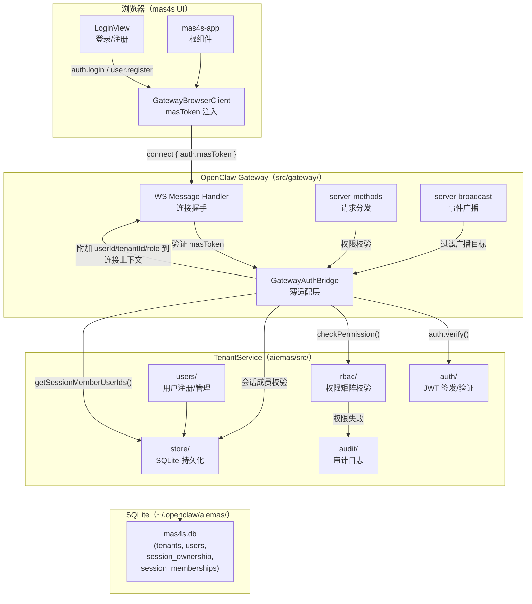
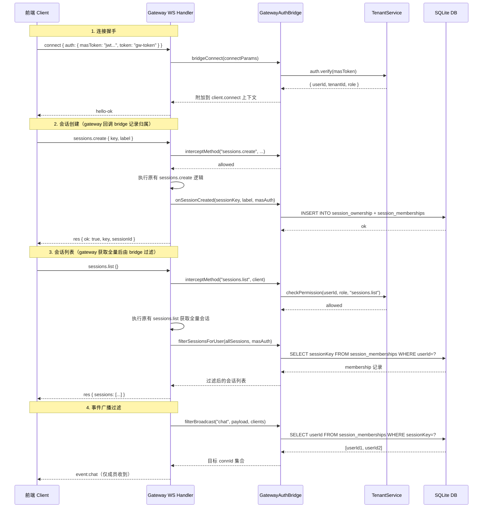
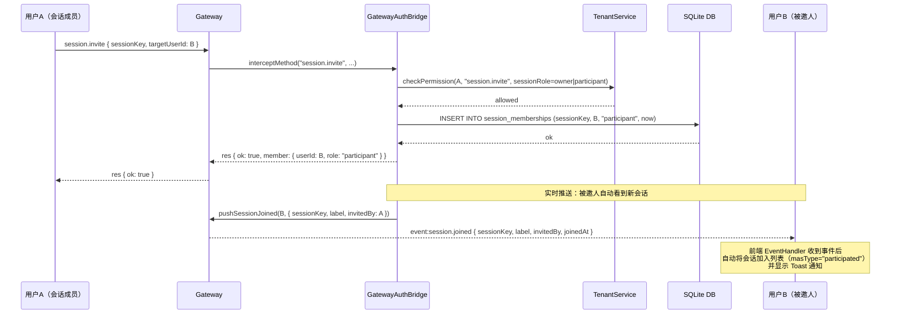
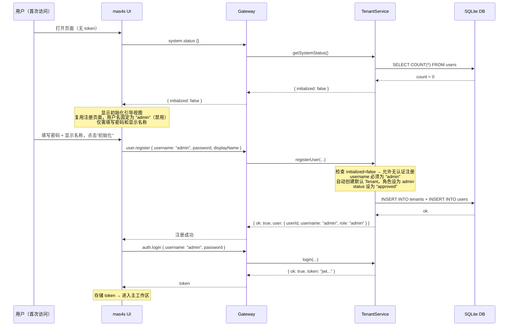
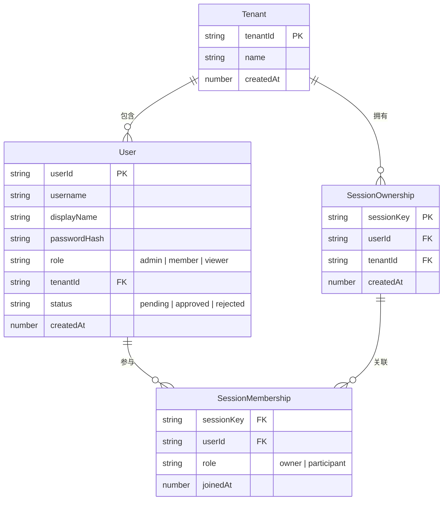

# 设计文档：mas4s 多租户与角色权限控制

## 概述

在 `aiemas/src/` 中实现多租户核心服务（TenantService），通过薄桥接层（GatewayAuthBridge）与现有 gateway 集成。设计目标：

1. **最小侵入**：原 gateway（`src/gateway/`）仅增加桥接调用点，核心逻辑全部在 `aiemas/src/` 中
2. **向后兼容**：不携带 `masToken` 的连接保持原有行为，零破坏性变更
3. **SQLite 持久化**：使用 `node:sqlite`（项目已有依赖，`src/memory/` 模块同款），单文件数据库 `~/.openclaw/aiemas/mas4s.db`，WAL 模式 + 事务保证原子性和并发安全
4. **JWT 认证**：HMAC-SHA256 签名，24 小时有效期，支持续期

本设计与 `mas4s-multi-agent-platform` spec 互补：该 spec 定义前端 UI 和多人会话交互，本 spec 聚焦后端身份认证、会话归属隔离和 RBAC。

---

## 架构

### 系统架构图



### 请求处理流程



### 邀请加入流程（邀请即自动加入）



### 系统初始化流程（首次部署）



### 模块划分

| 模块     | 路径                         | 职责                                                                                                                                                                                                     |
| -------- | ---------------------------- | -------------------------------------------------------------------------------------------------------------------------------------------------------------------------------------------------------- |
| 认证模块 | `aiemas/src/auth/`           | JWT 签发、验证、续期；密码哈希                                                                                                                                                                           |
| 用户模块 | `aiemas/src/users/`          | 用户注册、查询、更新、审批；系统初始化状态检查                                                                                                                                                           |
| 权限模块 | `aiemas/src/rbac/`           | 全局角色 + 会话级角色权限矩阵                                                                                                                                                                            |
| 存储模块 | `aiemas/src/store/`          | SQLite 数据库初始化、schema 管理、事务封装                                                                                                                                                               |
| 审计模块 | `aiemas/src/audit/`          | 权限失败审计日志                                                                                                                                                                                         |
| 桥接层   | `aiemas/src/gateway-bridge/` | GatewayAuthBridge：连接认证、会话归属与成员管理（SessionOwnership/SessionMembership CRUD + SQLite 持久化）、方法拦截（sessions.create/list/resolve、chat.send 等）、事件广播过滤、邀请推送、成员移除推送 |
| 入口     | `aiemas/src/index.ts`        | TenantService 单例初始化、导出                                                                                                                                                                           |

---

## 组件与接口

### TenantService 核心接口

```typescript
// aiemas/src/index.ts
export interface TenantServiceConfig {
  /** JWT 签名密钥，未配置时自动生成随机密钥并输出警告 */
  jwtSecret?: string;
  /** SQLite 数据库文件路径，默认 ~/.openclaw/aiemas/mas4s.db */
  dbPath?: string;
  /** bcrypt cost factor，默认 10 */
  bcryptRounds?: number;
  /** JWT 有效期（秒），默认 86400（24h） */
  tokenExpirySeconds?: number;
}

export interface TenantService {
  // ── 认证 ──
  login(params: LoginParams): Promise<LoginResult>;
  verify(token: string): VerifyResult;
  refresh(token: string): RefreshResult;

  // ── 用户管理 ──
  registerUser(params: RegisterParams): Promise<RegisterResult>;
  listUsers(tenantId: string, callerRole: GlobalRole): ListUsersResult; // admin: 全量含 status；member/viewer: 仅 approved 用户
  updateUser(params: UpdateUserParams, callerRole: GlobalRole): UpdateUserResult;
  approveUser(targetUserId: string, callerRole: GlobalRole): ApproveResult;
  rejectUser(targetUserId: string, callerRole: GlobalRole): RejectResult;

  // ── 会话归属 ──（已移至 GatewayAuthBridge，由 bridge 直接管理 SQLite）

  // ── 会话成员 ──（已移至 GatewayAuthBridge）

  // ── 权限 ──
  checkPermission(
    userId: string,
    role: GlobalRole,
    method: string,
    sessionContext?: SessionPermissionContext,
  ): PermissionResult;

  // ── 广播过滤 ──（已移至 GatewayAuthBridge）

  // ── 速率限制 ──
  checkLoginRateLimit(clientIp: string): RateLimitResult;

  // ── 系统状态 ──
  /** 检查系统是否已初始化（存在至少一个用户），无需认证 */
  getSystemStatus(): { initialized: boolean };

  // ── 生命周期 ──
  init(): Promise<void>;
}
```

### 认证模块接口

```typescript
// aiemas/src/auth/types.ts
export interface LoginParams {
  username: string;
  password: string;
  tenantId?: string;
  clientIp?: string;
}

export type LoginResult =
  | { ok: true; token: string; user: PublicUser }
  | {
      ok: false;
      error: "AUTH_FAILED" | "RATE_LIMITED" | "ACCOUNT_PENDING_APPROVAL" | "ACCOUNT_REJECTED";
      retryAfterMs?: number;
    };

export type VerifyResult =
  | { ok: true; userId: string; tenantId: string; role: GlobalRole }
  | { ok: false; error: "TOKEN_EXPIRED" | "TOKEN_INVALID" };

export type RefreshResult =
  | { ok: true; token: string }
  | { ok: false; error: "TOKEN_EXPIRED" | "TOKEN_INVALID" };

export interface JwtPayload {
  userId: string;
  tenantId: string;
  role: GlobalRole;
  iat: number;
  exp: number;
}
```

### GatewayAuthBridge 接口

```typescript
// aiemas/src/gateway-bridge/bridge.ts
import type { TenantService } from "../index.js";

/** 附加到 GatewayWsClient.connect 上的多租户上下文 */
export interface MasAuthContext {
  userId: string | null;
  tenantId: string | null;
  masRole: GlobalRole | null;
}

export interface GatewayAuthBridge {
  /**
   * 在 WS connect 握手时调用。
   * 从 connectParams.auth.masToken 提取并验证用户身份。
   * 返回 MasAuthContext 附加到连接上下文。
   */
  authenticateConnect(connectAuth: {
    masToken?: string;
    token?: string;
    password?: string;
  }): MasAuthContext;

  /**
   * 方法拦截器：在 gateway 分发请求前调用。
   * 检查全局角色权限 + 会话级权限。
   * system.status 和初始化注册（initialized=false 时的 user.register）跳过认证。
   * 返回 null 表示放行，返回 ErrorShape 表示拒绝。
   */
  interceptMethod(
    method: string,
    params: Record<string, unknown>,
    masAuth: MasAuthContext,
  ): { allowed: true } | { allowed: false; code: string; message: string };

  /**
   * 响应拦截器：对 sessions.list 等方法的响应进行过滤。
   */
  filterResponse(method: string, response: unknown, masAuth: MasAuthContext): unknown;

  // ── 会话生命周期钩子（原 gateway 在关键操作后回调） ──

  /**
   * sessions.create 后回调：记录会话归属和创建者 membership。
   * 原 gateway 完成会话创建后调用此钩子。
   */
  onSessionCreated(sessionKey: string, label: string, masAuth: MasAuthContext): void;

  /**
   * sessions.list 结果过滤：仅返回当前用户有 membership 的会话。
   * 原 gateway 获取全量会话列表后调用此钩子过滤。
   * 兼容模式（userId=null）返回原始列表不过滤。
   */
  filterSessionsForUser(sessions: unknown[], masAuth: MasAuthContext): unknown[];

  /**
   * 会话访问校验：sessions.resolve、chat.send 等操作前调用。
   * 检查当前用户是否有目标会话的 membership。
   * 兼容模式（userId=null）直接放行。
   */
  checkSessionAccess(
    sessionKey: string,
    masAuth: MasAuthContext,
  ): { allowed: true } | { allowed: false; code: string; message: string };

  // ── 会话成员管理 ──

  /**
   * 邀请用户加入会话（邀请即自动加入）。
   * 会话成员（owner 和 participant）均可调用，立即创建 membership。
   */
  inviteToSession(params: {
    sessionKey: string;
    targetUserId: string;
    callerUserId: string;
  }): { ok: true; member: SessionMember } | { ok: false; code: string; message: string };

  /**
   * 移除会话成员，仅 owner 可调用。
   * 删除目标用户的 SessionMembership 记录，并推送 event:session.removed。
   * owner 不可移除自己（返回 OWNER_CANNOT_LEAVE）。
   * 目标不是成员时返回 NOT_A_MEMBER。
   */
  removeMember(params: {
    sessionKey: string;
    targetUserId: string;
    callerUserId: string;
  }): { ok: true } | { ok: false; code: string; message: string };

  /**
   * 查询会话成员列表，仅会话成员可调用。
   */
  listSessionMembers(sessionKey: string, callerUserId: string): SessionMember[];

  /**
   * 退出会话，participant 可退出，owner 不可。
   */
  leaveSession(
    sessionKey: string,
    callerUserId: string,
  ): { ok: true } | { ok: false; code: string; message: string };

  /**
   * 获取会话成员 userId 集合（用于广播过滤）。
   */
  getSessionMemberUserIds(sessionKey: string): string[];

  /**
   * 获取会话 owner userId 集合（用于 approval 事件广播过滤）。
   */
  getSessionOwnerUserIds(sessionKey: string): string[];

  // ── 广播与推送 ──

  /**
   * 广播过滤器：返回应接收事件的 userId 集合。
   * 返回 null 表示不过滤（兼容模式）。
   */
  filterBroadcastTargets(
    event: string,
    payload: unknown,
    connectedUsers: Map<string, MasAuthContext>,
  ): Set<string> | null;

  /**
   * 邀请加入后推送通知：向被邀人的所有已连接 WS 客户端推送 event:session.joined。
   * 被邀人无需确认，邀请即自动加入。
   * 若被邀人不在线，下次 sessions.list 时自然包含该会话。
   */
  pushSessionJoined(
    targetUserId: string,
    payload: { sessionKey: string; label: string; invitedBy: string; joinedAt: number },
    connectedUsers: Map<string, MasAuthContext>,
  ): void;

  /**
   * 成员移除后推送通知：向被移除用户的所有已连接 WS 客户端推送 event:session.removed。
   * 前端收到后从会话列表中移除该会话。
   */
  pushSessionRemoved(
    targetUserId: string,
    payload: { sessionKey: string; removedBy: string },
    connectedUsers: Map<string, MasAuthContext>,
  ): void;
}
```

### 权限模块接口

```typescript
// aiemas/src/rbac/types.ts
export type GlobalRole = "admin" | "member" | "viewer";
export type SessionRole = "owner" | "participant";

export interface SessionPermissionContext {
  sessionKey: string;
  sessionRole?: SessionRole;
}

export type PermissionResult =
  | { allowed: true }
  | { allowed: false; code: "PERMISSION_DENIED"; reason: string };

/**
 * 全局角色权限矩阵。
 * key = 方法名，value = 允许调用的最低角色集合。
 */
export const GLOBAL_ROLE_PERMISSIONS: Record<string, Set<GlobalRole>> = {
  "system.status": new Set([]), // 无需认证，任何人可调用
  "user.register": new Set(["admin"]), // 已初始化后自注册无需认证（status=pending）；admin 创建则 status=approved
  "user.approve": new Set(["admin"]),
  "user.reject": new Set(["admin"]),
  "user.list": new Set(["admin", "member", "viewer"]), // 所有已认证用户可查询（admin 看全量含 status，其他仅看 approved 用户）
  "user.update": new Set(["admin"]),
  "sessions.create": new Set(["admin", "member"]),
  "chat.send": new Set(["admin", "member"]),
  "sessions.list": new Set(["admin", "member", "viewer"]),
  "sessions.resolve": new Set(["admin", "member", "viewer"]),
  "session.invite": new Set(["admin", "member"]),
  "session.removeMember": new Set(["admin", "member"]),
  "session.members": new Set(["admin", "member", "viewer"]),
  "session.leave": new Set(["admin", "member", "viewer"]),
  "exec.approval.resolve": new Set(["admin", "member"]),
};

/**
 * 会话级角色权限矩阵。
 * 仅在全局角色允许后进一步检查。
 */
export const SESSION_ROLE_PERMISSIONS: Record<string, Set<SessionRole>> = {
  "session.invite": new Set(["owner", "participant"]), // 所有会话成员均可邀请
  "session.removeMember": new Set(["owner"]), // 仅 owner 可移除成员
  "exec.approval.resolve": new Set(["owner"]),
};
```

### 存储模块接口

```typescript
// aiemas/src/store/database.ts
import type { DatabaseSync } from "node:sqlite";

/**
 * 初始化 SQLite 数据库，创建表结构。
 * 复用项目现有的 requireNodeSqlite() 加载方式（src/memory/sqlite.ts）。
 */
export function initDatabase(dbPath: string): DatabaseSync {
  const { DatabaseSync } = requireNodeSqlite();
  const db = new DatabaseSync(dbPath);

  // WAL 模式：提升并发读写性能
  db.exec("PRAGMA journal_mode=WAL");
  // busy_timeout：并发写入时自动重试而非立即失败
  db.exec("PRAGMA busy_timeout=5000");
  // 外键约束
  db.exec("PRAGMA foreign_keys=ON");

  ensureMas4sSchema(db);
  return db;
}

export function ensureMas4sSchema(db: DatabaseSync): void {
  db.exec(`
    CREATE TABLE IF NOT EXISTS tenants (
      tenantId TEXT PRIMARY KEY,
      name TEXT NOT NULL,
      createdAt INTEGER NOT NULL
    );
  `);
  db.exec(`
    CREATE TABLE IF NOT EXISTS users (
      userId TEXT PRIMARY KEY,
      username TEXT NOT NULL,
      displayName TEXT NOT NULL,
      passwordHash TEXT NOT NULL,
      role TEXT NOT NULL CHECK(role IN ('admin', 'member', 'viewer')),
      tenantId TEXT NOT NULL REFERENCES tenants(tenantId),
      status TEXT NOT NULL DEFAULT 'pending' CHECK(status IN ('pending', 'approved', 'rejected')),
      createdAt INTEGER NOT NULL
    );
  `);
  db.exec(`
    CREATE UNIQUE INDEX IF NOT EXISTS idx_users_tenant_username
    ON users(tenantId, username);
  `);
  db.exec(`
    CREATE TABLE IF NOT EXISTS session_ownership (
      sessionKey TEXT PRIMARY KEY,
      userId TEXT NOT NULL REFERENCES users(userId),
      tenantId TEXT NOT NULL REFERENCES tenants(tenantId),
      createdAt INTEGER NOT NULL
    );
  `);
  db.exec(`
    CREATE TABLE IF NOT EXISTS session_memberships (
      sessionKey TEXT NOT NULL,
      userId TEXT NOT NULL REFERENCES users(userId),
      role TEXT NOT NULL CHECK(role IN ('owner', 'participant')),
      joinedAt INTEGER NOT NULL,
      PRIMARY KEY (sessionKey, userId)
    );
  `);
  db.exec(`
    CREATE INDEX IF NOT EXISTS idx_memberships_user
    ON session_memberships(userId);
  `);
}
```

---

## 数据模型

### 实体关系图



### TypeScript 数据类型

```typescript
// aiemas/src/models.ts

export interface Tenant {
  tenantId: string;
  name: string;
  createdAt: number;
}

export interface User {
  userId: string;
  username: string;
  displayName: string;
  passwordHash: string;
  role: GlobalRole;
  tenantId: string;
  status: UserStatus;
  createdAt: number;
}

export type UserStatus = "pending" | "approved" | "rejected";

/** 不含 passwordHash 的公开用户信息 */
export type PublicUser = Omit<User, "passwordHash">;

export interface SessionOwnership {
  sessionKey: string;
  userId: string;
  tenantId: string;
  createdAt: number;
}

export interface SessionMembership {
  sessionKey: string;
  userId: string;
  role: SessionRole;
  joinedAt: number;
}

export interface SessionMember {
  userId: string;
  displayName: string;
  role: SessionRole;
  joinedAt: number;
}
```

### 数据库存储结构

```
~/.openclaw/aiemas/
├── mas4s.db                            # SQLite 数据库（WAL 模式）
├── mas4s.db-wal                        # WAL 日志（自动生成）
├── mas4s.db-shm                        # 共享内存（自动生成）
└── audit.log                           # 审计日志（追加写入）
```

数据库表结构：

```sql
-- 租户表
CREATE TABLE tenants (
  tenantId TEXT PRIMARY KEY,
  name TEXT NOT NULL,
  createdAt INTEGER NOT NULL
);

-- 用户表（tenantId + username 唯一）
CREATE TABLE users (
  userId TEXT PRIMARY KEY,
  username TEXT NOT NULL,
  displayName TEXT NOT NULL,
  passwordHash TEXT NOT NULL,
  role TEXT NOT NULL CHECK(role IN ('admin', 'member', 'viewer')),
  tenantId TEXT NOT NULL REFERENCES tenants(tenantId),
  status TEXT NOT NULL DEFAULT 'pending' CHECK(status IN ('pending', 'approved', 'rejected')),
  createdAt INTEGER NOT NULL
);
CREATE UNIQUE INDEX idx_users_tenant_username ON users(tenantId, username);

-- 会话归属表
CREATE TABLE session_ownership (
  sessionKey TEXT PRIMARY KEY,
  userId TEXT NOT NULL REFERENCES users(userId),
  tenantId TEXT NOT NULL REFERENCES tenants(tenantId),
  createdAt INTEGER NOT NULL
);

-- 会话成员表（复合主键）
CREATE TABLE session_memberships (
  sessionKey TEXT NOT NULL,
  userId TEXT NOT NULL REFERENCES users(userId),
  role TEXT NOT NULL CHECK(role IN ('owner', 'participant')),
  joinedAt INTEGER NOT NULL,
  PRIMARY KEY (sessionKey, userId)
);
CREATE INDEX idx_memberships_user ON session_memberships(userId);
```

### JWT Token 结构

```json
{
  "userId": "u-abc123",
  "tenantId": "t-xyz789",
  "role": "member",
  "iat": 1719000000,
  "exp": 1719086400
}
```

签名算法：HMAC-SHA256，密钥来源优先级：

1. `MAS4S_JWT_SECRET` 环境变量
2. 配置文件中的 `mas4s.jwtSecret`
3. 启动时随机生成（输出警告日志）

### ConnectParams 扩展

现有 `ConnectParamsSchema.auth` 对象使用 `additionalProperties: false`，不能直接添加 `masToken` 字段。设计方案：

**方案：通过 `auth.token` 字段复用传递 masToken**

前端在 `connect` 时同时传递 gateway token 和 masToken，使用约定前缀区分：

```typescript
// 前端 connect 参数构造
const connectAuth = {
  token: gatewayToken, // 原有 gateway 认证
  password: undefined,
  // masToken 通过独立的 WS query param 或 connect params 扩展传递
};
```

**实际方案**：由于 `ConnectParamsSchema` 是 `additionalProperties: false`，我们采用以下策略：

1. 前端在 WS URL 的 query string 中传递 masToken：`ws://host:port/ws?masToken=jwt...`
2. GatewayAuthBridge 从 `upgradeReq.url` 中提取 masToken
3. 这样完全不修改 ConnectParamsSchema

```typescript
// 前端
const url = `${baseWsUrl}?masToken=${encodeURIComponent(token)}`;
new WebSocket(url);

// GatewayAuthBridge（在 WS upgrade 时）
function extractMasToken(upgradeReq: IncomingMessage): string | undefined {
  const url = new URL(upgradeReq.url ?? "/", "http://localhost");
  return url.searchParams.get("masToken") ?? undefined;
}
```

### 连接上下文扩展

在 `GatewayWsClient` 上附加多租户上下文（不修改原类型定义，使用 WeakMap）：

```typescript
// aiemas/src/gateway-bridge/context.ts
const masAuthMap = new WeakMap<object, MasAuthContext>();

export function setMasAuth(client: object, auth: MasAuthContext): void {
  masAuthMap.set(client, auth);
}

export function getMasAuth(client: object): MasAuthContext | null {
  return masAuthMap.get(client) ?? null;
}
```

---

## 正确性属性

_属性是在系统所有有效执行中应保持为真的特征或行为——本质上是关于系统应做什么的形式化陈述。属性是人类可读规范与机器可验证正确性保证之间的桥梁。_

### Property 1: 用户名租户内唯一性

_对于任意_ 租户 T 和用户名 U，在 T 下注册两个相同用户名 U 的用户，第二次注册应返回 `USERNAME_TAKEN` 错误，且 T 下仅存在一条 username=U 的 User 记录。

**Validates: Requirements 1.2**

### Property 2: 密码安全不变量

_对于任意_ 注册请求中的密码 P（长度 ≥ 8），注册成功后持久化存储中不应包含 P 的明文，仅包含以 `$2b$` 开头的 bcrypt 哈希值；_对于任意_ 密码 P（长度 < 8），注册应被拒绝。

**Validates: Requirements 1.3, 11.4**

### Property 3: AuthToken round-trip

_对于任意_ 有效的注册参数（username, password, displayName），执行 `register → login → verify` 链路后，`verify` 返回的 `userId`、`tenantId`、`role` 应与注册时创建的用户一致，且 token 的 JWT header 中 `alg` 为 `HS256`。

**Validates: Requirements 2.1, 2.3, 2.5, 2.7**

### Property 4: 过期令牌拒绝

_对于任意_ 已过期的 AuthToken（`exp < now`），`auth.verify` 应返回 `TOKEN_EXPIRED` 错误，不应返回有效的身份信息。

**Validates: Requirements 2.6**

### Property 5: 认证错误不泄露信息

_对于任意_ 登录失败场景（用户名不存在或密码错误），`auth.login` 应返回相同的错误码 `AUTH_FAILED`，不应通过错误码、错误消息或响应时间差异区分失败原因。`ACCOUNT_PENDING_APPROVAL` 和 `ACCOUNT_REJECTED` 仅在凭据验证通过后根据 status 返回。

**Validates: Requirements 2.2, 2.8, 2.9**

### Property 6: 会话隔离完备性

_对于任意_ 两个不同的已认证用户 A 和 B，若 B 没有会话 S 的 SessionMembership 记录，则：

- B 调用 `sessions.list` 的结果不应包含 S
- B 调用 `sessions.resolve(S)` 应返回 `SESSION_ACCESS_DENIED`
- B 调用 `chat.send` 到 S 应返回 `SESSION_ACCESS_DENIED`

**Validates: Requirements 4.2, 4.3, 4.4**

### Property 7: 会话创建记录完整性

_对于任意_ 已认证用户 U 创建的会话 S，创建后应同时存在 SessionOwnership 记录（sessionKey=S, userId=U）和 SessionMembership 记录（sessionKey=S, userId=U, role="owner"）。

**Validates: Requirements 4.1**

### Property 8: 会话邀请权限与成员增长

_对于任意_ 会话 S 和用户 U，当 U 是 S 的成员（owner 或 participant）时 `session.invite` 应成功；成功后被邀人立即成为会话成员（无需确认），`session.members` 返回的列表长度应增加 1 且包含被邀请用户；若被邀人在线，应收到 `event:session.joined` 推送。非成员调用应返回 `SESSION_ACCESS_DENIED`。已是成员时应返回 `ALREADY_MEMBER`。

**Validates: Requirements 5.1, 5.2, 5.3, 5.4, 5.6, 5.9**

### Property 9: owner 不可自行退出

_对于任意_ 会话 S 的 owner 用户 U，调用 `session.leave` 应返回 `OWNER_CANNOT_LEAVE` 错误，SessionMembership 记录不应被删除。

**Validates: Requirements 5.7**

### Property 10: 全局与会话级权限矩阵一致性

_对于任意_ 全局角色 R 和操作 M 的组合，权限校验结果应与以下矩阵一致：

- admin: user.list ✓, user.update ✓, sessions.create ✓, chat.send ✓
- member: user.list ✓, user.update ✗, sessions.create ✓, chat.send ✓
- viewer: user.list ✓, user.update ✗, sessions.create ✗, chat.send ✗

_对于任意_ 会话级角色 SR 和操作 M 的组合：

- owner: session.invite ✓, session.removeMember ✓, exec.approval.resolve ✓
- participant: session.invite ✓, session.removeMember ✗, exec.approval.resolve ✗

**Validates: Requirements 6.1, 6.2, 6.3, 6.4, 6.5, 6.6**

### Property 11: 事件广播隔离

_对于任意_ 会话事件（chat/agent）和已连接用户集合，事件仅应发送给拥有该 sessionKey 的 SessionMembership 的用户连接；`exec.approval.requested` 事件仅应发送给该会话的 owner 用户。

**Validates: Requirements 7.1, 7.2, 7.3**

### Property 12: 兼容模式透明性

_对于任意_ 不携带 `masToken` 的连接（userId=null），系统行为应与多租户功能引入前完全一致：会话全部可见、事件全部广播、无权限校验。

**Validates: Requirements 3.4, 4.6, 7.4**

### Property 13: 登录速率限制

_对于任意_ IP 地址，在 1 分钟窗口内连续 10 次登录失败后，第 11 次尝试应返回 `RATE_LIMITED` 错误和 `retryAfterMs` 值。

**Validates: Requirements 11.1**

### Property 14: 权限失败审计日志

_对于任意_ 权限校验失败事件，审计日志中应包含一条记录，包含 userId、操作名、目标资源、时间戳和结果字段。

**Validates: Requirements 11.3**

### Property 15: 数据持久化 round-trip

_对于任意_ 通过 TenantService 创建的用户、租户、会话归属和会话成员数据，关闭并重新打开 SQLite 数据库后读取应得到等价的数据。

**Validates: Requirements 10.1, 10.2, 10.3, 10.4**

### Property 16: 并发写入安全

_对于任意_ 两个并发的写入操作（如同时注册两个用户），SQLite WAL 模式和 busy_timeout 应确保数据不丢失、不损坏，最终状态包含两次写入的结果。

**Validates: Requirements 10.6**

### Property 17: 消息发送者名替换

_对于任意_ 已登录用户 U（displayName=D），发送消息时构造的消息体前缀应为 `"D: "` 而非硬编码的 `"我: "`。

**Validates: Requirements 9.5**

### Property 18: 会话类型标记

_对于任意_ 用户创建的会话，AppStore 中应标记 `masType="initiated"`；_对于任意_ 通过邀请加入的会话，应标记 `masType="participated"`。

**Validates: Requirements 9.2, 9.3**

### Property 19: 成员移除完整性

_对于任意_ 会话 S 的 owner 用户 A 和 participant 用户 B，A 调用 `session.removeMember(B)` 后，B 不再是会话成员，`session.members` 不包含 B，B 调用 `sessions.list` 不包含 S。若 B 在线，应收到 `event:session.removed` 推送。owner 移除自己应返回 `OWNER_CANNOT_LEAVE`，目标不是成员应返回 `NOT_A_MEMBER`。

**Validates: Requirements 5.10, 5.11, 5.12, 5.13**

---

## 错误处理

### 错误码体系

| 错误码                     | HTTP 等价 | 触发场景                         | 处理方式                 |
| -------------------------- | --------- | -------------------------------- | ------------------------ |
| `AUTH_FAILED`              | 401       | 用户名/密码不匹配                | 返回统一错误，不区分原因 |
| `ACCOUNT_PENDING_APPROVAL` | 403       | 用户 status="pending"，尚未审批  | 前端提示等待审批         |
| `ACCOUNT_REJECTED`         | 403       | 用户 status="rejected"，审批被拒 | 前端提示联系管理员       |
| `TOKEN_EXPIRED`            | 401       | JWT 已过期                       | 前端清除 token，跳转登录 |
| `TOKEN_INVALID`            | 401       | JWT 签名无效或格式错误           | 同上                     |
| `MAS_AUTH_FAILED`          | 401       | WS connect 时 masToken 验证失败  | 前端显示登录界面         |
| `USERNAME_TAKEN`           | 409       | 注册时用户名已存在               | 前端提示换用户名         |
| `SESSION_ACCESS_DENIED`    | 403       | 用户无会话访问权限               | 前端移除该会话           |
| `PERMISSION_DENIED`        | 403       | 角色权限不足                     | 前端提示权限不足         |
| `OWNER_CANNOT_LEAVE`       | 400       | owner 尝试退出会话               | 前端提示需先转让         |
| `RATE_LIMITED`             | 429       | 登录失败次数超限                 | 前端显示等待时间         |
| `WEAK_PASSWORD`            | 400       | 密码长度 < 8                     | 前端提示密码要求         |
| `ADMIN_USERNAME_REQUIRED`  | 400       | 初始化时 username 不是 "admin"   | 前端已锁定，仅后端防御   |
| `ALREADY_MEMBER`           | 409       | 邀请时目标用户已是会话成员       | 前端提示已是成员         |
| `NOT_A_MEMBER`             | 404       | 移除成员时目标用户不是会话成员   | 前端提示不是成员         |
| `JWT_SECRET_TOO_SHORT`     | 500       | JWT 密钥 < 32 字节               | 启动时拒绝，日志输出     |

### 错误处理策略

```typescript
// aiemas/src/errors.ts
export class TenantServiceError extends Error {
  constructor(
    readonly code: string,
    message: string,
    readonly details?: Record<string, unknown>,
  ) {
    super(message);
    this.name = "TenantServiceError";
  }
}

// GatewayAuthBridge 中的错误转换
function toGatewayError(err: TenantServiceError): { code: string; message: string } {
  return { code: err.code, message: err.message };
}
```

### 前端错误处理流程

```mermaid
flowchart TD
    A[收到错误响应] --> B{错误码?}
    B -->|TOKEN_EXPIRED / TOKEN_INVALID| C[清除 localStorage token]
    C --> D[重置 AppStore.currentUser]
    D --> E[断开 WebSocket]
    E --> F[显示 LoginView]
    B -->|MAS_AUTH_FAILED| F
    B -->|SESSION_ACCESS_DENIED| G[从会话列表移除该会话]
    B -->|PERMISSION_DENIED| H[显示 Toast 提示权限不足]
    B -->|ACCOUNT_PENDING_APPROVAL| K[显示"账号等待审批"提示]
    B -->|ACCOUNT_REJECTED| L[显示"注册已被拒绝，请联系管理员"]
    B -->|RATE_LIMITED| I[显示倒计时等待]
    B -->|其他| J[显示通用错误提示]
```

---

## 测试策略

### 双轨测试方法

本功能采用单元测试 + 属性测试（Property-Based Testing）双轨并行：

- **单元测试**：验证具体示例、边界条件、错误路径
- **属性测试**：验证跨所有输入的通用属性，使用 `fast-check` 库

### 属性测试配置

- 库：`fast-check`（TypeScript 生态最成熟的 PBT 库）
- 每个属性测试最少运行 100 次迭代
- 每个属性测试必须通过注释引用设计文档中的属性编号
- 标签格式：`Feature: mas4s-multi-tenant-rbac, Property {number}: {property_text}`

### 测试文件结构

```
aiemas/src/
├── auth/
│   ├── jwt.ts
│   ├── jwt.test.ts              # 单元测试：JWT 签发/验证
│   └── jwt.property.test.ts     # 属性测试：Property 3, 4, 5
├── users/
│   ├── user-service.ts
│   ├── user-service.test.ts     # 单元测试：注册/查询
│   └── user-service.property.test.ts  # 属性测试：Property 1, 2
├── rbac/
│   ├── permission-checker.ts
│   ├── permission-checker.test.ts  # 单元测试：边界角色
│   └── permission-checker.property.test.ts  # 属性测试：Property 10
├── store/
│   ├── database.ts
│   ├── database.test.ts         # 单元测试：schema 创建/WAL 模式
│   └── database.property.test.ts  # 属性测试：Property 15, 16
├── gateway-bridge/
│   ├── bridge.ts                # GatewayAuthBridge 核心逻辑
│   ├── session-manager.ts       # 会话归属与成员管理（SQLite CRUD）
│   ├── context.ts               # WeakMap 连接上下文
│   ├── bridge.test.ts           # 单元测试：连接认证/方法拦截/会话管理
│   └── bridge.property.test.ts  # 属性测试：Property 6, 7, 8, 9, 11, 12, 19
├── audit/
│   ├── audit-logger.ts
│   └── audit-logger.test.ts     # 单元测试 + 属性测试：Property 14
└── index.ts
```

### 单元测试重点

| 模块                      | 测试重点                                                                                                                 |
| ------------------------- | ------------------------------------------------------------------------------------------------------------------------ |
| `auth/jwt`                | token 签发格式、过期检测、无效签名拒绝、密钥长度校验                                                                     |
| `users/user-service`      | 注册成功/失败、用户名冲突、密码哈希验证、弱密码拒绝                                                                      |
| `rbac/permission-checker` | 每个角色-操作组合的边界测试                                                                                              |
| `store/database`          | schema 创建、WAL 模式验证、并发写入、数据库重新打开后数据完整性                                                          |
| `gateway-bridge/bridge`   | masToken 提取、兼容模式、广播过滤、会话创建记录完整性、邀请权限（owner+participant）、成员移除、退出逻辑、owner 不可退出 |

### 属性测试生成器

```typescript
// 测试辅助：随机用户生成器
import * as fc from "fast-check";

export const arbUsername = fc.stringOf(
  fc.constantFrom(..."abcdefghijklmnopqrstuvwxyz0123456789_"),
  { minLength: 3, maxLength: 20 },
);

export const arbPassword = fc.string({ minLength: 8, maxLength: 64 });

export const arbWeakPassword = fc.string({ minLength: 0, maxLength: 7 });

export const arbDisplayName = fc.string({ minLength: 1, maxLength: 50 });

export const arbGlobalRole = fc.constantFrom(
  "admin",
  "member",
  "viewer",
) as fc.Arbitrary<GlobalRole>;

export const arbSessionRole = fc.constantFrom("owner", "participant") as fc.Arbitrary<SessionRole>;

export const arbSessionKey = fc
  .string({ minLength: 5, maxLength: 100 })
  .map((s) => `agent:default:group:mas-${s.replace(/[^a-z0-9]/g, "x")}`);

export const arbMethod = fc.constantFrom(
  "user.list",
  "user.update",
  "sessions.create",
  "chat.send",
  "sessions.list",
  "sessions.resolve",
  "session.invite",
  "session.removeMember",
  "session.members",
  "session.leave",
  "exec.approval.resolve",
);
```

### 属性测试示例

```typescript
// aiemas/src/rbac/permission-checker.property.test.ts
import { describe, it } from "vitest";
import * as fc from "fast-check";
import { checkPermission } from "./permission-checker.js";
import { GLOBAL_ROLE_PERMISSIONS } from "./types.js";
import { arbGlobalRole, arbMethod } from "../test-helpers/generators.js";

describe("Property 10: 全局与会话级权限矩阵一致性", () => {
  // Feature: mas4s-multi-tenant-rbac, Property 10: 权限矩阵一致性
  it("对于任意角色和操作组合，权限校验结果应与矩阵一致", () => {
    fc.assert(
      fc.property(arbGlobalRole, arbMethod, (role, method) => {
        const result = checkPermission("test-user", role, method);
        const expectedAllowed = GLOBAL_ROLE_PERMISSIONS[method]?.has(role) ?? false;
        return result.allowed === expectedAllowed;
      }),
      { numRuns: 100 },
    );
  });
});
```

### 集成测试

集成测试验证 GatewayAuthBridge 与 TenantService 的端到端流程：

1. **连接认证流程**：模拟 WS connect → masToken 验证 → 上下文附加
2. **会话隔离流程**：用户 A 创建会话 → 用户 B 无法访问 → 邀请 B → B 可访问
3. **广播过滤流程**：发送 chat 事件 → 仅成员收到
4. **兼容模式流程**：无 masToken 连接 → 所有功能正常

### 前端测试

前端测试使用 Vitest + `@open-wc/testing`：

1. **LoginView**：渲染测试、登录流程测试、错误显示测试
2. **AppStore**：currentUser 状态管理测试
3. **GatewayClient**：masToken 注入测试
4. **SessionSidebar**：masType 分组显示测试
5. **MessageFormatter**：displayName 替换测试
