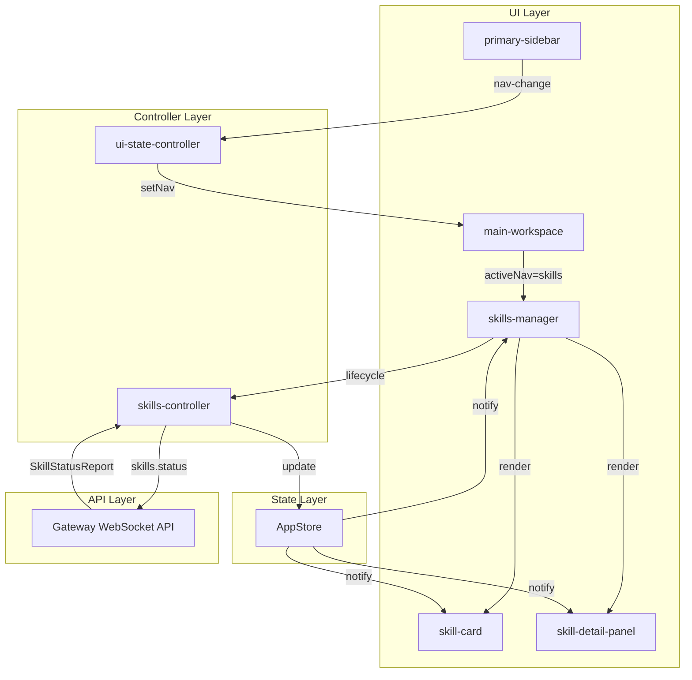
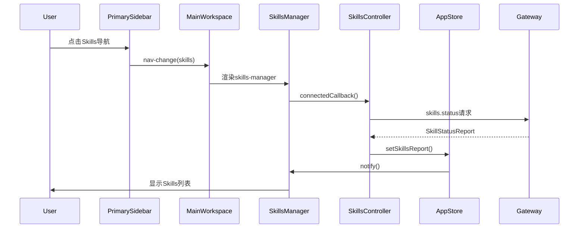

# 设计文档：mas4s Skills管理功能

## 概述

本设计文档定义了mas4s前端Skills管理功能的技术实现方案。该功能为用户提供Skills的浏览、分类、详情查看和状态管理能力，采用Lit Web Components架构，通过WebSocket Gateway API与后端通信。

### 设计目标

- 提供直观的Skills浏览和管理界面
- 支持按类别（工作空间/内置）和状态（就绪/需配置/已禁用）过滤
- 实现响应式布局，适配不同屏幕尺寸
- 集成Gateway API，实时获取Skills状态
- 遵循现有设计系统和组件模式

### 技术栈

- **框架**: Lit (Web Components)
- **状态管理**: AppStore (响应式单例模式)
- **通信**: WebSocket Gateway API
- **样式**: CSS-in-JS (Lit的css标签)
- **架构**: 三栏布局 (primary-sidebar + session-sidebar + main-workspace)

## 架构设计

### 系统架构图



### 组件层次结构

```
app-shell
├── primary-sidebar (已存在)
│   └── Skills导航项
├── session-sidebar (已存在)
└── main-workspace (已存在)
    └── skills-manager (新增)
        ├── 页签切换 (所有/工作空间/内置)
        ├── 搜索过滤
        ├── skill-card[] (新增)
        │   ├── 名称 + 图标
        │   ├── 描述
        │   └── 状态指示器
        └── skill-detail-panel (新增)
            ├── 完整描述
            ├── 配置要求
            ├── 安装状态
            └── 文件路径
```

### 数据流图



## 组件设计

### 1. skills-manager (主容器组件)

**职责**:

- 作为Skills管理功能的主容器
- 管理页签切换和搜索过滤状态
- 协调skill-card和skill-detail-panel的渲染
- 处理用户交互事件

**属性**:

```typescript
@property({ type: String }) activeTab: 'all' | 'workspace' | 'builtin' = 'all';
@property({ type: String }) searchFilter = '';
@property({ type: String }) selectedSkillKey: string | null = null;
```

**事件**:

- `skill-select`: 用户选择Skill卡片
- `skill-detail-close`: 关闭详情面板
- `refresh-skills`: 刷新Skills数据

**样式特性**:

- 响应式网格布局 (grid-template-columns)
- 页签切换动画
- 搜索框实时过滤

### 2. skill-card (卡片组件)

**职责**:

- 展示单个Skill的摘要信息
- 显示状态指示器（Ready/Needs Setup/Disabled）
- 响应点击事件打开详情面板

**属性**:

```typescript
@property({ attribute: false }) skill: SkillStatusEntry;
@property({ type: Boolean }) selected = false;
```

**样式特性**:

- 卡片悬停效果
- 状态颜色编码（绿色/黄色/灰色）
- 图标 + 文本布局

### 3. skill-detail-panel (详情面板组件)

**职责**:

- 显示Skill的完整信息
- 展示配置要求和安装状态
- 提供启用/禁用切换功能
- 提供关闭交互

**属性**:

```typescript
@property({ attribute: false }) skill: SkillStatusEntry | null;
@property({ type: Boolean }) open = false;
@property({ type: Boolean }) updating = false;
```

**事件**:

- `close`: 关闭详情面板
- `toggle-enabled`: 切换Skill启用状态

**样式特性**:

- 右侧滑出动画
- 响应式布局（小屏全屏模态）
- 点击外部区域关闭
- 切换按钮加载状态

### 4. skills-controller (业务逻辑控制器)

**职责**:

- 管理Skills数据的获取和刷新
- 处理Gateway API调用
- 更新AppStore状态
- 实现Skills分类逻辑
- 处理Skill启用/禁用操作

**方法**:

```typescript
async fetchSkills(): Promise<void>
async toggleSkillEnabled(skillKey: string, enabled: boolean): Promise<void>
classifySkill(skill: SkillStatusEntry): 'workspace' | 'builtin'
filterSkills(skills: SkillStatusEntry[], tab: string, search: string): SkillStatusEntry[]
```

## 数据模型设计

### SkillStatusEntry (来自Gateway)

```typescript
export interface SkillStatusEntry {
  name: string;
  description: string;
  source: string; // 用于分类
  skillKey: string;
  filePath: string;
  emoji?: string;
  homepage?: string;
  disabled: boolean; // 配置中是否禁用
  eligible: boolean; // 是否满足运行条件
  bundled?: boolean;
  primaryEnv?: string;
  requires?: {
    bins?: string[];
    anyBins?: string[];
    env?: string[];
    config?: string[];
  };
  missing: {
    bins: string[];
    env: string[];
    config: string[];
  };
  install: Array<{
    id: string;
    label: string;
    kind: string;
  }>;
}
```

### SkillStatusReport (Gateway响应)

```typescript
export interface SkillStatusReport {
  workspaceDir: string;
  managedSkillsDir: string;
  skills: SkillStatusEntry[];
}
```

### AppStore扩展

在现有AppStore中添加Skills相关状态:

```typescript
// 在AppStore类中添加
skillsReport: SkillStatusReport | null = null;
skillsLoading: boolean = false;
skillsError: string | null = null;

setSkillsReport(report: SkillStatusReport): void {
  this.skillsReport = report;
  this.skillsError = null;
  this.notify();
}

setSkillsLoading(loading: boolean): void {
  this.skillsLoading = loading;
  this.notify();
}

setSkillsError(error: string): void {
  this.skillsError = error;
  this.skillsLoading = false;
  this.notify();
}
```

### Skills分类逻辑

```typescript
function classifySkill(skill: SkillStatusEntry): "workspace" | "builtin" {
  const workspaceSources = ["openclaw-workspace", "agents-skills-project"];
  return workspaceSources.includes(skill.source) ? "workspace" : "builtin";
}

function groupSkillsByCategory(skills: SkillStatusEntry[]): {
  workspace: SkillStatusEntry[];
  builtin: SkillStatusEntry[];
} {
  return skills.reduce(
    (acc, skill) => {
      const category = classifySkill(skill);
      acc[category].push(skill);
      return acc;
    },
    { workspace: [], builtin: [] },
  );
}
```

## Gateway API集成

### skills.status方法

**请求**:

```json
{
  "type": "req",
  "id": "skills_1",
  "method": "skills.status",
  "params": {}
}
```

**响应**:

```json
{
  "type": "res",
  "id": "skills_1",
  "result": {
    "workspaceDir": "/path/to/workspace",
    "managedSkillsDir": "/path/to/skills",
    "skills": [
      {
        "name": "example-skill",
        "description": "An example skill",
        "source": "openclaw-workspace",
        "skillKey": "example-skill",
        "filePath": "/path/to/skill.md",
        "disabled": false,
        "eligible": true,
        "missing": { "bins": [], "env": [], "config": [] },
        "install": []
      }
    ]
  }
}
```

### skills.update方法（启用/禁用Skill）

**请求**:

```json
{
  "type": "req",
  "id": "skills_2",
  "method": "skills.update",
  "params": {
    "skillKey": "example-skill",
    "enabled": false
  }
}
```

**响应**:

```json
{
  "type": "res",
  "id": "skills_2",
  "result": {
    "ok": true,
    "skillKey": "example-skill",
    "config": {
      "enabled": false
    }
  }
}
```

### 错误处理策略

```typescript
async function fetchSkills(gateway: GatewayClient, store: AppStore): Promise<void> {
  store.setSkillsLoading(true);

  try {
    const response = await gateway.request("skills.status", {}, { timeout: 10000 });
    store.setSkillsReport(response as SkillStatusReport);
  } catch (error) {
    if (error.code === "TIMEOUT") {
      store.setSkillsError("请求超时，请稍后重试");
    } else if (error.code === "DISCONNECTED") {
      store.setSkillsError("连接已断开，请检查网络");
    } else {
      store.setSkillsError(error.message || "获取Skills数据失败");
    }
  } finally {
    store.setSkillsLoading(false);
  }
}

async function toggleSkillEnabled(
  gateway: GatewayClient,
  store: AppStore,
  skillKey: string,
  enabled: boolean,
): Promise<void> {
  try {
    const response = await gateway.request(
      "skills.update",
      {
        skillKey,
        enabled,
      },
      { timeout: 5000 },
    );

    if (response.ok) {
      // 更新本地状态
      const report = store.skillsReport;
      if (report) {
        const updatedSkills = report.skills.map((skill) =>
          skill.skillKey === skillKey ? { ...skill, disabled: !enabled } : skill,
        );
        store.setSkillsReport({ ...report, skills: updatedSkills });
      }
    } else {
      throw new Error("更新Skill状态失败");
    }
  } catch (error) {
    if (error.code === "TIMEOUT") {
      throw new Error("请求超时，请稍后重试");
    } else if (error.code === "DISCONNECTED") {
      throw new Error("连接已断开，请检查网络");
    } else {
      throw new Error(error.message || "更新Skill状态失败");
    }
  }
}
```

## UI/UX设计

### 页签切换逻辑

```typescript
const tabs = [
  { id: "all", label: "所有" },
  { id: "workspace", label: "工作空间" },
  { id: "builtin", label: "内置" },
];

function filterByTab(skills: SkillStatusEntry[], activeTab: string): SkillStatusEntry[] {
  if (activeTab === "all") return skills;
  if (activeTab === "workspace") {
    return skills.filter((s) => ["openclaw-workspace", "agents-skills-project"].includes(s.source));
  }
  if (activeTab === "builtin") {
    return skills.filter(
      (s) => !["openclaw-workspace", "agents-skills-project"].includes(s.source),
    );
  }
  return skills;
}
```

### 搜索过滤实现

```typescript
function filterBySearch(skills: SkillStatusEntry[], searchText: string): SkillStatusEntry[] {
  if (!searchText.trim()) return skills;

  const query = searchText.toLowerCase();
  return skills.filter(
    (skill) =>
      skill.name.toLowerCase().includes(query) || skill.description.toLowerCase().includes(query),
  );
}
```

### 卡片网格布局

```css
.skills-grid {
  display: grid;
  gap: 16px;
  grid-template-columns: repeat(3, 1fr);
}

@media (max-width: 1200px) {
  .skills-grid {
    grid-template-columns: repeat(2, 1fr);
  }
}

@media (max-width: 768px) {
  .skills-grid {
    grid-template-columns: 1fr;
  }
}
```

### 详情面板交互

```typescript
// 打开详情面板
function openDetailPanel(skillKey: string) {
  this.selectedSkillKey = skillKey;
  // 触发滑入动画
}

// 关闭详情面板
function closeDetailPanel() {
  this.selectedSkillKey = null;
  // 触发滑出动画
}

// 点击外部区域关闭
function handleBackdropClick(event: MouseEvent) {
  if (event.target === event.currentTarget) {
    this.closeDetailPanel();
  }
}
```

### 加载/错误/空状态

**加载状态**:

```html
<div class="loading-state">
  <div class="spinner"></div>
  <p>正在加载Skills...</p>
</div>
```

**错误状态**:

```html
<div class="error-state">
  <p class="error-message">${errorMessage}</p>
  <button @click="${retry}">重试</button>
</div>
```

**空状态**:

```html
<div class="empty-state">
  <div class="empty-icon">📦</div>
  <p>暂无可用的Skills</p>
</div>
```

## 样式设计

### 设计系统变量

```css
:host {
  /* 颜色 */
  --primary-color: #3b82f6;
  --success-color: #10b981;
  --warning-color: #f59e0b;
  --error-color: #ef4444;
  --muted-color: #94a3b8;

  /* 间距 */
  --spacing-xs: 4px;
  --spacing-sm: 8px;
  --spacing-md: 16px;
  --spacing-lg: 24px;
  --spacing-xl: 32px;

  /* 圆角 */
  --radius-sm: 8px;
  --radius-md: 12px;
  --radius-lg: 16px;

  /* 阴影 */
  --shadow-sm: 0 1px 3px rgba(0, 0, 0, 0.1);
  --shadow-md: 0 4px 6px rgba(0, 0, 0, 0.1);
  --shadow-lg: 0 10px 15px rgba(0, 0, 0, 0.1);
}
```

### 组件样式规范

**skill-card样式**:

```css
.skill-card {
  background: white;
  border: 1px solid #e8edf5;
  border-radius: var(--radius-md);
  padding: var(--spacing-md);
  cursor: pointer;
  transition: all 0.2s ease;
}

.skill-card:hover {
  border-color: var(--primary-color);
  box-shadow: var(--shadow-md);
  transform: translateY(-2px);
}

.skill-card.selected {
  border-color: var(--primary-color);
  background: #eff6ff;
}

.skill-status-indicator {
  width: 8px;
  height: 8px;
  border-radius: 50%;
}

.skill-status-indicator.ready {
  background: var(--success-color);
}

.skill-status-indicator.needs-setup {
  background: var(--warning-color);
}

.skill-status-indicator.disabled {
  background: var(--muted-color);
}
```

**skill-detail-panel样式**:

```css
.detail-panel {
  position: fixed;
  top: 0;
  right: 0;
  width: 400px;
  height: 100vh;
  background: white;
  box-shadow: var(--shadow-lg);
  transform: translateX(100%);
  transition: transform 0.3s ease;
  z-index: 1000;
}

.detail-panel.open {
  transform: translateX(0);
}

.detail-backdrop {
  position: fixed;
  top: 0;
  left: 0;
  width: 100%;
  height: 100%;
  background: rgba(0, 0, 0, 0.3);
  opacity: 0;
  pointer-events: none;
  transition: opacity 0.3s ease;
  z-index: 999;
}

.detail-backdrop.visible {
  opacity: 1;
  pointer-events: auto;
}

.toggle-button {
  display: flex;
  align-items: center;
  gap: 8px;
  padding: 8px 16px;
  border: 1px solid #e8edf5;
  border-radius: var(--radius-sm);
  background: white;
  cursor: pointer;
  transition: all 0.2s ease;
}

.toggle-button:hover {
  background: #f8fafc;
  border-color: var(--primary-color);
}

.toggle-button.updating {
  opacity: 0.6;
  cursor: not-allowed;
}

.toggle-switch {
  width: 40px;
  height: 20px;
  border-radius: 10px;
  background: #cbd5e1;
  position: relative;
  transition: background 0.2s ease;
}

.toggle-switch.enabled {
  background: var(--success-color);
}

.toggle-switch::after {
  content: "";
  position: absolute;
  width: 16px;
  height: 16px;
  border-radius: 50%;
  background: white;
  top: 2px;
  left: 2px;
  transition: transform 0.2s ease;
}

.toggle-switch.enabled::after {
  transform: translateX(20px);
}

@media (max-width: 768px) {
  .detail-panel {
    width: 100%;
  }
}
```

### 响应式断点

```css
/* 桌面 (>1200px): 3列网格 */
@media (min-width: 1201px) {
  .skills-grid {
    grid-template-columns: repeat(3, 1fr);
  }
}

/* 平板 (768px-1200px): 2列网格 */
@media (min-width: 768px) and (max-width: 1200px) {
  .skills-grid {
    grid-template-columns: repeat(2, 1fr);
  }
}

/* 移动 (<768px): 1列网格 */
@media (max-width: 767px) {
  .skills-grid {
    grid-template-columns: 1fr;
  }

  .detail-panel {
    width: 100%;
  }
}
```

### 动画过渡效果

```css
/* 页签切换动画 */
.tab-content {
  animation: fadeIn 0.3s ease;
}

@keyframes fadeIn {
  from {
    opacity: 0;
    transform: translateY(10px);
  }
  to {
    opacity: 1;
    transform: translateY(0);
  }
}

/* 详情面板滑入动画 */
.detail-panel {
  transition: transform 0.3s cubic-bezier(0.4, 0, 0.2, 1);
}

/* 卡片悬停动画 */
.skill-card {
  transition: all 0.2s cubic-bezier(0.4, 0, 0.2, 1);
}
```

## 正确性属性

_属性是一个特征或行为,应该在系统的所有有效执行中保持为真——本质上是关于系统应该做什么的形式化陈述。属性作为人类可读规范和机器可验证正确性保证之间的桥梁。_

### 属性反思

在分析需求后,我识别出以下可能的冗余:

- 属性2.3、2.4、2.5都是关于Skill卡片显示内容的,可以合并为一个综合属性
- 属性6.4、6.5、6.6都是关于AppStore状态更新方法的,可以合并为一个通用属性
- 属性7.1-7.6都是关于特定source值的分类,可以合并为一个基于source列表的属性

经过反思,我将保留独立的属性以确保每个验收标准都有明确的测试覆盖,但会在实现时考虑合并测试用例。

### 属性 1: 导航项点击触发正确事件

*对于任何*导航项,当用户点击该导航项时,Primary_Sidebar应该触发nav-change事件,携带正确的nav值。

**验证需求: 1.3**

### 属性 2: 激活导航项应用激活态样式

*对于任何*导航项,当该导航项的id与activeNav匹配时,该导航项应该应用激活态样式类。

**验证需求: 1.4**

### 属性 3: Main_Workspace根据activeNav显示对应组件

*对于任何*activeNav值,Main_Workspace应该渲染与该值对应的视图组件。

**验证需求: 2.1**

### 属性 4: Skills列表以卡片网格形式展示

*对于任何*Skills列表,Skills_Manager应该将每个Skill渲染为一个skill-card组件,并以网格布局排列。

**验证需求: 2.2**

### 属性 5: Skill卡片包含必需信息

*对于任何*Skill,其对应的skill-card应该显示Skill的名称、描述和状态指示器。

**验证需求: 2.3, 2.4, 2.5**

### 属性 6: 搜索过滤正确筛选Skills

*对于任何*搜索文本和Skills列表,过滤后的结果应该只包含名称或描述中包含该搜索文本的Skills(不区分大小写)。

**验证需求: 2.7**

### 属性 7: 工作空间页签过滤正确的Skills

*对于任何*Skills列表,当选择"工作空间"页签时,显示的Skills应该只包含source为"openclaw-workspace"或"agents-skills-project"的Skills。

**验证需求: 3.5**

### 属性 8: 内置页签过滤正确的Skills

*对于任何*Skills列表,当选择"内置"页签时,显示的Skills应该只包含source不为"openclaw-workspace"和"agents-skills-project"的Skills。

**验证需求: 3.6**

### 属性 9: 点击Skill卡片打开详情面板

*对于任何*Skill卡片,当用户点击该卡片时,应该显示该Skill的详情面板。

**验证需求: 4.1**

### 属性 10: 详情面板显示完整Skill信息

*对于任何*Skill,其详情面板应该包含完整描述、配置要求(如果存在)、安装状态和文件路径(如果存在)。

**验证需求: 4.2, 4.3, 4.4, 4.5**

### 属性 11: 关闭操作隐藏详情面板

*对于任何*打开的详情面板,当用户点击关闭按钮或点击面板外部区域时,详情面板应该被隐藏。

**验证需求: 4.7**

### 属性 12: API成功响应更新AppStore

*对于任何*成功的skills.status API响应,Skills_Controller应该将返回的SkillStatusReport存储到AppStore中。

**验证需求: 5.3**

### 属性 13: API错误显示错误信息

*对于任何*skills.status API错误,Skills_Manager应该显示相应的错误提示信息。

**验证需求: 5.4**

### 属性 14: 请求期间显示加载状态

*对于任何*进行中的skills.status请求,Skills_Manager应该显示加载状态指示器。

**验证需求: 5.5**

### 属性 15: AppStore状态更新触发通知

*对于任何*AppStore中Skills相关属性的更新(skillsReport、skillsLoading、skillsError),AppStore应该调用notify()方法通知所有订阅的组件。

**验证需求: 6.4, 6.5, 6.6, 6.7**

### 属性 16: 成功请求清除错误状态

*对于任何*成功的skills.status请求,Skills_Controller应该清除AppStore中的skillsError状态。

**验证需求: 9.6**

### 属性 17: 切换Skill启用状态调用正确API

*对于任何*Skill和目标启用状态,当用户切换Skill启用状态时,Skills_Controller应该调用skills.update API,携带正确的skillKey和enabled参数。

**验证需求: 11.3**

### 属性 18: 启用状态更新后刷新显示

*对于任何*成功的skills.update响应,AppStore中对应Skill的disabled字段应该更新为与enabled参数相反的值。

**验证需求: 11.4, 11.5**

### 属性 19: 禁用Skill显示禁用指示器

*对于任何*disabled为true的Skill,其Skill_Card应该显示禁用状态指示器(灰色)。

**验证需求: 11.7**

### 属性 20: 启用Skill显示正确指示器

*对于任何*disabled为false的Skill,其Skill_Card应该根据eligible和missing字段显示正确的状态指示器(绿色表示Ready,黄色表示Needs Setup)。

**验证需求: 11.8**

## 错误处理

### 错误类型和处理策略

| 错误类型    | 错误码       | 用户提示                 | 处理策略     |
| ----------- | ------------ | ------------------------ | ------------ |
| 请求超时    | TIMEOUT      | "请求超时，请稍后重试"   | 显示重试按钮 |
| 连接断开    | DISCONNECTED | "连接已断开，请检查网络" | 显示重试按钮 |
| Gateway错误 | ERROR        | Gateway返回的错误消息    | 显示重试按钮 |
| 未知错误    | UNKNOWN      | "获取Skills数据失败"     | 显示重试按钮 |

### 错误恢复流程

```typescript
class SkillsController {
  private retryCount = 0;
  private maxRetries = 3;

  async fetchSkillsWithRetry(): Promise<void> {
    try {
      await this.fetchSkills();
      this.retryCount = 0; // 成功后重置重试计数
    } catch (error) {
      if (this.retryCount < this.maxRetries) {
        this.retryCount++;
        // 指数退避重试
        const delay = Math.pow(2, this.retryCount) * 1000;
        setTimeout(() => this.fetchSkillsWithRetry(), delay);
      } else {
        // 达到最大重试次数，显示错误
        this.store.setSkillsError(error.message);
      }
    }
  }
}
```

### 错误边界

```typescript
class SkillsManager extends LitElement {
  private errorBoundary(fn: () => void): void {
    try {
      fn();
    } catch (error) {
      console.error("Skills Manager Error:", error);
      this.store.setSkillsError("组件渲染错误，请刷新页面");
    }
  }

  render() {
    return this.errorBoundary(() => {
      // 渲染逻辑
    });
  }
}
```

## 测试策略

### 双重测试方法

本功能采用单元测试和属性测试相结合的方法:

**单元测试**:

- 验证特定示例和边缘情况
- 测试组件集成点
- 测试错误条件

**属性测试**:

- 验证跨所有输入的通用属性
- 通过随机化实现全面的输入覆盖

### 单元测试范围

**组件测试**:

```typescript
describe("skills-manager", () => {
  it("should render Skills navigation item", () => {
    // 验证需求 1.1
  });

  it("should display layers icon for Skills", () => {
    // 验证需求 1.2
  });

  it("should show 3 tabs: All, Workspace, Builtin", () => {
    // 验证需求 3.1
  });

  it("should default to All tab", () => {
    // 验证需求 3.7
  });

  it("should show empty state when no skills", () => {
    // 验证需求 10.1, 10.2, 10.3
  });

  it("should show empty search state", () => {
    // 验证需求 10.4, 10.5
  });
});

describe("skill-detail-panel", () => {
  it("should display current enabled status", () => {
    // 验证需求 11.1
  });

  it("should show toggle button", () => {
    // 验证需求 11.2
  });

  it("should emit toggle-enabled event on button click", () => {
    // 验证需求 11.2
  });

  it("should show loading state during update", () => {
    // 验证需求 11.3
  });
});

describe("skill-card", () => {
  it("should show disabled indicator when disabled", () => {
    // 验证需求 11.7
  });

  it("should show ready indicator when enabled and eligible", () => {
    // 验证需求 11.8
  });

  it("should show needs-setup indicator when enabled but not eligible", () => {
    // 验证需求 11.8
  });
});
```

**控制器测试**:

```typescript
describe("skills-controller", () => {
  it("should call skills.status on mount", () => {
    // 验证需求 5.1, 5.2
  });

  it("should refresh on navigation back to Skills", () => {
    // 验证需求 5.6
  });

  it("should classify openclaw-workspace as workspace", () => {
    // 验证需求 7.1
  });

  it("should classify agents-skills-project as workspace", () => {
    // 验证需求 7.2
  });

  it("should classify openclaw-bundled as builtin", () => {
    // 验证需求 7.3
  });

  it("should handle timeout error", () => {
    // 验证需求 9.1
  });

  it("should handle disconnection error", () => {
    // 验证需求 9.3
  });

  it("should call skills.update with correct params", () => {
    // 验证需求 11.3
  });

  it("should update AppStore on successful toggle", () => {
    // 验证需求 11.4
  });

  it("should show error on failed toggle", () => {
    // 验证需求 11.6
  });
});
```

**AppStore测试**:

```typescript
describe("AppStore Skills state", () => {
  it("should have skillsReport property", () => {
    // 验证需求 6.1
  });

  it("should have skillsLoading property", () => {
    // 验证需求 6.2
  });

  it("should have skillsError property", () => {
    // 验证需求 6.3
  });
});
```

**响应式布局测试**:

```typescript
describe("responsive layout", () => {
  it("should use grid layout", () => {
    // 验证需求 8.1
  });

  it("should show 3 columns on desktop", () => {
    // 验证需求 8.2
  });

  it("should show 2 columns on tablet", () => {
    // 验证需求 8.3
  });

  it("should show 1 column on mobile", () => {
    // 验证需求 8.4
  });

  it("should adjust grid when detail panel opens", () => {
    // 验证需求 8.5
  });

  it("should show fullscreen modal on mobile", () => {
    // 验证需求 8.6
  });
});
```

### 属性测试配置

使用fast-check库进行属性测试,每个测试运行最少100次迭代:

```typescript
import fc from "fast-check";

describe("Skills Manager Properties", () => {
  it("Property 1: Navigation click triggers correct event", () => {
    /**
     * Feature: mas4s-skills-management, Property 1:
     * 对于任何导航项,当用户点击该导航项时,
     * Primary_Sidebar应该触发nav-change事件,携带正确的nav值
     */
    fc.assert(
      fc.property(
        fc.constantFrom("workspace", "usage", "agents", "skills", "cron", "users", "settings"),
        (navId) => {
          // 测试逻辑
        },
      ),
      { numRuns: 100 },
    );
  });

  it("Property 5: Skill card contains required info", () => {
    /**
     * Feature: mas4s-skills-management, Property 5:
     * 对于任何Skill,其对应的skill-card应该显示
     * Skill的名称、描述和状态指示器
     */
    fc.assert(
      fc.property(skillArbitrary(), (skill) => {
        const card = renderSkillCard(skill);
        return (
          card.includes(skill.name) && card.includes(skill.description) && hasStatusIndicator(card)
        );
      }),
      { numRuns: 100 },
    );
  });

  it("Property 6: Search filter correctly filters skills", () => {
    /**
     * Feature: mas4s-skills-management, Property 6:
     * 对于任何搜索文本和Skills列表,过滤后的结果应该
     * 只包含名称或描述中包含该搜索文本的Skills
     */
    fc.assert(
      fc.property(fc.array(skillArbitrary()), fc.string(), (skills, searchText) => {
        const filtered = filterBySearch(skills, searchText);
        return filtered.every(
          (skill) =>
            skill.name.toLowerCase().includes(searchText.toLowerCase()) ||
            skill.description.toLowerCase().includes(searchText.toLowerCase()),
        );
      }),
      { numRuns: 100 },
    );
  });

  it("Property 7: Workspace tab filters correct skills", () => {
    /**
     * Feature: mas4s-skills-management, Property 7:
     * 对于任何Skills列表,当选择"工作空间"页签时,
     * 显示的Skills应该只包含source为特定值的Skills
     */
    fc.assert(
      fc.property(fc.array(skillArbitrary()), (skills) => {
        const filtered = filterByTab(skills, "workspace");
        return filtered.every((skill) =>
          ["openclaw-workspace", "agents-skills-project"].includes(skill.source),
        );
      }),
      { numRuns: 100 },
    );
  });

  it("Property 15: AppStore updates trigger notifications", () => {
    /**
     * Feature: mas4s-skills-management, Property 15:
     * 对于任何AppStore中Skills相关属性的更新,
     * AppStore应该调用notify()方法通知所有订阅的组件
     */
    fc.assert(
      fc.property(
        fc.record({
          skillsReport: fc.option(skillsReportArbitrary()),
          skillsLoading: fc.boolean(),
          skillsError: fc.option(fc.string()),
        }),
        (state) => {
          const store = new AppStore();
          const notifySpy = vi.spyOn(store, "notify");

          if (state.skillsReport) store.setSkillsReport(state.skillsReport);
          if (state.skillsLoading !== undefined) store.setSkillsLoading(state.skillsLoading);
          if (state.skillsError) store.setSkillsError(state.skillsError);

          return notifySpy.mock.calls.length > 0;
        },
      ),
      { numRuns: 100 },
    );
  });
});

// 测试数据生成器
function skillArbitrary() {
  return fc.record({
    name: fc.string({ minLength: 1 }),
    description: fc.string(),
    source: fc.constantFrom(
      "openclaw-workspace",
      "agents-skills-project",
      "openclaw-bundled",
      "openclaw-managed",
      "agents-skills-personal",
      "openclaw-extra",
    ),
    skillKey: fc.string({ minLength: 1 }),
    filePath: fc.string(),
    disabled: fc.boolean(),
    eligible: fc.boolean(),
    missing: fc.record({
      bins: fc.array(fc.string()),
      env: fc.array(fc.string()),
      config: fc.array(fc.string()),
    }),
    install: fc.array(
      fc.record({
        id: fc.string(),
        label: fc.string(),
        kind: fc.string(),
      }),
    ),
  });
}

function skillsReportArbitrary() {
  return fc.record({
    workspaceDir: fc.string(),
    managedSkillsDir: fc.string(),
    skills: fc.array(skillArbitrary()),
  });
}
```

### 测试覆盖目标

- 单元测试: 覆盖所有组件、控制器和工具函数
- 属性测试: 覆盖所有正确性属性
- 集成测试: 覆盖完整的用户交互流程
- E2E测试: 覆盖与Gateway的实际通信

### 测试执行

```bash
# 运行所有测试
pnpm test -- aiemas/ui/mas4s

# 运行属性测试
pnpm test -- aiemas/ui/mas4s --grep "Property"

# 运行覆盖率测试
pnpm test:coverage -- aiemas/ui/mas4s
```

## 实现计划

### 阶段1: 基础架构 (1-2天)

1. 扩展AppStore添加Skills状态管理
2. 创建skills-controller.ts
3. 实现Gateway API集成
4. 编写控制器单元测试

### 阶段2: UI组件 (2-3天)

1. 创建skills-manager.ts主容器
2. 创建skill-card.ts卡片组件
3. 创建skill-detail-panel.ts详情面板
4. 实现响应式布局
5. 编写组件单元测试

### 阶段3: 交互逻辑 (1-2天)

1. 实现页签切换
2. 实现搜索过滤
3. 实现详情面板交互
4. 实现错误处理和重试
5. 编写交互测试

### 阶段4: 样式和动画 (1天)

1. 应用设计系统样式
2. 实现过渡动画
3. 优化响应式布局
4. 测试不同屏幕尺寸

### 阶段5: 集成和测试 (1-2天)

1. 集成到main-workspace
2. 更新primary-sidebar导航
3. 编写属性测试
4. 执行E2E测试
5. 性能优化

### 总计: 6-10天

## 性能考虑

### 渲染优化

```typescript
// 使用虚拟滚动处理大量Skills
import { VirtualScroller } from "@lit-labs/virtualizer";

class SkillsManager extends LitElement {
  render() {
    return html`
      <lit-virtualizer
        .items=${this.filteredSkills}
        .renderItem=${(skill) => html`<skill-card .skill=${skill}></skill-card>`}
      ></lit-virtualizer>
    `;
  }
}
```

### 搜索防抖

```typescript
private searchDebounce: number | null = null;

handleSearchInput(value: string) {
  if (this.searchDebounce) {
    clearTimeout(this.searchDebounce);
  }

  this.searchDebounce = window.setTimeout(() => {
    this.searchFilter = value;
    this.requestUpdate();
  }, 300);
}
```

### 懒加载详情面板

```typescript
// 只在打开时加载详情面板组件
async openDetailPanel(skillKey: string) {
  if (!this.detailPanelLoaded) {
    await import('./skill-detail-panel.js');
    this.detailPanelLoaded = true;
  }
  this.selectedSkillKey = skillKey;
}
```

## 可访问性

### ARIA标签

```html
<div role="tablist" aria-label="Skills分类">
  <button role="tab" aria-selected="true" aria-controls="all-panel">所有</button>
  <button role="tab" aria-selected="false" aria-controls="workspace-panel">工作空间</button>
  <button role="tab" aria-selected="false" aria-controls="builtin-panel">内置</button>
</div>

<div role="tabpanel" id="all-panel" aria-labelledby="all-tab">
  <!-- Skills列表 -->
</div>
```

### 键盘导航

```typescript
handleKeyDown(event: KeyboardEvent) {
  switch (event.key) {
    case 'Escape':
      this.closeDetailPanel();
      break;
    case 'ArrowLeft':
      this.navigateToPreviousTab();
      break;
    case 'ArrowRight':
      this.navigateToNextTab();
      break;
  }
}
```

### 焦点管理

```typescript
openDetailPanel(skillKey: string) {
  this.selectedSkillKey = skillKey;
  // 将焦点移到详情面板
  this.updateComplete.then(() => {
    const panel = this.shadowRoot?.querySelector('.detail-panel');
    (panel as HTMLElement)?.focus();
  });
}
```

## 安全考虑

### XSS防护

```typescript
// 使用Lit的自动转义
render() {
  return html`
    <div class="skill-description">
      ${this.skill.description} <!-- 自动转义 -->
    </div>
  `;
}

// 对于需要渲染HTML的情况,使用sanitize
import { unsafeHTML } from 'lit/directives/unsafe-html.js';
import DOMPurify from 'dompurify';

render() {
  const sanitized = DOMPurify.sanitize(this.skill.htmlContent);
  return html`
    <div>${unsafeHTML(sanitized)}</div>
  `;
}
```

### API调用安全

```typescript
// 验证Gateway响应
function validateSkillsReport(data: unknown): SkillStatusReport {
  if (!data || typeof data !== "object") {
    throw new Error("Invalid skills report");
  }

  const report = data as SkillStatusReport;

  if (!Array.isArray(report.skills)) {
    throw new Error("Skills must be an array");
  }

  return report;
}
```

## 未来扩展

### 可能的功能增强

1. **Skills安装**: 直接从UI安装和更新Skills
2. **Skills配置**: 在UI中配置Skill参数
3. **Skills市场**: 浏览和安装社区Skills
4. **使用统计**: 显示Skills的使用频率和性能
5. **依赖管理**: 可视化Skills之间的依赖关系
6. **批量操作**: 批量启用/禁用Skills
7. **导入/导出**: 导入和导出Skills配置

### 架构扩展点

```typescript
// 插件系统接口
interface SkillsPlugin {
  name: string;
  onSkillLoad?(skill: SkillStatusEntry): void;
  onSkillEnable?(skill: SkillStatusEntry): void;
  onSkillDisable?(skill: SkillStatusEntry): void;
}

// 自定义过滤器
interface SkillsFilter {
  id: string;
  label: string;
  predicate: (skill: SkillStatusEntry) => boolean;
}

// 自定义排序
interface SkillsSorter {
  id: string;
  label: string;
  compare: (a: SkillStatusEntry, b: SkillStatusEntry) => number;
}
```

## 参考资料

### 相关文档

- [OpenClaw WebSocket API](../../aiemas/docs/openclaw/websocket_api.md)
- [Lit Web Components](https://lit.dev/)
- [AppStore响应式模式](../../../aiemas/ui/mas4s/src/store/app-store.ts)
- [现有Skills UI实现](../../../ui/src/ui/views/skills.ts)

### 设计参考

- 现有OpenClaw UI的Skills管理界面
- Material Design卡片组件
- Tailwind CSS响应式网格

### 技术栈文档

- [Lit Documentation](https://lit.dev/docs/)
- [TypeScript Handbook](https://www.typescriptlang.org/docs/)
- [fast-check Property Testing](https://github.com/dubzzz/fast-check)
- [Vitest Testing Framework](https://vitest.dev/)
