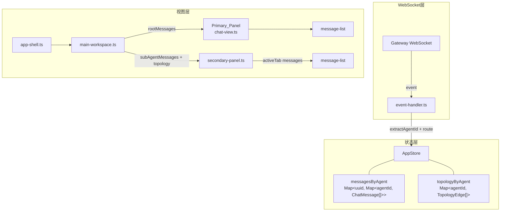
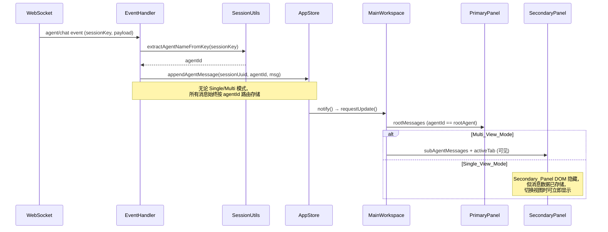
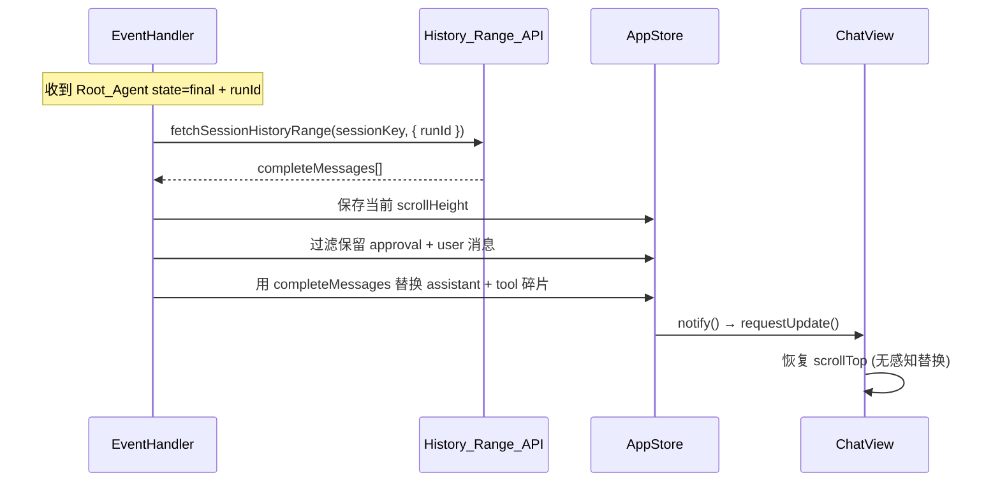

# 技术设计文档：Multi-Agent Chat View

## 概述

本设计将 AIEMAS 前端的 `chat-view` 从单窗口视图改造为多窗口视图，解决多 Agent 协作场景下消息交叉割裂的问题。核心思路是：

1. **消息路由层**：在 `event-handler.ts` 中根据 `sessionKey` 提取 `agentId`，将消息路由到按 Agent 维度隔离的消息集合
2. **拓扑驱动布局**：根据 `fetchTopology` 返回的拓扑关系自动选择 Single_View_Mode 或 Multi_View_Mode
3. **分屏渲染**：Primary_Panel 渲染 Root_Agent 消息，Secondary_Panel 渲染 Sub_Agent 消息（带 Tab 切换）
4. **碎片修复**：run 结束时通过 History_Range_API 替换 streaming 碎片
5. **超时优化**：将 `aiemas_sessions_send` 的默认超时从 30s 提升到 120s

### 设计决策

| 决策                 | 选择                                                                                          | 理由                                                                               |
| -------------------- | --------------------------------------------------------------------------------------------- | ---------------------------------------------------------------------------------- |
| 消息存储维度         | `messagesByAgent: Map<string, Map<string, ChatMessage[]>>` (sessionUuid → agentId → messages) | 保持与现有 `messagesBySession` 兼容，按 Agent 隔离消息避免交叉                     |
| 消息路由策略         | 无论视图模式，所有消息始终按 agentId 路由存储                                                 | Single_View_Mode 下隐藏 Secondary_Panel DOM 而非丢弃消息，确保视图切换时消息不丢失 |
| 视图模式判定         | 拓扑 edges 数组长度 > 0 → Multi_View_Mode                                                     | 简单可靠，无需额外配置                                                             |
| Secondary_Panel 实现 | 新建 `secondary-panel.ts` Web Component                                                       | 保持 Lit 组件架构一致性，职责单一                                                  |
| 碎片修复时机         | Root_Agent 的 `state=final` 事件                                                              | Sub_Agent 消息已被路由隔离，无需修复                                               |
| 拓扑缓存             | App_Store 内 `topologyByAgent: Map<string, TopologyEdge[]>`                                   | 避免重复请求，会话切换时复用                                                       |

## 架构

### High-Level 组件关系



### 数据流



## 组件与接口

### 1. `session-utils.ts` — 新增工具函数

```typescript
// 已有
export function extractUuidFromKey(sessionKey: string): string;
export function extractAgentNameFromKey(sessionKey: string): string;

// 新增：从 agentId 和 sessionUuid 构建 sessionKey
export function buildSessionKey(agentId: string, sessionUuid: string): string {
  return `agent:${agentId}:group:${sessionUuid}`;
}
```

往返一致性保证：`buildSessionKey(extractAgentNameFromKey(key), extractUuidFromKey(key)) === key`

### 2. `app-store.ts` — 状态扩展

```typescript
// 新增：按 Agent 维度的消息存储
// 外层 key = sessionUuid, 内层 key = agentId
messagesByAgent: Map<string, Map<string, ChatMessage[]>> = new Map();

// 新增：拓扑缓存 (rootAgentId → edges)
topologyByAgent: Map<string, TopologyEdge[]> = new Map();

// 新增：当前会话的视图模式
viewModeBySession: Map<string, "single" | "multi"> = new Map();

// 新增：Secondary_Panel 活跃 Tab
activeSubAgentTab: Map<string, string> = new Map(); // sessionUuid → agentId

// 新增：Sub_Agent 未读指示器
unreadByAgent: Map<string, Set<string>> = new Map(); // sessionUuid → Set<agentId>

// 新增方法
appendAgentMessage(sessionUuid: string, agentId: string, msg: ChatMessage): void;
getAgentMessages(sessionUuid: string, agentId: string): ChatMessage[];
updateAgentLastMessage(sessionUuid: string, agentId: string, msg: ChatMessage): void;
setTopology(rootAgentId: string, edges: TopologyEdge[]): void;
getTopology(rootAgentId: string): TopologyEdge[] | undefined;
setViewMode(sessionUuid: string, mode: "single" | "multi"): void;
getViewMode(sessionUuid: string): "single" | "multi";
setActiveSubAgentTab(sessionUuid: string, agentId: string): void;
markAgentUnread(sessionUuid: string, agentId: string): void;
clearAgentUnread(sessionUuid: string, agentId: string): void;
```

### 3. `event-handler.ts` — 消息路由改造

核心变更：`handleChatEvent` 和 `handleAgentEvent` 增加 Agent 路由逻辑。

```typescript
function resolveMessageTarget(
  store: AppStore,
  sessionKey: string,
): {
  sessionUuid: string;
  agentId: string;
  isRootAgent: boolean;
} {
  const sessionUuid = extractUuidFromKey(sessionKey);
  const agentId = extractAgentNameFromKey(sessionKey);
  const activeSession = store.activeSession;
  const rootAgentId = activeSession ? extractAgentNameFromKey(activeSession.key) : agentId;
  const isRootAgent = agentId === rootAgentId;
  return { sessionUuid, agentId, isRootAgent };
}
```

路由规则：

- **统一路由（Single_View_Mode 和 Multi_View_Mode 共用）**：所有消息始终按 agentId 路由到 `messagesByAgent[sessionUuid][agentId]`，不因视图模式而跳过任何消息的存储
- **视图层差异**：
  - Multi_View_Mode：Primary_Panel 渲染 Root_Agent 消息，Secondary_Panel 渲染 Sub_Agent 消息（可见）
  - Single_View_Mode：Primary_Panel 渲染 Root_Agent 消息，Secondary_Panel DOM 隐藏（`display: none`），但 Sub_Agent 消息已存储在 `messagesByAgent` 中，切换到 Multi_View_Mode 时可立即显示
- **审批事件特殊处理**：无论视图模式，审批事件（`exec.approval.requested`、`exec.approval.resolved`）始终写入 Root_Agent 的消息集合，确保审批卡片在 Primary_Panel 中渲染

### 4. `secondary-panel.ts` — 新组件

```typescript
@customElement("secondary-panel")
export class SecondaryPanel extends LitElement {
  // 所有 Sub_Agent 的消息集合
  @property({ attribute: false })
  agentMessages: Map<string, ChatMessage[]> = new Map();

  // 拓扑中的 Sub_Agent 列表
  @property({ attribute: false })
  subAgents: string[] = [];

  // 当前活跃 Tab
  @property({ type: String })
  activeTab = "";

  // 未读 Agent 集合
  @property({ attribute: false })
  unreadAgents: Set<string> = new Set();

  // 是否显示工具消息
  @property({ type: Boolean })
  showToolMessages = true;
}
```

渲染结构：

```
┌─────────────────────────────────┐
│ [Tab: agent-A] [Tab: agent-B●] │  ← Tab 栏，● 表示未读
├─────────────────────────────────┤
│                                 │
│   message-list (activeTab)      │  ← 独立滚动区域
│                                 │
└─────────────────────────────────┘
```

### 5. `main-workspace.ts` — 布局改造

```typescript
// 新增属性
@property({ attribute: false })
subAgentMessages: Map<string, ChatMessage[]> = new Map();

@property({ attribute: false })
subAgents: string[] = [];

@property({ type: String })
viewMode: "single" | "multi" = "single";

@property({ type: String })
activeSubAgentTab = "";

@property({ attribute: false })
unreadAgents: Set<string> = new Set();
```

Multi_View_Mode 布局：

```html
<div class="workspace-content multi-view">
  <div class="primary-panel" style="flex: 6;">
    <chat-view .messages="${rootMessages}" ...></chat-view>
  </div>
  <div class="panel-divider"></div>
  <div class="secondary-panel-wrapper" style="flex: 4;">
    <secondary-panel
      .agentMessages="${this.subAgentMessages}"
      .subAgents="${this.subAgents}"
      .activeTab="${this.activeSubAgentTab}"
      .unreadAgents="${this.unreadAgents}"
      .showToolMessages="${this.showToolMessages}"
    ></secondary-panel>
  </div>
</div>
```

Single_View_Mode 布局（Secondary_Panel 隐藏但保留 DOM，消息持续路由）：

```html
<div class="workspace-content single-view">
  <div class="primary-panel" style="flex: 1;">
    <chat-view .messages="${rootMessages}" ...></chat-view>
  </div>
  <!-- Secondary_Panel 隐藏但仍接收消息数据，切换视图时可立即显示 -->
  <div class="secondary-panel-wrapper" style="display: none;">
    <secondary-panel
      .agentMessages="${this.subAgentMessages}"
      .subAgents="${this.subAgents}"
      .activeTab="${this.activeSubAgentTab}"
      .unreadAgents="${this.unreadAgents}"
      .showToolMessages="${this.showToolMessages}"
    ></secondary-panel>
  </div>
</div>
```

### 6. `app-shell.ts` — 数据传递

`renderMain()` 函数需要从 `store` 读取新增的 Agent 维度数据，传递给 `main-workspace`：

```typescript
// 新增传递
.viewMode=${store.getViewMode(store.activeSessionUuid ?? "")}
.subAgentMessages=${store.getSubAgentMessages(store.activeSessionUuid ?? "")}
.subAgents=${store.getSubAgentList(store.activeSessionUuid ?? "")}
.activeSubAgentTab=${store.activeSubAgentTab.get(store.activeSessionUuid ?? "") ?? ""}
.unreadAgents=${store.unreadByAgent.get(store.activeSessionUuid ?? "") ?? new Set()}
```

### 7. `session-controller.ts` — 拓扑获取

在 `onSessionSelect` 中增加拓扑获取逻辑：

```typescript
onSessionSelect = (e: CustomEvent<{ sessionKey: string }>) => {
  // ... 现有逻辑 ...

  // 新增：获取拓扑数据
  const rootAgentId = extractAgentNameFromKey(sessionKey);
  const cachedTopology = store.getTopology(rootAgentId);
  if (cachedTopology !== undefined) {
    // 使用缓存
    const mode = cachedTopology.length > 0 ? "multi" : "single";
    store.setViewMode(uuid, mode);
  } else {
    // 异步获取
    void fetchTopology(client, rootAgentId)
      .then((result) => {
        const edges = (result as { topology?: { edges?: TopologyEdge[] } })?.topology?.edges ?? [];
        store.setTopology(rootAgentId, edges);
        store.setViewMode(uuid, edges.length > 0 ? "multi" : "single");
      })
      .catch((err) => {
        console.error("[mas4s:session] fetchTopology failed:", err);
        store.setViewMode(uuid, "single"); // 回退到单窗口
      });
  }
};
```

### 8. `aiemas-tools.ts` — 超时优化

```typescript
// 变更：默认超时从 30 秒改为 120 秒
timeoutSeconds: timeoutSeconds ?? 120,
```

## 数据模型

### 消息存储结构变更

**现有结构**（单维度）：

```
messagesBySession: Map<sessionUuid, ChatMessage[]>
```

**新增结构**（Agent 维度）：

```
messagesByAgent: Map<sessionUuid, Map<agentId, ChatMessage[]>>
```

两个 Map 并存：

- `messagesBySession` 保留用于向后兼容（仅存储 Root_Agent 消息）
- `messagesByAgent` 作为主存储，**无论 Single_View_Mode 还是 Multi_View_Mode，所有消息始终按 agentId 路由存储**。Single_View_Mode 下 Secondary_Panel 仅隐藏 DOM，不丢弃消息数据，确保视图模式切换时消息不丢失

### 拓扑缓存结构

```typescript
// rootAgentId → edges
topologyByAgent: Map<string, TopologyEdge[]>;

// TopologyEdge 复用 agent-topology-shared.ts 中已有定义
interface TopologyEdge {
  from: string; // 父 Agent ID
  to: string; // 子 Agent ID
}
```

### 视图模式状态

```typescript
// sessionUuid → "single" | "multi"
viewModeBySession: Map<string, "single" | "multi">;
```

### Sub_Agent Tab 状态

```typescript
// sessionUuid → 当前活跃的 sub-agent ID
activeSubAgentTab: Map<string, string>;

// sessionUuid → 有未读消息的 agent ID 集合
unreadByAgent: Map<string, Set<string>>;
```

### ChatMessage 扩展

`NormalizedMessage` 已有可选 `sessionKey?: string` 字段，无需修改类型定义。需求 9 要求确保所有 ChatMessage 构建时都填充此字段。

### Session Key 解析关系

```
Session Key: "agent:aieiaas:group:abc-123"
                    ↓              ↓
              agentId          sessionUuid
              (aieiaas)        (abc-123)

同一 group 下的多个 Agent：
  agent:aieiaas:group:abc-123          → Root Agent
  agent:aieiaas-resource:group:abc-123 → Sub Agent 1
  agent:aieiaas-monitor:group:abc-123  → Sub Agent 2
```

### 碎片修复数据流



## 正确性属性

_正确性属性是在系统所有合法执行中都应成立的特征或行为——本质上是对系统应做什么的形式化陈述。属性是人类可读规格说明与机器可验证正确性保证之间的桥梁。_

### Property 1: SessionKey 往返一致性

_For any_ 合法的 Session_Key 字符串（格式为 `agent:{agentId}:group:{sessionUuid}`），先调用 `extractAgentNameFromKey` 和 `extractUuidFromKey` 解析出 agentId 和 sessionUuid，再调用 `buildSessionKey(agentId, sessionUuid)` 重建，SHALL 产生与原始 Session_Key 完全相等的字符串。

**Validates: Requirements 9.2, 9.3, 9.4**

### Property 2: 消息按 Agent 维度路由

_For any_ 携带合法 `sessionKey` 的 WebSocket 事件（agent 或 chat 类型），经过 Event_Handler 路由后，该消息 SHALL 仅出现在 `messagesByAgent[sessionUuid][agentId]` 对应的消息集合中，其中 `agentId` 和 `sessionUuid` 从事件的 `sessionKey` 中提取。消息不应出现在其他 agentId 的集合中。

**Validates: Requirements 1.1, 1.2, 1.3, 1.4, 1.5, 4.1, 4.2, 8.1**

### Property 3: Single_View_Mode 消息存储不丢失

_For any_ 处于 Single*View_Mode 的会话，\_for any* 来自 Sub_Agent（agentId ≠ rootAgentId）的事件（包括 `stream=assistant`、`stream=tool`、`state=final`），Event_Handler SHALL 将该消息存储到 `messagesByAgent[sessionUuid][agentId]` 中，与 Multi_View_Mode 的路由行为完全一致。视图层通过隐藏 Secondary_Panel 的 DOM 来控制显示，而非在路由层丢弃消息。

**Validates: Requirements 1.7, 1.8, 1.9, 6.4, 6.5**

### Property 4: 审批事件不受过滤规则影响

_For any_ 审批事件（`exec.approval.requested` 或 `exec.approval.resolved`），无论来源 Agent 是 Root_Agent 还是 Sub_Agent，无论当前视图模式是 Single_View_Mode 还是 Multi_View_Mode，该审批事件 SHALL 始终被保留并路由到 Primary_Panel 的消息集合中。

**Validates: Requirements 1.6, 1.10, 4.7**

### Property 5: Streaming 消息的 Agent 隔离

_For any_ 两个不同 Agent（agentA ≠ agentB）的交错 streaming 事件序列，`updateChatStream` 处理 agentA 的 streaming delta 时，SHALL 仅在 `messagesByAgent[sessionUuid][agentA]` 中查找末尾消息进行原地更新，agentB 的消息列表 SHALL 保持不变。

**Validates: Requirements 7.1, 7.2**

### Property 6: 碎片修复保留非 Streaming 消息

_For any_ 包含混合类型消息（user、approval、assistant、tool）的消息列表，当碎片修复用 History_Range_API 返回的完整消息替换 Streaming_Fragment 时，所有 `role=user` 和 `subType=pending`（审批）的消息 SHALL 被保留不变，仅 `role=assistant` 和 `role=tool`/`role=toolResult` 类型的消息被替换。

**Validates: Requirements 10.2, 10.6**

### Property 7: 未读指示器准确性

_For any_ 处于 Multi_View_Mode 的会话，当 Sub_Agent 收到新消息且该 Sub_Agent 不是当前 Secondary_Panel 的活跃 Tab 时，该 Sub_Agent 的 agentId SHALL 出现在 `unreadByAgent` 集合中。当用户切换到该 Tab 时，该 agentId SHALL 从 `unreadByAgent` 集合中移除。

**Validates: Requirements 5.4**

### Property 8: 超时参数透传

_For any_ 调用 `aiemas_sessions_send` 时传入的 `timeoutSeconds` 数值，该数值 SHALL 被原样传递给底层 `callSessionsSend` 回调的 `timeoutSeconds` 参数。当未传入 `timeoutSeconds` 时，SHALL 使用默认值 120。

**Validates: Requirements 11.1, 11.4**

### Property 9: ChatMessage sessionKey 完整性

_For any_ 由 Event_Handler 构建的 ChatMessage 对象（包括 assistant streaming、tool、chat final、prompt 等所有类型），其 `sessionKey` 字段 SHALL 非空且等于事件 payload 中的原始 `sessionKey` 值。

**Validates: Requirements 9.1**

### Property 10: 拓扑缓存幂等性

_For any_ rootAgentId，调用 `setTopology(rootAgentId, edges)` 后，后续调用 `getTopology(rootAgentId)` SHALL 返回与存入时完全相同的 edges 数组。多次调用 `setTopology` 使用相同的 rootAgentId 和 edges，SHALL 产生与单次调用相同的结果。

**Validates: Requirements 2.2**

### Property 11: 视图模式切换保留消息数据

_For any_ 已存储消息的会话，当视图模式从 Single_View_Mode 切换到 Multi_View_Mode（或反向切换）时，`messagesByAgent` 中已存储的所有消息 SHALL 保持不变，不被清除或修改。

**Validates: Requirements 6.4, 6.5**

## 错误处理

### 1. 拓扑获取失败

| 场景                         | 处理策略                                          |
| ---------------------------- | ------------------------------------------------- |
| `fetchTopology` 网络超时     | 回退到 Single_View_Mode，`console.error` 记录错误 |
| `fetchTopology` 返回格式异常 | 将 edges 视为空数组，使用 Single_View_Mode        |
| Gateway 断连期间切换会话     | 使用缓存拓扑（如有），否则 Single_View_Mode       |

### 2. 消息路由异常

| 场景                                    | 处理策略                                                     |
| --------------------------------------- | ------------------------------------------------------------ |
| `sessionKey` 为空或格式非法             | `extractAgentNameFromKey` 返回 `"Agent"`，消息路由到默认集合 |
| `agentId` 无法匹配任何已知 Agent        | 消息仍按 agentId 存储，Secondary_Panel 动态创建 Tab          |
| `messagesByAgent` 中 sessionUuid 不存在 | 自动创建空 Map，不抛异常                                     |

### 3. 碎片修复失败

| 场景                         | 处理策略                                                                      |
| ---------------------------- | ----------------------------------------------------------------------------- |
| `History_Range_API` 请求失败 | 保留现有 streaming 消息不做替换，`console.error` 记录                         |
| API 返回空消息列表           | 不执行替换，保留现有消息                                                      |
| 替换过程中新消息到达         | 碎片修复仅在 `state=final` 后触发，此时 run 已结束，不会有新的 streaming 消息 |

### 4. 视图模式不一致

| 场景                                          | 处理策略                                                             |
| --------------------------------------------- | -------------------------------------------------------------------- |
| 拓扑数据延迟到达（先渲染了 Single_View_Mode） | 拓扑到达后自动切换到 Multi_View_Mode，已路由的消息保留               |
| 会话切换时拓扑缓存过期                        | 拓扑缓存不设过期时间（Agent 拓扑在运行期间不变），手动刷新可清除缓存 |

### 5. 超时处理

| 场景                             | 处理策略                                           |
| -------------------------------- | -------------------------------------------------- |
| `aiemas_sessions_send` 120s 超时 | 返回 `status=running`，Root_Agent 自行决定后续行为 |
| 自定义 `timeoutSeconds` 为 0     | 立即返回，不等待子 Agent 完成                      |
| `callSessionsSend` 抛出异常      | 包装为 `status=error` 结果，不抛出未捕获异常       |

## 测试策略

### 测试框架

- **单元测试**：Vitest（与项目现有测试框架一致）
- **属性测试**：fast-check（项目已有 `*.property.test.ts` 先例，如 `aiemas-tools.property.test.ts`）
- **测试文件命名**：`*.test.ts`（单元测试）、`*.property.test.ts`（属性测试）

### 属性测试配置

- 每个属性测试最少运行 **100 次迭代**
- 每个属性测试必须以注释引用设计文档中的属性编号
- 标签格式：`Feature: multi-agent-chat-view, Property {number}: {property_text}`

### 测试范围

#### 属性测试（Property-Based Tests）

| 属性                            | 测试文件                         | 生成器                                      |
| ------------------------------- | -------------------------------- | ------------------------------------------- |
| P1: SessionKey 往返一致性       | `session-utils.property.test.ts` | 随机 agentId（字母数字+连字符）+ 随机 UUID  |
| P2: 消息按 Agent 路由           | `event-handler.property.test.ts` | 随机 sessionKey + 随机 ChatMessage payload  |
| P3: Single_View_Mode 消息不丢失 | `event-handler.property.test.ts` | 随机 sub-agent 事件（assistant/tool/final） |
| P4: 审批事件保留                | `event-handler.property.test.ts` | 随机审批事件 + 随机 agentId + 随机 viewMode |
| P5: Streaming Agent 隔离        | `app-store.property.test.ts`     | 交错的多 Agent streaming 事件序列           |
| P6: 碎片修复保留非 Streaming    | `event-handler.property.test.ts` | 混合类型消息列表 + 替换消息列表             |
| P7: 未读指示器                  | `app-store.property.test.ts`     | 随机 sub-agent 消息 + 随机 activeTab        |
| P8: 超时参数透传                | `aiemas-tools.property.test.ts`  | 随机 timeoutSeconds 数值（含 undefined）    |
| P9: sessionKey 完整性           | `event-handler.property.test.ts` | 所有事件类型的随机 payload                  |
| P10: 拓扑缓存幂等               | `app-store.property.test.ts`     | 随机 rootAgentId + 随机 edges 数组          |
| P11: 视图模式切换保留消息       | `app-store.property.test.ts`     | 随机消息 + 随机模式切换序列                 |

#### 单元测试（Example-Based Tests）

| 测试场景                                                | 测试文件                     |
| ------------------------------------------------------- | ---------------------------- |
| 拓扑为空 → Single_View_Mode                             | `session-controller.test.ts` |
| 拓扑非空 → Multi_View_Mode                              | `session-controller.test.ts` |
| 拓扑获取失败 → 回退 Single_View_Mode                    | `session-controller.test.ts` |
| Multi_View_Mode DOM 布局（两个面板存在）                | `main-workspace.test.ts`     |
| Single_View_Mode DOM 布局（secondary panel 隐藏但存在） | `main-workspace.test.ts`     |
| Tab 切换机制                                            | `secondary-panel.test.ts`    |
| 自动切换到活跃 Sub_Agent Tab                            | `secondary-panel.test.ts`    |
| 默认超时 120s                                           | `aiemas-tools.test.ts`       |
| 碎片修复 API 失败时保留消息                             | `event-handler.test.ts`      |
| 仅 Root_Agent final 触发碎片修复                        | `event-handler.test.ts`      |

#### 集成测试

| 测试场景              | 测试文件                     |
| --------------------- | ---------------------------- |
| 会话选择触发拓扑获取  | `session-controller.test.ts` |
| 历史消息多 Agent 回放 | `session-controller.test.ts` |
| 碎片修复 API 调用     | `event-handler.test.ts`      |

### 测试优先级

1. **P1 高优先级**：SessionKey 往返一致性（基础设施，所有路由依赖此函数）
2. **P2 高优先级**：消息路由正确性（核心功能）
3. **P3 高优先级**：Single_View_Mode 消息不丢失（视图切换保障）
4. **P5 高优先级**：Streaming 隔离（解决核心痛点）
5. **P4/P6/P9 中优先级**：审批保留、碎片修复、sessionKey 完整性
6. **P7/P8/P10/P11 低优先级**：未读指示器、超时透传、缓存幂等、模式切换
