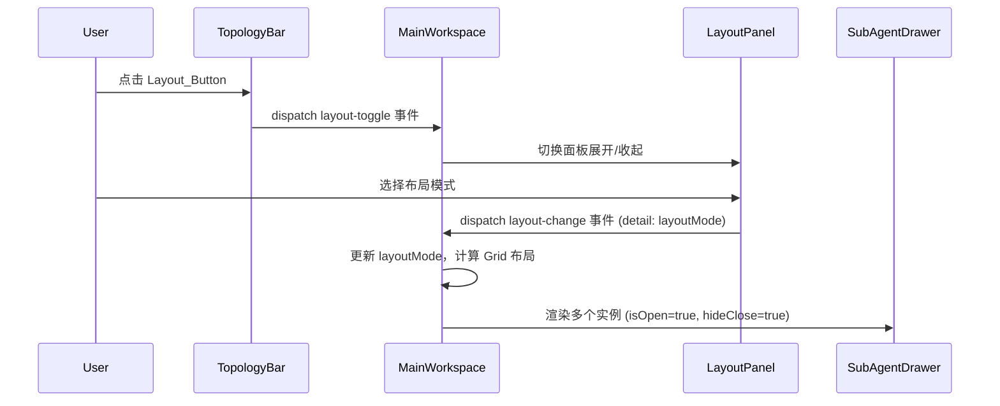
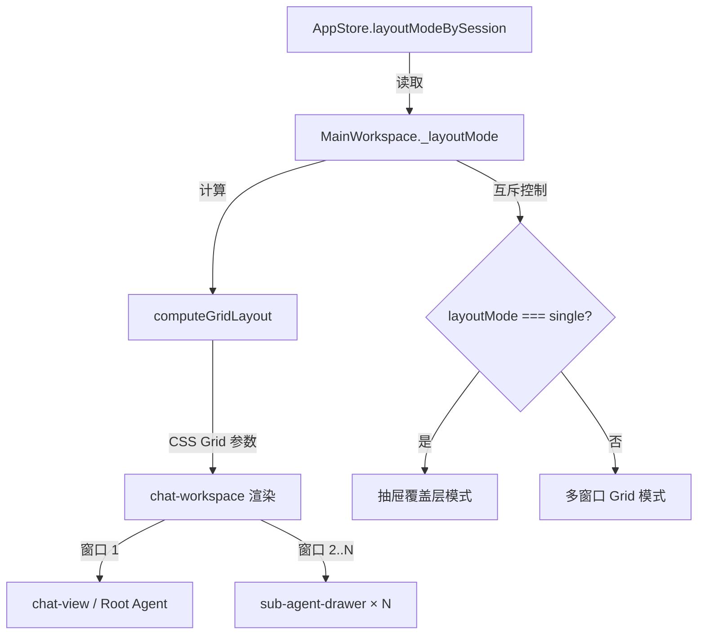
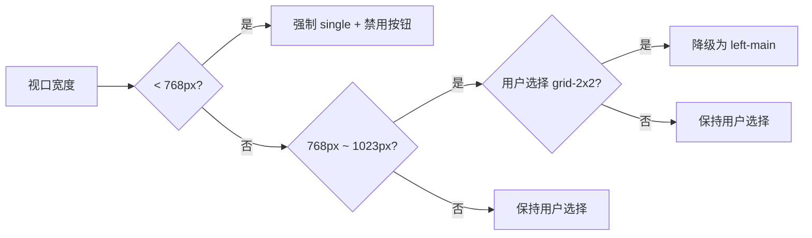

# 技术设计文档：拓扑布局切换器（Topology Layout Switcher）

## 概述

本功能在拓扑状态条（`topology-bar`）右侧添加布局切换按钮，点击后展开浮层面板供用户选择多种窗口布局模式。主工作区（`main-workspace`）根据所选布局模式动态渲染 CSS Grid 布局，将根 Agent 的 `chat-view` 和子 Agent 的 `sub-agent-drawer` 实例分布在不同窗口中，实现多 Agent 对话的并行可视化。

核心设计决策：

- 布局计算逻辑抽取为纯函数，与 UI 渲染解耦，便于测试和复用
- 多窗口模式复用现有 `sub-agent-drawer` 组件，通过属性控制隐藏关闭按钮
- 布局切换与抽屉模式互斥，通过 `layoutMode` 状态统一管控
- 小屏设备强制降级为 single 模式，中屏设备 Grid_2x2 降级为 Left_Main

## 架构

### 组件交互流程



### 数据流向



### 响应式降级策略



## 组件与接口

### 1. 布局模式类型定义

新增文件：`src/types/layout-types.ts`

```typescript
/** 布局模式标识符 */
export type LayoutMode = "single" | "grid-2x2" | "three-column" | "left-main" | "top-bottom";

/** 布局模式元数据（用于面板渲染） */
export interface LayoutOption {
  mode: LayoutMode;
  label: string;
  icon: string; // SVG path 或模板
}

/** 计算后的 Grid 布局参数 */
export interface GridLayoutResult {
  gridTemplateColumns: string;
  gridTemplateRows: string;
  /** 窗口分配：index 0 = Root Agent，后续为子 Agent */
  slots: Array<{ agentId: string; type: "root" | "sub" | "placeholder" }>;
}
```

### 2. 布局计算纯函数

新增文件：`src/utils/layout-utils.ts`

```typescript
/**
 * 根据 layoutMode 和 agent 列表计算 CSS Grid 布局参数。
 * 纯函数，无副作用，便于属性测试。
 */
export function computeGridLayout(
  layoutMode: LayoutMode,
  rootAgentId: string,
  subAgentIds: string[],
): GridLayoutResult;

/**
 * 根据 agent 总数计算 grid-2x2 模式的行列数。
 * 纯函数：totalAgents → { cols, rows }
 */
export function computeGridDimensions(totalAgents: number): { cols: number; rows: number };

/**
 * 根据视口宽度和用户选择的布局模式，返回实际生效的布局模式。
 * 处理响应式降级逻辑。
 */
export function resolveEffectiveLayout(userChoice: LayoutMode, viewportWidth: number): LayoutMode;
```

### 3. topology-bar 组件扩展

修改文件：`src/components/topology-bar.ts`

新增属性与事件：

```typescript
// 新增属性
@property({ type: String }) layoutMode: LayoutMode = "single";
@property({ type: Boolean }) layoutDisabled = false;

// 新增事件
// layout-toggle: CustomEvent<void> — 点击布局按钮时派发
```

在 `.bar` 容器的子 Agent 卡片区域右侧追加 Layout_Button 元素。按钮具备 `role="button"`、`tabindex="0"`、`aria-label="布局切换"` 无障碍属性，支持 Enter/Space 键盘触发。

### 4. main-workspace 组件扩展

修改文件：`src/components/main-workspace.ts`

新增状态与属性：

```typescript
// 新增响应式状态
@state() private _layoutMode: LayoutMode = "single";
@state() private _layoutPanelOpen = false;
@state() private _userLayoutChoice: LayoutMode = "single"; // 用户偏好，响应式恢复用

// 新增事件处理
private _onLayoutToggle(): void;     // 切换面板展开/收起
private _onLayoutChange(e: CustomEvent<{ mode: LayoutMode }>): void; // 更新布局模式
private _onClickOutsidePanel(e: Event): void; // 点击面板外部关闭
```

渲染逻辑变更：

- `layoutMode === "single"` 时保持现有抽屉覆盖层行为
- `layoutMode !== "single"` 时：
  - 关闭抽屉覆盖层
  - 使用 `computeGridLayout()` 计算 Grid 参数
  - 在 `chat-workspace` 中渲染 CSS Grid 布局
  - 第一个窗口放置 `chat-view`（Root Agent）
  - 后续窗口各放置一个 `sub-agent-drawer` 实例

### 5. sub-agent-drawer 组件扩展

修改文件：`src/components/sub-agent-drawer.ts`

新增属性：

```typescript
/** 是否隐藏关闭按钮（多窗口模式下为 true） */
@property({ type: Boolean }) hideClose = false;
```

渲染逻辑变更：

- 当 `hideClose === true` 时，不渲染关闭按钮（`✕`）
- 其余功能（消息列表、输入框、审批卡片、通知设置）保持不变

### 6. 布局选择面板

新增内联渲染（在 `main-workspace.ts` 内部）：

Layout_Panel 以 popover 浮层形式渲染在 Layout_Button 下方，包含五种布局样式的 SVG 图标。面板具备磨砂玻璃质感样式（`backdrop-filter: blur(8px)`），与 Topology_Bar 设计语言一致。当前激活的布局模式图标高亮显示。

### 7. AppStore 扩展

修改文件：`src/store/app-store.ts`

```typescript
// 新增布局模式缓存（sessionUuid → LayoutMode）
layoutModeBySession: Map<string, LayoutMode> = new Map();

setLayoutMode(sessionUuid: string, mode: LayoutMode): void;
getLayoutMode(sessionUuid: string): LayoutMode; // 默认 "single"
```

## 数据模型

### 布局模式状态

| 字段                | 类型         | 存储位置                       | 说明                               |
| ------------------- | ------------ | ------------------------------ | ---------------------------------- |
| `layoutMode`        | `LayoutMode` | `AppStore.layoutModeBySession` | 每个会话独立的布局模式             |
| `_layoutMode`       | `LayoutMode` | `MainWorkspace` 组件 `@state`  | 当前生效的布局模式（含响应式降级） |
| `_userLayoutChoice` | `LayoutMode` | `MainWorkspace` 组件 `@state`  | 用户原始选择（响应式恢复用）       |
| `_layoutPanelOpen`  | `boolean`    | `MainWorkspace` 组件 `@state`  | 面板展开状态                       |
| `layoutDisabled`    | `boolean`    | `TopologyBar` 组件 `@property` | 小屏禁用状态                       |

### 布局模式枚举值

| 模式     | 标识符           | CSS Grid 模板                                      | 说明                    |
| -------- | ---------------- | -------------------------------------------------- | ----------------------- |
| 单窗口   | `"single"`       | N/A（保持现有布局）                                | 默认模式，抽屉覆盖层    |
| 动态网格 | `"grid-2x2"`     | 动态计算 `repeat(cols, 1fr)` / `repeat(rows, 1fr)` | 根据 agent 数量自动行列 |
| 全列     | `"three-column"` | `repeat(N, 1fr)` / `1fr`                           | N = agent 总数          |
| 左主右副 | `"left-main"`    | `3fr 2fr` / `1fr`                                  | 左 60% 右 40%           |
| 上主下副 | `"top-bottom"`   | `1fr` / `1fr 1fr`                                  | 上 50% 下 50%           |

### Grid_2x2 动态行列计算规则

| Agent 总数 | 列数            | 行数           | 说明          |
| ---------- | --------------- | -------------- | ------------- |
| 1          | 1               | 1              | 仅根 Agent    |
| 2          | 2               | 1              | 1×2           |
| 3          | 2               | 2              | 2×2（1 空位） |
| 4          | 2               | 2              | 2×2           |
| 5-6        | 3               | 2              | 2×3           |
| >6         | `ceil(sqrt(N))` | `ceil(N/cols)` | 自动计算      |

### 事件流

| 事件名          | 来源        | 目标          | detail                 | 说明              |
| --------------- | ----------- | ------------- | ---------------------- | ----------------- |
| `layout-toggle` | TopologyBar | MainWorkspace | `void`                 | 切换面板展开/收起 |
| `layout-change` | LayoutPanel | MainWorkspace | `{ mode: LayoutMode }` | 用户选择布局模式  |

## 正确性属性

_属性（Property）是在系统所有合法执行中都应成立的特征或行为——本质上是对系统行为的形式化陈述。属性是连接人类可读规格说明与机器可验证正确性保证之间的桥梁。_

### Property 1: 网格维度充分性

_对任意_ agent 总数 N（N ≥ 1），`computeGridDimensions(N)` 返回的 `cols × rows` 应大于等于 N，确保所有 agent 都有窗口可放置。同时，空余窗口数（`cols × rows - N`）应小于 `cols`（即最多空一行以内），避免过度浪费空间。

**Validates: Requirements 5.1, 5.2, 5.3, 5.4, 5.5, 5.6, 5.9**

### Property 2: 窗口分配正确性

_对任意_ 多窗口布局模式（grid-2x2、three-column、left-main、top-bottom）和任意 rootAgentId 与 subAgentIds 列表，`computeGridLayout(mode, rootAgentId, subAgentIds)` 返回的 `slots` 应满足：

1. `slots[0]` 的 `agentId` 等于 `rootAgentId` 且 `type` 为 `"root"`
2. 后续 `type === "sub"` 的 slot 按顺序与 `subAgentIds` 一一对应
3. `type === "sub"` 的 slot 数量等于 `subAgentIds.length`
4. 所有剩余 slot 的 `type` 为 `"placeholder"`

**Validates: Requirements 5.7, 5.8, 5.9, 6.2, 6.3, 6.4, 7.2, 7.3, 7.5, 8.2, 8.3, 8.5, 9.1**

### Property 3: 全列布局列数等于 Agent 总数

_对任意_ rootAgentId 和 subAgentIds 列表，`computeGridLayout("three-column", rootAgentId, subAgentIds)` 返回的 `gridTemplateColumns` 中的列数应等于 `1 + subAgentIds.length`（即 agent 总数）。

**Validates: Requirements 6.1**

### Property 4: 响应式布局降级

_对任意_ 用户选择的 LayoutMode 和任意视口宽度：

1. 当 `viewportWidth < 768` 时，`resolveEffectiveLayout(userChoice, viewportWidth)` 应返回 `"single"`
2. 当 `768 ≤ viewportWidth < 1024` 且 `userChoice === "grid-2x2"` 时，应返回 `"left-main"`
3. 当 `viewportWidth ≥ 1024` 时，应返回 `userChoice` 本身
4. 当 `768 ≤ viewportWidth < 1024` 且 `userChoice !== "grid-2x2"` 时，应返回 `userChoice` 本身

**Validates: Requirements 11.1, 11.3, 11.4**

### Property 5: 非 Single 模式同步 viewMode

_对任意_ 非 `"single"` 的 LayoutMode 值，当 `layoutMode` 被设置为该值时，`viewMode` 应同步被设为 `"multi"`。当 `layoutMode` 为 `"single"` 时，`viewMode` 应为 `"single"`。

**Validates: Requirements 3.5**

## 错误处理

| 场景                                           | 处理策略                                                              |
| ---------------------------------------------- | --------------------------------------------------------------------- |
| `layoutMode` 收到未知值                        | 回退到 `"single"` 模式                                                |
| `subAgentIds` 为空数组                         | 多窗口模式下仅显示 Root Agent 窗口 + 占位提示                         |
| `rootAgentId` 为空字符串                       | 回退到 `"single"` 模式，不渲染多窗口布局                              |
| 窗口 resize 事件频繁触发                       | 使用 `ResizeObserver` + debounce（150ms）避免频繁重新计算             |
| Layout_Panel 外部点击检测失败                  | 使用 `composedPath()` 确保 Shadow DOM 边界内的点击检测正确            |
| 子 Agent 窗口中 `drawer-send-message` 事件丢失 | 每个 `sub-agent-drawer` 实例独立绑定事件监听，通过 `agentId` 区分来源 |

## 测试策略

### 属性测试（Property-Based Testing）

使用 `fast-check` 库（项目已有依赖），配合 `vitest` 测试框架。

每个属性测试最少运行 100 次迭代，测试标签格式：`Feature: topology-layout-switcher, Property {N}: {title}`

测试文件：

- `src/utils/layout-utils.property.test.ts` — 覆盖 Property 1-4（纯函数测试）
- `src/components/main-workspace.property.test.ts` — 覆盖 Property 5（组件状态测试）

生成器设计：

- `arbLayoutMode`: 从 `["single", "grid-2x2", "three-column", "left-main", "top-bottom"]` 中随机选择
- `arbMultiLayoutMode`: 从非 single 的 4 种模式中随机选择
- `arbAgentId`: 匹配 `/^[a-z][a-z0-9-]{0,19}$/` 的随机字符串
- `arbSubAgentList`: 长度 0-10 的 `arbAgentId` 数组（去重）
- `arbViewportWidth`: 300-2560 范围内的随机整数
- `arbTotalAgents`: 1-20 范围内的随机正整数

### 单元测试（Example-Based）

测试文件：

- `src/utils/layout-utils.test.ts` — 具体布局计算的边界值测试
- `src/components/topology-bar.test.ts` — Layout_Button 渲染、事件派发、无障碍属性
- `src/components/sub-agent-drawer.test.ts` — `hideClose` 属性行为

覆盖内容：

- 布局按钮的 DOM 属性和事件派发（需求 1）
- 布局面板的展开/收起/外部点击关闭（需求 2）
- 默认值和状态同步（需求 3、4）
- 子 Agent 窗口的属性传递和事件转发（需求 9）
- 抽屉互斥行为（需求 10）
- 小屏禁用状态（需求 11）

### 集成测试

- 完整的布局切换流程：single → grid-2x2 → three-column → left-main → top-bottom → single
- 响应式降级：resize 窗口验证布局自动切换
- 多窗口模式下子 Agent 消息收发
