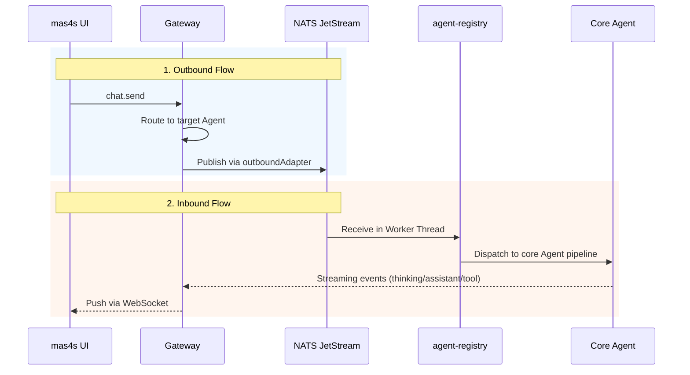
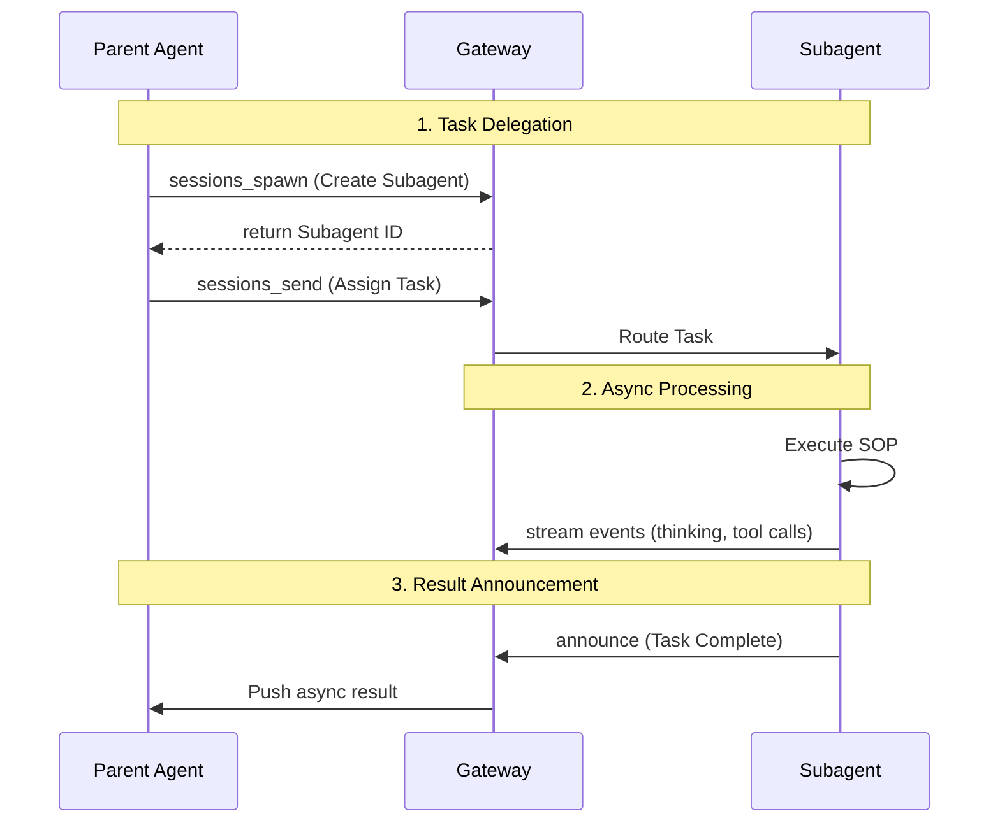

# AieClaw

**AieClaw** is a Multi-Agent System (MAS) platform built on top of OpenClaw. It extends the core capabilities of OpenClaw to support complex agent-to-agent interactions, multi-agent workflows, and advanced session management.

> **Note:** This project is forked from the original OpenClaw repository at [https://github.com/openclaw/openclaw.git](https://github.com/openclaw/openclaw.git). All core OpenClaw functionalities remain intact, with the addition of the features listed below.

## Key Features

AieClaw introduces several advanced features for building and managing multi-agent systems, detailed in the `aiemas/docs` directory:

- **Multi-Agent Systems & DAG:** Support for Multi-Agent chats, request flows, and Directed Acyclic Graph (DAG) task execution.
- **Agent-to-Agent Communication:** Dedicated protocols and message flows for agents to communicate and collaborate with each other.
- **Agent Registry (CRUD):** Built-in management for agent lifecycle, including creating, observing, and deleting agents dynamically.
- **Human-in-the-Loop:** Intervene in agent workflows when manual approval or guidance is required.
- **Advanced Session Management:** Robust session message history, session summaries, label persistence, and session reset mechanisms.
- **Message Flow Tracing:** Deep tracing of user messages and message flow diagrams to debug complex agent interactions.
- **Extended Integrations:** Enhanced WebSocket APIs, Feishu (Lark) group chat support, and UI workspace additions.

## Documentation

Comprehensive documentation for AieClaw-specific features can be found in the [`aiemas/docs`](./aiemas/docs/) directory. Key documentation areas include:

- `aiemas/docs/openclaw/`: Core architecture, human-in-the-loop, agent-to-agent protocols, and websocket API.
- `aiemas/docs/mas4s/`: Multi-Agent MQ, DAG requests, agent CRUD, message history, and tracing.
- `aiemas/docs/agent-registry/`: Documentation regarding the implementation of the `agent-registry`, detailing message flow function call chains (`message_flow_kiro.md`), tracking, and routing. The source code for the Agent Registry is maintained in its dedicated repository: [iaie-hub/AgentRegistry](https://github.com/iaie-hub/AgentRegistry.git).

### Agent Registry Integration

The Agent Registry is deeply integrated into AieClaw to facilitate decentralized Agent-to-Agent (A2A) communication. The implementation is detailed in `aiemas/docs/agent-registry/`:

- **Communication Model:** Uses a decentralized publish-subscribe model powered by **NATS JetStream**.
- **Message Routing:** Requests are processed via worker threads listening to NATS subscriptions, deserialized in the main thread, and routed using a topic-matching strategy.
- **Topic Types:** The system intelligently routes messages based on topic prefixes such as unicast (`a2a.agent.unicast.`), multicast (`a2a.agent.group.`), broadcast (`a2a.agent.broadcast.`), and collaborative spaces (`a2a.discussion.` / `a2a.cowork.`).
- **Session Dispatching:** Routed messages are dispatched to existing sessions or trigger the creation of new sessions with load-balancing for multicast messages.
- **Interaction Flow:** The architecture forms a complete communication loop:
  1. **Outbound (`mas4s → Gateway → agent-registry`):** When a user sends a message via the mas4s UI, the Gateway routes the request to the target Agent. If the Agent is bound to the agent-registry channel, the Gateway publishes the message to the corresponding NATS topic via the Plugin SDK outbound adapter.
  2. **Inbound (`agent-registry → Core Agent → Gateway → mas4s`):** The agent-registry receives the NATS message and dispatches it into the core Agent execution pipeline. Any resulting streaming events (thinking, assistant replies, tool calls) are pushed back to the mas4s UI via the Gateway WebSocket.
  3. **Isolation Design:** To maximize system resilience, NATS I/O is isolated in worker threads on the backend, while the UI employs optimistic updates to mask network latency.



## Multi-Agent System (MAS) Design

AieClaw supports complex Multi-Agent deployments using a Gateway-centric architecture and an advanced multi-tier UI.

### Design Scheme
- **Gateway-Centric Communication:** There is no direct socket or memory communication between agents. All Agent-to-Agent (A2A) message sending (`sessions_send`) and agent creation (`sessions_spawn`) are routed securely through the Gateway.
- **Asynchronous Announcements:** Subagents process tasks independently and use an "announce" mechanism to asynchronously push results back to their parent agents, eliminating the need for polling.
- **Idempotency and Traceability:** Every cross-session call uses an `idempotencyKey` to prevent duplicate execution, and carries an `inputProvenance` tag to trace the message origin.
- **Three-Tier User Interface:** The frontend provides "Session", "Collaboration", and "Observation" views. This supports everything from viewing linear chat milestones to observing live Multi-Agent Topology DAGs and monitoring independent Standard Operating Procedure (SOP) states for each subagent.

### Multi-Agent Interaction Flow



## Getting Started

Since AieClaw is built on OpenClaw, the standard installation and setup procedures apply. 

### Prerequisites

Runtime: **Node 24 (recommended) or Node 22.19+**.

### Setup from Source

Use `pnpm` for source checkouts:

```bash
git clone <your-aieclaw-repo-url>
cd AieClaw

pnpm install

# Setup local configuration
pnpm openclaw setup

# Build the control UI
pnpm ui:build

# Run the gateway in watch mode
pnpm gateway:watch
```

### MAS4S UI Setup

AieClaw includes a dedicated User Interface for managing the Multi-Agent System, located in `aiemas/ui/mas4s`.

To run the UI for development:

```bash
cd aiemas/ui/mas4s

# Install dependencies (npm or pnpm)
pnpm install

# Start the Vite development server
pnpm run dev
```

To build for production:

```bash
cd aiemas/ui/mas4s
pnpm run build
```

For detailed instructions on configuring the base Gateway, Channels, and Tools, please refer to the original [OpenClaw Documentation](https://docs.openclaw.ai).

## License

This project is licensed under the MIT License. See the [LICENSE](LICENSE) file for details.
