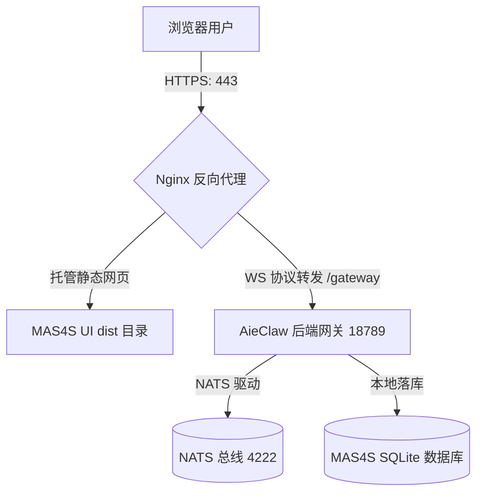

# AieClaw 与 aiemas/ui/mas4s 部署与集成配置指南

本指南详细阐述了 **AieClaw** 核心网关（Backend / Gateway）及其前端管理控制台 **aiemas/ui/mas4s**（Frontend / UI）在开发环境与生产环境中的构建、配置、部署与服务治理方案。

---

## 🛠 一、 环境前置要求

在开始部署之前，请确保目标服务器或本地环境已配置以下依赖：

| 组件名称 | 推荐版本 | 作用说明 |
| :--- | :--- | :--- |
| **Node.js** | `>= 22.0.0` (如 v22.x) | 核心运行时，包含原生高效 `node:sqlite` 支持 |
| **pnpm** | `>= 9.x` | Monorepo 多包依赖管理及快速安装工具 |
| **NATS Server** | `>= 2.10.x` (JetStream 开启) | 多智能体总线（A2A Collaboration）的消息队列引擎 |
| **Nginx** (可选) | `>= 1.24.x` | 生产环境下用于静态资源托管与 WebSocket 安全代理 |
| **OS 兼容性** | Linux (Ubuntu/CentOS), macOS | 完美适配，自带服务管理器挂载能力 |

---

## 🏗 二、 代码构建阶段

AieClaw 采用 `pnpm` workspace 管理单体大仓。需要分别对后端网关和前端 UI 资源包进行依赖安装与构建。

### 1. 构建 AieClaw Gateway (核心后端)

在项目根目录下执行全局安装和构建：

```bash
# 1. 进入 AieClaw 根目录
cd /path/to/AieClaw  # 实际部署时为服务器上的项目根路径

# 2. 安装整个大仓的依赖
pnpm install

# 3. 编译 TypeScript 代码（产出 dist/ 目录及编译后运行逻辑）
pnpm run build
```

* **构建产出物**：
  * 根目录下的 `dist/` 目录。
  * 根目录下的 `openclaw.mjs`（网关命令入口文件）。

### 2. 构建 MAS4S UI (前端控制台)

进入 UI 包目录，单独安装依赖并进行 Vite 静态编译：

```bash
# 1. 进入 UI 模块目录
cd aiemas/ui/mas4s

# 2. 安装前端专用依赖
pnpm install

# 3. 静态编译打包
pnpm run build
```

* **构建产出物**：
  * 生成静态资源文件夹 `aiemas/ui/mas4s/dist/`，内含 `index.html` 及编译后的 JS/CSS 静态文件。

---

## ⚙️ 三、 核心服务配置

AieClaw 的运行时行为完全由 `openclaw.json` (默认位于 `~/.openclaw/openclaw.json`) 以及系统环境变量控制。

### 1. 创建基础配置文件

在部署机器的家目录创建 `.openclaw` 文件夹，并编写基础 `openclaw.json`：

```bash
mkdir -p ~/.openclaw
touch ~/.openclaw/openclaw.json
```

在 `openclaw.json` 中配置网关运行参数：

```json
{
  "gateway": {
    "port": 18789,
    "mode": "local",
    "bind": "loopback",
    "jwtSecret": "your-jwt-secret-key-please-change",
    "auth": {
      "mode": "token",
      "token": "your-secure-access-token-string"
    }
  },
  "plugins": {
    "entries": {
      "agent-registry": {
        "enabled": true
      }
    }
  }
}
```

> [!IMPORTANT]
> - `gateway.jwtSecret` 与 `gateway.auth.token` 是保证 WebSocket 通信安全的关键。请使用 `openssl rand -hex 32` 生成高强度随机字符串填充。
> - `"agent-registry": { "enabled": true }` 必须启用，以便网关能加载 NATS 多智能体协作和进化功能。

### 2. 配置环境变量 (`.env`)

在 AieClaw 根目录（或 `~/.openclaw/.env` 路径）创建环境变量文件 `.env`。包含多智能体协作所需的 NATS 总线和调试模式：

```env
# -----------------------------------------------------------------------------
# AieClaw 网关核心安全密钥 (必须与 openclaw.json 一致)
# -----------------------------------------------------------------------------
OPENCLAW_GATEWAY_TOKEN=your-secure-access-token-string

# -----------------------------------------------------------------------------
# 智能体中心注册与 NATS 消息总线配置 (A2A 核心)
# -----------------------------------------------------------------------------
# 开启 A2A 功能的标志，指定本地或集群 NATS 服务地址
AGENT_REGISTRY_NATS_URL=nats://127.0.0.1:4222
# NATS 身份认证 Token (如果 NATS 开启了 Token 保护)
# AGENT_REGISTRY_NATS_TOKEN=your-nats-token

# 当前部署实体注册到总线的专属智能体 ID 和友好名称
AGENT_REGISTRY_AGENT_ID=main-gateway-agent
AGENT_REGISTRY_AGENT_NAME="AieClaw 协作中心网关"

# -----------------------------------------------------------------------------
# 调试与日志优化参数
# -----------------------------------------------------------------------------
# 开启 mas4s 底层长连接数据广播、会话落库详细日志 (推荐生产/测试环境开启)
OPENCLAW_MAS4S_DEBUG_EVENTS=1
```

---

## 🚀 四、 双通道部署与服务集成方案

AieClaw 网关提供了两种部署 MAS4S 静态界面的方案：**网关内嵌托管（开箱即用）** 和 **Nginx 独立代理（生产级推荐）**。

### 方案 A：AieClaw 自动内嵌托管（极简单进程模式）

在该模式下，AieClaw 的 Node.js 进程会自动挂载静态资源服务，无需额外配置 Web 服务器，非常适合**本地调试**或**快速上线**。

#### 1. 配置 UI 指向
在 `~/.openclaw/openclaw.json` 中配置 `gateway.controlUi` 节点：

```json
{
  "gateway": {
    "port": 18789,
    "mode": "local",
    "bind": "loopback",
    "controlUi": {
      "enabled": true,
      "root": "/path/to/AieClaw/aiemas/ui/mas4s/dist",
      "basePath": "/"
    }
  }
}
```

> [!WARNING]
> 请确保 `gateway.controlUi.root` 填入的是 UI 构建产物 `dist` 目录的**绝对路径**。

#### 2. 启动服务
```bash
# 进入根目录直接运行
node openclaw.mjs gateway
```
* **访问入口**：在浏览器中打开 `http://localhost:18789` 即可访问集成好的 MAS4S 管理系统，长连接会自动解析到同端口。

---

### 方案 B：独立静态服务器 + Nginx 反向代理（生产级高并发模式）

在企业级部署中，强烈建议将静态资源交由 Nginx 托管，并将 API 请求与 WebSocket 连接反向代理给后端的 AieClaw Core，从而支持 **SSL/TLS 加密**、**负载均衡** 及 **Gzip 压缩**。



#### 1. Nginx 配置文件示例
创建 Nginx 虚拟主机配置文件（例如 `/etc/nginx/conf.d/mas4s.conf`）：

```nginx
server {
    listen 80;
    server_name aiemas.yourdomain.com; # 您的域名或服务器IP

    # 1. 托管 MAS4S 前端静态文件
    location / {
        root /path/to/AieClaw/aiemas/ui/mas4s/dist;
        index index.html;
        try_files $uri $uri/ /index.html; # 支持 Single Page Application 路由规则
        
        # 静态资源缓存控制
        expires 7d;
        add_header Cache-Control "public, no-transform";
    }

    # 2. 反向代理 AieClaw 核心网关接口与 WebSocket 通道
    location /gateway {
        proxy_pass http://127.0.0.1:18789; # 指向 openclaw 运行端口
        
        # 必须配置：支持协议提升，保持 WebSocket 握手长连接
        proxy_http_version 1.1;
        proxy_set_header Upgrade $http_upgrade;
        proxy_set_header Connection "upgrade";
        
        # 穿透真实客户端 IP 与 Host 头
        proxy_set_header Host $host;
        proxy_set_header X-Real-IP $remote_addr;
        proxy_set_header X-Forwarded-For $proxy_add_x_forwarded_for;
        proxy_set_header X-Forwarded-Proto $scheme;

        # 延长超时设置，防止空闲 WebSocket 被 Nginx 主动断开
        proxy_read_timeout 3600s;
        proxy_send_timeout 3600s;
    }
}
```

#### 2. 加载 Nginx 配置并检查
```bash
# 检查 Nginx 配置格式是否正确
nginx -t

# 重新加载配置
systemctl reload nginx  # 或 nginx -s reload
```

---

## 🛡 五、 服务管理与进程守护

为了让 AieClaw 网关在后台稳定运行，并能够开机自启、奔溃自动恢复，可选用以下两种服务管理方案：

### 方案 1：使用 OpenClaw 自带服务管理器 (推荐 Linux/macOS)

OpenClaw 提供了多平台通用的系统服务注册指令，能自动生成并载入 `systemd` (Linux) 或 `launchd` (macOS) 服务描述。

```bash
# 1. 安装系统级守护服务
# 安装后会生成名为 openclaw-gateway 的服务守护进程
openclaw gateway install

# 2. 启动服务
openclaw gateway start

# 3. 检查服务运行状态与监听端口
openclaw gateway status
```

### 方案 2：使用 PM2 守护进程 (高度可观测，跨平台)

如果你的服务器环境常驻 Node.js 生态，可以使用 `pm2` 进行进程级别监控。

#### 1. 创建进程配置文件 `ecosystem.config.cjs`
在项目根目录下新建 `ecosystem.config.cjs` :

```javascript
module.exports = {
  apps: [
    {
      name: "aieclaw-gateway",
      script: "./openclaw.mjs",
      args: "gateway",
      instances: 1,
      exec_mode: "fork",
      watch: false,
      env: {
        NODE_ENV: "production",
      },
      error_file: "./log/pm2-err.log",
      out_file: "./log/pm2-out.log",
      log_date_format: "YYYY-MM-DD HH:mm:ss Z",
      autorestart: true,
      max_memory_restart: "1G",
    }
  ]
};
```

#### 2. PM2 命令运维
```bash
# 启动守护网关
pm2 start ecosystem.config.cjs

# 查看日志
pm2 logs aieclaw-gateway

# 监控资源占用 (CPU/Mem)
pm2 monit

# 开机自启生成
pm2 startup
pm2 save
```

---

## 🔍 六、 部署验证与排错

### 1. 验证网关健康度
在部署服务器上执行 Curl，预期应返回状态 `{"status":"ok"}`：
```bash
curl http://127.0.0.1:18789/healthz
```

### 2. 检查 SQLite 数据库状态
MAS4S 数据表将自动在网关初次启动时完成注册建表，持久化于：
* **存储路径**：`~/.openclaw/aiemas/mas4s.db`
* **查看数据库**：可以使用 `sqlite3 ~/.openclaw/aiemas/mas4s.db` 命令行查看会话及讨论总线消息记录。

### 3. 日志排查
当协作 UI 发生无法连接长连接或消息卡顿等异常时，可通过下列方式审查实时日志：
* **守护进程日志**：运行 `tail -f ~/.openclaw/logs/gateway.log`（具体取决于 `openclaw.json` 定义的日志输出位置）。
* **WebSocket 通信流调试**：在 `.env` 中调高 `VITE_DEBUG_MAS4S_EVENTS=true` 并在浏览器控制台（Console）过滤 WebSocket 事务信息。
