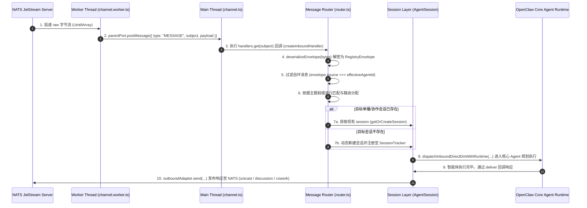
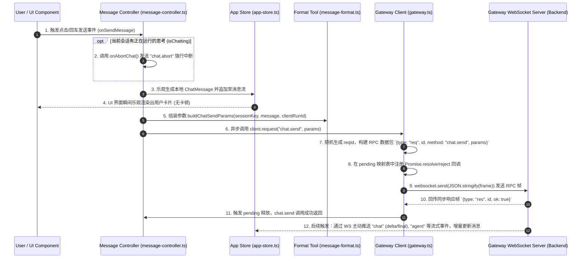

# AieClaw & AieMas 消息流转分析报告

## —— Agent Registry 接收消息流程与 MAS4S UI 发送消息流程深度对比

本报告针对 `extensions/agent-registry`（后端 A2A 协作通道）接收请求消息后的处理逻辑，与 `aiemas/ui/mas4s`（前端 C2A 交互界面）通过 `chat.send` 发送消息的处理流程进行深度解析，并从通信范式、消息生命周期、会话绑定、错误处理与状态同步等多个维度展开对比。

---

## 1. `extensions/agent-registry` 接收请求消息处理流程

`agent-registry` 后端扩展是一个基于 **NATS JetStream** 的去中心化、异步 A2A（Agent-to-Agent）多智能体协作通道。其接收消息的核心流程由 Worker 线程代理、NATS 客户端代理、消息路由器和核心 Agent 会话层共同协作完成。

### 1.1 详细处理步骤与代码轨迹



#### 第一步：NATS 物理层接收（Worker 线程）

- **涉及文件**：`extensions/agent-registry/src/channel.worker.ts`
- **逻辑实现**：为了避免 NATS 客户端事件循环阻塞主线程，通道在启动时会生成一个独立的 `Worker` 线程。
  - Worker 线程启动后，通过 `createNATSClient` 建立物理连接，并使用 `subscribeBaseTopics` 订阅单播、广播及组播等主题。
  - 当 NATS 收到对应的原始字节流（`Uint8Array`）时，Worker 中的订阅回调函数被触发：
    ```typescript
    const sub = natsClient?.subscribe(subject, (payload) => {
      parentPort?.postMessage({ type: "MESSAGE", subject, payload });
    });
    ```
  - 原始负载通过主子线程通信（`postMessage`）被安全地发送回主线程。

#### 第二步：主线程 NATS 代理与分发

- **涉及文件**：`extensions/agent-registry/src/channel.ts`
- **逻辑实现**：主线程在启动通道时订阅 Worker 的消息通道。
  - 当监听到 `msg.type === "MESSAGE"` 时，主线程根据 `msg.subject` 从内部 `handlers` 映射表中检索出该主题绑定的回调处理器：
    ```typescript
    worker.on("message", (msg: any) => {
      if (msg.type === "MESSAGE") {
        const subjectHandlers = handlers.get(msg.subject);
        if (subjectHandlers) {
          for (const handler of subjectHandlers) {
            handler(msg.payload);
          }
        }
      }
    });
    ```

#### 第三步：消息解析与反序列化

- **涉及文件**：`extensions/agent-registry/src/router.ts` & `envelope.ts`
- **逻辑实现**：主线程回调指向 `MessageRouter.createInboundHandler` 产生的闭包处理器。
  - 路由器首先调用 `deserializeEnvelope(bytes)` 将二进制字节反序列化为标准的 `RegistryEnvelope`（注册包信封）对象。如果解析失败，则按规范截断日志并抛弃消息（Requirement 6.1, 6.2）。
  - 过滤**自环消息**：检查 `envelope.source === getEffectiveAgentId()`，若该消息是当前 Agent 自身发出的，则直接丢弃，避免在广播和协作主题中发生死循环。

#### 第四步：主题模式匹配与路由分配

- **涉及文件**：`extensions/agent-registry/src/router.ts`
- **逻辑实现**：依据 NATS 主题的前缀，消息被导向不同的处理分支：
  - **单播**（`a2a.agent.unicast.*`）：直接调用 `handleUnicast(envelope)`，通过发送者 ID 查找或创建会话。
  - **组播**（`a2a.agent.group.*`）：调用 `handleMulticast(envelope)`，进行负载均衡，将消息投递给当前负载最小的活跃会话（`getLeastLoadedSession`）；若无会话则为发送者新建。
  - **协作组主题**（`a2a.discussion.*` 与 `a2a.cowork.*`）：
    - 首先调用 `emitCollabEvent` 发射进程内协作事件，使实时前端 UI 能够旁路监听协作消息流；
    - 接着调用 `handleCollaborationTopic(topicId, envelope)`，通过 `discussionId` 或 `taskId` 查找/创建协作会话。
  - **广播**（`a2a.agent.broadcast.*`）：调用 `handleBroadcast(envelope)`。广播消息不进入常规 Agent 聊天会话，而是分发给 **Arbiter（协作仲裁器）**：
    - `discussion.created` -> `arbiter.processDiscussionCreated(payload)`
    - `cowork.created` -> `arbiter.processCoworkCreated(payload)`

#### 第五步：智能体执行与输出投递

- **涉及文件**：`extensions/agent-registry/src/channel.ts`
- **逻辑实现**：会话解析为 `AgentSession` 后，执行 `session.dispatch(envelope)`：
  - 提取信封负载中的正文，并调用 OpenClaw Plugin SDK 核心管道函数：
    ```typescript
    await dispatchInboundDirectDmWithRuntime({
      cfg,
      runtime: channelRuntime,
      channel: "agent-registry",
      accountId: agentId,
      rawBody: messageText,
      // ... 封装上下文信息
      deliver: async (payload) => {
        // 当 Agent 内部逻辑推理、生成响应文本后，将自动调用此处的 deliver 物理投递回调
        const responseText = payload?.["text"] ?? "";
        if (responseText) {
          await outboundAdapter.send({
            responseText,
            inboundEnvelope: envelope,
            sessionContext, // 传入单播、讨论组或协同任务的上下文
            // ...
          });
        }
      },
    });
    ```
  - `outboundAdapter` 最终会将生成的回复打包为 `RegistryEnvelope` 二进制流，通过 Worker 线程发送至 NATS，完成整个 A2A 回合闭环。

---

## 2. `aiemas/ui/mas4s` 发送消息（`chat.send`）处理流程

`mas4s` 界面是面向操作员/用户的前端 Web 应用。它通过 **WebSocket (RPC-over-WS)** 与 Gateway 进行同步命令控制与流式事件监听，属于典型的 C2A（Client-to-Agent）或操作员控制台通信模型。

### 2.1 详细处理步骤与代码轨迹



#### 第一步：控制器事件捕获

- **涉及文件**：`aiemas/ui/mas4s/src/controllers/message-controller.ts`
- **逻辑实现**：用户在聊天输入框内输入并确认，触发 `onSendMessage`（或子 Agent 抽屉触发 `onSendSubAgentMessage`）。
  - 提取当前的活动会话 `activeSession`。如果当前会话处于运行忙碌状态（即 `isChattingBySession` 为 `true`），为防止多路请求冲突，将首先触发 `onAbortChat()` 流程向 Gateway 发送 `chat.abort` 指令强制打断上一回合。

#### 第二步：本地乐观渲染（Optimistic Update）

- **涉及文件**：`aiemas/ui/mas4s/src/store/app-store.ts` 与 `message-controller.ts`
- **逻辑实现**：
  - 使用 `crypto.randomUUID()` 预生成一个唯一的 `clientRunId`。
  - 构造一个 `role: "user"` 的本地 `ChatMessage` 结构体：
    ```typescript
    const msg: ChatMessage = {
      role: "user",
      content: [{ type: "text", text: rawText }, .../* 映射附件 */],
      timestamp: Date.now(),
      id: clientRunId,
      senderLabel: displayName,
    };
    ```
  - 直接调用 `store.appendMessage` 和 `store.appendAgentMessage` 乐观追加。此时**物理请求尚未到达网络**，但界面聊天窗口已即时浮现出用户气泡。同时通过 `store.setIsChatting(..., true)` 将界面切换至流式加载状态。

#### 第三步：请求信封组装

- **涉及文件**：`aiemas/ui/mas4s/src/utils/message-format.ts`
- **逻辑实现**：
  - 控制器对附加的图片/文件进行 Base64 预编码提取（包括 MimeType 和 Content 分离）。
  - 最终调用 `buildChatSendParams` 打包成标准的 WebSocket RPC 信封体：
    ```typescript
    export function buildChatSendParams(opts: { ... }) {
      return {
        sessionKey: opts.sessionKey, // 区分单播 (agent-registry) 或群组 (disc-*/task-*)
        message: opts.message,       // 纯文本消息正文
        clientRunId: finalId,        // 用于后续匹配与追踪
        idempotencyKey: finalId,     // 幂等键，避免因断线重连导致多发
        attachments: opts.attachments,
      };
    }
    ```

#### 第四步：WebSocket RPC 物理传输

- **涉及文件**：`aiemas/ui/mas4s/src/lib/gateway.ts` & `client.ts`
- **逻辑实现**：
  - 调用 `getClient()` 获得长连接客户端实例。
  - 执行 `client.request("chat.send", params)` 动作：
    ```typescript
    request<T = unknown>(method: string, params?: unknown): Promise<T> {
      // 1. 强力校验连接状态
      if (!this.ws || this.ws.readyState !== WebSocket.OPEN) {
        return Promise.reject(new Error("gateway not connected"));
      }
      // 2. 生成此帧的 RPC ID
      const id = generateUUID();
      const frame = { type: "req", id, method, params };
      // 3. 本地建立待处理映射 (Map<id, Pending>)，用于监听返回
      const p = new Promise<T>((resolve, reject) => {
        this.pending.set(id, { resolve: (v) => resolve(v as T), reject });
      });
      // 4. WebSocket 物理帧发送
      this.ws.send(JSON.stringify(frame));
      return p;
    }
    ```

#### 第五步：同步确认与异步流式反馈循环

- **涉及文件**：`aiemas/ui/mas4s/src/gateway/event-handler.ts`
- **逻辑实现**：
  - **同步握手**：当 Gateway 接受请求后，立即回发 `{ type: "res", id, ok: true }`，主线程的 `pending.get(id)` 触发 `resolve()`，`chat.send` 函数至此安全闭合。
  - **流式接收（Event Feedback Loop）**：
    - 随后，智能体进入规划与思考，Gateway 通过 WebSocket 事件流异步广播多组 Event 事件。
    - 前端 `event-handler.ts` 持续捕获这些事件，并进行局部差异更新（Delta Streaming）：
      - `evt.event === "chat"`：触发 `handleChatEvent`，动态流式更新助理（`assistant`）文本，直到收到 `state: "final"`。
      - `evt.event === "agent"`：触发 `handleAgentEvent`，依次捕获 `stream: "thinking"`（生成思维链框体）、`stream: "prompt"` 以及 A2A 过程中的跨智能体中继消息。
      - `evt.event === "session.tool"`：实时更新正在调用的工具名称、参数以及工具执行输出（Requirement 9.1）。

---

## 3. Agent Registry（后端接收）与 MAS4S UI（前端发送）的深度对比

| 对比维度             | `extensions/agent-registry` 接收消息流                                                                                                                 | `aiemas/ui/mas4s` 发送消息流 (`chat.send`)                                                                                                                         |
| :------------------- | :----------------------------------------------------------------------------------------------------------------------------------------------------- | :----------------------------------------------------------------------------------------------------------------------------------------------------------------- |
| **通信物理协议**     | **NATS JetStream** (后端消息中间件)。                                                                                                                  | **WebSocket** (前端长连接套接字)。                                                                                                                                 |
| **通信架构模式**     | **去中心化发布-订阅 (Pub/Sub)**。<br>多智能体在不同的 NATS 主题（Topic）上进行广播与监听。                                                             | **同步远程调用 (RPC-over-WS)** 与 **单向事件流**。<br>客户端先发送 Request，Gateway 异步推送 Event。                                                               |
| **网络会话模型**     | **多 Agent 对等会话 (A2A - Agent-to-Agent)**。<br>使用 NATS 信封包裹的 RegistryEnvelope，包含 `source`, `target`, `action` 等元数据。                  | **操作员对智能体会话 (C2A - Client-to-Agent)**。<br>使用由 Gateway 定义的方法调用（`chat.send`、`chat.abort`）与本地 UI Store 强绑定。                             |
| **会话标识与绑定**   | **物理主题 (NATS Subject)** 分配：<br>`a2a.agent.unicast.{agentId}`<br>`a2a.discussion.{discId}`<br>`a2a.cowork.{taskId}`                              | **逻辑会话键 (Session Key)**：<br>`agent-registry:agent-xxx`<br>`disc-xxx` / `task-xxx`                                                                            |
| **时效性与生命周期** | **异步队列处理**。<br>消息写入消息队列，支持断线持久化、ACK 机制及 Worker 线程代理的多任务多路并发接收。                                               | **实时同步阻断 + 乐观响应**。<br>UI 瞬间乐观渲染，网络传输等待 Gateway 连接握手确认。支持物理打断机制（Abort）。                                                   |
| **自环与防死循环**   | **严格旁路去重机制**。<br>对比 NATS 信封 `envelope.source === getEffectiveAgentId()` 相同则立即抛弃，防止多路网络自发自收。                            | **前端拦截打断**。<br>通过 `AppStore` 与 `crypto.randomUUID()` 追踪特定的 `clientRunId` 与 `idempotencyKey` 进行幂等去重。                                         |
| **并发与执行负载**   | **主动负载均衡分发**。<br>对于 Multicast 广播消息，路由器通过评估所有活跃会话的任务数（`activeTaskCount`），主动派发给负载最小的 `AgentSession` 实例。 | **串行流式状态机控制**。<br>会话层采用 `isChattingBySession` 忙碌标记控制，新指令会中断（Abort）上一回合，禁止多任务乱序碰撞。                                     |
| **异常控制机制**     | **防崩溃火后即忘 (Fire & Forget)**。<br>任何单个 NATS 消息解码失败或 Handler 报错，均通过 catch 日志拦截，绝对不会导致主消息总线和 NATS 线程断开崩溃。 | **强制重连与状态容灾回滚**。<br>RPC 调用超时会触发 `GatewayRequestError` 并断开 WS，随后触发自动避退重连（Backoff Reconnect）与运行状态恢复（RunState Recovery）。 |

---

## 4. 架构协同与总线互通机制

理解这两个流程如何最终在物理系统上协同，是掌握 OpenClaw 多智能体生态的核心：

```
+-----------------------------------------------------------------------------------+
|                            AieClaw Gateway Backend                                |
|                                                                                   |
|  [ WebSocket Server ]  <== (WS RPC Frame) ===>  [ aiemas/ui/mas4s (Frontend) ]    |
|          ||                                       - chat.send (Outbound RPC)      |
|          || (Bridge / Routing)                    - Local Optimistic Update       |
|          \/                                       - Streaming Event Handler       |
|  [ Core Agent Runtime ]                                                           |
|          ||                                                                       |
|          || (SDK / dispatchInboundDirectDm)                                       |
|          \/                                                                       |
|  [ extensions/agent-registry (Main Thread) ]                                      |
|          ||                                                                       |
|          || (Thread Port: postMessage)                                            |
|          \/                                                                       |
|  [ extensions/agent-registry (Worker Thread) ]                                    |
|          ||                                                                       |
|  [ NATS JetStream Client ] <== (NATS Raw Bytes) ==> [ NATS Broker (A2A Bus) ]     |
|                                                                                   |
+-----------------------------------------------------------------------------------+
```

### 关键协同点：

1. **输入衔接**：当操作员在前端 `mas4s` 输入并触发 `chat.send` 时，Gateway 后端路由将此 RPC 转换为具体的 Agent 执行请求。若目标 Agent 绑定了 `agent-registry` 物理通道，Plugin SDK 的 `outboundAdapter` 就会将消息发送到 NATS 的 `a2a.agent.unicast.{target}` 主题上。
2. **输出流转**：目标 Agent 在另一端由 `agent-registry` 通道接收（经历 NATS -> Worker -> Main Thread Router -> Dispatch），执行完成后，通过 NATS 主题异步投递回来。后端再由 WebSocket 通道将消息片段作为 `evt.event === "chat"` 实时推回前端 `mas4s`，由 `event-handler.ts` 动态渲染。
3. **隔离与原子性**：`agent-registry` 通过分离子进程 Worker 将繁重的 NATS 网络 I/O 隔离出去；而 `mas4s` 前端利用乐观更新与 ID 幂等追踪，确保了极佳的用户体验，两者在架构上分别在网络端和交互端最大化了系统的弹性和流畅度。
