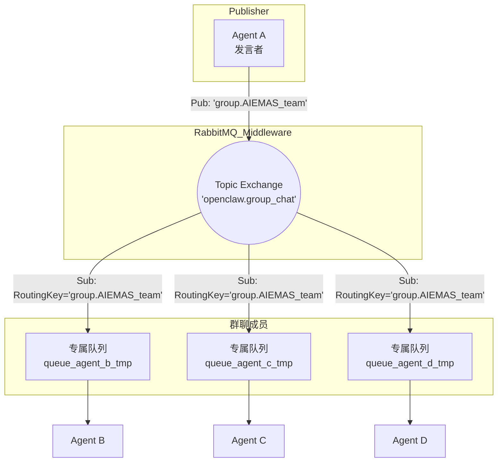

既然以“群聊（广播）”**为主，系统的核心挑战将从“如何路由消息”转变为**“如何控制消息风暴（Message Storm）”**以及**“如何管理多主体的上下文（Context）”。

在 RabbitMQ 架构下，针对群聊模式，我们需要将网络拓扑从点对点（Direct）切换为主题发布/订阅（Topic Pub/Sub）模式。以下是针对 OpenClaw 群聊场景的深度设计方案：

### 1. RabbitMQ 拓扑架构设计 (Topic Exchange)

群聊模式下，不再将消息发给特定的 Agent 队列，而是发给特定的“群组主题”。



#### 核心配置策略：

- **Exchange (交换机)**: 采用 `Topic` 模式，命名为 `openclaw.group_chat`。
- **Queue (队列)**: 每个加入群聊的 Agent，由 Node.js 动态声明一个排他且自动删除（Exclusive & Auto-delete）的临时队列。
- **Routing Key (路由键)**: 以群组 ID 作为路由键，例如 `group.AIEMAS_team`。所有监听该群组的 Agent 将自己的临时队列绑定到该 Routing Key。

### 2. Node.js (amqplib) 实现逻辑

在 Node.js 中，Agent 加入群聊和发送广播的核心逻辑如下：

```javascript
// Agent 加入群聊 (Subscribe)
async function joinGroupChat(channel, agentId, groupId) {
  const exchange = "openclaw.group_chat";
  await channel.assertExchange(exchange, "topic", { durable: true });

  // 声明专属临时队列，Node.js 进程断开时自动销毁
  const q = await channel.assertQueue("", { exclusive: true });

  // 绑定到群组主题
  await channel.bindQueue(q.queue, exchange, `group.${groupId}`);

  channel.consume(q.queue, (msg) => {
    const payload = JSON.parse(msg.content.toString());
    // 过滤自己发出的消息（防止回音壁效应）
    if (payload.sender_id !== agentId) {
      triggerAgentReasoning(agentId, payload);
    }
    channel.ack(msg);
  });
}

// Agent 发送群消息 (Publish)
async function broadcastMessage(channel, senderId, groupId, content) {
  const exchange = "openclaw.group_chat";
  const payload = {
    message_id: generateUUID(),
    group_id: groupId,
    sender_id: senderId,
    content: content,
    timestamp: Date.now(),
  };
  channel.publish(exchange, `group.${groupId}`, Buffer.from(JSON.stringify(payload)));
}
```

### 3. 多 Agent 群聊的三大核心控制机制

在由 LLM 驱动的群聊中，如果收到消息后每个 Agent 都立刻回复，会导致灾难性的**消息风暴**和 Token 消耗。必须在 OpenClaw 架构中引入以下控制层：

#### 3.1 发言权控制 (Speaker Election)

由于是广播，必须解决“谁来接话”的问题。推荐采用以下两种模式之一：

- **SOP 轮转模式 (Token-passing)**: 结合您正在设计的 AIEMAS 平台，在元数据中明确指定“下一步由谁执行”。例如在消息 metadata 中附带 `{"next_speaker": "Agent_C"}`。其他 Agent 虽然收到消息并更新了本地上下文，但不触发 LLM 推理。
- **@提及模式 (Mentioning)**: 在协议中加入 `mentions: ["agent_b"]` 字段。仅被 Mention 的 Agent 触发回复动作，其他 Agent 仅做被动记忆（Passive Memory Update）。

#### 3.2 共享上下文窗口 (Shared Context Window)

群聊会导致上下文迅速膨胀，单体 Agent 容易触发 LLM 的 Token 上限。

- **全局黑板模式 (Blackboard Pattern)**: 不要在每次 MQ 消息中附带完整的历史记录。在 etcd 或 Redis 中维护一个该群组的全局 Session 历史。
- **消息截断与总结**: 当群聊达到一定轮数时，触发一个独立的 Summarizer Agent 将历史记录压缩为摘要，并更新到全局黑板。提示词模板可设计为：
  `请总结以下群聊记录，保留核心决策：\n{{chat_history}}` （严格保留 `{{}}` 占位符供模板引擎注入）。

#### 3.3 意图判定层 (Intent Gatekeeper)

为了最大程度节省算力，在将消息喂给大模型之前，在 Node.js 代码层设置一个轻量级的 Gatekeeper。

- 当 Agent 收到群组广播时，先用一段极短的规则或一个非常小参数的模型（如基于本地的轻量分类器）判断：**“这条消息与我（当前 Agent 的角色/技能）是否相关？”**
- 如果不相关，直接 Drop（仅记录日志）；如果相关，再唤醒主 LLM 开启推理并生成回复。
